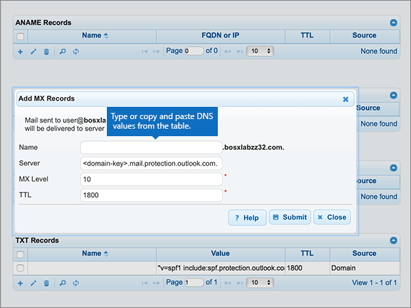
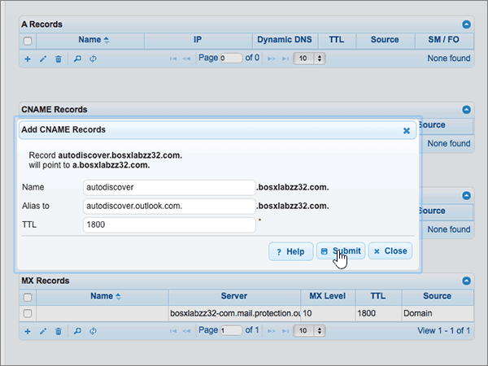

# 在 DNSMadeEasy 建立 Office 365 的 DNS 記錄Create DNS records at DNSMadeEasy for Office 365

 若您找不到所需內容，請**[查看網域常見問題集](../setup/domains-faq.md)**。**[Check the Domains FAQ](../setup/domains-faq.md)** if you don't find what you're looking for. 
  
如果 DNSMadeEasy 是您的 DNS 主機服務提供者，請按照本文所述的步驟驗證網域，並設定電子郵件與商務用 Skype Online 等項目的 DNS 記錄。If DNSMadeEasy is your DNS hosting provider, follow the steps in this article to verify your domain and set up DNS records for email, Skype for Business Online, and so on.
  
在 DNSMadeEasy 新增這些記錄之後，您的網域就會設定為搭配 Office 365 服務使用。After you add these records at DNSMadeEasy, your domain will be set up to work with Office 365 services.
  
若要了解使用 Office 365 網站的虛擬主機和 DNS，請參閱[搭配 Office 365 使用公用網站](https://support.office.com/article/choose-a-public-website-3325d50e-d131-403c-a278-7f3296fe33a9)。To learn about webhosting and DNS for websites with Office 365, see [Use a public website with Office 365](https://support.office.com/article/choose-a-public-website-3325d50e-d131-403c-a278-7f3296fe33a9).
  
> [!NOTE]
> Typically it takes about 15 minutes for DNS changes to take effect.Typically it takes about 15 minutes for DNS changes to take effect. 而如果您所做的變更要在整個網際網路 DNS 系統中生效，有時可能需要更久的時間。However, it can occasionally take longer for a change you've made to update across the Internet's DNS system. 在您新增 DNS 記錄後，如有郵件流程或其他方面的問題，請參閱[尋找並修正在 Office 365 中新增網域或 DNS 記錄之後所發生的問題](../get-help-with-domains/find-and-fix-issues.md)。If you're having trouble with mail flow or other issues after adding DNS records, see [Find and fix issues after adding your domain or DNS records in Office 365](../get-help-with-domains/find-and-fix-issues.md). 
  
## 新增 TXT 記錄以供驗證Add a TXT record for verification

在您將自己的網域用於 Office 365 之前，我們必須先確認您擁有該網域。如果您能在自己的網域註冊機構登入自己的帳戶並能建立 DNS 記錄，Office 365 就能確信您擁有該網域。Before you use your domain with Office 365, we have to make sure that you own it. Your ability to log in to your account at your domain registrar and create the DNS record proves to Office 365 that you own the domain.
  
> [!NOTE]
> 這筆記錄只會用於驗證您擁有自己的網域，不會影響其他項目。您可以選擇稍後再刪除記錄。This record is used only to verify that you own your domain; it doesn't affect anything else. You can delete it later, if you like. 
  
> [!IMPORTANT]
> For DNSMadeEasy accounts, the domain you added was purchased from a separate domain registrar.For DNSMadeEasy accounts, the domain you added was purchased from a separate domain registrar. DNSMadeEasy does not offer domain registration services.DNSMadeEasy does not offer domain registration services. Your ability to log in at DNSMadeEasy and create the DNS record is sufficient proof of ownership.Your ability to log in at DNSMadeEasy and create the DNS record is sufficient proof of ownership. 
  
1. 首先請用[這個連結](https://cp.dnsmadeeasy.com/)移至 DNSMadeEasy 上您的網域頁面。To get started, go to your domains page at DNSMadeEasy by using [this link](https://cp.dnsmadeeasy.com/). 系統會提示您先登入。You'll be prompted to login first.
    
2. 在 [**管理主控台**] 頁面上，在**最近更新的網域**] 區域中，選取您想要更新的網域。On the **Management Console** page, in the **Recently Updated Domains** area, select the domain that you want to update. 
    
3. 在 [ **Managed DNS** ] 頁面的 [ **TXT 記錄**] 區域中，選取 [( **+**) 控制項 （**新增**）。On the **Managed DNS** page, in the **TXT Records** area, select the ( **+**) control ( **Add new**).
    
    (You may have to scroll down.)(You may have to scroll down.)
    
4. In the **Add TXT Records** area, in the boxes for the new record, type or copy and paste the values from the following table.In the **Add TXT Records** area, in the boxes for the new record, type or copy and paste the values from the following table. 
    
    ||||
    |:-----|:-----|:-----|
    |**Name****Name**   |**值****Value**   |**TTL****TTL**   |
    |(Leave this field empty.)(Leave this field empty.)    |MS=ms *XXXXXXXX*MS=ms *XXXXXXXX*    **附註：** 這是範例。**Note:** This is an example. 在這裡請使用您自己的 [目的地或指向位址] 值，請參閱 Office 365 表格。Use your specific **Destination or Points to Address** value here, from the table in Office 365. [如何找到呢？How do I find this?](../get-help-with-domains/information-for-dns-records.md)          |18001800    |
   
5. 選取 [**提交**]。Select **Submit**.
    
6. 繼續進行之前，請先稍候幾分鐘，好讓您剛剛建立的記錄能在網際網路上更新。Wait a few minutes before you continue, so that the record you just created can update across the Internet.
    
現在您已在網域註冊機構網站新增記錄，請返回 Office 365 並要求 Office 365 尋找該記錄。Now that you've added the record at your domain registrar's site, you'll go back to Office 365 and request Office 365 to look for the record.
  
在 Office 365 找到正確的 TXT 記錄後，您的網域就完成驗證了。When Office 365 finds the correct TXT record, your domain is verified.
  
1. 在系統管理中心中，移至 **[設定]** \> <a href="https://go.microsoft.com/fwlink/p/?linkid=834818" target="_blank">[網域]</a> 頁面。In the admin center, go to the **Settings** \> <a href="https://go.microsoft.com/fwlink/p/?linkid=834818" target="_blank">Domains</a> page.

    
2. 在 **[網域]** 頁面上，選取您要驗證的網域。On the **Domains** page, select the domain that you are verifying. 
    
3. 在 **[設定]** 頁面上，選取 **[開始設定]**。On the **Setup** page, select **Start setup**.
    
4. 在 [驗證網域]\*\*\*\* 頁面上，選取 [驗證]\*\*\*\*。On the **Verify domain** page, select **Verify**.
    
> [!NOTE]
> Typically it takes about 15 minutes for DNS changes to take effect.Typically it takes about 15 minutes for DNS changes to take effect. 而如果您所做的變更要在整個網際網路 DNS 系統中生效，有時可能需要更久的時間。However, it can occasionally take longer for a change you've made to update across the Internet's DNS system. 在您新增 DNS 記錄後，如有郵件流程或其他方面的問題，請參閱[尋找並修正在 Office 365 中新增網域或 DNS 記錄之後所發生的問題](../get-help-with-domains/find-and-fix-issues.md)。If you're having trouble with mail flow or other issues after adding DNS records, see [Find and fix issues after adding your domain or DNS records in Office 365](../get-help-with-domains/find-and-fix-issues.md). 
  
## 新增 MX 記錄，以將寄往您網域的電子郵件轉至 Office 365Add an MX record so email for your domain will come to Office 365

1. 首先請用[這個連結](https://cp.dnsmadeeasy.com/)移至 DNSMadeEasy 上您的網域頁面。系統會提示您先登入。To get started, go to your domains page at DNSMadeEasy by using [this link](https://cp.dnsmadeeasy.com/). You'll be prompted to login first.
    
2. 在 [**管理主控台**] 頁面上，在**最近更新的網域**] 區域中，選取您想要更新的網域。On the **Management Console** page, in the **Recently Updated Domains** area, select the domain that you want to update. 
    
    在 [**管理主控台**] 頁面上，在**最近更新的網域**] 區域中，選取您想要更新的網域。On the **Management Console** page, in the **Recently Updated Domains** area, select the domain that you want to update. 
    
    
  
3. 在 [ **Managed DNS** ] 頁面上，在 [ **MX 記錄**] 區域中，選取 **（+）** 控制項 （**新增**）。On the **Managed DNS** page, in the **MX Records** area, select the **(+)** control ( **Add new**).
    
    (You may have to scroll down.)(You may have to scroll down.)
    
    
  
4. 在 [**新增 MX 記錄**] 區域中，於新記錄的方塊中輸入或複製並貼上下表中的值。In the **Add MX Records** area, in the boxes for the new record, type or copy and paste the values from the following table. 
    
    (You may have to scroll down.)(You may have to scroll down.)
    
    |**名稱****Name**|**伺服器****Server**|**MX Level (MX 等級)****MX Level**|**TTL****TTL**|
    |:-----|:-----|:-----|:-----|
    |(將此欄位保留空白。)(Leave this field empty.)    | *\<網域金鑰\>*  .mail.protection.outlook.com*\<domain-key\>*  .mail.protection.outlook.com    **This value MUST end with a period (.)****This value MUST end with a period (.)**   **注意：** 從您的 Office 365 帳戶取得您的\<*網域金鑰*\>。**Note:** Get your \<*domain-key*\> from your Office 365 account. [How do I find this?How do I find this?](../get-help-with-domains/information-for-dns-records.md)          |10 10    如需關於優先順序的詳細資訊，請參閱[什麼是 MX 優先順序？](https://support.office.com/article/2784cc4d-95be-443d-b5f7-bb5dd867ba83.aspx)For more information about priority, see [What is MX priority?](https://support.office.com/article/2784cc4d-95be-443d-b5f7-bb5dd867ba83.aspx)   |18001800    |
   
    
  
5. 選取 [**提交**]。Select **Submit**.
    
    
  
6. 如果有任何其他 MX 記錄列在 [ **MX 記錄**] 區段中，請選取每個來刪除全部。If there are any other MX records listed in the **MX Records** section, delete all of them by selecting each one. 
    
    
  
7. 選取所有記錄時，選取 [**刪除選取的**。When all records are selected, select **Delete selected**.
    
    
  
8. 在 [**刪除的 MX 記錄**] 對話方塊中，選取 [**刪除**] 以確認您的變更。In the **Delete MX Records** dialog box, select **Delete** to confirm your changes. 
    
    
  
## 新增 Office 365 所需的五筆 CNAME 記錄Add the five CNAME records that are required for Office 365

1. 首先請用[這個連結](https://cp.dnsmadeeasy.com/)移至 DNSMadeEasy 上您的網域頁面。系統會提示您先登入。To get started, go to your domains page at DNSMadeEasy by using [this link](https://cp.dnsmadeeasy.com/). You'll be prompted to login first.
    
2. 在 [**管理主控台**] 頁面上，在**最近更新的網域**] 區域中，選取您想要更新的網域。On the **Management Console** page, in the **Recently Updated Domains** area, select the domain that you want to update. 
    
3. 在 [ **Managed DNS** ] 頁面上**筆 CNAME 記錄**] 區域中，選取 **（+）** 控制項 （**新增**）。On the **Managed DNS** page, in the **CNAME Records** area, select the **(+)** control ( **Add new**).
    
    (You may have to scroll down.)(You may have to scroll down.)
    
    
  
4. 新增第一筆五筆 CNAME 記錄。Add the first of the five CNAME records.
    
    在 [**新增 CNAME 記錄**] 區域中，於新記錄的方塊中輸入或複製並貼下表中第一列的值。In the **Add CNAME Records** area, in the boxes for the new record, type or copy and paste the values from the first row in the following table. 
    
    |**名稱****Name**|**Alias to (別名)****Alias to**|**TTL****TTL**|
    |:-----|:-----|:-----|
    |autodiscoverautodiscover    |autodiscover.outlook.com。autodiscover.outlook.com.    **This value MUST end with a period (.)****This value MUST end with a period (.)**   |18001800    |
    |sipsip    |sipdir.online.lync.com>。sipdir.online.lync.com.    **This value MUST end with a period (.)****This value MUST end with a period (.)**   |18001800    |
    |lyncdiscoverlyncdiscover    |webdir.online.lync.com>。webdir.online.lync.com.    **This value MUST end with a period (.)****This value MUST end with a period (.)**   |18001800    |
    |enterpriseregistrationenterpriseregistration    |enterpriseregistration.windows.net>。enterpriseregistration.windows.net.    **This value MUST end with a period (.)****This value MUST end with a period (.)**   |18001800    |
    |enterpriseenrollmententerpriseenrollment    |enterpriseenrollment-s.manage.microsoft.com。enterpriseenrollment-s.manage.microsoft.com.    **This value MUST end with a period (.)****This value MUST end with a period (.)**   |18001800    |
   
    
  
5. 選取 [**提交**]。Select **Submit**.
    
    
  
6. 新增每個其他四筆 CNAME 記錄。Add each of the other four CNAME records.
    
    在 [ **CNAME 記錄**] 區段中，選擇 **（+）** 控制項 （**新增**） 在表格中，使用下一列的值來建立記錄，然後再次選擇 [**提交**]，以完成該筆記錄。In the **CNAME Records** section, select the **(+)** control ( **Add new**), create a record by using the values from the next row in the table, and then again select **Submit** to complete that record. 
    
    重複此程序，直到五筆 CNAME 記錄全部建立完畢。Repeat this process until you have created all five CNAME records.
    
## 新增 SPF 的 TXT 記錄以協助防範垃圾郵件Add a TXT record for SPF to help prevent email spam

> [!IMPORTANT]
> 網域的 SPF 不得擁有一個以上的 TXT 記錄。You cannot have more than one TXT record for SPF for a domain. 如果您的網域具有多筆 SPF 記錄，您將收到電子郵件錯誤，以及傳送及垃圾郵件分類問題。If your domain has more than one SPF record, you'll get email errors, as well as delivery and spam classification issues. 如果網域已經有 SPF 記錄，請勿為 Office 365 建立一個新的記錄。If you already have an SPF record for your domain, don't create a new one for Office 365. 而是，請將必要的 Office 365 值新增到目前的記錄，以便擁有包含這兩組值的*單一* SPF 記錄。Instead, add the required Office 365 values to the current record so that you have a  *single*  SPF record that includes both sets of values. 需要範例？Need examples? 請參閱這些 [Office 365 的外部網域名稱系統記錄](https://support.office.com/article/c0531a6f-9e25-4f2d-ad0e-a70bfef09ac0)。Check out these [External Domain Name System records for Office 365](https://support.office.com/article/c0531a6f-9e25-4f2d-ad0e-a70bfef09ac0). 若要驗證您的 SPF 記錄，您可以使用其中一種[SPF 驗證工具](../setup/domains-faq.md)。To validate your SPF record, you can use one of these[SPF validation tools](../setup/domains-faq.md). 
  
1. 首先請用[這個連結](https://cp.dnsmadeeasy.com/)移至 DNSMadeEasy 上您的網域頁面。To get started, go to your domains page at DNSMadeEasy by using [this link](https://cp.dnsmadeeasy.com/). 系統會提示您先登入。You'll be prompted to login first.
    
2. 在 [**管理主控台**] 頁面上，在**最近更新的網域**] 區域中，選取您想要更新的網域。On the **Management Console** page, in the **Recently Updated Domains** area, select the domain that you want to update. 
    
3. 在 [ **Managed DNS** ] 頁面上，在 [ **TXT 記錄**] 區域中，選取 **（+）** 控制項 （**新增**）。On the **Managed DNS** page, in the **TXT Records** area, select the **(+)** control ( **Add new**).
    
    (您可能需要向下捲動。)(You may have to scroll down.)
    
    
  
4. In the **Add TXT Records** area, in the boxes for the new record, type or copy and paste the values from the following table.In the **Add TXT Records** area, in the boxes for the new record, type or copy and paste the values from the following table. 
    
    |**名稱****Name**|**值****Value**|**TTL****TTL**|
    |:-----|:-----|:-----|
    |(Leave this field empty.)(Leave this field empty.)    |v=spf1 include:spf.protection.outlook.com -allv=spf1 include:spf.protection.outlook.com -all    **附註：** 建議您複製並貼上這個項目，好讓所有的間距保持正確。**Note:** We recommend copying and pasting this entry, so that all of the spacing stays correct.           |18001800    |
   
    
  
5. 選取 [**提交**]。Select **Submit**.
    
    
  
## 新增兩筆 Office 365 所需的 SRV 記錄Add the two SRV records that are required for Office 365

1. 首先請用[這個連結](https://cp.dnsmadeeasy.com/)移至 DNSMadeEasy 上您的網域頁面。系統會提示您先登入。To get started, go to your domains page at DNSMadeEasy by using [this link](https://cp.dnsmadeeasy.com/). You'll be prompted to login first.
    
2. 在 [**管理主控台**] 頁面上，在**最近更新的網域**] 區域中，選取您想要更新的網域。On the **Management Console** page, in the **Recently Updated Domains** area, select the domain that you want to update. 
    
3. 在 [ **Managed DNS** ] 頁面上**SRV 記錄**] 區域中，選取 **（+）** 控制項 （**新增**）。On the **Managed DNS** page, in the **SRV Records** area, select the **(+)** control ( **Add new**).
    
    (您可能需要向下捲動)(You may have to scroll down)
    
    
  
4. 新增兩筆 SRV 記錄中的第一筆。Add the first of the two SRV records.
    
    在 [**新增 SRV 記錄**] 區域中，於新記錄的方塊中輸入或複製並貼下表中第一列的值。In the **Add SRV Records** area, in the boxes for the new record, type or copy and paste the values from the first row in the following table. 
    
    |**名稱****Name**|**Priority** (優先順序)**Priority**|**Weight** (權數)**Weight**|**Port** (連接埠)**Port**|**Host** (主機)**Host**|**TTL****TTL**|
    |:-----|:-----|:-----|:-----|:-----|:-----|
    |_sip._tls_sip._tls    |100100    |11    |443443    |sipdir.online.lync.com>。sipdir.online.lync.com.    **This value MUST end with a period (.)****This value MUST end with a period (.)**   |18001800    |
    |_sipfederationtls._tcp_sipfederationtls._tcp    |100100    |11    |50615061    |sipfed.online.lync.com。sipfed.online.lync.com.    **This value MUST end with a period (.)****This value MUST end with a period (.)**   |18001800    |
   
    
  
5. 選取 [**提交**]。Select **Submit**.
    
    
  
6. 新增另一筆 SRV 記錄。Add the other SRV record.
    
    在 [ **SRV 記錄**] 區段中，選擇 **（+）** 控制項 （**新增**） 在表格中，使用下一列的值來建立記錄，然後再次選擇 [**提交**]，以完成該筆記錄。In the **SRV Records** section, select the **(+)** control ( **Add new**), create a record by using the values from the next row in the table, and then again select **Submit** to complete that record. 
    
> [!NOTE]
> Typically it takes about 15 minutes for DNS changes to take effect.Typically it takes about 15 minutes for DNS changes to take effect. 而如果您所做的變更要在整個網際網路 DNS 系統中生效，有時可能需要更久的時間。However, it can occasionally take longer for a change you've made to update across the Internet's DNS system. 在您新增 DNS 記錄後，如有郵件流程或其他方面的問題，請參閱[尋找並修正在 Office 365 中新增網域或 DNS 記錄之後所發生的問題](../get-help-with-domains/find-and-fix-issues.md)。If you're having trouble with mail flow or other issues after adding DNS records, see [Find and fix issues after adding your domain or DNS records in Office 365](../get-help-with-domains/find-and-fix-issues.md). 
  

