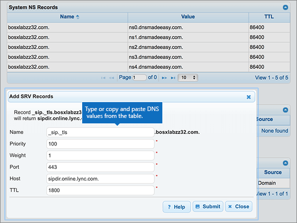

# 在 Microsoft 的 DNSMadeEasy 建立 DNS 記錄

 若您找不到所需內容，請**[查看網域常見問題集](../setup/domains-faq.md)**。 
  
如果 DNSMadeEasy 是您的 DNS 主機服務提供者，請按照本文所述的步驟驗證網域，並設定電子郵件與商務用 Skype Online 等項目的 DNS 記錄。
  
在 DNSMadeEasy 新增這些記錄之後，您的網域就會設定為與 Microsoft 服務搭配使用。
  

  
> [!NOTE]
> Typically it takes about 15 minutes for DNS changes to take effect. 然而有時可能需要更久的時間，您所做的變更才能在整個網際網路的 DNS 系統中生效。 在您新增 DNS 記錄後，如有郵件流程或其他方面的問題，請參閱[尋找並修正新增網域或 DNS 記錄之後所發生的問題](../get-help-with-domains/find-and-fix-issues.md)。 
  
## 新增 TXT 記錄以供驗證

在您將自己的網域用於 Microsoft 之前，我們必須先確認您擁有該網域。如果您能在自己的網域註冊機構登入自己的帳戶並能建立 DNS 記錄，Microsoft 就能確信您擁有該網域。
  
> [!NOTE]
> 這筆記錄只會用於驗證您擁有自己的網域，不會影響其他項目。您可以選擇稍後再刪除記錄。 
  
> [!IMPORTANT]
> For DNSMadeEasy accounts, the domain you added was purchased from a separate domain registrar. DNSMadeEasy does not offer domain registration services. Your ability to log in at DNSMadeEasy and create the DNS record is sufficient proof of ownership. 
  
1. 首先請用[這個連結](https://cp.dnsmadeeasy.com/)移至 DNSMadeEasy 上您的網域頁面。 系統會提示您先登入。
    
2. 在 [ **管理主控台** ] 頁面上的 [ **最近更新的網域** ] 區域中，選取您要更新的網域。 
    
3. 在 [ **受管理的 DNS** ] 頁面上的 [ **TXT 記錄** ] 區域中，選取 [ ( **+**) 控制項] ( [ **新增**) ]。
    
    (您可能需要向下捲動。)
    
4. In the **Add TXT Records** area, in the boxes for the new record, type or copy and paste the values from the following table. 
    
    ||||
    |:-----|:-----|:-----|
    |**名稱**   |**值**   |**TTL**   |
    |(將此欄位保留空白。)    |MS=ms *XXXXXXXX*    **附註：** 這是範例。 在這裡請使用您自己來自表格的 **[目的地或指向位址]** 值。 [如何找到呢？](../get-help-with-domains/information-for-dns-records.md)          |1800    |
   
5. 選取 **[提交]**。
    
6. 繼續進行之前，請先稍候幾分鐘，好讓您剛剛建立的記錄能在網際網路上更新。
    
現在您已在網域註冊機構網站新增記錄，請返回 Microsoft 並要求該記錄。
  
在 Microsoft 找到正確的 TXT 記錄後，您的網域就完成驗證了。
  
1. 在 Microsoft 系統管理中心中，移至 **[設定]** \> <a href="https://go.microsoft.com/fwlink/p/?linkid=834818" target="_blank">[網域]</a> 頁面。

    
2. 在 **[網域]** 頁面上，選取您要驗證的網域。 
    
3. 在 **[設定]** 頁面上，選取 **[開始設定]**。
    
4. 在 **[驗證網域]** 頁面上，選取 **[驗證]**。
    
> [!NOTE]
> Typically it takes about 15 minutes for DNS changes to take effect. 然而有時可能需要更久的時間，您所做的變更才能在整個網際網路的 DNS 系統中生效。 在您新增 DNS 記錄後，如有郵件流程或其他方面的問題，請參閱[尋找並修正新增網域或 DNS 記錄之後所發生的問題](../get-help-with-domains/find-and-fix-issues.md)。 
  
## 新增 MX 記錄，以將寄往您網域的電子郵件轉至 Microsoft

1. 首先請用[這個連結](https://cp.dnsmadeeasy.com/)移至 DNSMadeEasy 上您的網域頁面。系統會提示您先登入。
    
2. 在 [ **管理主控台** ] 頁面上的 [ **最近更新的網域** ] 區域中，選取您要更新的網域。 
    
    在 [ **管理主控台** ] 頁面上的 [ **最近更新的網域** ] 區域中，選取您要更新的網域。 
    
    
  
3. 在 [ **受管理的 DNS** ] 頁面的 [ **MX 記錄** ] 區域中，選取 [ ** (+) ** 控制項] ( [ **新增**) ]。
    
    (您可能需要向下捲動。)
    
    
  
4. 在 [新增 **MX 記錄** ] 區域的新記錄方塊中，輸入或複製並貼上下表中的值。 
    
    (您可能需要向下捲動。)
    
    |**名稱**|**伺服器**|**MX Level (MX 等級)**|**TTL**|
    |:-----|:-----|:-----|:-----|
    |(Leave this field empty.)    | *\<domain-key\>*  .mail.protection.outlook.com    **此值必須以英文句點 (.) 結尾。**   **注意：** 從您的 Microsoft 帳戶取得您的 \<*domain-key*\>。 [如何找到呢？](../get-help-with-domains/information-for-dns-records.md)          |10     如需關於優先順序的詳細資訊，請參閱[什麼是 MX 優先順序？](https://docs.microsoft.com/microsoft-365/admin/setup/domains-faq)   |1800    |
   
    
  
5. 選取 **[提交]**。
    
    
  
6. 如果 [ **Mx 記錄** ] 區段中列出任何其他 MX 記錄，請逐一選取所有的 mx 記錄加以刪除。 
    
    
  
7. 選取所有記錄後，請選取 [ **刪除選取**的]。
    
    
  
8. 在 [ **刪除 MX 記錄** ] 對話方塊中，選取 [ **刪除** ] 以確認您的變更。 
    
    
  
## 新增 Microsoft 所需的5筆 CNAME 記錄

1. 首先請用[這個連結](https://cp.dnsmadeeasy.com/)移至 DNSMadeEasy 上您的網域頁面。系統會提示您先登入。
    
2. 在 [ **管理主控台** ] 頁面上的 [ **最近更新的網域** ] 區域中，選取您要更新的網域。 
    
3. 在 [ **受管理的 DNS** ] 頁面上，選取 [ **CNAME 記錄** ] 區域中的 [ ** (+) ** ] 控制項 ( [ **新增**) ]。
    
    (您可能需要向下捲動。)
    
    
  
4. 新增五筆 CNAME 記錄中的第一筆。
    
    在 [新增 **CNAME 記錄** ] 區域的新記錄方塊中，輸入或複製並貼上下表中第一列的值。 
    
    |**名稱**|**Alias to (別名)**|**TTL**|
    |:-----|:-----|:-----|
    |autodiscover    |autodiscover.outlook.com.    **此值必須以英文句點 (.) 結尾。**   |1800    |
    |sip    |sipdir.online.lync.com.    **此值必須以英文句點 (.) 結尾。**   |1800    |
    |lyncdiscover    |webdir.online.lync.com.    **此值必須以英文句點 (.) 結尾。**   |1800    |
    |enterpriseregistration    |enterpriseregistration.windows.net.    **此值必須以英文句點 (.) 結尾。**   |1800    |
    |enterpriseenrollment    |enterpriseenrollment-s.manage.microsoft.com.    **此值必須以英文句點 (.) 結尾。**   |1800    |
   
    
  
5. 選取 **[提交]**。
    
    
  
6. 新增其他四筆 CNAME 記錄。
    
    在 [ **CNAME 記錄** ] 區段中，選取 [ ** (+) ** 控制項] ( [ **新增**) ]，使用表格中下一列的值來建立記錄，然後再選取 [ **提交** ] 以完成記錄。 
    
    重複此程式，直到您已建立全部五筆 CNAME 記錄為止。
    
## 新增 SPF 的 TXT 記錄以協助防範垃圾郵件

> [!IMPORTANT]
> 網域的 SPF 不得擁有一個以上的 TXT 記錄。 如果您的網域具有多筆 SPF 記錄，您將收到電子郵件錯誤，以及傳送及垃圾郵件分類問題。 如果網域已經有 SPF 記錄，請勿為 Microsoft 建立一個新的記錄。 請改為將必要的 Microsoft 值新增至目前的記錄，讓您擁有包含這兩組值的  *單一*  SPF 記錄。 需要範例？ 請參閱這些 [Microsoft 的外部網域名稱系統記錄](https://docs.microsoft.com/microsoft-365/enterprise/external-domain-name-system-records)。 若要驗證您的 SPF 記錄，您可以使用其中一種[spf 驗證工具](../setup/domains-faq.md)。 
  
1. 首先請用[這個連結](https://cp.dnsmadeeasy.com/)移至 DNSMadeEasy 上您的網域頁面。 系統會提示您先登入。
    
2. 在 [ **管理主控台** ] 頁面上的 [ **最近更新的網域** ] 區域中，選取您要更新的網域。 
    
3. 在 [ **受管理的 DNS** ] 頁面上的 [ **TXT 記錄** ] 區域中，選取 [ ** (+) ** 控制項] ( [ **新增**) ]。
    
    (您可能需要向下捲動。)
    
    
  
4. In the **Add TXT Records** area, in the boxes for the new record, type or copy and paste the values from the following table. 
    
    |**名稱**|**值**|**TTL**|
    |:-----|:-----|:-----|
    |(將此欄位保留空白。)    |v=spf1 include:spf.protection.outlook.com -all    **注意：** 建議您複製並貼上這個項目，好讓所有的間距保持正確。           |1800    |
   
    
  
5. 選取 **[提交]**。
    
    
  
## 新增兩筆 Microsoft 所需的 SRV 記錄

1. 首先請用[這個連結](https://cp.dnsmadeeasy.com/)移至 DNSMadeEasy 上您的網域頁面。系統會提示您先登入。
    
2. 在 [ **管理主控台** ] 頁面上的 [ **最近更新的網域** ] 區域中，選取您要更新的網域。 
    
3. 在 [ **受管理的 DNS** ] 頁面上，選取 [ **SRV 記錄** ] 區域中的 [ ** (+) ** ] 控制項 ( [ **新增**) ]。
    
    (您可能需要向下捲動)
    
    
  
4. 新增兩筆 SRV 記錄中的第一筆。
    
    在 [ **ADD SRV** record] （新增 SRV 記錄）區域的新記錄方塊中，輸入或複製並貼上下表中第一列的值。 
    
    |**名稱**|**Priority** (優先順序)|**Weight** (權數)|**Port** (連接埠)|**Host**|**TTL**|
    |:-----|:-----|:-----|:-----|:-----|:-----|
    |_sip._tls    |100    |1     |443    |sipdir.online.lync.com.    **此值必須以英文句點 (.) 結尾。**   |1800    |
    |_sipfederationtls._tcp    |100    |1     |5061    |sipfed.online.lync.com。    **此值必須以英文句點 (.) 結尾。**   |1800    |
   
    
  
5. 選取 **[提交]**。
    
    
  
6. 新增另一筆 SRV 記錄。
    
    在 [ **SRV 記錄** ] 區段中，選取 [ ** (+) ** 控制項] ( [ **新增**) ]，使用表格中下一列的值來建立記錄，然後再選取 [ **提交** ] 以完成記錄。 
    
> [!NOTE]
> Typically it takes about 15 minutes for DNS changes to take effect. 然而有時可能需要更久的時間，您所做的變更才能在整個網際網路的 DNS 系統中生效。 在您新增 DNS 記錄後，如有郵件流程或其他方面的問題，請參閱[尋找並修正新增網域或 DNS 記錄之後所發生的問題](../get-help-with-domains/find-and-fix-issues.md)。 
  

