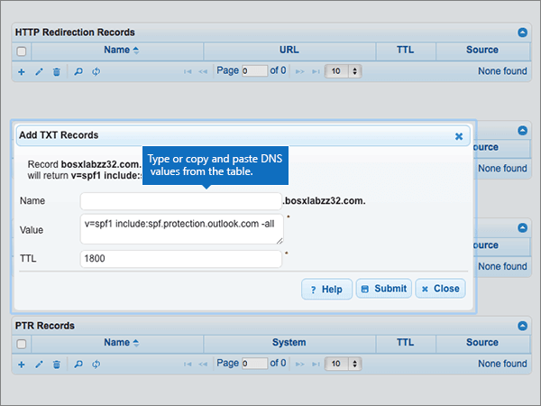

# 在 DNSMadeEasy 建立 Office 365 的 DNS 記錄

 若您找不到所需內容，請**[查看網域常見問題集](../setup/domains-faq.md)**。 
  
如果 DNSMadeEasy 是您的 DNS 主機服務提供者，請按照本文所述的步驟驗證網域，並設定電子郵件與商務用 Skype Online 等項目的 DNS 記錄。
  
在 DNSMadeEasy 新增這些記錄之後，您的網域就會設定為搭配 Office 365 服務使用。
  
若要了解使用 Office 365 網站的虛擬主機和 DNS，請參閱[搭配 Office 365 使用公用網站](https://support.office.com/article/choose-a-public-website-3325d50e-d131-403c-a278-7f3296fe33a9)。
  
> [!NOTE]
> Typically it takes about 15 minutes for DNS changes to take effect. 而如果您所做的變更要在整個網際網路 DNS 系統中生效，有時可能需要更久的時間。 在您新增 DNS 記錄後，如有郵件流程或其他方面的問題，請參閱[尋找並修正在 Office 365 中新增網域或 DNS 記錄之後所發生的問題](../get-help-with-domains/find-and-fix-issues.md)。 
  
## 新增 TXT 記錄以供驗證

在您將自己的網域用於 Office 365 之前，我們必須先確認您擁有該網域。如果您能在自己的網域註冊機構登入自己的帳戶並能建立 DNS 記錄，Office 365 就能確信您擁有該網域。
  
> [!NOTE]
> 這筆記錄只會用於驗證您擁有自己的網域，不會影響其他項目。您可以選擇稍後再刪除記錄。 
  
> [!IMPORTANT]
> For DNSMadeEasy accounts, the domain you added was purchased from a separate domain registrar. DNSMadeEasy does not offer domain registration services. Your ability to log in at DNSMadeEasy and create the DNS record is sufficient proof of ownership. 
  
1. 首先請用[這個連結](https://cp.dnsmadeeasy.com/)移至 DNSMadeEasy 上您的網域頁面。 系統會提示您先登入。
    
2. 在 [**管理主控台**] 頁面上，在**最近更新的網域**] 區域中，選取您想要更新的網域。 
    
3. 在 [ **Managed DNS** ] 頁面的 [ **TXT 記錄**] 區域中，選取 [( **+**) 控制項 （**新增**）。
    
    (You may have to scroll down.)
    
4. In the **Add TXT Records** area, in the boxes for the new record, type or copy and paste the values from the following table. 
    
    ||||
    |:-----|:-----|:-----|
    |**Name**   |**值**   |**TTL**   |
    |(Leave this field empty.)    |MS=ms *XXXXXXXX*    **附註：** 這是範例。 在這裡請使用您自己的 [目的地或指向位址] 值，請參閱 Office 365 表格。 [如何找到呢？](../get-help-with-domains/information-for-dns-records.md)          |1800    |
   
5. 選取 [**提交**]。
    
6. 繼續進行之前，請先稍候幾分鐘，好讓您剛剛建立的記錄能在網際網路上更新。
    
現在您已在網域註冊機構網站新增記錄，請返回 Office 365 並要求 Office 365 尋找該記錄。
  
在 Office 365 找到正確的 TXT 記錄後，您的網域就完成驗證了。
  
1. 在系統管理中心中，移至 **[設定]** \> <a href="https://go.microsoft.com/fwlink/p/?linkid=834818" target="_blank">[網域]</a> 頁面。

    
2. 在 **[網域]** 頁面上，選取您要驗證的網域。 
    
3. 在 **[設定]** 頁面上，選取 **[開始設定]**。
    
4. 在 [驗證網域]**** 頁面上，選取 [驗證]****。
    
> [!NOTE]
> Typically it takes about 15 minutes for DNS changes to take effect. 而如果您所做的變更要在整個網際網路 DNS 系統中生效，有時可能需要更久的時間。 在您新增 DNS 記錄後，如有郵件流程或其他方面的問題，請參閱[尋找並修正在 Office 365 中新增網域或 DNS 記錄之後所發生的問題](../get-help-with-domains/find-and-fix-issues.md)。 
  
## 新增 MX 記錄，以將寄往您網域的電子郵件轉至 Office 365

1. 首先請用[這個連結](https://cp.dnsmadeeasy.com/)移至 DNSMadeEasy 上您的網域頁面。系統會提示您先登入。
    
2. 在 [**管理主控台**] 頁面上，在**最近更新的網域**] 區域中，選取您想要更新的網域。 
    
    在 [**管理主控台**] 頁面上，在**最近更新的網域**] 區域中，選取您想要更新的網域。 
    
    
  
3. 在 [ **Managed DNS** ] 頁面上，在 [ **MX 記錄**] 區域中，選取 **（+）** 控制項 （**新增**）。
    
    (You may have to scroll down.)
    
    
  
4. 在 [**新增 MX 記錄**] 區域中，於新記錄的方塊中輸入或複製並貼上下表中的值。 
    
    (You may have to scroll down.)
    
    |**名稱**|**伺服器**|**MX Level (MX 等級)**|**TTL**|
    |:-----|:-----|:-----|:-----|
    |(將此欄位保留空白。)    | *\<網域金鑰\>*  .mail.protection.outlook.com    **This value MUST end with a period (.)**   **注意：** 從您的 Office 365 帳戶取得您的\<*網域金鑰*\>。 [How do I find this?](../get-help-with-domains/information-for-dns-records.md)          |10     如需關於優先順序的詳細資訊，請參閱[什麼是 MX 優先順序？](https://support.office.com/article/2784cc4d-95be-443d-b5f7-bb5dd867ba83.aspx)   |1800    |
   
    
  
5. 選取 [**提交**]。
    
    
  
6. 如果有任何其他 MX 記錄列在 [ **MX 記錄**] 區段中，請選取每個來刪除全部。 
    
    
  
7. 選取所有記錄時，選取 [**刪除選取的**。
    
    
  
8. 在 [**刪除的 MX 記錄**] 對話方塊中，選取 [**刪除**] 以確認您的變更。 
    
    
  
## 新增 Office 365 所需的五筆 CNAME 記錄

1. 首先請用[這個連結](https://cp.dnsmadeeasy.com/)移至 DNSMadeEasy 上您的網域頁面。系統會提示您先登入。
    
2. 在 [**管理主控台**] 頁面上，在**最近更新的網域**] 區域中，選取您想要更新的網域。 
    
3. 在 [ **Managed DNS** ] 頁面上**筆 CNAME 記錄**] 區域中，選取 **（+）** 控制項 （**新增**）。
    
    (You may have to scroll down.)
    
    
  
4. 新增第一筆五筆 CNAME 記錄。
    
    在 [**新增 CNAME 記錄**] 區域中，於新記錄的方塊中輸入或複製並貼下表中第一列的值。 
    
    |**名稱**|**Alias to (別名)**|**TTL**|
    |:-----|:-----|:-----|
    |autodiscover    |autodiscover.outlook.com。    **This value MUST end with a period (.)**   |1800    |
    |sip    |sipdir.online.lync.com>。    **This value MUST end with a period (.)**   |1800    |
    |lyncdiscover    |webdir.online.lync.com>。    **This value MUST end with a period (.)**   |1800    |
    |enterpriseregistration    |enterpriseregistration.windows.net>。    **This value MUST end with a period (.)**   |1800    |
    |enterpriseenrollment    |enterpriseenrollment-s.manage.microsoft.com。    **This value MUST end with a period (.)**   |1800    |
   
    
  
5. 選取 [**提交**]。
    
    
  
6. 新增每個其他四筆 CNAME 記錄。
    
    在 [ **CNAME 記錄**] 區段中，選擇 **（+）** 控制項 （**新增**） 在表格中，使用下一列的值來建立記錄，然後再次選擇 [**提交**]，以完成該筆記錄。 
    
    重複此程序，直到五筆 CNAME 記錄全部建立完畢。
    
## 新增 SPF 的 TXT 記錄以協助防範垃圾郵件

> [!IMPORTANT]
> 網域的 SPF 不得擁有一個以上的 TXT 記錄。 如果您的網域具有多筆 SPF 記錄，您將收到電子郵件錯誤，以及傳送及垃圾郵件分類問題。 如果網域已經有 SPF 記錄，請勿為 Office 365 建立一個新的記錄。 而是，請將必要的 Office 365 值新增到目前的記錄，以便擁有包含這兩組值的*單一* SPF 記錄。 需要範例？ 請參閱這些 [Office 365 的外部網域名稱系統記錄](https://support.office.com/article/c0531a6f-9e25-4f2d-ad0e-a70bfef09ac0)。 若要驗證您的 SPF 記錄，您可以使用其中一種[SPF 驗證工具](../setup/domains-faq.md)。 
  
1. 首先請用[這個連結](https://cp.dnsmadeeasy.com/)移至 DNSMadeEasy 上您的網域頁面。 系統會提示您先登入。
    
2. 在 [**管理主控台**] 頁面上，在**最近更新的網域**] 區域中，選取您想要更新的網域。 
    
3. 在 [ **Managed DNS** ] 頁面上，在 [ **TXT 記錄**] 區域中，選取 **（+）** 控制項 （**新增**）。
    
    (您可能需要向下捲動。)
    
    
  
4. In the **Add TXT Records** area, in the boxes for the new record, type or copy and paste the values from the following table. 
    
    |**名稱**|**值**|**TTL**|
    |:-----|:-----|:-----|
    |(Leave this field empty.)    |v=spf1 include:spf.protection.outlook.com -all    **附註：** 建議您複製並貼上這個項目，好讓所有的間距保持正確。           |1800    |
   
    
  
5. 選取 [**提交**]。
    
    
  
## 新增兩筆 Office 365 所需的 SRV 記錄

1. 首先請用[這個連結](https://cp.dnsmadeeasy.com/)移至 DNSMadeEasy 上您的網域頁面。系統會提示您先登入。
    
2. 在 [**管理主控台**] 頁面上，在**最近更新的網域**] 區域中，選取您想要更新的網域。 
    
3. 在 [ **Managed DNS** ] 頁面上**SRV 記錄**] 區域中，選取 **（+）** 控制項 （**新增**）。
    
    (您可能需要向下捲動)
    
    
  
4. 新增兩筆 SRV 記錄中的第一筆。
    
    在 [**新增 SRV 記錄**] 區域中，於新記錄的方塊中輸入或複製並貼下表中第一列的值。 
    
    |**名稱**|**Priority** (優先順序)|**Weight** (權數)|**Port** (連接埠)|**Host** (主機)|**TTL**|
    |:-----|:-----|:-----|:-----|:-----|:-----|
    |_sip._tls    |100    |1    |443    |sipdir.online.lync.com>。    **This value MUST end with a period (.)**   |1800    |
    |_sipfederationtls._tcp    |100    |1    |5061    |sipfed.online.lync.com。    **This value MUST end with a period (.)**   |1800    |
   
    
  
5. 選取 [**提交**]。
    
    
  
6. 新增另一筆 SRV 記錄。
    
    在 [ **SRV 記錄**] 區段中，選擇 **（+）** 控制項 （**新增**） 在表格中，使用下一列的值來建立記錄，然後再次選擇 [**提交**]，以完成該筆記錄。 
    
> [!NOTE]
> Typically it takes about 15 minutes for DNS changes to take effect. 而如果您所做的變更要在整個網際網路 DNS 系統中生效，有時可能需要更久的時間。 在您新增 DNS 記錄後，如有郵件流程或其他方面的問題，請參閱[尋找並修正在 Office 365 中新增網域或 DNS 記錄之後所發生的問題](../get-help-with-domains/find-and-fix-issues.md)。 
  

