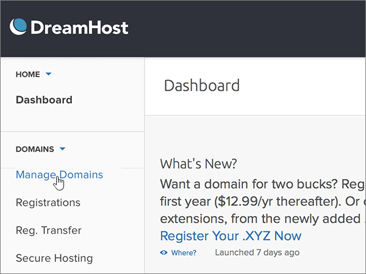
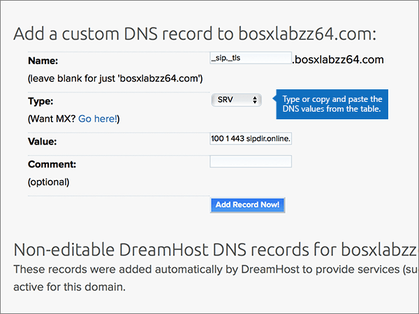
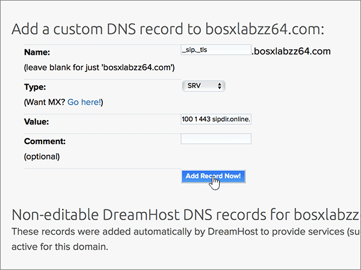

# 在 Dreamhost 建立 Office 365 的 DNS 記錄

 若您找不到所需功能，請**[檢查網域常見問題集](../setup/domains-faq.md)**。 
  
如果 DreamHost 是您 DNS 主機服務提供者，請遵循本篇文章以驗證您的網域和設定 DNS 記錄的電子郵件、 Lync、 等等中的步驟。
 
在 DreamHost 新增這些記錄之後，您的網域就會設定為搭配 Office 365 服務。
  
若要了解使用 Office 365 網站的虛擬主機和 DNS，請參閱[搭配 Office 365 使用公用網站](https://support.office.com/article/a8178510-501d-4bd8-9921-b04f2e9517a5.aspx)。
  
> [!NOTE]
> DNS 變更生效通常約需 15 分鐘的時間。而如果您所做的變更要在整個網際網路 DNS 系統中生效，有時可能需要更久的時間。在您新增 DNS 記錄後，如有郵件流程或其他方面的問題，請參閱[變更網域名稱或 DNS 記錄之後所發生問題的疑難排解](../get-help-with-domains/find-and-fix-issues.md)。 
  
## 新增 TXT 記錄以供驗證

在您將自己的網域用於 Office 365 之前，我們必須先確認您擁有該網域。如果您能在自己的網域註冊機構登入自己的帳戶並能建立 DNS 記錄，Office 365 就能確信您擁有該網域。
  
> [!NOTE]
> 這筆記錄只會用於驗證您擁有自己的網域，不會影響其他項目。您可以選擇稍後再刪除記錄。 
  
1. 若要開始，使用[這個連結](https://panel.dreamhost.com/)移至您在 DreamHost 的網域頁面。 系統會提示您登入。
    
    
  
2. 在**儀表板**頁面上，選取 [**網域**]，然後按一下 [**管理網域**]。
    
    
  
3. 在 [**管理網域**] 頁面上，在 [**網域**] 區段中，選取**DNS**針對您想要編輯的網域。 
    
    
  
4. In the **Add a custom DNS record** section, in the boxes for the new record, type or copy and paste the values from the following table. 
    
    (You may have to scroll down.)
    
    (Choose the **Type** value from the drop-down list.) 
    
    |**Name**|**Type**|**Value**|**Comment**|
    |:-----|:-----|:-----|:-----|
    |(Leave this field empty.)    |TXT    |MS=ms *XXXXXXXX*    **附註：** 這是範例。 Use your specific **Destination or Points to Address** value here, from the table in Office 365.           [How do I find this?](../get-help-with-domains/information-for-dns-records.md)          |（此欄位是選用的）。    |
   
   
  
5. 選取 [**現在新增記錄 ！**
    
    
  
6. 繼續進行之前，請先稍候幾分鐘，好讓您剛剛建立的記錄能在網際網路上更新。
    
Now that you've added the record at your domain registrar's site, you'll go back to Office 365 and request Office 365 to look for the record.
  
When Office 365 finds the correct TXT record, your domain is verified.
  
1. 在系統管理中心，移至 [**設定** \> <a href="https://go.microsoft.com/fwlink/p/?linkid=834818" target="_blank">網域</a>] 頁面。

    
2. 在 [**網域**] 頁面上，選取您要驗證的網域。 
    
    
  
3. 在 [**安裝**] 頁面上，選取 [**啟動安裝程式**。
    
    
  
4. 在 [**驗證網域**] 頁面上，選取 [**驗證**]。
    
    
  
> [!NOTE]
>  DNS 變更生效通常約需 15 分鐘的時間。而如果您所做的變更要在整個網際網路 DNS 系統中生效，有時可能需要更久的時間。在您新增 DNS 記錄後，如有郵件流程或其他方面的問題，請參閱[變更網域名稱或 DNS 記錄之後所發生問題的疑難排解](../get-help-with-domains/find-and-fix-issues.md)。 
  

  
## 新增 MX 記錄，以將寄往您網域的電子郵件轉至 Office 365

請依照下列步驟進行。
  
1. 若要開始，使用[這個連結](https://panel.dreamhost.com/)移至您在 DreamHost 的網域頁面。 系統會提示您登入。
    
    
  
2. 在 [**儀表板**] 頁面上，選取**郵件**，然後**自訂 MX**。
    
    
  
3. 在 [**管理郵件傳遞**] 區段中 [**動作**] 欄中，選取您想要編輯的網域的 [**編輯**]。 
    
    
  
4. 在 [**自訂 MX 記錄**] 區段，於新記錄的方塊中輸入或複製並貼上下表中的下列值。 
    
    (You may have to scroll down.)
    
    （如果有任何其他現有的 MX 記錄，將標示要刪除的記錄）。
    
    |**MX 記錄 （必要）**|
    |:-----|
    |0  *\<網域金鑰\>*  .mail.protection.outlook.com.    **This value MUST end with a period (.)**   0 是指 MX 優先順序值。請將它新增到 MX 值的開頭，並以空格分隔該值的其餘部分。    **附註：** 取得您*\<網域金鑰\>* 從您的 Office 365 帳戶。           [How do I find this?](../get-help-with-domains/information-for-dns-records.md)          |
   
    
  
5. 選取 [**變更此網域若要使用自訂 MX 記錄，現在 ！**
    
    
  
6. 如果有任何其他現有的 MX 記錄，請選取項目，然後按鍵盤上的**Delete**鍵刪除每一筆記錄。 
    
    
  
7. 如果您已刪除任何記錄，選取 [**立即更新您的自訂 MX 記錄 ！**
    
    

  
## 新增 Office 365 所需的六筆 CNAME 記錄

請依照下列步驟進行。
  
1. 若要開始，使用[這個連結](https://panel.dreamhost.com/)移至您在 DreamHost 的網域頁面。 系統會提示您登入。
    
    
  
2. 在**儀表板**頁面上，選取 [**網域**]，然後按一下 [**管理網域**]。
    
    
  
3. 在 [**管理網域**] 頁面上，在 [**網域**] 區段中，選取**DNS**針對您想要編輯的網域。 
    
    
  
4. 在 [**新增自訂的 DNS 記錄**] 區段，於新記錄的方塊中輸入或複製並貼下表中第一列的值。 
    
    (You may have to scroll down.)
    
    (Choose the **Type** value from the drop-down list.) 
    
    |**Name**|**Type**|**Value**|**Comment**|
    |:-----|:-----|:-----|:-----|
    |autodiscover    |CNAME    |autodiscover.outlook.com。    **This value MUST end with a period (.)**   |（此欄位是選用的）。    |
    |sip    |CNAME    |sipdir.online.lync.com>。    **This value MUST end with a period (.)**   |（此欄位是選用的）。    |
    |lyncdiscover    |CNAME    |webdir.online.lync.com>。    **This value MUST end with a period (.)**   |（此欄位是選用的）。    |
    |enterpriseregistration    |CNAME    |enterpriseregistration.windows.net>。    **This value MUST end with a period (.)**   |（此欄位是選用的）。    |
    |enterpriseenrollment    |CNAME    |enterpriseenrollment-s.manage.microsoft.com。    **This value MUST end with a period (.)**   |（此欄位是選用的）。    |
   
    
  
5. 選取 [**現在新增記錄 ！**
    
    
  
6. 使用表格中的前兩個步驟和其他五列的值，新增每個其他五筆 CNAME 記錄。

  
## 新增 SPF 的 TXT 記錄以協助防範垃圾郵件

> [!IMPORTANT]
> You cannot have more than one TXT record for SPF for a domain. If your domain has more than one SPF record, you'll get email errors, as well as delivery and spam classification issues. If you already have an SPF record for your domain, don't create a new one for Office 365. Instead, add the required Office 365 values to the current record so that you have a  *single*  SPF record that includes both sets of values.
  
請依照下列步驟操作。
  
1. 若要開始，使用[這個連結](https://panel.dreamhost.com/)移至您在 DreamHost 的網域頁面。 系統會提示您登入。
    
    
  
2. 在**儀表板**頁面上，選取 [**網域**]，然後按一下 [**管理網域**]。
    
    
  
3. 在 [**管理網域**] 頁面上，在 [**網域**] 區段中，選取**DNS**針對您想要編輯的網域。 
    
    
  
4. 在 [**新增自訂的 DNS 記錄**] 區段，於新記錄的方塊中輸入或複製並貼下表中第一列的值。 
    
    (You may have to scroll down.)
    
    (Choose the **Type** value from the drop-down list.) 
    
    |**Name**|**Type**|**Value**|**Comment**|
    |:-----|:-----|:-----|:-----|
    |(Leave this field empty.)    |TXT    |v=spf1 include:spf.protection.outlook.com -all    **附註：** 建議您複製並貼上這個項目，好讓所有的間距保持正確。           |（此欄位是選用的）。    |
   
   
  
5. 選取 [**現在新增記錄 ！**
    
    
  
6. 使用表格中的前兩個步驟和第二列中的值，新增其他 SRV 記錄。
    
  
## 新增兩筆 Office 365 所需的 SRV 記錄

請依照下列步驟進行。
  
1. 若要開始，使用[這個連結](https://panel.dreamhost.com/)移至您在 DreamHost 的網域頁面。 系統會提示您登入。
    
    
  
2. 在**儀表板**頁面上，選取 [**網域**]，然後按一下 [**管理網域**]。
    
    
  
3. 在 [**管理網域**] 頁面上，在 [**網域**] 區段中，選取**DNS**針對您想要編輯的網域。 
    
    
  
4. 在 [**新增自訂的 DNS 記錄**] 區段，於新記錄的方塊中輸入或複製並貼下表中第一列的值。 
    
    (You may have to scroll down.)
    
    (Choose the **Type** value from the drop-down list.) 
    
    |**Name**|**Type**|**Value**|**Comment**|
    |:-----|:-----|:-----|:-----|
    |_sip._tls    |SRV    |100 1 443    sipdir.online.lync.com>。    **This value MUST end with a period (.)**   |（此欄位是選用的）。    |
    |_sipfederationtls._tcp    |SRV    |100 1 5061    sipfed.online.lync.com。    **This value MUST end with a period (.)**   |（此欄位是選用的）。    |
   
    
  
5. 選取 [**現在新增記錄 ！**。
    
    
  
6. 使用表格中的前兩個步驟和第二列中的值，新增其他 SRV 記錄。
    
> [!NOTE]
>  DNS 變更生效通常約需 15 分鐘的時間。而如果您所做的變更要在整個網際網路 DNS 系統中生效，有時可能需要更久的時間。在您新增 DNS 記錄後，如有郵件流程或其他方面的問題，請參閱[變更網域名稱或 DNS 記錄之後所發生問題的疑難排解](../get-help-with-domains/find-and-fix-issues.md)。 

  
