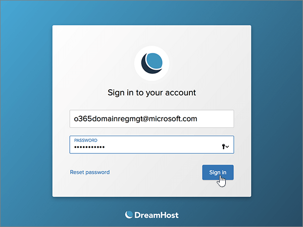
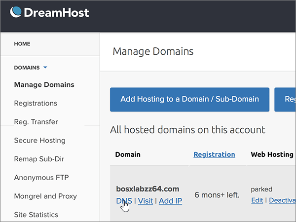
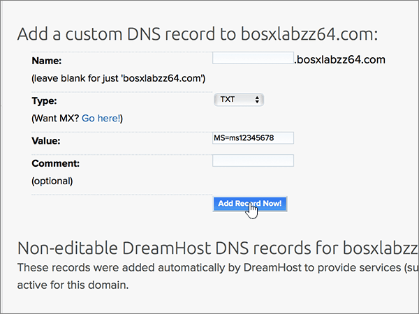
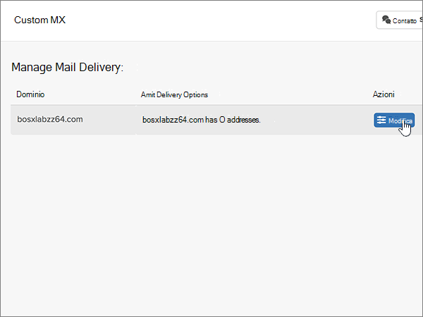
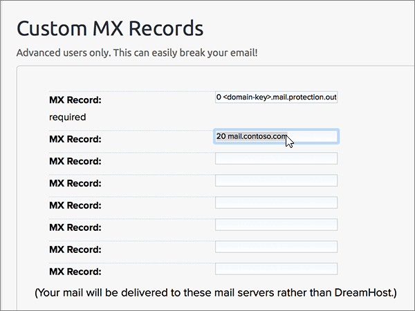
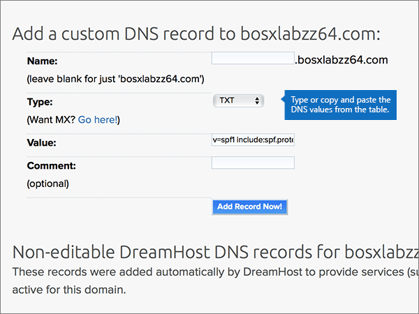

# 在 Dreamhost 建立 Microsoft 的 DNS 記錄

 若您找不到所需功能，請**[檢查網域常見問題集](../setup/domains-faq.md)**。 
  
如果 DreamHost 是您的 DNS 主機服務提供者，請遵循本文中的步驟來驗證您的網域，並設定電子郵件、Lync 等等的 DNS 記錄。
 
在 DreamHost 新增這些記錄之後，您的網域就會設定為與 Microsoft 服務搭配使用。
  
  
> [!NOTE]
> DNS 變更生效通常約需 15 分鐘的時間。而如果您所做的變更要在整個網際網路 DNS 系統中生效，有時可能需要更久的時間。在您新增 DNS 記錄後，如有郵件流程或其他方面的問題，請參閱[變更網域名稱或 DNS 記錄之後所發生問題的疑難排解](../get-help-with-domains/find-and-fix-issues.md)。 
  
## 新增 TXT 記錄以供驗證

在您將自己的網域用於 Microsoft 之前，我們必須先確認您擁有該網域。如果您能在自己的網域註冊機構登入自己的帳戶並能建立 DNS 記錄，Microsoft 就能確信您擁有該網域。
  
> [!NOTE]
> 這筆記錄只會用於驗證您擁有自己的網域，不會影響其他項目。您可以選擇稍後再刪除記錄。 
  
1. 若要開始使用，請移至您的網域頁面 DreamHost，方法是使用[此連結](https://panel.dreamhost.com/)。 系統會提示您登入。
    
    
  
2. 在 [**儀表板**] 頁面上，選取 [**網域**]，然後**管理網域**。
    
    
  
3. 在 [**管理網域**] 頁面上的 [**網域**] 區段中，選取您要編輯之網域的 [ **DNS** ]。 
    
    
  
4. In the **Add a custom DNS record** section, in the boxes for the new record, type or copy and paste the values from the following table. 
    
    (You may have to scroll down.)
    
    (Choose the **Type** value from the drop-down list.) 
    
    |**Name**|**Type**|**Value**|**Comment**|
    |:-----|:-----|:-----|:-----|
    |(Leave this field empty.)    |TXT    |MS=ms *XXXXXXXX*    **附註：** 這是範例。 在這裡請使用您自己來自表格的 [目的地或指向位址]**** 值。           [如何找到呢？](../get-help-with-domains/information-for-dns-records.md)          |（此欄位是選用的。）    |
   
   
  
5. 選取 [**立即加入記錄！** ]
    
    
  
6. 繼續進行之前，請先稍候幾分鐘，好讓您剛剛建立的記錄能在網際網路上更新。
    
現在您已在網域註冊機構網站新增記錄，請返回 Microsoft 並要求該記錄。
  
在 Microsoft 找到正確的 TXT 記錄後，您的網域就完成驗證了。
  
1. 在 Microsoft 系統管理中心中，移至 [設定]**** \> [網域] 頁面。

    
2. 在 **[網域]** 頁面上，選取您要驗證的網域。 
    
    
  
3. 在 **[設定]** 頁面上，選取 **[開始設定]**。
    
    
  
4. 在 **[驗證網域]** 頁面上，選取 **[驗證]**。
    
    
  
> [!NOTE]
>  DNS 變更生效通常約需 15 分鐘的時間。而如果您所做的變更要在整個網際網路 DNS 系統中生效，有時可能需要更久的時間。在您新增 DNS 記錄後，如有郵件流程或其他方面的問題，請參閱[變更網域名稱或 DNS 記錄之後所發生問題的疑難排解](../get-help-with-domains/find-and-fix-issues.md)。 
  

  
## 新增 MX 記錄，以將寄往您網域的電子郵件轉至 Microsoft

請依照下列步驟進行。
  
1. 若要開始使用，請移至您的網域頁面 DreamHost，方法是使用[此連結](https://panel.dreamhost.com/)。 系統會提示您登入。
    
    
  
2. 在 [**儀表板**] 頁面上，選取 [**郵件**]，然後選取 [**自訂 MX**]。
    
    
  
3. 在 [**管理郵件傳遞**] 區段的 [**動作**] 欄中，針對您要編輯的網域，選取 [**編輯**]。 
    
    
  
4. 在 [**自訂 MX 記錄**] 區段的新記錄方塊中，輸入或複製並貼上下清單格中的值。 
    
    (You may have to scroll down.)
    
    （如果有任何其他現有的 MX 記錄，請將這些記錄標示為待刪除。）
    
    |**MX 記錄（必要）**|
    |:-----|
    |0  *\<網域金鑰\>*  .mail.protection.outlook.com.    **This value MUST end with a period (.)**   0 是指 MX 優先順序值。請將它新增到 MX 值的開頭，並以空格分隔該值的其餘部分。    **附注：** 從您的 Microsoft 帳戶取得您* \<的網域金鑰\> * 。           [如何找到呢？](../get-help-with-domains/information-for-dns-records.md)          |
   
    
  
5. 選取 [**變更這個網域立即使用自訂的 MX 記錄！** ]
    
    
  
6. 如果有任何其他現有的 MX 記錄，請選取該專案，然後按下鍵盤上的**delete**鍵，以刪除每一筆記錄。 
    
    
  
7. 如果您已刪除任何記錄，請選取 [**立即更新您的自訂 MX 記錄！** ]。
    
    

  
## 新增 Microsoft 所需的六筆 CNAME 記錄

請依照下列步驟進行。
  
1. 若要開始使用，請移至您的網域頁面 DreamHost，方法是使用[此連結](https://panel.dreamhost.com/)。 系統會提示您登入。
    
    
  
2. 在 [**儀表板**] 頁面上，選取 [**網域**]，然後**管理網域**。
    
    
  
3. 在 [**管理網域**] 頁面上的 [**網域**] 區段中，選取您要編輯之網域的 [ **DNS** ]。 
    
    
  
4. 在 [新增**自訂 DNS 記錄**] 區段的新記錄方塊中，輸入或複製並貼上下表中第一列的值。 
    
    (You may have to scroll down.)
    
    (Choose the **Type** value from the drop-down list.) 
    
    |**Name**|**Type**|**Value**|**Comment**|
    |:-----|:-----|:-----|:-----|
    |autodiscover    |CNAME    |autodiscover.outlook.com。    **This value MUST end with a period (.)**   |（此欄位是選用的。）    |
    |sip    |CNAME    |sipdir.online.lync.com。    **This value MUST end with a period (.)**   |（此欄位是選用的。）    |
    |lyncdiscover    |CNAME    |webdir.online.lync.com。    **This value MUST end with a period (.)**   |（此欄位是選用的。）    |
    |enterpriseregistration    |CNAME    |enterpriseregistration.windows.net。    **This value MUST end with a period (.)**   |（此欄位是選用的。）    |
    |enterpriseenrollment    |CNAME    |enterpriseenrollment-s.manage.microsoft.com。    **This value MUST end with a period (.)**   |（此欄位是選用的。）    |
   
    
  
5. 選取 [**立即加入記錄！** ]
    
    
  
6. 使用前兩個步驟和表格中其他五列的值，新增其餘五筆 CNAME 記錄。

  
## 新增 SPF 的 TXT 記錄以協助防範垃圾郵件

> [!IMPORTANT]
> 網域的 SPF 不得擁有一個以上的 TXT 記錄。 如果您的網域具有多筆 SPF 記錄，您將收到電子郵件錯誤，以及傳送及垃圾郵件分類問題。 如果網域已經有 SPF 記錄，請勿為 Microsoft 建立一個新的記錄。 請改為將必要的 Microsoft 值新增至目前的記錄，讓您擁有包含這兩組值的*單一*SPF 記錄。
  
請依照下列步驟操作。
  
1. 若要開始使用，請移至您的網域頁面 DreamHost，方法是使用[此連結](https://panel.dreamhost.com/)。 系統會提示您登入。
    
    
  
2. 在 [**儀表板**] 頁面上，選取 [**網域**]，然後**管理網域**。
    
    
  
3. 在 [**管理網域**] 頁面上的 [**網域**] 區段中，選取您要編輯之網域的 [ **DNS** ]。 
    
    
  
4. 在 [新增**自訂 DNS 記錄**] 區段的新記錄方塊中，輸入或複製並貼上下表中第一列的值。 
    
    (You may have to scroll down.)
    
    (Choose the **Type** value from the drop-down list.) 
    
    |**Name**|**Type**|**Value**|**Comment**|
    |:-----|:-----|:-----|:-----|
    |(Leave this field empty.)    |TXT    |v=spf1 include:spf.protection.outlook.com -all    **注意：** 建議您複製並貼上這個項目，好讓所有的間距保持正確。           |（此欄位是選用的。）    |
   
   
  
5. 選取 [**立即加入記錄！** ]
    
    
  
6. 使用前面的兩個步驟和表格中第二列的值，新增其他 SRV 記錄。
    
  
## 新增兩筆 Microsoft 所需的 SRV 記錄

請依照下列步驟進行。
  
1. 若要開始使用，請移至您的網域頁面 DreamHost，方法是使用[此連結](https://panel.dreamhost.com/)。 系統會提示您登入。
    
    
  
2. 在 [**儀表板**] 頁面上，選取 [**網域**]，然後**管理網域**。
    
    
  
3. 在 [**管理網域**] 頁面上的 [**網域**] 區段中，選取您要編輯之網域的 [ **DNS** ]。 
    
    
  
4. 在 [新增**自訂 DNS 記錄**] 區段的新記錄方塊中，輸入或複製並貼上下表中第一列的值。 
    
    (You may have to scroll down.)
    
    (Choose the **Type** value from the drop-down list.) 
    
    |**Name**|**Type**|**Value**|**Comment**|
    |:-----|:-----|:-----|:-----|
    |_sip。 _tls    |SRV    |100 1 443    sipdir.online.lync.com。    **This value MUST end with a period (.)**   |（此欄位是選用的。）    |
    |_sipfederationtls。 _tcp    |SRV    |100 1 5061    sipfed.online.lync.com。    **This value MUST end with a period (.)**   |（此欄位是選用的。）    |
   
    
  
5. 選取 [**立即加入記錄！**]。
    
    
  
6. 使用前面的兩個步驟和表格中第二列的值，新增其他 SRV 記錄。
    
> [!NOTE]
>  DNS 變更生效通常約需 15 分鐘的時間。而如果您所做的變更要在整個網際網路 DNS 系統中生效，有時可能需要更久的時間。在您新增 DNS 記錄後，如有郵件流程或其他方面的問題，請參閱[變更網域名稱或 DNS 記錄之後所發生問題的疑難排解](../get-help-with-domains/find-and-fix-issues.md)。 

  
