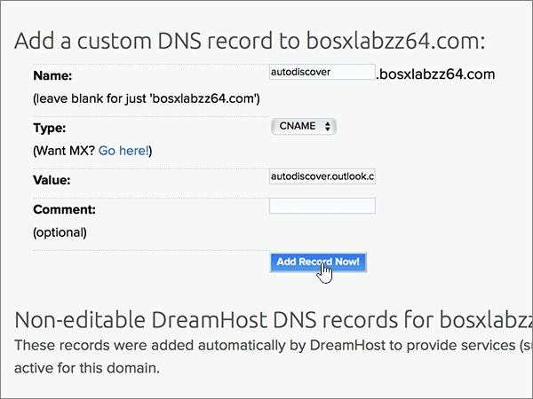

# 在 Dreamhost 建立 Office 365 的 DNS 記錄Create DNS records at Dreamhost for Office 365

 若您找不到所需功能，請**[檢查網域常見問題集](../setup/domains-faq.md)**。**[Check the Domains FAQ](../setup/domains-faq.md)** if you don't find what you're looking for. 
  
如果 DreamHost 是您的 DNS 主機服務提供者，請遵循本文中的步驟來驗證您的網域，並設定電子郵件、Lync 等等的 DNS 記錄。If DreamHost is your DNS hosting provider, follow the steps in this article to verify your domain and set up DNS records for email, Lync, and so on.
 
在 DreamHost 新增這些記錄之後，您的網域就會設定為搭配 Office 365 服務使用。After you add these records at DreamHost, your domain will be set up to work with Office 365 services.
  
若要了解使用 Office 365 網站的虛擬主機和 DNS，請參閱[搭配 Office 365 使用公用網站](https://support.office.com/article/a8178510-501d-4bd8-9921-b04f2e9517a5.aspx)。To learn about webhosting and DNS for websites with Office 365, see [Use a public website with Office 365](https://support.office.com/article/a8178510-501d-4bd8-9921-b04f2e9517a5.aspx).
  
> [!NOTE]
> DNS 變更生效通常約需 15 分鐘的時間。而如果您所做的變更要在整個網際網路 DNS 系統中生效，有時可能需要更久的時間。在您新增 DNS 記錄後，如有郵件流程或其他方面的問題，請參閱[變更網域名稱或 DNS 記錄之後所發生問題的疑難排解](../get-help-with-domains/find-and-fix-issues.md)。Typically it takes about 15 minutes for DNS changes to take effect. However, it can occasionally take longer for a change you've made to update across the Internet's DNS system. If you're having trouble with mail flow or other issues after adding DNS records, see [Troubleshoot issues after changing your domain name or DNS records](../get-help-with-domains/find-and-fix-issues.md). 
  
## 新增 TXT 記錄以供驗證Add a TXT record for verification

在您將自己的網域用於 Office 365 之前，我們必須先確認您擁有該網域。如果您能在自己的網域註冊機構登入自己的帳戶並能建立 DNS 記錄，Office 365 就能確信您擁有該網域。Before you use your domain with Office 365, we have to make sure that you own it. Your ability to log in to your account at your domain registrar and create the DNS record proves to Office 365 that you own the domain.
  
> [!NOTE]
> 這筆記錄只會用於驗證您擁有自己的網域，不會影響其他項目。您可以選擇稍後再刪除記錄。This record is used only to verify that you own your domain; it doesn't affect anything else. You can delete it later, if you like. 
  
1. 若要開始使用，請移至您的網域頁面 DreamHost，方法是使用[此連結](https://panel.dreamhost.com/)。To get started, go to your domains page at DreamHost by using [this link](https://panel.dreamhost.com/). 系統會提示您登入。You'll be prompted to Sign in.
    
    
  
2. 在 [**儀表板**] 頁面上，選取 [**網域**]，然後**管理網域**。On the **Dashboard** page, select **Domains**, and then **Manage Domains**.
    
    
  
3. 在 [**管理網域**] 頁面上的 [**網域**] 區段中，選取您要編輯之網域的 [ **DNS** ]。On the **Manage Domains** page, in the **Domain** section, select **DNS** for the domain that you want to edit. 
    
    
  
4. In the **Add a custom DNS record** section, in the boxes for the new record, type or copy and paste the values from the following table.In the **Add a custom DNS record** section, in the boxes for the new record, type or copy and paste the values from the following table. 
    
    (You may have to scroll down.)(You may have to scroll down.)
    
    (Choose the **Type** value from the drop-down list.)(Choose the **Type** value from the drop-down list.) 
    
    |**名稱****Name**|**Type****Type**|**Value****Value**|**Comment****Comment**|
    |:-----|:-----|:-----|:-----|
    |(Leave this field empty.)(Leave this field empty.)    |TXTTXT    |MS=ms *XXXXXXXX*MS=ms *XXXXXXXX*    **附註：** 這是範例。**Note:** This is an example. 在這裡請使用您自己的 [目的地或指向位址] 值，請參閱 Office 365 表格。Use your specific **Destination or Points to Address** value here, from the table in Office 365.           [如何找到呢？How do I find this?](../get-help-with-domains/information-for-dns-records.md)          |（此欄位是選用的。）(This field is optional.)    |
   
   
  
5. 選取 [**立即加入記錄！** ]Select **Add Record Now!**
    
    
  
6. 繼續進行之前，請先稍候幾分鐘，好讓您剛剛建立的記錄能在網際網路上更新。Wait a few minutes before you continue, so that the record you just created can update across the Internet.
    
現在您已在網域註冊機構網站新增記錄，請返回 Office 365 並要求 Office 365 尋找該記錄。Now that you've added the record at your domain registrar's site, you'll go back to Office 365 and request Office 365 to look for the record.
  
在 Office 365 找到正確的 TXT 記錄後，您的網域就完成驗證了。When Office 365 finds the correct TXT record, your domain is verified.
  
1. 在系統管理中心中，移至 **[設定]** \> <a href="https://go.microsoft.com/fwlink/p/?linkid=834818" target="_blank">[網域]</a> 頁面。In the admin center, go to the **Settings** \> <a href="https://go.microsoft.com/fwlink/p/?linkid=834818" target="_blank">Domains</a> page.

    
2. 在 **[網域]** 頁面上，選取您要驗證的網域。On the **Domains** page, select the domain that you are verifying. 
    
    
  
3. 在 **[設定]** 頁面上，選取 **[開始設定]**。On the **Setup** page, select **Start setup**.
    
    
  
4. 在 **[驗證網域]** 頁面上，選取 **[驗證]**。On the **Verify domain** page, select **Verify**.
    
    
  
> [!NOTE]
>  DNS 變更生效通常約需 15 分鐘的時間。而如果您所做的變更要在整個網際網路 DNS 系統中生效，有時可能需要更久的時間。在您新增 DNS 記錄後，如有郵件流程或其他方面的問題，請參閱[變更網域名稱或 DNS 記錄之後所發生問題的疑難排解](../get-help-with-domains/find-and-fix-issues.md)。Typically it takes about 15 minutes for DNS changes to take effect. However, it can occasionally take longer for a change you've made to update across the Internet's DNS system. If you're having trouble with mail flow or other issues after adding DNS records, see [Troubleshoot issues after changing your domain name or DNS records](../get-help-with-domains/find-and-fix-issues.md). 
  

  
## 新增 MX 記錄，以將寄往您網域的電子郵件轉至 Office 365Add an MX record so email for your domain will come to Office 365

請依照下列步驟進行。Follow the steps below.
  
1. 若要開始使用，請移至您的網域頁面 DreamHost，方法是使用[此連結](https://panel.dreamhost.com/)。To get started, go to your domains page at DreamHost by using [this link](https://panel.dreamhost.com/). 系統會提示您登入。You'll be prompted to Sign in.
    
    
  
2. 在 [**儀表板**] 頁面上，選取 [**郵件**]，然後選取 [**自訂 MX**]。On the **Dashboard** page, select **Mail**, and then **Custom MX**.
    
    
  
3. 在 [**管理郵件傳遞**] 區段的 [**動作**] 欄中，針對您要編輯的網域，選取 [**編輯**]。In the **Manage Mail Delivery** section, in the **Actions** column, select **Edit** for the domain that you want to edit. 
    
    
  
4. 在 [**自訂 MX 記錄**] 區段的新記錄方塊中，輸入或複製並貼上下清單格中的值。In the **Custom MX Record** section, in the boxes for the new record, type or copy and paste the following values from the following table. 
    
    (You may have to scroll down.)(You may have to scroll down.)
    
    （如果有任何其他現有的 MX 記錄，請將這些記錄標示為待刪除。）(If there are any other existing MX records, mark those records to be deleted.)
    
    |**MX 記錄（必要）****MX Record (required)**|
    |:-----|
    |0  *\<網域金鑰\>*  .mail.protection.outlook.com.0  *\<domain-key\>*  .mail.protection.outlook.com.    **This value MUST end with a period (.)****This value MUST end with a period (.)**   0 是指 MX 優先順序值。請將它新增到 MX 值的開頭，並以空格分隔該值的其餘部分。  The 0 is the MX priority value. Add it to the beginning of the MX value, separated from the remainder of the value by a space.    **附注：** 從您的 Office 365 帳戶取得您\* \<的網域金鑰\> \* 。**Note:** Get your  *\<domain-key\>*  from your Office 365 account.           [如何找到呢？How do I find this?](../get-help-with-domains/information-for-dns-records.md)          |
   
    
  
5. 選取 [**變更這個網域立即使用自訂的 MX 記錄！** ]Select **Change this domain to use custom MX records now!**
    
    
  
6. 如果有任何其他現有的 MX 記錄，請選取該專案，然後按下鍵盤上的**delete**鍵，以刪除每一筆記錄。If there are any other existing MX records, delete each record by selecting the entry and then pressing the **Delete** key on your keyboard. 
    
    
  
7. 如果您已刪除任何記錄，請選取 [**立即更新您的自訂 MX 記錄！** ]。If you have deleted any records, select **Update your custom MX records now!**
    
    

  
## 新增 Office 365 所需的六筆 CNAME 記錄Add the six CNAME records that are required for Office 365

請依照下列步驟進行。Follow the steps below.
  
1. 若要開始使用，請移至您的網域頁面 DreamHost，方法是使用[此連結](https://panel.dreamhost.com/)。To get started, go to your domains page at DreamHost by using [this link](https://panel.dreamhost.com/). 系統會提示您登入。You'll be prompted to Sign in.
    
    
  
2. 在 [**儀表板**] 頁面上，選取 [**網域**]，然後**管理網域**。On the **Dashboard** page, select **Domains**, and then **Manage Domains**.
    
    
  
3. 在 [**管理網域**] 頁面上的 [**網域**] 區段中，選取您要編輯之網域的 [ **DNS** ]。On the **Manage Domains** page, in the **Domain** section, select **DNS** for the domain that you want to edit. 
    
    
  
4. 在 [新增**自訂 DNS 記錄**] 區段的新記錄方塊中，輸入或複製並貼上下表中第一列的值。In the **Add a custom DNS record** section, in the boxes for the new record, type or copy and paste the values from the first row in the following table. 
    
    (You may have to scroll down.)(You may have to scroll down.)
    
    (Choose the **Type** value from the drop-down list.)(Choose the **Type** value from the drop-down list.) 
    
    |**名稱****Name**|**Type****Type**|**Value****Value**|**Comment****Comment**|
    |:-----|:-----|:-----|:-----|
    |autodiscoverautodiscover    |CNAMECNAME    |autodiscover.outlook.com。autodiscover.outlook.com.    **This value MUST end with a period (.)****This value MUST end with a period (.)**   |（此欄位是選用的。）(This field is optional.)    |
    |sipsip    |CNAMECNAME    |sipdir.online.lync.com。sipdir.online.lync.com.    **This value MUST end with a period (.)****This value MUST end with a period (.)**   |（此欄位是選用的。）(This field is optional.)    |
    |lyncdiscoverlyncdiscover    |CNAMECNAME    |webdir.online.lync.com。webdir.online.lync.com.    **This value MUST end with a period (.)****This value MUST end with a period (.)**   |（此欄位是選用的。）(This field is optional.)    |
    |enterpriseregistrationenterpriseregistration    |CNAMECNAME    |enterpriseregistration.windows.net。enterpriseregistration.windows.net.    **This value MUST end with a period (.)****This value MUST end with a period (.)**   |（此欄位是選用的。）(This field is optional.)    |
    |enterpriseenrollmententerpriseenrollment    |CNAMECNAME    |enterpriseenrollment-s.manage.microsoft.com。enterpriseenrollment-s.manage.microsoft.com.    **This value MUST end with a period (.)****This value MUST end with a period (.)**   |（此欄位是選用的。）(This field is optional.)    |
   
    
  
5. 選取 [**立即加入記錄！** ]Select **Add Record Now!**
    
    
  
6. 使用前兩個步驟和表格中其他五列的值，新增其餘五筆 CNAME 記錄。Using the preceding two steps and the values from the other five rows in the table, add each of the other five CNAME records.

  
## 新增 SPF 的 TXT 記錄以協助防範垃圾郵件Add a TXT record for SPF to help prevent email spam

> [!IMPORTANT]
> 網域的 SPF 不得擁有一個以上的 TXT 記錄。You cannot have more than one TXT record for SPF for a domain. 如果您的網域具有多筆 SPF 記錄，您將收到電子郵件錯誤，以及傳送及垃圾郵件分類問題。If your domain has more than one SPF record, you'll get email errors, as well as delivery and spam classification issues. 如果網域已經有 SPF 記錄，請勿為 Office 365 建立一個新的記錄。If you already have an SPF record for your domain, don't create a new one for Office 365. 而是，請將必要的 Office 365 值新增到目前的記錄，以便擁有包含這兩組值的*單一* SPF 記錄。Instead, add the required Office 365 values to the current record so that you have a  *single*  SPF record that includes both sets of values.
  
請依照下列步驟操作。Follow the steps below.
  
1. 若要開始使用，請移至您的網域頁面 DreamHost，方法是使用[此連結](https://panel.dreamhost.com/)。To get started, go to your domains page at DreamHost by using [this link](https://panel.dreamhost.com/). 系統會提示您登入。You'll be prompted to Sign in.
    
    
  
2. 在 [**儀表板**] 頁面上，選取 [**網域**]，然後**管理網域**。On the **Dashboard** page, select **Domains**, and then **Manage Domains**.
    
    
  
3. 在 [**管理網域**] 頁面上的 [**網域**] 區段中，選取您要編輯之網域的 [ **DNS** ]。On the **Manage Domains** page, in the **Domain** section, select **DNS** for the domain that you want to edit. 
    
    
  
4. 在 [新增**自訂 DNS 記錄**] 區段的新記錄方塊中，輸入或複製並貼上下表中第一列的值。In the **Add a custom DNS record** section, in the boxes for the new record, type or copy and paste the values from the first row in the following table. 
    
    (You may have to scroll down.)(You may have to scroll down.)
    
    (Choose the **Type** value from the drop-down list.)(Choose the **Type** value from the drop-down list.) 
    
    |**名稱****Name**|**Type****Type**|**Value****Value**|**Comment****Comment**|
    |:-----|:-----|:-----|:-----|
    |(Leave this field empty.)(Leave this field empty.)    |TXTTXT    |v=spf1 include:spf.protection.outlook.com -allv=spf1 include:spf.protection.outlook.com -all    **注意：** 建議您複製並貼上這個項目，好讓所有的間距保持正確。**Note:** We recommend copying and pasting this entry, so that all of the spacing stays correct.           |（此欄位是選用的。）(This field is optional.)    |
   
   
  
5. 選取 [**立即加入記錄！** ]Select **Add Record Now!**
    
    
  
6. 使用前面的兩個步驟和表格中第二列的值，新增其他 SRV 記錄。Using the preceding two steps and the values from the second row in the table, add the other SRV record.
    
  
## 新增兩筆 Office 365 所需的 SRV 記錄Add the two SRV records that are required for Office 365

請依照下列步驟進行。Follow the steps below.
  
1. 若要開始使用，請移至您的網域頁面 DreamHost，方法是使用[此連結](https://panel.dreamhost.com/)。To get started, go to your domains page at DreamHost by using [this link](https://panel.dreamhost.com/). 系統會提示您登入。You'll be prompted to Sign in.
    
    
  
2. 在 [**儀表板**] 頁面上，選取 [**網域**]，然後**管理網域**。On the **Dashboard** page, select **Domains**, and then **Manage Domains**.
    
    
  
3. 在 [**管理網域**] 頁面上的 [**網域**] 區段中，選取您要編輯之網域的 [ **DNS** ]。On the **Manage Domains** page, in the **Domain** section, select **DNS** for the domain that you want to edit. 
    
    
  
4. 在 [新增**自訂 DNS 記錄**] 區段的新記錄方塊中，輸入或複製並貼上下表中第一列的值。In the **Add a custom DNS record** section, in the boxes for the new record, type or copy and paste the values from the first row in the following table. 
    
    (You may have to scroll down.)(You may have to scroll down.)
    
    (Choose the **Type** value from the drop-down list.)(Choose the **Type** value from the drop-down list.) 
    
    |**名稱****Name**|**Type****Type**|**Value****Value**|**Comment****Comment**|
    |:-----|:-----|:-----|:-----|
    |_sip。 _tls_sip._tls    |SRVSRV    |100 1 443100 1 443    sipdir.online.lync.com。sipdir.online.lync.com.    **This value MUST end with a period (.)****This value MUST end with a period (.)**   |（此欄位是選用的。）(This field is optional.)    |
    |_sipfederationtls。 _tcp_sipfederationtls._tcp    |SRVSRV    |100 1 5061100 1 5061    sipfed.online.lync.com。sipfed.online.lync.com.    **This value MUST end with a period (.)****This value MUST end with a period (.)**   |（此欄位是選用的。）(This field is optional.)    |
   
    
  
5. 選取 [**立即加入記錄！**]。Select **Add Record Now!**.
    
    
  
6. 使用前面的兩個步驟和表格中第二列的值，新增其他 SRV 記錄。Using the preceding two steps and the values from the second row in the table, add the other SRV record.
    
> [!NOTE]
>  DNS 變更生效通常約需 15 分鐘的時間。而如果您所做的變更要在整個網際網路 DNS 系統中生效，有時可能需要更久的時間。在您新增 DNS 記錄後，如有郵件流程或其他方面的問題，請參閱[變更網域名稱或 DNS 記錄之後所發生問題的疑難排解](../get-help-with-domains/find-and-fix-issues.md)。Typically it takes about 15 minutes for DNS changes to take effect. However, it can occasionally take longer for a change you've made to update across the Internet's DNS system. If you're having trouble with mail flow or other issues after adding DNS records, see [Troubleshoot issues after changing your domain name or DNS records](../get-help-with-domains/find-and-fix-issues.md). 

  
