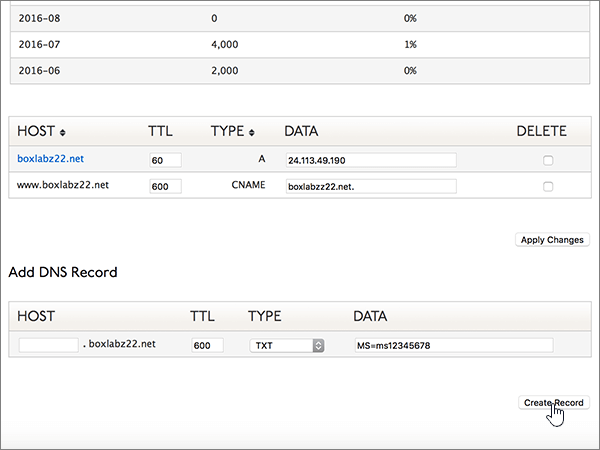

# 在 Dyn.com 建立 Microsoft 的 DNS 記錄Create DNS records at Dyn.com for Microsoft

 若您找不到所需內容，請**[查看網域常見問題集](../setup/domains-faq.md)**。**[Check the Domains FAQ](../setup/domains-faq.md)** if you don't find what you're looking for. 
  
如果 Dyn.com 是您的 DNS 主機服務提供者，請按照本文所述的步驟驗證網域，並為電子郵件與商務用 Skype Online 等項目設定 DNS 記錄。If Dyn.com is your DNS hosting provider, follow the steps in this article to verify your domain and set up DNS records for email, Skype for Business Online, and so on.
 

  
> [!NOTE]
>  DNS 變更生效通常約需 15 分鐘的時間。而如果您所做的變更要在整個網際網路 DNS 系統中生效，有時可能需要更久的時間。在您新增 DNS 記錄後，如有郵件流程或其他方面的問題，請參閱[變更網域名稱或 DNS 記錄之後所發生問題的疑難排解](../get-help-with-domains/find-and-fix-issues.md)。Typically it takes about 15 minutes for DNS changes to take effect. However, it can occasionally take longer for a change you've made to update across the Internet's DNS system. If you're having trouble with mail flow or other issues after adding DNS records, see [Troubleshoot issues after changing your domain name or DNS records](../get-help-with-domains/find-and-fix-issues.md). 
  
## 新增 TXT 記錄以供驗證Add a TXT record for verification

1. 首先請用[這個連結](https://account.dyn.com/dns/)移至 Dyn.com 上您的網域頁面。系統會提示您先登入。To get started, go to your domains page at Dyn.com by using [this link](https://account.dyn.com/dns/). You'll be prompted to login first.
    
    
  
2. 在 [ **區域等級服務** ] 頁面上，針對您想要編輯的網域，選取 [ **Dyn Standard DNS 服務** ]。On the **Zone Level Services** page, select **Dyn Standard DNS Service** for the domain that you want to edit. 
    
3. 在您網域的 [ **DNS** ] 頁面上，選取 [ **喜好**設定]。On the **DNS** page for your domain, select **Preferences**.
    
4. 選取 [ **啟用專家介面**]。Select **Enable Expert Interface**.
    
5. In the **Add DNS Record** section, in the boxes for the new record, type or copy and paste the values from the following table.In the **Add DNS Record** section, in the boxes for the new record, type or copy and paste the values from the following table. 
    
    (Choose the **Type** value from the drop-down list.)(Choose the **Type** value from the drop-down list.) 
    
    |**Host****Host**|**TTL****TTL**|**類型****Type**|**資料****Data**|
    |:-----|:-----|:-----|:-----|
    |(Leave this field empty.)(Leave this field empty.)    |600600    |TXTTXT    |MS=ms *XXXXXXXX*MS=ms *XXXXXXXX*    **附註：** 這是範例。**Note:** This is an example. 在這裡請使用您自己來自表格的 **[目的地或指向位址]** 值。Use your specific **Destination or Points to Address** value here, from the table.           [如何找到呢？How do I find this?](../get-help-with-domains/information-for-dns-records.md)          |
       
   
  
6. 選取 [ **建立記錄**]。Select **Create Record**.
    
    
  
7. 繼續進行之前，請先稍候幾分鐘，好讓您剛剛建立的記錄能在網際網路上更新。Wait a few minutes before you continue, so that the record you just created can update across the Internet.
    
現在您已在網域註冊機構網站新增記錄，請返回 Microsoft 並要求該記錄。Now that you've added the record at your domain registrar's site, you'll go back to Microsoft and request the record.
  
在 Microsoft 找到正確的 TXT 記錄後，您的網域就完成驗證了。When Microsoft finds the correct TXT record, your domain is verified.
  
1. 在 Microsoft 系統管理中心中，移至 **[設定]** \> <a href="https://go.microsoft.com/fwlink/p/?linkid=834818" target="_blank">[網域]</a> 頁面。In the Microsoft admin center, go to the **Settings** \> <a href="https://go.microsoft.com/fwlink/p/?linkid=834818" target="_blank">Domains</a> page.

    
2. 在 **[網域]** 頁面上，選取您要驗證的網域。On the **Domains** page, select the domain that you are verifying. 
    
    
  
3. 在 **[設定]** 頁面上，選取 **[開始設定]**。On the **Setup** page, select **Start setup**.
    
    
  
4. 在 **[驗證網域]** 頁面上，選取 **[驗證]**。On the **Verify domain** page, select **Verify**.
    
    
  
> [!NOTE]
>  DNS 變更生效通常約需 15 分鐘的時間。而如果您所做的變更要在整個網際網路 DNS 系統中生效，有時可能需要更久的時間。在您新增 DNS 記錄後，如有郵件流程或其他方面的問題，請參閱[變更網域名稱或 DNS 記錄之後所發生問題的疑難排解](../get-help-with-domains/find-and-fix-issues.md)。Typically it takes about 15 minutes for DNS changes to take effect. However, it can occasionally take longer for a change you've made to update across the Internet's DNS system. If you're having trouble with mail flow or other issues after adding DNS records, see [Troubleshoot issues after changing your domain name or DNS records](../get-help-with-domains/find-and-fix-issues.md). 
  
## 新增 MX 記錄，以將寄往您網域的電子郵件轉至 MicrosoftAdd an MX record so email for your domain will come to Microsoft

1. 首先請用[這個連結](https://account.dyn.com/dns/)移至 Dyn.com 上您的網域頁面。系統會提示您先登入。To get started, go to your domains page at Dyn.com by using [this link](https://account.dyn.com/dns/). You'll be prompted to login first.
    
    
  
2. 在 [ **區域等級服務** ] 頁面上，針對您想要編輯的網域，選取 [ **Dyn Standard DNS 服務** ]。On the **Zone Level Services** page, select **Dyn Standard DNS Service** for the domain that you want to edit. 
    
3. 在您網域的 [DNS] 頁面上，選取 [ **喜好**設定]。On the DNS page for your domain, select **Preferences**.
    
4. 選取 [ **啟用專家介面**]。Select **Enable Expert Interface**.
    
5. In the **Add DNS Record** section, in the boxes for the new record, type or copy and paste the values from the following table.In the **Add DNS Record** section, in the boxes for the new record, type or copy and paste the values from the following table. 
    
    (Choose the **Type** value from the drop-down list.)(Choose the **Type** value from the drop-down list.) 
    
    |**Host****Host**|**TTL****TTL**|**類型****Type**|**資料****Data**|
    |:-----|:-----|:-----|:-----|
    |(Leave this field empty.)(Leave this field empty.)    |600600    |MXMX    |*\<domain-key\>* mail.protection.outlook.com。10  *\<domain-key\>*  .mail.protection.outlook.com.    **此值必須以英文句點 (.) 結尾。****This value MUST end with a period (.)**   **10**是 MX 優先順序值。The **10** is the MX priority value. 請將它新增到 MX 值的開頭，並以空格分隔該值的其餘部分。Add it to the beginning of the MX value, separated from the remainder of the value by a space.    \**附注：\*\*\*\<domain-key\>* 從您的 Microsoft 帳戶取得。**Note:** Get your  *\<domain-key\>*  from your Microsoft account.           [如何找到呢？How do I find this?](../get-help-with-domains/information-for-dns-records.md)           如需關於優先順序的詳細資訊，請參閱[什麼是 MX 優先順序？](https://docs.microsoft.com/microsoft-365/admin/setup/domains-faq)For more information about priority, see [What is MX priority?](https://docs.microsoft.com/microsoft-365/admin/setup/domains-faq)   |
   
    
  
6. 選取 [ **建立記錄**]。Select **Create Record**.
    
    
  
7. 如果有任何其他 MX 記錄，請選取 [ **刪除** ] 欄中的每一個核取方塊加以移除。If there are any other MX records, remove them by selecting the check box for each one in the **Delete** column. 
    
    
  
8. 選取 [套用 **變更**]。Select **Apply Changes**.
    
    
  
## 新增 Microsoft 所需的六筆 CNAME 記錄Add the six CNAME records that are required for Microsoft

1. 首先請用[這個連結](https://account.dyn.com/dns/)移至 Dyn.com 上您的網域頁面。系統會提示您先登入。To get started, go to your domains page at Dyn.com by using [this link](https://account.dyn.com/dns/). You'll be prompted to login first.
    
    
  
2. 在 [ **區域等級服務** ] 頁面上，針對您想要編輯的網域，選取 [ **Dyn Standard DNS 服務** ]。On the **Zone Level Services** page, select **Dyn Standard DNS Service** for the domain that you want to edit. 
    
3. 在您網域的 [ **DNS** ] 頁面上，選取 [ **喜好**設定]。On the **DNS** page for your domain, select **Preferences**.
    
4. 選取 [ **啟用專家介面**]。Select **Enable Expert Interface**.
    
5. 新增六筆 CNAME 記錄的第一筆。Add the first of the six CNAME records.
    
    在 [新增 **DNS 記錄** ] 區段的新記錄方塊中，輸入或複製並貼上下表第一列中的值。In the **Add DNS Record** section, in the boxes for the new record, type or copy and paste the values from the first row of the following table. 
    
    (從下拉式清單中選擇 [Type] (類型) 值。)(Choose the **Type** value from the drop-down list.) 
    
    |**Host****Host**|**TTL****TTL**|**類型****Type**|**資料****Data**|
    |:-----|:-----|:-----|:-----|
    |autodiscoverautodiscover    |600600    |CNAMECNAME    |autodiscover.outlook.com.autodiscover.outlook.com.    **此值必須以英文句點 (.) 結尾。****This value MUST end with a period (.)**   |
    |sipsip    |600600    |CNAMECNAME    |sipdir.online.lync.com.sipdir.online.lync.com.    **此值必須以英文句點 (.) 結尾。****This value MUST end with a period (.)**   |
    |lyncdiscoverlyncdiscover    |600600    |CNAMECNAME    |webdir.online.lync.com.webdir.online.lync.com.    **此值必須以英文句點 (.) 結尾。****This value MUST end with a period (.)**   |
    |enterpriseregistrationenterpriseregistration    |600600    |CNAMECNAME    |enterpriseregistration.windows.net.enterpriseregistration.windows.net.    **此值必須以英文句點 (.) 結尾。****This value MUST end with a period (.)**   |
    |enterpriseenrollmententerpriseenrollment    |600600    |CNAMECNAME    |enterpriseenrollment-s.manage.microsoft.com.enterpriseenrollment-s.manage.microsoft.com.    **此值必須以英文句點 (.) 結尾。****This value MUST end with a period (.)**   |
   
    
  
6. 選取 [ **建立記錄**]。Select **Create Record**.
    
    
  
7. 新增剩餘的五筆 CNAME 記錄。Add the remaining five CNAME records.
    
    在 [ **新增 DNS 記錄** ] 區段中，使用表格中下一列的值來建立記錄，然後再選取 [ **建立記錄** ] 以完成記錄。In the **Add DNS Record** section, create a record by using the values from the next row in the table, and then again select **Create Record** to complete that record. 
    
    重複這個程序，直到六筆 CNAME 記錄全部建立完畢。Repeat this process until you have created all six CNAME records.
    
## 新增 SPF 的 TXT 記錄以協助防範垃圾郵件Add a TXT record for SPF to help prevent email spam

> [!IMPORTANT]
> 網域的 SPF 不得擁有一個以上的 TXT 記錄。You cannot have more than one TXT record for SPF for a domain. 如果您的網域具有多筆 SPF 記錄，您將收到電子郵件錯誤，以及傳送及垃圾郵件分類問題。If your domain has more than one SPF record, you'll get email errors, as well as delivery and spam classification issues. 如果網域已經有 SPF 記錄，請勿為 Microsoft 建立一個新的記錄。If you already have an SPF record for your domain, don't create a new one for Microsoft. 請改為將必要的 Microsoft 值新增至目前的記錄，讓您擁有包含這兩組值的  *單一*  SPF 記錄。Instead, add the required Microsoft values to the current record so that you have a  *single*  SPF record that includes both sets of values.
  
1. 首先請用[這個連結](https://account.dyn.com/dns/)移至 Dyn.com 上您的網域頁面。系統會提示您先登入。To get started, go to your domains page at Dyn.com by using [this link](https://account.dyn.com/dns/). You'll be prompted to login first.
    
    
  
2. 在 [ **區域等級服務** ] 頁面上，針對您想要編輯的網域，選取 [ **Dyn Standard DNS 服務** ]。On the **Zone Level Services** page, select **Dyn Standard DNS Service** for the domain that you want to edit. 
    
3. 在您網域的 [ **DNS** ] 頁面上，選取 [ **喜好**設定]。On the **DNS** page for your domain, select **Preferences**.
    
4. 選取 [ **啟用專家介面**]。Select **Enable Expert Interface**.
    
5. In the **Add DNS Record** section, in the boxes for the new record, type or copy and paste the values from the following table.In the **Add DNS Record** section, in the boxes for the new record, type or copy and paste the values from the following table. 
    
    (Choose the **Type** value from the drop-down list.)(Choose the **Type** value from the drop-down list.) 
    
    |**Host****Host**|**TTL****TTL**|**類型****Type**|**資料****Data**|
    |:-----|:-----|:-----|:-----|
    |(Leave this field empty.)(Leave this field empty.)    |600600    |TXTTXT    |v=spf1 include:spf.protection.outlook.com -allv=spf1 include:spf.protection.outlook.com -all    **注意：** 建議您複製並貼上這個項目，好讓所有的間距保持正確。**Note:** We recommend copying and pasting this entry, so that all of the spacing stays correct.           |
   
    
  
6. 選取 [ **建立記錄**]。Select **Create Record**.
    
    
  
## 新增兩筆 Microsoft 所需的 SRV 記錄Add the two SRV records that are required for Microsoft

1. 首先請用[這個連結](https://account.dyn.com/dns/)移至 Dyn.com 上您的網域頁面。To get started, go to your domains page at Dyn.com by using [this link](https://account.dyn.com/dns/). 系統會提示您先登入You'll be prompted to login first 
    
    
  
2. 在 [ **區域等級服務** ] 頁面上，針對您想要編輯的網域，選取 [ **Dyn Standard DNS 服務** ]。On the **Zone Level Services** page, select **Dyn Standard DNS Service** for the domain that you want to edit. 
    
3. 在您網域的 [ **DNS** ] 頁面上，選取 [ **喜好**設定]。On the **DNS** page for your domain, select **Preferences**.
    
4. 選取 [ **啟用專家介面**]。Select **Enable Expert Interface**.
    
5. 新增兩筆 SRV 記錄中的第一筆。Add the first of the two SRV records.
    
    在 [新增 **DNS 記錄** ] 區段的新記錄方塊中，輸入或複製並貼上下表第一列中的值。In the **Add DNS Record** section, in the boxes for the new record, type or copy and paste the values from the first row of the following table. 
    
    (從下拉式清單中選擇 [Type] (類型) 值。)(Choose the **Type** value from the drop-down list.) 
    
    |**Host****Host**|**TTL****TTL**|**類型****Type**|**資料****Data**|
    |:-----|:-----|:-----|:-----|
    |_sip._tls_sip._tls|600600|SRVSRV|100 1 443 sipdir.online.lync.com.100 1 443 sipdir.online.lync.com. **此值必須以英文句點 (.) 結尾。****This value MUST end with a period (.)** **注意：** 建議您複製並貼上這個項目，好讓所有的間距保持正確。**Note:** We recommend copying and pasting this entry, so that all of the spacing stays correct.           |
    |_sipfederationtls._tcp_sipfederationtls._tcp|600600|SRVSRV|100 1 5061 sipfed.online.lync.com.100 1 5061 sipfed.online.lync.com. **此值必須以英文句點 (.) 結尾。****This value MUST end with a period (.)**  **注意：** 建議您複製並貼上這個項目，好讓所有的間距保持正確。**Note:** We recommend copying and pasting this entry, so that all of the spacing stays correct.           |
   
    
  
6. 選取 [ **建立記錄**]。Select **Create Record**.
    
    
  
7. 新增另一筆 SRV 記錄。Add the other SRV record.
    
    在 [ **新增 DNS 記錄** ] 區段中，使用表格中第二列的值來建立記錄，然後再選取 [ **建立記錄** ] 以完成記錄。In the **Add DNS Record** section, create a record by using the values from the second row in the table, and then again select **Create Record** to complete that record. 
    
> [!NOTE]
>  DNS 變更生效通常約需 15 分鐘的時間。而如果您所做的變更要在整個網際網路 DNS 系統中生效，有時可能需要更久的時間。在您新增 DNS 記錄後，如有郵件流程或其他方面的問題，請參閱[變更網域名稱或 DNS 記錄之後所發生問題的疑難排解](../get-help-with-domains/find-and-fix-issues.md)。Typically it takes about 15 minutes for DNS changes to take effect. However, it can occasionally take longer for a change you've made to update across the Internet's DNS system. If you're having trouble with mail flow or other issues after adding DNS records, see [Troubleshoot issues after changing your domain name or DNS records](../get-help-with-domains/find-and-fix-issues.md). 
  
