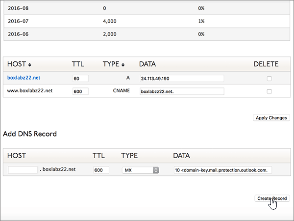

# 在 Dyn.com 建立 Microsoft 的 DNS 記錄

 若您找不到所需內容，請**[查看網域常見問題集](../setup/domains-faq.md)**。 
  
如果 Dyn.com 是您的 DNS 主機服務提供者，請按照本文所述的步驟驗證網域，並為電子郵件與商務用 Skype Online 等項目設定 DNS 記錄。
 

  
> [!NOTE]
>  DNS 變更生效通常約需 15 分鐘的時間。而如果您所做的變更要在整個網際網路 DNS 系統中生效，有時可能需要更久的時間。在您新增 DNS 記錄後，如有郵件流程或其他方面的問題，請參閱[變更網域名稱或 DNS 記錄之後所發生問題的疑難排解](../get-help-with-domains/find-and-fix-issues.md)。 
  
## 新增 TXT 記錄以供驗證

1. 首先請用[這個連結](https://account.dyn.com/dns/)移至 Dyn.com 上您的網域頁面。系統會提示您先登入。
    
    
  
2. 在 [ **區域等級服務** ] 頁面上，針對您想要編輯的網域，選取 [ **Dyn Standard DNS 服務** ]。 
    
3. 在您網域的 [ **DNS** ] 頁面上，選取 [ **喜好**設定]。
    
4. 選取 [ **啟用專家介面**]。
    
5. In the **Add DNS Record** section, in the boxes for the new record, type or copy and paste the values from the following table. 
    
    (Choose the **Type** value from the drop-down list.) 
    
    |**Host**|**TTL**|**類型**|**資料**|
    |:-----|:-----|:-----|:-----|
    |(Leave this field empty.)    |600    |TXT    |MS=ms *XXXXXXXX*    **附註：** 這是範例。 在這裡請使用您自己來自表格的 **[目的地或指向位址]** 值。           [如何找到呢？](../get-help-with-domains/information-for-dns-records.md)          |
       
   
  
6. 選取 [ **建立記錄**]。
    
    
  
7. 繼續進行之前，請先稍候幾分鐘，好讓您剛剛建立的記錄能在網際網路上更新。
    
現在您已在網域註冊機構網站新增記錄，請返回 Microsoft 並要求該記錄。
  
在 Microsoft 找到正確的 TXT 記錄後，您的網域就完成驗證了。
  
1. 在 Microsoft 系統管理中心中，移至 **[設定]** \> <a href="https://go.microsoft.com/fwlink/p/?linkid=834818" target="_blank">[網域]</a> 頁面。

    
2. 在 **[網域]** 頁面上，選取您要驗證的網域。 
    
    
  
3. 在 **[設定]** 頁面上，選取 **[開始設定]**。
    
    
  
4. 在 **[驗證網域]** 頁面上，選取 **[驗證]**。
    
    
  
> [!NOTE]
>  DNS 變更生效通常約需 15 分鐘的時間。而如果您所做的變更要在整個網際網路 DNS 系統中生效，有時可能需要更久的時間。在您新增 DNS 記錄後，如有郵件流程或其他方面的問題，請參閱[變更網域名稱或 DNS 記錄之後所發生問題的疑難排解](../get-help-with-domains/find-and-fix-issues.md)。 
  
## 新增 MX 記錄，以將寄往您網域的電子郵件轉至 Microsoft

1. 首先請用[這個連結](https://account.dyn.com/dns/)移至 Dyn.com 上您的網域頁面。系統會提示您先登入。
    
    
  
2. 在 [ **區域等級服務** ] 頁面上，針對您想要編輯的網域，選取 [ **Dyn Standard DNS 服務** ]。 
    
3. 在您網域的 [DNS] 頁面上，選取 [ **喜好**設定]。
    
4. 選取 [ **啟用專家介面**]。
    
5. In the **Add DNS Record** section, in the boxes for the new record, type or copy and paste the values from the following table. 
    
    (Choose the **Type** value from the drop-down list.) 
    
    |**Host**|**TTL**|**類型**|**資料**|
    |:-----|:-----|:-----|:-----|
    |(Leave this field empty.)    |600    |MX    |*\<domain-key\>* mail.protection.outlook.com。    **此值必須以英文句點 (.) 結尾。**   **10**是 MX 優先順序值。 請將它新增到 MX 值的開頭，並以空格分隔該值的其餘部分。    **附注：***\<domain-key\>* 從您的 Microsoft 帳戶取得。           [如何找到呢？](../get-help-with-domains/information-for-dns-records.md)           如需關於優先順序的詳細資訊，請參閱[什麼是 MX 優先順序？](https://docs.microsoft.com/microsoft-365/admin/setup/domains-faq)   |
   
    
  
6. 選取 [ **建立記錄**]。
    
    
  
7. 如果有任何其他 MX 記錄，請選取 [ **刪除** ] 欄中的每一個核取方塊加以移除。 
    
    
  
8. 選取 [套用 **變更**]。
    
    
  
## 新增 Microsoft 所需的六筆 CNAME 記錄

1. 首先請用[這個連結](https://account.dyn.com/dns/)移至 Dyn.com 上您的網域頁面。系統會提示您先登入。
    
    
  
2. 在 [ **區域等級服務** ] 頁面上，針對您想要編輯的網域，選取 [ **Dyn Standard DNS 服務** ]。 
    
3. 在您網域的 [ **DNS** ] 頁面上，選取 [ **喜好**設定]。
    
4. 選取 [ **啟用專家介面**]。
    
5. 新增六筆 CNAME 記錄的第一筆。
    
    在 [新增 **DNS 記錄** ] 區段的新記錄方塊中，輸入或複製並貼上下表第一列中的值。 
    
    (從下拉式清單中選擇 [Type] (類型) 值。) 
    
    |**Host**|**TTL**|**類型**|**資料**|
    |:-----|:-----|:-----|:-----|
    |autodiscover    |600    |CNAME    |autodiscover.outlook.com.    **此值必須以英文句點 (.) 結尾。**   |
    |sip    |600    |CNAME    |sipdir.online.lync.com.    **此值必須以英文句點 (.) 結尾。**   |
    |lyncdiscover    |600    |CNAME    |webdir.online.lync.com.    **此值必須以英文句點 (.) 結尾。**   |
    |enterpriseregistration    |600    |CNAME    |enterpriseregistration.windows.net.    **此值必須以英文句點 (.) 結尾。**   |
    |enterpriseenrollment    |600    |CNAME    |enterpriseenrollment-s.manage.microsoft.com.    **此值必須以英文句點 (.) 結尾。**   |
   
    
  
6. 選取 [ **建立記錄**]。
    
    
  
7. 新增剩餘的五筆 CNAME 記錄。
    
    在 [ **新增 DNS 記錄** ] 區段中，使用表格中下一列的值來建立記錄，然後再選取 [ **建立記錄** ] 以完成記錄。 
    
    重複這個程序，直到六筆 CNAME 記錄全部建立完畢。
    
## 新增 SPF 的 TXT 記錄以協助防範垃圾郵件

> [!IMPORTANT]
> 網域的 SPF 不得擁有一個以上的 TXT 記錄。 如果您的網域具有多筆 SPF 記錄，您將收到電子郵件錯誤，以及傳送及垃圾郵件分類問題。 如果網域已經有 SPF 記錄，請勿為 Microsoft 建立一個新的記錄。 請改為將必要的 Microsoft 值新增至目前的記錄，讓您擁有包含這兩組值的  *單一*  SPF 記錄。
  
1. 首先請用[這個連結](https://account.dyn.com/dns/)移至 Dyn.com 上您的網域頁面。系統會提示您先登入。
    
    
  
2. 在 [ **區域等級服務** ] 頁面上，針對您想要編輯的網域，選取 [ **Dyn Standard DNS 服務** ]。 
    
3. 在您網域的 [ **DNS** ] 頁面上，選取 [ **喜好**設定]。
    
4. 選取 [ **啟用專家介面**]。
    
5. In the **Add DNS Record** section, in the boxes for the new record, type or copy and paste the values from the following table. 
    
    (Choose the **Type** value from the drop-down list.) 
    
    |**Host**|**TTL**|**類型**|**資料**|
    |:-----|:-----|:-----|:-----|
    |(Leave this field empty.)    |600    |TXT    |v=spf1 include:spf.protection.outlook.com -all    **注意：** 建議您複製並貼上這個項目，好讓所有的間距保持正確。           |
   
    
  
6. 選取 [ **建立記錄**]。
    
    
  
## 新增兩筆 Microsoft 所需的 SRV 記錄

1. 首先請用[這個連結](https://account.dyn.com/dns/)移至 Dyn.com 上您的網域頁面。 系統會提示您先登入 
    
    
  
2. 在 [ **區域等級服務** ] 頁面上，針對您想要編輯的網域，選取 [ **Dyn Standard DNS 服務** ]。 
    
3. 在您網域的 [ **DNS** ] 頁面上，選取 [ **喜好**設定]。
    
4. 選取 [ **啟用專家介面**]。
    
5. 新增兩筆 SRV 記錄中的第一筆。
    
    在 [新增 **DNS 記錄** ] 區段的新記錄方塊中，輸入或複製並貼上下表第一列中的值。 
    
    (從下拉式清單中選擇 [Type] (類型) 值。) 
    
    |**Host**|**TTL**|**類型**|**資料**|
    |:-----|:-----|:-----|:-----|
    |_sip._tls|600|SRV|100 1 443 sipdir.online.lync.com. **此值必須以英文句點 (.) 結尾。** **注意：** 建議您複製並貼上這個項目，好讓所有的間距保持正確。           |
    |_sipfederationtls._tcp|600|SRV|100 1 5061 sipfed.online.lync.com. **此值必須以英文句點 (.) 結尾。**  **注意：** 建議您複製並貼上這個項目，好讓所有的間距保持正確。           |
   
    
  
6. 選取 [ **建立記錄**]。
    
    
  
7. 新增另一筆 SRV 記錄。
    
    在 [ **新增 DNS 記錄** ] 區段中，使用表格中第二列的值來建立記錄，然後再選取 [ **建立記錄** ] 以完成記錄。 
    
> [!NOTE]
>  DNS 變更生效通常約需 15 分鐘的時間。而如果您所做的變更要在整個網際網路 DNS 系統中生效，有時可能需要更久的時間。在您新增 DNS 記錄後，如有郵件流程或其他方面的問題，請參閱[變更網域名稱或 DNS 記錄之後所發生問題的疑難排解](../get-help-with-domains/find-and-fix-issues.md)。 
  
