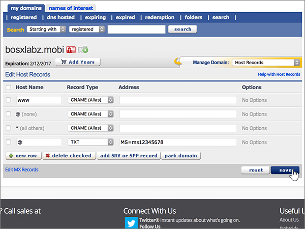
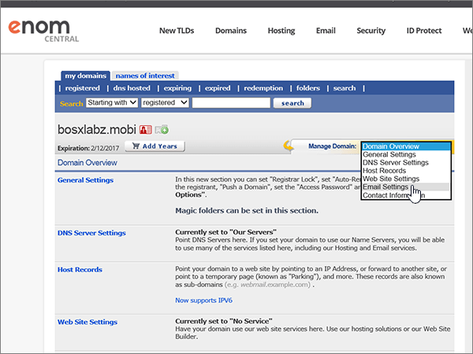
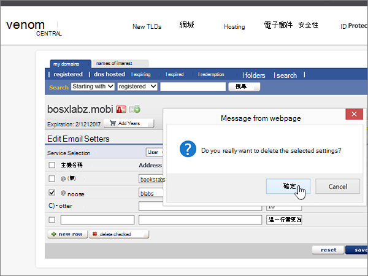
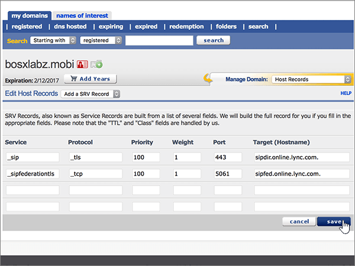

# 在 Microsoft 的 eNomCentral 建立 DNS 記錄

 若您找不到所需內容，請 **[查看網域常見問題集](../setup/domains-faq.yml)**。

如果 eNomCentral 是您的 DNS 主機服務提供者，請按照本文所述的步驟驗證網域，並為電子郵件與商務用 Skype Online 等項目設定 DNS 記錄。

在 eNomCentral 新增這些記錄之後，您的網域就會設定為與 Microsoft 服務搭配使用。

> [!NOTE]
> DNS 變更生效通常約需 15 分鐘的時間。而如果您所做的變更要在整個網際網路 DNS 系統中生效，有時可能需要更久的時間。在您新增 DNS 記錄後，如有郵件流程或其他方面的問題，請參閱[變更網域名稱或 DNS 記錄之後所發生問題的疑難排解](../get-help-with-domains/find-and-fix-issues.md)。

## 新增 TXT 記錄以供驗證

在您將自己的網域用於 Microsoft 之前，我們必須先確認您擁有該網域。如果您能在自己的網域註冊機構登入自己的帳戶並能建立 DNS 記錄，Microsoft 就能確信您擁有該網域。

> [!NOTE]
> 這筆記錄只會用於驗證您擁有自己的網域，不會影響其他項目。您可以選擇稍後再刪除記錄。

請依照下列步驟操作或[觀看影片 (0:46 從開始)](https://support.microsoft.com/office/3766a9e8-77dd-4a42-908d-89b076143e7d)。

1. 首先請用[這個連結](https://www.enomcentral.com/domains/Domain-Manager.aspx?tab=registered)移至 eNom Central 上您的網域頁面。系統會提示您先登入。

   

2. 在 [ **我的網域**] 底下，選取您要編輯的網功能變數名稱稱。

   

3. On the **Manage Domain** drop-down list, choose **Host Records**.

   

4. 在每一筆新記錄的方塊中，輸入或複製並貼上下表中的值。

   從下拉式清單中選擇 [ **記錄類型** ] 值。

   |主機名稱|Record Type|位址|
   |---|---|---|
   |@|TXT|MS=ms *XXXXXXXX*    **附註：** 這是範例。 在這裡請使用您自己來自表格的 **[目的地或指向位址]** 值。 [如何找到呢？](../get-help-with-domains/information-for-dns-records.md)|

   

5. 選取 [ **儲存**]。

   

6. 繼續進行之前，請先稍候幾分鐘，好讓您剛剛建立的記錄能在網際網路上更新。

現在您已在網域註冊機構網站新增記錄，請返回 Microsoft 365 並要求 Microsoft 365 尋找該記錄。

在 Microsoft 找到正確的 TXT 記錄後，您的網域就完成驗證了。

1. 在 Microsoft 系統管理中心中，移至 **[設定]** \> <a href="https://go.microsoft.com/fwlink/p/?linkid=834818" target="_blank">[網域]</a> 頁面。

2. 在 **[網域]** 頁面上，選取您要驗證的網域。

3. 在 **[設定]** 頁面上，選取 **[開始設定]**。

4. 在 **[驗證網域]** 頁面上，選取 **[驗證]**。

> [!NOTE]
> DNS 變更生效通常約需 15 分鐘的時間。而如果您所做的變更要在整個網際網路 DNS 系統中生效，有時可能需要更久的時間。在您新增 DNS 記錄後，如有郵件流程或其他方面的問題，請參閱[變更網域名稱或 DNS 記錄之後所發生問題的疑難排解](../get-help-with-domains/find-and-fix-issues.md)。

## 新增 MX 記錄，以將寄往您網域的電子郵件轉至 Microsoft

請依照下列步驟操作或[觀看影片 (從 3:40 處開始)](https://support.microsoft.com/office/3766a9e8-77dd-4a42-908d-89b076143e7d)。

1. 首先請用[這個連結](https://www.enomcentral.com/domains/Domain-Manager.aspx?tab=registered)移至 eNom Central 上您的網域頁面。系統會提示您先登入。

   

2. 在 [ **我的網域**] 底下，選取您要編輯的網功能變數名稱稱。

   

3. 在 [ **管理網域** ] 下拉式清單中，選擇 [ **電子郵件設定**]。

   

4. 在 [ **服務選擇** ] 下拉式清單中，選擇 [ **使用者 (MX])**。

   

5. In the boxes for the new record, type or copy and paste the values from the following table.

   |主機名稱|Address (位址)|Pref|
   |---|---|---|
   |@| *\<domain-key\>*  mail.protection.outlook.com。    **此值必須以英文句點 (.) 結尾。**   **附注：***\<domain-key\>* 從您的 Microsoft 帳戶取得。 [How do I find this?](../get-help-with-domains/information-for-dns-records.md)|10     如需關於優先順序的詳細資訊，請參閱[什麼是 MX 優先順序？](../setup/domains-faq.yml)|

   

6. 選取 [ **儲存**]。

   

7. 如果有任何其他現有的 MX 記錄，請選取其核取方塊來進行選取。

   

8. 選取 [ **刪除] 複選** 框。

   

## 新增 Microsoft 所需的 CNAME 記錄

請依照下列步驟操作或[觀看影片 (從 4:24 處開始)](https://support.microsoft.com/office/3766a9e8-77dd-4a42-908d-89b076143e7d)。

1. 首先請用[這個連結](https://www.enomcentral.com/domains/Domain-Manager.aspx?tab=registered)移至 eNom Central 上您的網域頁面。系統會提示您先登入。

   

2. 在 [ **我的網域**] 底下，選取您要編輯的網功能變數名稱稱。

   

3. On the **Manage Domain** drop-down list, choose **Host Records**.

   

4. 選取 [ **新增列**]。

   

5. 在六筆新記錄的方塊中，輸入或複製並貼上下列的值。

   從下拉式清單中選擇 [ **記錄類型** ] 值。

   |主機名稱|Record Type|Address (位址)|
   |---|---|---|
   |autodiscover (自動探索)|CNAME (Alias) (CNAME (別名))|autodiscover.outlook.com.    **此值必須以英文句點 (.) 結尾。**|
   |sip|CNAME (Alias) (CNAME (別名))|sipdir.online.lync.com.    **此值必須以英文句點 (.) 結尾。**|
   |lyncdiscover|CNAME (Alias) (CNAME (別名))|webdir.online.lync.com.    **此值必須以英文句點 (.) 結尾。**|
   |enterpriseregistration|CNAME (Alias) (CNAME (別名))|enterpriseregistration.windows.net.    **此值必須以英文句點 (.) 結尾。**|
   |enterpriseenrollment|CNAME (Alias) (CNAME (別名))|enterpriseenrollment-s.manage.microsoft.com.    **此值必須以英文句點 (.) 結尾。**|

   

6. 選取 [ **儲存**]。

   

## 新增 SPF 的 TXT 記錄以協助防範垃圾郵件

> [!IMPORTANT]
> 網域的 SPF 不得擁有一個以上的 TXT 記錄。 如果您的網域具有多筆 SPF 記錄，您將收到電子郵件錯誤，以及傳送及垃圾郵件分類問題。 如果網域已經有 SPF 記錄，請勿為 Microsoft 建立一個新的記錄。 請改為將必要的 Microsoft 值新增至目前的記錄，讓您擁有包含這兩組值的  *單一*  SPF 記錄。

請依照下列步驟操作或[觀看影片 (從 5:12 處開始)](https://support.microsoft.com/office/3766a9e8-77dd-4a42-908d-89b076143e7d)。

1. 首先請用[這個連結](https://www.enomcentral.com/domains/Domain-Manager.aspx?tab=registered)移至 eNom Central 上您的網域頁面。系統會提示您先登入。

   

2. 在 [ **我的網域**] 底下，選取您要編輯的網功能變數名稱稱。

   

3. On the **Manage Domain** drop-down list, choose **Host Records**.

   

4. 在每一筆新記錄的方塊中，輸入或複製並貼上下表中的值。

   從下拉式清單中選擇 [ **記錄類型** ] 值。

   |主機名稱|Record Type|位址|
   |---|---|---|
   |@|TXT|v=spf1 include:spf.protection.outlook.com -all   **注意：** 建議您複製並貼上這個項目，好讓所有的間距保持正確。|

   

5. 選取 [ **儲存**]。

   

## 新增兩筆 Microsoft 所需的 SRV 記錄

請依照下列步驟操作或[觀看影片 (從 5:50 處開始)](https://support.microsoft.com/office/3766a9e8-77dd-4a42-908d-89b076143e7d)。

1. 首先請用[這個連結](https://www.enomcentral.com/domains/Domain-Manager.aspx?tab=registered)移至 eNom Central 上您的網域頁面。系統會提示您先登入。

   

2. 在 [ **我的網域**] 底下，選取您要編輯的網功能變數名稱稱。

   

3. On the **Manage Domain** drop-down list, choose **Host Records**.

   

4. 在 [ **新增列**] 右邊，選取 [新增 **SRV 或 SPF 記錄**]。

   

5. 在這兩筆新記錄的方塊中，輸入或複製並貼上下表中的值。

   |Service (服務)|Protocol (通訊協定)|Priority (優先順序)|Weight (權數)|Port (連接埠)|目標 (主機名稱) |
   |---|---|---|---|---|---|
   |_sip|_tls|100|1|443|sipdir.online.lync.com.    **此值必須以英文句點 (.) 結尾。**|
   |_sipfederationtls|_tcp|100|1|5061|sipfed.online.lync.com。    **此值必須以英文句點 (.) 結尾。**|

   

6. 選取 [**儲存**]

   

> [!NOTE]
> DNS 變更生效通常約需 15 分鐘的時間。而如果您所做的變更要在整個網際網路 DNS 系統中生效，有時可能需要更久的時間。在您新增 DNS 記錄後，如有郵件流程或其他方面的問題，請參閱[變更網域名稱或 DNS 記錄之後所發生問題的疑難排解](../get-help-with-domains/find-and-fix-issues.md)。