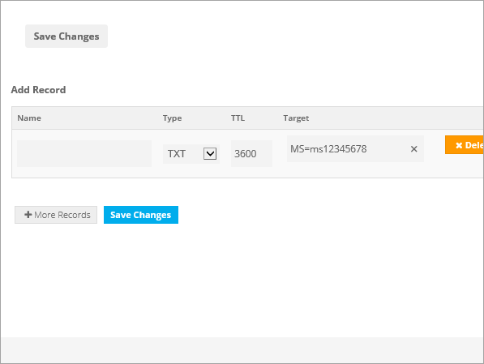
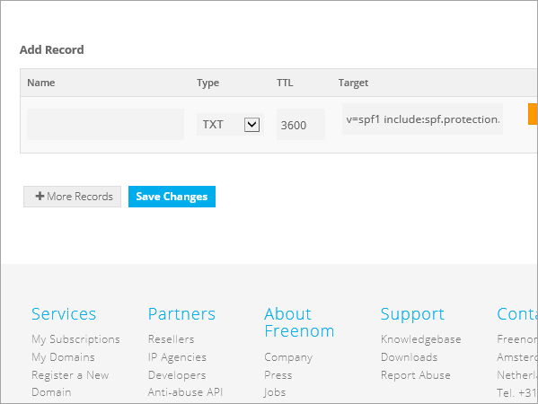

# 在 Freenom 建立 Office 365 的 DNS 記錄Create DNS records at Freenom for Office 365

[檢查網域常見問題集](../setup/domains-faq.md)找不到您要尋找。[Check the Domains FAQ ](../setup/domains-faq.md) if you don't find what you're looking for. 
  
> [!CAUTION]
> 在 Freenom 網站不支援 SRV 記錄，這表示幾個 Skype for Business Online 和 Outlook Web App 功能將無法運作。The Freenom website doesn't support SRV records, which means that several Skype for Business Online and Outlook Web App features won't work. 不論您使用哪一個 Office 365 方案，有重大服務限制，以及您可能想要切換至不同的 DNS 主機服務提供者。No matter which Office 365 plan you use, there are significant service limitations, and you may want to switch to a different DNS hosting provider. 
  
儘管服務的限制，如果您選擇 [管理 Office 365 DNS 記錄，在 Freenom，請遵循本文以驗證您的網域及設定電子郵件和其他服務的 DNS 記錄中的步驟。If despite the service limitations, you choose to manage your own Office 365 DNS records at Freenom, follow the steps in this article to verify your domain and set up DNS records for email and other services.
  
若要了解使用 Office 365 網站的虛擬主機和 DNS，請參閱[搭配 Office 365 使用公用網站](https://support.office.com/article/a8178510-501d-4bd8-9921-b04f2e9517a5.aspx)。To learn about webhosting and DNS for websites with Office 365, see [Use a public website with Office 365](https://support.office.com/article/a8178510-501d-4bd8-9921-b04f2e9517a5.aspx).
  
> [!NOTE]
> DNS 變更生效通常約需 15 分鐘的時間。而如果您所做的變更要在整個網際網路 DNS 系統中生效，有時可能需要更久的時間。在您新增 DNS 記錄後，如有郵件流程或其他方面的問題，請參閱[變更網域名稱或 DNS 記錄之後所發生問題的疑難排解](../get-help-with-domains/find-and-fix-issues.md)。Typically it takes about 15 minutes for DNS changes to take effect. However, it can occasionally take longer for a change you've made to update across the Internet's DNS system. If you're having trouble with mail flow or other issues after adding DNS records, see [Troubleshoot issues after changing your domain name or DNS records](../get-help-with-domains/find-and-fix-issues.md). 
  
## 新增 TXT 記錄以供驗證Add a TXT record for verification

在您將自己的網域用於 Office 365 之前，我們必須先確認您擁有該網域。如果您能在自己的網域註冊機構登入自己的帳戶並能建立 DNS 記錄，Office 365 就能確信您擁有該網域。Before you use your domain with Office 365, we have to make sure that you own it. Your ability to log in to your account at your domain registrar and create the DNS record proves to Office 365 that you own the domain.
  
> [!NOTE]
> 這筆記錄只會用於驗證您擁有自己的網域，不會影響其他項目。您可以選擇稍後再刪除記錄。This record is used only to verify that you own your domain; it doesn't affect anything else. You can delete it later, if you like. 
  
1. 若要開始，使用[此連結](https://my.freenom.com/)移至您在 Freenom 中的網域頁面。To get started, go to your domains page in Freenom by using [this link](https://my.freenom.com/). You'll be prompted to log in.You'll be prompted to log in.
    
    
  
2. 選取 [**服務**]，然後選取 [**我的網域**。Select **Services**, and then select **My Domains**.
    
    
  
3. 針對您想要編輯的網域，選取 [**管理網域**]。For the domain that you want to edit, select **Manage Domain**.
    
    
  
4. 選取 [**管理 Freenom DNS**]。Select **Manage Freenom DNS**.
    
    
  
5. [**新增記錄**，在 [**類型**] 欄中， **TXT**從功能表中選擇。Under **Add Record**, in the **Type** column, choose **TXT** from the menu. 
    
    
  
6. In the boxes for the new record, type or copy and paste the values from the following table.In the boxes for the new record, type or copy and paste the values from the following table. 
    
    |**Name****Name**|**Type****Type**|**TTL****TTL**|**Target****Target**|
    |:-----|:-----|:-----|:-----|
    |(保留空白)(leave blank)    |TXTTXT    |3600 （秒）3600 (seconds)    |MS = msXXXXXXXXMS=msXXXXXXXX    **附註：** 這是範例。**Note:** This is an example. Use your specific **Destination or Points to Address** value here, from the table in Office 365.Use your specific **Destination or Points to Address** value here, from the table in Office 365.           [How do I find this?How do I find this?](../get-help-with-domains/information-for-dns-records.md)          |
   
    
  
7. 選取 [**儲存變更**。Select **Save Changes**.
    
    
  
8. 繼續進行之前，請先稍候幾分鐘，好讓您剛剛建立的記錄能在網際網路上更新。Wait a few minutes before you continue, so that the record you just created can update across the Internet.
    
Now that you've added the record at your domain registrar's site, you'll go back to Office 365 and request Office 365 to look for the record.Now that you've added the record at your domain registrar's site, you'll go back to Office 365 and request Office 365 to look for the record.
  
When Office 365 finds the correct TXT record, your domain is verified.When Office 365 finds the correct TXT record, your domain is verified.
  
1. 在系統管理中心，移至 [**設定** \> <a href="https://go.microsoft.com/fwlink/p/?linkid=834818" target="_blank">網域</a>] 頁面。In the admin center, go to the **Settings** \> <a href="https://go.microsoft.com/fwlink/p/?linkid=834818" target="_blank">Domains</a> page.

    
2. 在 [**網域**] 頁面上，選取您要驗證的網域。On the **Domains** page, select the domain that you are verifying. 
    
    
  
3. 在 [**安裝**] 頁面上，選取 [**啟動安裝程式**。On the **Setup** page, select **Start setup**.
    
    
  
4. 在 [**驗證網域**] 頁面上，選取 [**驗證**]。On the **Verify domain** page, select **Verify**.
    
    
  
> [!NOTE]
>  DNS 變更生效通常約需 15 分鐘的時間。而如果您所做的變更要在整個網際網路 DNS 系統中生效，有時可能需要更久的時間。在您新增 DNS 記錄後，如有郵件流程或其他方面的問題，請參閱[變更網域名稱或 DNS 記錄之後所發生問題的疑難排解](../get-help-with-domains/find-and-fix-issues.md)。Typically it takes about 15 minutes for DNS changes to take effect. However, it can occasionally take longer for a change you've made to update across the Internet's DNS system. If you're having trouble with mail flow or other issues after adding DNS records, see [Troubleshoot issues after changing your domain name or DNS records](../get-help-with-domains/find-and-fix-issues.md). 
  
## 新增 MX 記錄，以將寄往您網域的電子郵件轉至 Office 365Add an MX record so email for your domain will come to Office 365

1. 若要開始，使用[此連結](https://my.freenom.com/)移至您在 Freenom 中的網域頁面。To get started, go to your domains page in Freenom by using [this link](https://my.freenom.com/). You'll be prompted to log in.You'll be prompted to log in.
    
    
  
2. 選取 [**服務**]，然後選取 [**我的網域**。Select **Services**, and then select **My Domains**.
    
    
  
3. 針對您想要編輯的網域，選取 [**管理網域**]。For the domain that you want to edit, select **Manage Domain**.
    
    
  
4. 設定您的網域名稱做為預設 Freenom 名稱伺服器。Set the name serves for your domain to the default Freenom name servers. 選取 [**管理工具**]，然後選取 [**名稱伺服器**。Select **Management Tools**, and then select **Nameservers**.
    
    
  
5. 請確定已選取 [**使用預設名稱伺服器**，，然後選取 [**變更名稱伺服器**。Make sure **Use default nameservers** is selected, and then select **Change Nameservers**.
    
    
  
6. 選取 [**管理 Freenom DNS**]。Select **Manage Freenom DNS**.
    
    
  
7. [**新增記錄**，在 [**類型**] 欄中， **MX**從功能表中選擇。Under **Add Record**, in the **Type** column, choose **MX** from the menu. 
    
    
  
8. 在每一筆新記錄的方塊中，輸入或複製並貼上下表第一列中的值。In the boxes for the new record, type or copy and paste the values from the first row of the following table. 
    
    |**Name****Name**|**Type****Type**|**TTL****TTL**|**Target****Target**|**優先順序****Priority**|
    |:-----|:-----|:-----|:-----|:-----|
    |(保留空白)(leave blank)    |MX (郵件交換程式)MX (Mail Exchanger)    |3600 （秒）3600 (seconds)    |\<網域金鑰\>。 mail.protection.outlook.com\<domain-key\>.mail.protection.outlook.com    **附註：** 取得您*\<網域金鑰\>* 從您的 Office 365 帳戶。**Note:** Get your  *\<domain-key\>*  from your Office 365 account.   [How do I find this?How do I find this?](../get-help-with-domains/information-for-dns-records.md)          |10 10    如需關於優先順序的詳細資訊，請參閱[什麼是 MX 優先順序？](https://support.office.com/article/17d415c1-067e-4974-84d5-aaeaf3a0c0a9)For more information about priority, see [What is MX priority?](https://support.office.com/article/17d415c1-067e-4974-84d5-aaeaf3a0c0a9)   |
   
   
  
9. 選取 [**儲存變更**。Select **Save Changes**.
    
    
  
10. 如果有任何其他 MX 記錄，請將它們全數刪除。If there are any other MX records, delete them all. 每一筆記錄中，選取 [**刪除**]。For each record, select **Delete**. 當郵件**您真的要移除此項目？** 出現，請選取 **[確定]**。When the message **Do you really want to remove this entry?** appears, select **OK**.
    
## 新增 Office 365 所需的 CNAME 記錄Add the CNAME records that are required for Office 365

1. 若要開始，使用[此連結](https://my.freenom.com/)移至您在 Freenom 中的網域頁面。To get started, go to your domains page in Freenom by using [this link](https://my.freenom.com/). You'll be prompted to log in.You'll be prompted to log in.
    
    
  
2. 選取 [**服務**]，然後選取 [**我的網域**。Select **Services**, and then select **My Domains**.
    
    
  
3. 針對您想要編輯的網域，選取 [**管理網域**]。For the domain that you want to edit, select **Manage Domain**.
    
    
  
4. 選取 [**管理 Freenom DNS**]。Select **Manage Freenom DNS**.
    
    
  
5. [**新增記錄**，在 [**類型**] 欄中， **CNAME**從功能表中選擇。Under **Add Record**, in the **Type** column, choose **CNAME** from the menu. 
    
    
  
6. 建立第一筆 CNAME 記錄。Create the first CNAME record. 在每一筆新記錄的方塊中，輸入或複製並貼上下表第一列中的值。In the boxes for the new record, type or copy and paste the values from the first row of the following table. 
    
    |**Name****Name**|**記錄類型****Record type**|**TTL****TTL**|**Target****Target**|
    |:-----|:-----|:-----|:-----|
    |autodiscoverautodiscover    |CNAMECNAME    |3600 （秒）3600 (seconds)    |autodiscover.outlook.comautodiscover.outlook.com    |
    |sipsip    |CNAMECNAME    |3600 （秒）3600 (seconds)    |sipdir.online.lync.com>sipdir.online.lync.com    |
    |lyncdiscoverlyncdiscover    |CNAMECNAME    |3600 （秒）3600 (seconds)    |webdir.online.lync.com>webdir.online.lync.com    |
    |enterpriseregistrationenterpriseregistration    |CNAMECNAME    |3600 （秒）3600 (seconds)    |enterpriseregistration.windows.net>enterpriseregistration.windows.net    |
    |enterpriseenrollmententerpriseenrollment    |CNAMECNAME    |3600 （秒）3600 (seconds)    |enterpriseenrollment-s.manage.microsoft.comenterpriseenrollment-s.manage.microsoft.com    |
   
    
  
7. 選取 [**儲存變更**。Select **Save Changes**.
    
    
  
8. 重複上述步驟建立其他五筆 CNAME 記錄。Repeat the previous steps to create the other five CNAME records. 
    
    每一筆記錄，輸入或複製並貼入該記錄的方塊中的表格中下一列中的值。For each record, type or copy and paste the values from the next row of the table above into the boxes for that record.
    
## 新增 SPF 的 TXT 記錄以協助防範垃圾郵件Add a TXT record for SPF to help prevent email spam

> [!IMPORTANT]
> You cannot have more than one TXT record for SPF for a domain.You cannot have more than one TXT record for SPF for a domain. If your domain has more than one SPF record, you'll get email errors, as well as delivery and spam classification issues.If your domain has more than one SPF record, you'll get email errors, as well as delivery and spam classification issues. If you already have an SPF record for your domain, don't create a new one for Office 365.If you already have an SPF record for your domain, don't create a new one for Office 365. Instead, add the required Office 365 values to the current record so that you have a  *single*  SPF record that includes both sets of values.Instead, add the required Office 365 values to the current record so that you have a  *single*  SPF record that includes both sets of values. 

1. 若要開始，使用[此連結](https://my.freenom.com/)移至您在 Freenom 中的網域頁面。To get started, go to your domains page in Freenom by using [this link](https://my.freenom.com/). You'll be prompted to log in.You'll be prompted to log in.
    
    
  
2. 選取 [**服務**]，然後選取 [**我的網域**。Select **Services**, and then select **My Domains**.
    
    
  
3. 針對您想要編輯的網域，選取 [**管理網域**]。For the domain that you want to edit, select **Manage Domain**.
    
    
  
4. 選取 [**管理 Freenom DNS**]。Select **Manage Freenom DNS**.
    
    
  
5. [**新增記錄**，在 [**類型**] 欄中， **TXT**從功能表中選擇。Under **Add Record**, in the **Type** column, choose **TXT** from the menu. 
    
    
  
6. In the boxes for the new record, type or copy and paste the following values.In the boxes for the new record, type or copy and paste the following values. 
    
    |**Name****Name**|**記錄類型****Record type**|**TTL****TTL**|**Target****Target**|
    |:-----|:-----|:-----|:-----|
    |(保留空白)(leave blank)    |TXTTXT    |3600 （秒）3600 (seconds)    |v=spf1 include:spf.protection.outlook.com -allv=spf1 include:spf.protection.outlook.com -all   **附註：** 建議您複製並貼上這個項目，好讓所有的間距保持正確。**Note:** We recommend copying and pasting this entry, so that all of the spacing stays correct.           |
   
    
  
7. 選取 [**儲存變更**。Select **Save Changes**.
    
    
  

