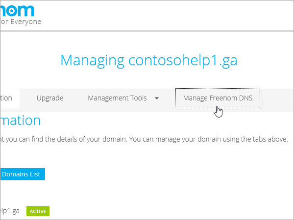
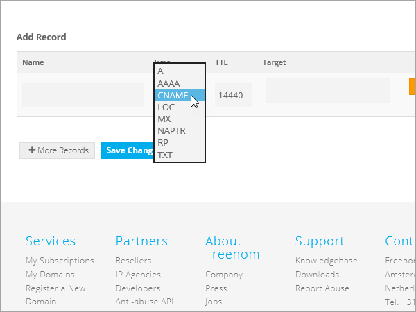

# 在 Freenom 建立 Microsoft 的 DNS 記錄

如果您找不到所需的專案，[請檢查網域常見問題](../setup/domains-faq.md)。 
  
> [!CAUTION]
> Freenom 網站不支援 SRV 記錄，這表示有幾部商務用 Skype Online 和 Outlook Web App 功能將無法運作。 不論使用哪一種 Microsoft 方案，都有重大的服務限制，您可能想要切換至不同的 DNS 主機服務提供者。 
  
不論服務限制，您可以選擇在 Freenom 管理您自己的 Microsoft DNS 記錄，請遵循本文中的步驟來驗證您的網域，並設定電子郵件和其他服務的 DNS 記錄。
  
若要深入瞭解 Microsoft 的網站的主控和 DNS，請參閱搭配[Microsoft 使用公用網站](https://support.office.com/article/a8178510-501d-4bd8-9921-b04f2e9517a5.aspx)。
  
> [!NOTE]
> DNS 變更生效通常約需 15 分鐘的時間。而如果您所做的變更要在整個網際網路 DNS 系統中生效，有時可能需要更久的時間。在您新增 DNS 記錄後，如有郵件流程或其他方面的問題，請參閱[變更網域名稱或 DNS 記錄之後所發生問題的疑難排解](../get-help-with-domains/find-and-fix-issues.md)。 
  
## 新增 TXT 記錄以供驗證

在將您的網域與 Microsoft 搭配使用之前，我們必須先確認您擁有該網域。 您能夠在您的網域註冊機構登入您的帳戶，並為您擁有網域的 Microsoft 建立 DNS 記錄證明。
  
> [!NOTE]
> 這筆記錄只會用於驗證您擁有自己的網域，不會影響其他項目。您可以選擇稍後再刪除記錄。 
  
1. 若要開始使用，請使用[此連結](https://my.freenom.com/)移至 Freenom 中您的網域頁面。 You'll be prompted to log in.
    
    
  
2. 選取 [**服務**]，然後選取 [**我的網域**]。
    
    
  
3. 針對您要編輯的網域，選取 [**管理網域**]。
    
    
  
4. 選取 [**管理 FREENOM DNS**]。
    
    
  
5. 在 [**新增記錄**] 底下的 [**類型**] 欄中，選擇功能表中的 [ **TXT** ]。 
    
    
  
6. 在新記錄的方塊中，輸入或複製並貼上下表中的值。 
    
    |**名稱**|**Type**|**TTL**|**Target** (目標)|
    |:-----|:-----|:-----|:-----|
    |(保留空白)    |TXT    |3600（秒）    |MS=msXXXXXXXX    **附註：** 這是範例。 從表格中，使用您的特定**目的地或指向位址**值。           [如何找到呢？](../get-help-with-domains/information-for-dns-records.md)          |
   
    
  
7. 選取 [**儲存變更**]。
    
    
  
8. 繼續進行之前，請先稍候幾分鐘，好讓您剛剛建立的記錄能在網際網路上更新。
    
現在，您已在網域註冊機構的網站上新增記錄，您會回到 Microsoft 並要求記錄。
  
當 Microsoft 找到正確的 TXT 記錄後，您的網域就會經過驗證。
  
1. 在 Microsoft 系統管理中心，移至 [**設定** \> <a href="https://go.microsoft.com/fwlink/p/?linkid=834818" target="_blank">網域</a>] 頁面。

    
2. 在 **[網域]** 頁面上，選取您要驗證的網域。 
    
    
  
3. 在 **[設定]** 頁面上，選取 **[開始設定]**。
    
    
  
4. 在 **[驗證網域]** 頁面上，選取 **[驗證]**。
    
    
  
> [!NOTE]
>  DNS 變更生效通常約需 15 分鐘的時間。而如果您所做的變更要在整個網際網路 DNS 系統中生效，有時可能需要更久的時間。在您新增 DNS 記錄後，如有郵件流程或其他方面的問題，請參閱[變更網域名稱或 DNS 記錄之後所發生問題的疑難排解](../get-help-with-domains/find-and-fix-issues.md)。 
  
## 新增 MX 記錄，使您網域的電子郵件將會傳送給 Microsoft

1. 若要開始使用，請使用[此連結](https://my.freenom.com/)移至 Freenom 中您的網域頁面。 You'll be prompted to log in.
    
    
  
2. 選取 [**服務**]，然後選取 [**我的網域**]。
    
    
  
3. 針對您要編輯的網域，選取 [**管理網域**]。
    
    
  
4. 將您的網域的名稱設為預設的 Freenom 名稱伺服器。 選取 [**管理工具**]，然後選取 [**名稱伺服器**]。
    
    
  
5. 請確認已選取 [**使用預設名稱伺服器**]，然後選取 [**變更名稱伺服器**]。
    
    
  
6. 選取 [**管理 FREENOM DNS**]。
    
    
  
7. 在 [**新增記錄**] 底下的 [**類型**] 欄中，從功能表選擇 [ **MX** ]。 
    
    
  
8. 在每一筆新記錄的方塊中，輸入或複製並貼上下表第一列中的值。 
    
    |**名稱**|**Type**|**TTL**|**Target** (目標)|**優先順序**|
    |:-----|:-----|:-----|:-----|:-----|
    |(保留空白)    |MX (郵件交換程式)    |3600（秒）    |\<網域金鑰\>。 mail.protection.outlook.com    **附注：** 從您的 Microsoft 帳戶取得您* \<的網域金鑰\> * 。   [How do I find this?](../get-help-with-domains/information-for-dns-records.md)          |10     如需關於優先順序的詳細資訊，請參閱[什麼是 MX 優先順序？](https://support.office.com/article/17d415c1-067e-4974-84d5-aaeaf3a0c0a9)   |
   
   
  
9. 選取 [**儲存變更**]。
    
    
  
10. 如果有任何其他 MX 記錄，請全部刪除。 針對每筆記錄，選取 [**刪除**]。 當郵件**確實要移除此專案時？** 隨即出現，請選取 **[確定]**。
    
## 新增 Microsoft 所需的 CNAME 記錄

1. 若要開始使用，請使用[此連結](https://my.freenom.com/)移至 Freenom 中您的網域頁面。 You'll be prompted to log in.
    
    
  
2. 選取 [**服務**]，然後選取 [**我的網域**]。
    
    
  
3. 針對您要編輯的網域，選取 [**管理網域**]。
    
    
  
4. 選取 [**管理 FREENOM DNS**]。
    
    
  
5. 在 [**新增記錄**] 底下的 [**類型**] 欄中，從功能表選擇 [ **CNAME** ]。 
    
    
  
6. 建立第一筆 CNAME 記錄。 在每一筆新記錄的方塊中，輸入或複製並貼上下表第一列中的值。 
    
    |**Name** (名稱)|**記錄類型**|**TTL**|**Target** (目標)|
    |:-----|:-----|:-----|:-----|
    |autodiscover    |CNAME    |3600（秒）    |autodiscover.outlook.com    |
    |sip    |CNAME    |3600（秒）    |sipdir.online.lync.com    |
    |lyncdiscover    |CNAME    |3600（秒）    |webdir.online.lync.com    |
    |enterpriseregistration    |CNAME    |3600（秒）    |enterpriseregistration.windows.net    |
    |enterpriseenrollment    |CNAME    |3600（秒）    |enterpriseenrollment-s.manage.microsoft.com    |
   
    
  
7. 選取 [**儲存變更**]。
    
    
  
8. 重複上述步驟，以建立其他五筆 CNAME 記錄。 
    
    針對每個記錄，輸入或複製並貼上表格中下一列的值，然後將其貼到該記錄的方塊中。
    
## 新增 SPF 的 TXT 記錄以協助防範垃圾郵件

> [!IMPORTANT]
> 網域的 SPF 不得擁有一個以上的 TXT 記錄。 如果您的網域具有多筆 SPF 記錄，您將收到電子郵件錯誤，以及傳送及垃圾郵件分類問題。 如果您已有網域的 SPF 記錄，請不要為 Microsoft 建立新的記錄。 請改為將必要的 Microsoft 值新增至目前的記錄，讓您擁有包含這兩組值的*單一*SPF 記錄。 

1. 若要開始使用，請使用[此連結](https://my.freenom.com/)移至 Freenom 中您的網域頁面。 You'll be prompted to log in.
    
    
  
2. 選取 [**服務**]，然後選取 [**我的網域**]。
    
    
  
3. 針對您要編輯的網域，選取 [**管理網域**]。
    
    
  
4. 選取 [**管理 FREENOM DNS**]。
    
    
  
5. 在 [**新增記錄**] 底下的 [**類型**] 欄中，選擇功能表中的 [ **TXT** ]。 
    
    
  
6. In the boxes for the new record, type or copy and paste the following values. 
    
    |**Name** (名稱)|**記錄類型**|**TTL**|**Target** (目標)|
    |:-----|:-----|:-----|:-----|
    |(保留空白)    |TXT    |3600（秒）    |v=spf1 include:spf.protection.outlook.com -all   **注意：** 建議您複製並貼上這個項目，好讓所有的間距保持正確。           |
   
    
  
7. 選取 [**儲存變更**]。
    
    
  

