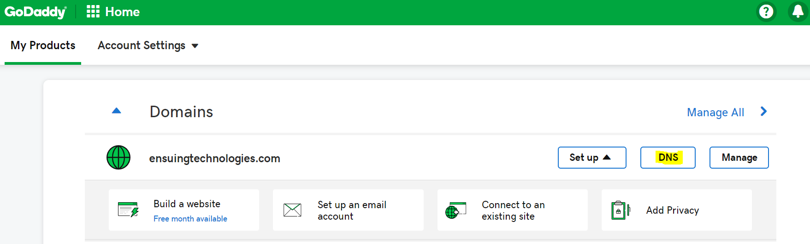
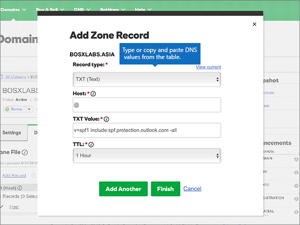

# 在 Microsoft 的 GoDaddy 建立 DNS 記錄

 若您找不到所需內容，請 **[查看網域常見問題集](../setup/domains-faq.yml)**。

如果 GoDaddy 是您的 DNS 主機服務提供者，請按照本文所述的步驟驗證網域，並設定電子郵件與商務用 Skype Online 等項目的 DNS 記錄。

在 GoDaddy 新增這些記錄之後，您的網域就會設定為與 Microsoft 服務搭配使用。

> [!NOTE]
> DNS 變更生效通常約需 15 分鐘的時間。而如果您所做的變更要在整個網際網路 DNS 系統中生效，有時可能需要更久的時間。在您新增 DNS 記錄後，如有郵件流程或其他方面的問題，請參閱[變更網域名稱或 DNS 記錄之後所發生問題的疑難排解](../get-help-with-domains/find-and-fix-issues.md)。

## 新增 TXT 記錄以供驗證

在您將自己的網域用於 Microsoft 之前，我們必須先確認您擁有該網域。如果您能在自己的網域註冊機構登入自己的帳戶並能建立 DNS 記錄，Microsoft 就能確信您擁有該網域。

> [!NOTE]
> 這筆記錄只會用於驗證您擁有自己的網域，不會影響其他項目。您可以選擇稍後再刪除記錄。

請依照下列步驟操作。

1. 首先請用[這個連結](https://account.godaddy.com/products/?go_redirect=disabled)移至 GoDaddy 上您的網域頁面。系統會提示您先登入。

    

2. 在 [ **網域**] 底下，選取您要編輯之網域底下的 [DNS]。

    

3. 選取 **[新增]**。

    

4. Choose **TXT (Text)** from the drop-down list. 在新記錄的方塊中，輸入或複製並貼上下表中的值。

    |**記錄類型** |**Host** (主機)|**TXT Value** (TXT 值)|**TTL** |
    |:-----|:-----|:-----|:-----|
    |TXT (文字)|@|MS=ms *XXXXXXXX* **請注意**：這是一個範例。 在這裡請使用您自己來自表格的 **[目的地或指向位址]** 值。 [如何找到呢？](../get-help-with-domains/information-for-dns-records.md)|1 小時    (從下拉式清單中選取值。 ) |

      

5. 選取 [儲存]。

6. 繼續進行之前，請先稍候幾分鐘，好讓您剛剛建立的記錄能在網際網路上更新。

現在您已在網域註冊機構網站新增記錄，請返回 Microsoft 並要求該記錄。

在 Microsoft 找到正確的 TXT 記錄後，您的網域就完成驗證了。
  
1. 在 Microsoft 系統管理中心中，移至 **[設定]** \> <a href="https://go.microsoft.com/fwlink/p/?linkid=834818" target="_blank">[網域]</a> 頁面。

    
2. 在 **[網域]** 頁面上，選取您要驗證的網域。 
    
    
  
3. 在 **[設定]** 頁面上，選取 **[開始設定]**。

4. 在 **[驗證網域]** 頁面上，選取 **[驗證]**。

> [!NOTE]
>  DNS 變更生效通常約需 15 分鐘的時間。而如果您所做的變更要在整個網際網路 DNS 系統中生效，有時可能需要更久的時間。在您新增 DNS 記錄後，如有郵件流程或其他方面的問題，請參閱[變更網域名稱或 DNS 記錄之後所發生問題的疑難排解](../get-help-with-domains/find-and-fix-issues.md)。

## 新增 MX 記錄，以將寄往您網域的電子郵件轉至 Microsoft

請依照下列步驟進行。

1. 首先請用[這個連結](https://account.godaddy.com/products/?go_redirect=disabled)移至 GoDaddy 上您的網域頁面。系統會提示您先登入。

    

2. 在 [ **網域**] 底下，選取您要編輯之網域底下的 [DNS]。

    

3. 選取 **[新增]**。

    

4. 從下拉式清單中選擇 [ **MX (郵件交換器])** 。

    

5. 在每一筆新記錄的方塊中，輸入或複製並貼上下表中的值。

     (從下拉式清單中選取 [ **TTL** ] 值。 ) 

    |**記錄類型**|**Host** (主機)|**Points to** (指向)|**Priority** (優先順序)|**TTL**|
    |:-----|:-----|:-----|:-----|:-----|
    |MX (郵件交換程式)    |@    | *\<domain-key\>*  .mail.protection.outlook.com    **附注：***\<domain-key\>* 從您的 Microsoft 帳戶取得。           [How do I find this?](../get-help-with-domains/information-for-dns-records.md)          |10     如需關於優先順序的詳細資訊，請參閱[什麼是 MX 優先順序？](https://docs.microsoft.com/microsoft-365/admin/setup/domains-faq)   |1 小時    |

6. 選取 [儲存]。

## 新增 Microsoft 所需的 CNAME 記錄

請依照下列步驟進行。

1. 首先請用[這個連結](https://account.godaddy.com/products/?go_redirect=disabled)移至 GoDaddy 上您的網域頁面。系統會提示您先登入。

    

2. 在 [ **網域**] 底下，選取您要編輯之網域底下的 [DNS]。

    

3. 選取 **[新增]**。

    

4. 從下拉式清單中選擇 [ **CNAME (別名])** 。

    

5. 建立第一筆 CNAME 記錄。

    在每一筆新記錄的方塊中，輸入或複製並貼上下表第一列中的值。

     (從下拉式清單中選取 [ **TTL** ] 值。 ) 

    |**記錄類型**|**Host** (主機)|**Points to** (指向)|**TTL**|
    |:-----|:-----|:-----|:-----|
    |CNAME (Alias) (CNAME (別名))    |autodiscover    |autodiscover.outlook.com    |1 小時    |
    |CNAME (Alias) (CNAME (別名))    |sip    |sipdir.online.lync.com    |1 小時    |
    |CNAME (Alias) (CNAME (別名))    |lyncdiscover    |webdir.online.lync.com    |1 小時    |
    |CNAME (Alias) (CNAME (別名))    |enterpriseregistration    |enterpriseregistration.windows.net    |1 小時    |
    |CNAME (Alias) (CNAME (別名))    |enterpriseenrollment    |enterpriseenrollment.manage.microsoft.com    |1 小時    |

6. 重複這些步驟，以新增下一個 CNAME 記錄，直到您已建立所有的六筆 CNAME 記錄為止。

## 新增 SPF 的 TXT 記錄以協助防範垃圾郵件

> [!IMPORTANT]
> 網域的 SPF 不得擁有一個以上的 TXT 記錄。 如果您的網域具有多筆 SPF 記錄，您將收到電子郵件錯誤，以及傳送及垃圾郵件分類問題。 如果網域已經有 SPF 記錄，請勿為 Microsoft 建立一個新的記錄。 請改為將必要的 Microsoft 值新增至目前的記錄，讓您擁有包含這兩組值的  *單一*  SPF 記錄。

請依照下列步驟操作。

1. 首先請用[這個連結](https://account.godaddy.com/products/?go_redirect=disabled)移至 GoDaddy 上您的網域頁面。系統會提示您先登入。

    

2. 在 [ **網域**] 底下，選取您要編輯之網域底下的 [DNS]。

    

3. 選取 **[新增]**。

    

4. Choose **TXT (Text)** from the drop-down list.

    

5. 在每一筆新記錄的方塊中，輸入或複製並貼上下列的值。

     (從下拉式清單中選擇 **TTL** 值。 ) 

    |**記錄類型**|**Host** (主機)|**TXT Value** (TXT 值)|**TTL**|
    |:-----|:-----|:-----|:-----|
    |TXT (文字)    |@    |v=spf1 include:spf.protection.outlook.com -all    **附註：** 建議您複製並貼上這個項目，好讓所有的間距保持正確。           |1 hour (1 小時)    |

    

6. 選取 [儲存]。

## 新增兩筆 Microsoft 所需的 SRV 記錄

請依照下列步驟進行。

1. 首先請用[這個連結](https://account.godaddy.com/products/?go_redirect=disabled)移至 GoDaddy 上您的網域頁面。系統會提示您先登入。

    

2. 在 [ **網域**] 底下，選取您要編輯之網域底下的 [DNS]。

    

3. 選取 **[新增]**。

    

4. 從下拉式清單中選擇 [ **SRV (服務])** 。

    

5. 建立第一筆 SRV 記錄。

    在每一筆新記錄的方塊中，輸入或複製並貼上下表第一列中的值。

     (從下拉式清單中選擇 [ **記錄類型** ] 和 [ **TTL** ] 值。 ) 

    |**記錄類型**|**Name** (名稱)|**Target** (目標)|**Protocol** (通訊協定)|**Service** (服務)|**Priority** (優先順序)|**Weight** (權數)|**Port** (連接埠)|**TTL**|
    |:-----|:-----|:-----|:-----|:-----|:-----|:-----|:-----|:-----|
    |SRV (Service) (SRV (服務))    |@    |sipdir.online.lync.com    |_tls    |_sip    |100    |1     |443    |1 小時    |
    |SRV (Service) (SRV (服務))    |@    |sipfed.online.lync.com    |_tcp    |_sipfederationtls    |100    |1     |5061    |1 小時    |

    

6. 重複 **步驟 5** 以建立其他 SRV 記錄。

7. 選取 [儲存]。

> [!NOTE]
> DNS 變更生效通常約需 15 分鐘的時間。而如果您所做的變更要在整個網際網路 DNS 系統中生效，有時可能需要更久的時間。在您新增 DNS 記錄後，如有郵件流程或其他方面的問題，請參閱[變更網域名稱或 DNS 記錄之後所發生問題的疑難排解](../get-help-with-domains/find-and-fix-issues.md)。
