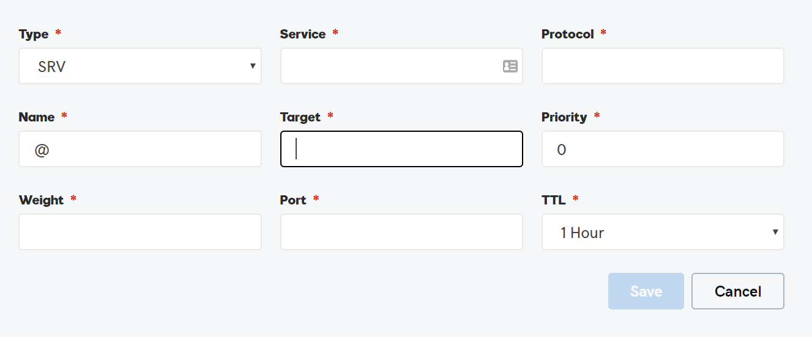
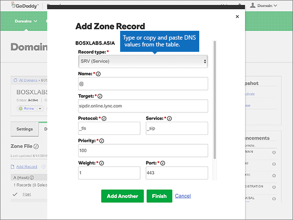

# 在 GoDaddy 建立 Office 365 的 DNS 記錄

 若您找不到所需功能，請**[檢查網域常見問題集](../setup/domains-faq.md)**。

如果 GoDaddy 是您的 DNS 主機服務提供者，請按照本文所述的步驟驗證網域，並設定電子郵件與商務用 Skype Online 等項目的 DNS 記錄。

在 GoDaddy 新增這些記錄之後，您的網域就會設定為搭配 Office 365 服務使用。

若要了解使用 Office 365 網站的虛擬主機和 DNS，請參閱[搭配 Office 365 使用公用網站](https://support.office.com/article/choose-a-public-website-3325d50e-d131-403c-a278-7f3296fe33a9)。

> [!NOTE]
> DNS 變更生效通常約需 15 分鐘的時間。而如果您所做的變更要在整個網際網路 DNS 系統中生效，有時可能需要更久的時間。在您新增 DNS 記錄後，如有郵件流程或其他方面的問題，請參閱[變更網域名稱或 DNS 記錄之後所發生問題的疑難排解](../get-help-with-domains/find-and-fix-issues.md)。

## 新增 TXT 記錄以供驗證

在您將自己的網域用於 Office 365 之前，我們必須先確認您擁有該網域。如果您能在自己的網域註冊機構登入自己的帳戶並能建立 DNS 記錄，Office 365 就能確信您擁有該網域。

> [!NOTE]
> 這筆記錄只會用於驗證您擁有自己的網域，不會影響其他項目。您可以選擇稍後再刪除記錄。

請依照下列步驟操作。

1. 首先請用[這個連結](https://account.godaddy.com/products/?go_redirect=disabled)移至 GoDaddy 上您的網域頁面。系統會提示您先登入。

    

2. [**網域**] 中，選取 [您想要編輯的網域下的 [DNS]。

    

3. 選取 **[新增]**。

    

4. Choose **TXT (Text)** from the drop-down list. In the boxes for the new record, type or copy and paste the values from the following table.

    |**記錄類型** |**Host (主機)**|**TXT Value**|**TTL** |
    |:-----|:-----|:-----|:-----|
    |TXT (文字)|@|MS=ms *XXXXXXXX* **附註**： 這是範例。 Use your specific **Destination or Points to Address** value here, from the table in Office 365. [How do I find this?](../get-help-with-domains/information-for-dns-records.md)|1 hour   （從下拉式清單選取值）。|

      

5. 選取 **[儲存]**。

6. 繼續進行之前，請先稍候幾分鐘，好讓您剛剛建立的記錄能在網際網路上更新。

Now that you've added the record at your domain registrar's site, you'll go back to Office 365 and request Office 365 to look for the record.

When Office 365 finds the correct TXT record, your domain is verified.
  
1. 在系統管理中心，移至 [**設定** \> <a href="https://go.microsoft.com/fwlink/p/?linkid=834818" target="_blank">網域</a>] 頁面。

    
2. 在 [**網域**] 頁面上，選取您要驗證的網域。 
    
    
  
3. 在 [**安裝**] 頁面上，選取 [**啟動安裝程式**。

4. 在 [**驗證網域**] 頁面上，選取 [**驗證**]。

> [!NOTE]
>  DNS 變更生效通常約需 15 分鐘的時間。而如果您所做的變更要在整個網際網路 DNS 系統中生效，有時可能需要更久的時間。在您新增 DNS 記錄後，如有郵件流程或其他方面的問題，請參閱[變更網域名稱或 DNS 記錄之後所發生問題的疑難排解](../get-help-with-domains/find-and-fix-issues.md)。

## 新增 MX 記錄，以將寄往您網域的電子郵件轉至 Office 365

請依照下列步驟進行。

1. 首先請用[這個連結](https://account.godaddy.com/products/?go_redirect=disabled)移至 GoDaddy 上您的網域頁面。系統會提示您先登入。

    

2. [**網域**] 中，選取 [您想要編輯的網域下的 [DNS]。

    

3. 選取 **[新增]**。

    

4. 從下拉式清單中選擇**MX （郵件交換程式）** 。

    

5. 在每一筆新記錄的方塊中，輸入或複製並貼上下表中的值。

    （從下拉式清單選擇 [ **TTL** ] 值）。

    |**記錄類型**|**Host (主機)**|**Points to **|**Priority** (優先順序)|**TTL**|
    |:-----|:-----|:-----|:-----|:-----|
    |MX (郵件交換程式)    |@    | *\<網域金鑰\>*  .mail.protection.outlook.com    **附註：** 取得您*\<網域金鑰\>* 從您的 Office 365 帳戶。           [How do I find this?](../get-help-with-domains/information-for-dns-records.md)          |10     如需關於優先順序的詳細資訊，請參閱[什麼是 MX 優先順序？](https://support.office.com/article/2784cc4d-95be-443d-b5f7-bb5dd867ba83.aspx)   |1 hour    |

6. 選取 **[儲存]**。

## 新增 Office 365 所需的 CNAME 記錄

請依照下列步驟進行。

1. 首先請用[這個連結](https://account.godaddy.com/products/?go_redirect=disabled)移至 GoDaddy 上您的網域頁面。系統會提示您先登入。

    

2. [**網域**] 中，選取 [您想要編輯的網域下的 [DNS]。

    

3. 選取 **[新增]**。

    

4. 從下拉式清單中，選擇 [ **CNAME (Alias)** 。

    

5. 建立第一筆 CNAME 記錄。

    在每一筆新記錄的方塊中，輸入或複製並貼上下表第一列中的值。

    （從下拉式清單選擇 [ **TTL** ] 值）。

    |**記錄類型**|**Host (主機)**|**Points to **|**TTL**|
    |:-----|:-----|:-----|:-----|
    |CNAME (Alias)    |autodiscover    |autodiscover.outlook.com    |1 hour    |
    |CNAME (Alias) (CNAME (別名))    |sip    |sipdir.online.lync.com>    |1 小時    |
    |CNAME (Alias) (CNAME (別名))    |lyncdiscover    |webdir.online.lync.com>    |1 小時    |
    |CNAME (Alias) (CNAME (別名))    |enterpriseregistration    |enterpriseregistration.windows.net>    |1 小時    |
    |CNAME (Alias) (CNAME (別名))    |enterpriseenrollment    |enterpriseenrollment.manage.microsoft.com>    |1 小時    |

6. 重複這些步驟來新增的下一筆 CNAME 記錄，直到建立完所有六筆 CNAME 記錄。

## 新增 SPF 的 TXT 記錄以協助防範垃圾郵件

> [!IMPORTANT]
> You cannot have more than one TXT record for SPF for a domain. If your domain has more than one SPF record, you'll get email errors, as well as delivery and spam classification issues. If you already have an SPF record for your domain, don't create a new one for Office 365. Instead, add the required Office 365 values to the current record so that you have a  *single*  SPF record that includes both sets of values.

請依照下列步驟操作。

1. 首先請用[這個連結](https://account.godaddy.com/products/?go_redirect=disabled)移至 GoDaddy 上您的網域頁面。系統會提示您先登入。

    

2. [**網域**] 中，選取 [您想要編輯的網域下的 [DNS]。

    

3. 選取 **[新增]**。

    

4. Choose **TXT (Text)** from the drop-down list.

    

5. 在每一筆新記錄的方塊中，輸入或複製並貼上下列的值。

    （從下拉式清單選擇 [ **TTL** ] 值）。

    |**記錄類型**|**Host (主機)**|**TXT Value**|**TTL**|
    |:-----|:-----|:-----|:-----|
    |TXT (文字)    |@    |v=spf1 include:spf.protection.outlook.com -all    **附註：** 建議您複製並貼上這個項目，好讓所有的間距保持正確。           |1 hour    |

    

6. 選取 **[儲存]**。

## 新增兩筆 Office 365 所需的 SRV 記錄

請依照下列步驟進行。

1. 首先請用[這個連結](https://account.godaddy.com/products/?go_redirect=disabled)移至 GoDaddy 上您的網域頁面。系統會提示您先登入。

    

2. [**網域**] 中，選取 [您想要編輯的網域下的 [DNS]。

    

3. 選取 **[新增]**。

    

4. 從下拉式清單中選擇**SRV （服務）** 。

    

5. 建立第一筆 SRV 記錄。

    在每一筆新記錄的方塊中，輸入或複製並貼上下表第一列中的值。

    （從下拉式清單選擇 [**記錄類型**] 和 [ **TTL**值）。

    |**記錄類型**|**Name**|**Target**|**通訊協定**|**服務**|**優先順序**|**Weight**|**Port**|**TTL**|
    |:-----|:-----|:-----|:-----|:-----|:-----|:-----|:-----|:-----|
    |SRV (Service) (SRV (服務))    |@    |sipdir.online.lync.com>    |_tls    |_sip    |100    |1    |443    |1 小時    |
    |SRV (Service) (SRV (服務))    |@    |sipfed.online.lync.com>    |_tcp    |_sipfederationtls    |100    |1    |5061    |1 小時    |

    

6. 重複**步驟 5** ，以建立其他 SRV 記錄。

7. 選取 **[儲存]**。

> [!NOTE]
> DNS 變更生效通常約需 15 分鐘的時間。而如果您所做的變更要在整個網際網路 DNS 系統中生效，有時可能需要更久的時間。在您新增 DNS 記錄後，如有郵件流程或其他方面的問題，請參閱[變更網域名稱或 DNS 記錄之後所發生問題的疑難排解](../get-help-with-domains/find-and-fix-issues.md)。
