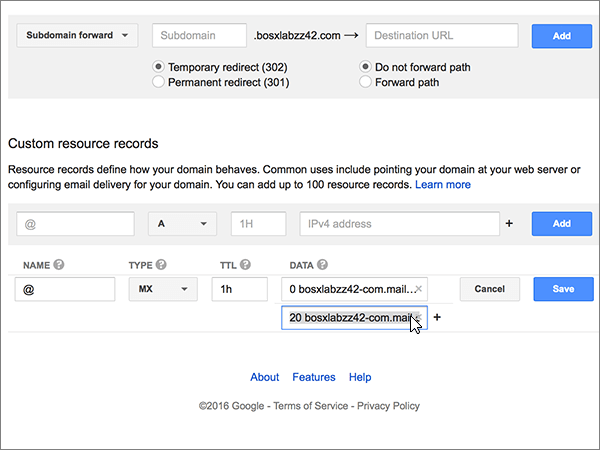
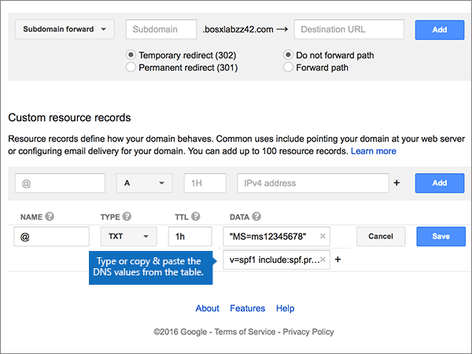

# 在 Google 網域上建立 Microsoft 的 DNS 記錄Create DNS records at Google Domains for Microsoft

 若您找不到所需功能，請**[檢查網域常見問題集](../setup/domains-faq.md)**。**[Check the Domains FAQ](../setup/domains-faq.md)** if you don't find what you're looking for. 
  
如果 Google Domains 是您的 DNS 主機服務提供者，請按照本文所述的步驟驗證網域，並設定電子郵件與 Lync 等項目的 DNS 記錄。If Google Domains is your DNS hosting provider, follow the steps in this article to verify your domain and set up DNS records for email, Lync, and so on.
  
在 Google 網域新增這些記錄之後，您的網域就會設定為與 Microsoft 服務搭配使用。After you add these records at Google Domains, your domain will be set up to work with Microsoft services.
  
若要深入瞭解 Microsoft 的網站的主控和 DNS，請參閱搭配[Microsoft 使用公用網站](https://support.office.com/article/choose-a-public-website-3325d50e-d131-403c-a278-7f3296fe33a9)。To learn about webhosting and DNS for websites with Microsoft, see [Use a public website with Microsoft](https://support.office.com/article/choose-a-public-website-3325d50e-d131-403c-a278-7f3296fe33a9).
  
> [!NOTE]
> Typically it takes about 15 minutes for DNS changes to take effect.Typically it takes about 15 minutes for DNS changes to take effect. 而如果您所做的變更要在整個網際網路 DNS 系統中生效，有時可能需要更久的時間。However, it can occasionally take longer for a change you've made to update across the Internet's DNS system. 如果您在新增 DNS 記錄後遇到郵件流程或其他問題的問題，請參閱[尋找並修正在 Microsoft 中新增您的網域或 DNS 記錄之後](../get-help-with-domains/find-and-fix-issues.md)所發生的問題。If you're having trouble with mail flow or other issues after adding DNS records, see [Find and fix issues after adding your domain or DNS records in Microsoft](../get-help-with-domains/find-and-fix-issues.md). 
  
## 新增 TXT 記錄以供驗證Add a TXT record for verification

在將您的網域與 Microsoft 搭配使用之前，我們必須先確認您擁有該網域。Before you use your domain with Microsoft, we have to make sure that you own it. 您能夠在您的網域註冊機構登入您的帳戶，並為您擁有網域的 Microsoft 建立 DNS 記錄證明。Your ability to log in to your account at your domain registrar and create the DNS record proves to Microsoft that you own the domain.
  
> [!NOTE]
> 這筆記錄只會用於驗證您擁有自己的網域，不會影響其他項目。您可以選擇稍後再刪除記錄。This record is used only to verify that you own your domain; it doesn't affect anything else. You can delete it later, if you like. 
  
1. 首先請用[這個連結](https://domains.google.com/registrar)移至 Google Domains 上您的網域頁面。系統會提示您登入。若要執行此作業，請執行下列動作：To get started, go to your domains page at Google Domains by using [this link](https://domains.google.com/registrar). You'll be prompted to sign in. To do so:
    
1. 選取 [登**入**]。Select **Sign In**.
    
2. 輸入您的登入認證，然後再選取 [登**入**]。Enter your login credentials, and then again select **Sign In**.
    
2. 在 [**我的網域**] 頁面上，尋找您要與 Microsoft 搭配使用的網域，然後選取它旁邊的 [**管理**] 連結。On the **My domains** page, find the domain you want to use with Microsoft, and select the **MANAGE** link next to it. 在左側導覽中，選取 [ **DNS**]。In the left navigation, select **DNS**.
    
3. 在 [自訂資源記錄] （\*）區段的新記錄方塊中，輸入或複製並貼上下表中的值。In the \*\* Custom resource records \*\* section, in the boxes for the new record, type or copy and paste the values from the following table. 
    
    (You may have to scroll down.)(You may have to scroll down.)
    
    (Choose the **Type** value from the drop-down list.)(Choose the **Type** value from the drop-down list.) 
    
    |||||
    |:-----|:-----|:-----|:-----|
    |**名稱****Name**   |**Type****Type**   |**TTL****TTL**   |**資料****Data**   |
    |@    |TXTTXT    |1H1H    |MS=ms *XXXXXXXX*MS=ms *XXXXXXXX*    **附註：** 這是範例。**Note:** This is an example. 從表格中，使用您的特定**目的地或指向位址**值。Use your specific **Destination or Points to Address** value here, from the table. [如何找到呢？How do I find this?](../get-help-with-domains/information-for-dns-records.md)          |
   
4. 選取 [新增]\*\*\*\*。Select **Add**.
    
5. 繼續進行之前，請先稍候幾分鐘，好讓您剛剛建立的記錄能在網際網路上更新。Wait a few minutes before you continue, so that the record you just created can update across the Internet.
    
現在，您已在網域註冊機構的網站上新增記錄，您會回到 Microsoft 並要求記錄。Now that you've added the record at your domain registrar's site, you'll go back to Microsoft and request the record.
  
當 Microsoft 找到正確的 TXT 記錄後，您的網域就會經過驗證。When Microsoft finds the correct TXT record, your domain is verified.
  
1. 在 Microsoft 系統管理中心，移至 [**設定** \> <a href="https://go.microsoft.com/fwlink/p/?linkid=834818" target="_blank">網域</a>] 頁面。In the Microsoft admin center, go to the **Settings** \> <a href="https://go.microsoft.com/fwlink/p/?linkid=834818" target="_blank">Domains</a> page.

    
2. 在 **[網域]** 頁面上，選取您要驗證的網域。On the **Domains** page, select the domain that you are verifying. 
    
3. 在 **[設定]** 頁面上，選取 **[開始設定]**。On the **Setup** page, select **Start setup**.
    
4. 在 [驗證網域]\*\*\*\* 頁面上，選取 [驗證]\*\*\*\*。On the **Verify domain** page, select **Verify**.
    
> [!NOTE]
> Typically it takes about 15 minutes for DNS changes to take effect.Typically it takes about 15 minutes for DNS changes to take effect. 而如果您所做的變更要在整個網際網路 DNS 系統中生效，有時可能需要更久的時間。However, it can occasionally take longer for a change you've made to update across the Internet's DNS system. 如果您在新增 DNS 記錄後遇到郵件流程或其他問題的問題，請參閱[尋找並修正新增您的網域或 DNS 記錄後的問題](../get-help-with-domains/find-and-fix-issues.md)。If you're having trouble with mail flow or other issues after adding DNS records, see [Find and fix issues after adding your domain or DNS records](../get-help-with-domains/find-and-fix-issues.md). 

  
## 新增 MX 記錄，使您網域的電子郵件將會傳送給 MicrosoftAdd an MX record so email for your domain will come to Microsoft

1. 首先請用[這個連結](https://domains.google.com/registrar)移至 Google Domains 上您的網域頁面。系統會提示您登入。若要執行此作業，請執行下列動作：To get started, go to your domains page at Google Domains by using [this link](https://domains.google.com/registrar). You'll be prompted to sign in. To do so:
    
2. 選取 [登**入**]。Select **Sign In**.
    
3. 輸入您的登入認證，然後再選取 [登**入**]。Enter your login credentials, and then again select **Sign In**.
4. 在 [**網域**] 頁面上的 [**網域**] 區段中，針對您要編輯的網域選取 [**設定 DNS** ]。On the **Domains** page, in the **Domain** section, select **Configure DNS** for the domain that you want to edit.
    
    > [!IMPORTANT]
    > 如果您擁有 G Suite 電子郵件帳戶，則必須先刪除與該帳戶相關聯的 MX 記錄。If you have a G Suite email account, you must first delete the MX records associated with that account. G Suite MX 記錄會使您無法新增其他任何 MX 記錄，包括 Microsoft 所需的記錄。The G Suite MX records prevent you from adding any other MX records, including those required for Microsoft. 請注意，刪除 G Suite 記錄並不會刪除您的 G Suite 帳戶。Note that deleting the G Suite records does not delete your G Suite account. 若要刪除您的 G Suite MX 記錄，請依照下列步驟操作。To delete your G Suite MX records, use the following steps. 
  
5. 在 [**綜合記錄**] 區段的 [ **G Suite** ] 區域中，選取 [**刪除**]。In the **Synthetic records** section, in the **G Suite** area, select **Delete**.
    
    (You may have to scroll down.)(You may have to scroll down.)
    
    ![在 [綜合記錄] 區段中，選取 [刪除]](../../media/bd276b5d-5667-4bb1-a233-2dc5194e7ace.png)
  
6. 選取 [刪除]\*\*\*\*。Select **Delete**.
    
    ![選取 [刪除]](../../media/4413a45a-5b82-4ec6-82c6-0091f5be9696.png)
  
7. In the **Custom resource records** section, in the boxes for the new record, type or copy and paste the values from the following table.In the **Custom resource records** section, in the boxes for the new record, type or copy and paste the values from the following table. 
    
    (You may have to scroll down.)(You may have to scroll down.)
    
    (Choose the **Type** value from the drop-down list.)(Choose the **Type** value from the drop-down list.) 
    
    |**名稱****Name**|**Type****Type**|**TTL****TTL**|**資料****Data**|
    |:-----|:-----|:-----|:-----|
    |@    |MXMX    |1H1H    |0  *\<網域金鑰\>*  .mail.protection.outlook.com.0  *\<domain-key\>*  .mail.protection.outlook.com.    **This value MUST end with a period (.)****This value MUST end with a period (.)**   **0**是 MX 優先順序值。The **0** is the MX priority value. 請將它新增到 MX 值的開頭，並以空格分隔該值的其餘部分。Add it to the beginning of the MX value, separated from the remainder of the value by a space.    **附注：** 從您\<的 Microsoft 帳戶取得您的*網域金鑰*\> 。**Note:** Get your \<*domain-key*\> from your Microsoft account.  [How do I find this?How do I find this?](../get-help-with-domains/information-for-dns-records.md)          For more information about priority, see [What is MX priority?](https://support.office.com/article/2784cc4d-95be-443d-b5f7-bb5dd867ba83.aspx)For more information about priority, see [What is MX priority?](https://support.office.com/article/2784cc4d-95be-443d-b5f7-bb5dd867ba83.aspx)   |
   
    
  
5. 選取 [新增]\*\*\*\*。Select **Add**.
    
    ![選取 [新增]](../../media/32f8f23c-0b80-48da-b08e-4e04052971af.png)
  
6. 如果有任何其他的自訂 MX 記錄，請移除它們。If there are any other Custom MX records, remove them.
    
1. 在 [MX 記錄] 列中，選取 [**編輯**]。Select **Edit** in the MX record row. 
    
    ![在 [MX 記錄] 資料列中，選取 [編輯]](../../media/acc53ae9-3b8a-421d-8d11-d4a4108b2353.png)
  
2. 針對每個其他自訂 MX 記錄，選取 [**資料**] 方塊中的專案，然後按下鍵盤上的**Delete**鍵，以刪除該記錄。For each of the other Custom MX records, select the entry in the **Data** box and then press the **Delete** key on your keyboard to delete that record. 
    
    繼續執行，直到您刪除每個其他 MX 記錄的**資料**輸入為止。Continue until you have deleted the **Data** entry for each of the other MX records. 
    
    
  
7. 當您已刪除每個其他 MX 記錄的**資料**輸入時，請選取 [**儲存**] 以儲存您的變更。When you have deleted the **Data** entry for each of the other MX records, select **Save** to save your changes. 
    
    ![選取 [儲存]](../../media/bf496d01-ccbe-4800-95f4-7b2283f2e5f6.png)
  
## 新增 Microsoft 所需的五個 CNAME 記錄Add the five CNAME records that are required for Microsoft

1. 若要開始，請移至 [Google 網域] 頁面]https://domains.google.com/registrar) （並登入。To get started, go to your [Google Domains page] (https://domains.google.com/registrar) and sign in.
    
2. 在 [**網域**] 頁面上的 [**網域**] 區段中，針對您要編輯的網域選取 [**設定 DNS** ]。On the **Domains** page, in the **Domain** section, select **Configure DNS** for the domain that you want to edit. 
    
3. 新增第一筆 CNAME 記錄。Add the first CNAME record.
    
    在 [**自訂資源記錄**] 區段的新記錄方塊中，輸入或複製並貼上下表第一列中的值。In the **Custom resource records** section, in the boxes for the new record, type or copy and paste the values from first row of the following table. 
    
    (You may have to scroll down.)(You may have to scroll down.)
    
    (Choose the **Type** value from the drop-down list.)(Choose the **Type** value from the drop-down list.) 
    
    |**名稱****Name**|**Type****Type**|**TTL****TTL**|**資料****Data**|
    |:-----|:-----|:-----|:-----|
    |autodiscoverautodiscover    |CNAMECNAME    |1H1H    |autodiscover.outlook.com。autodiscover.outlook.com.    **This value MUST end with a period (.)****This value MUST end with a period (.)**   |
    |sipsip    |CNAMECNAME    |1H1H    |sipdir.online.lync.com。sipdir.online.lync.com.    **This value MUST end with a period (.)****This value MUST end with a period (.)**   |
    |lyncdiscoverlyncdiscover    |CNAMECNAME    |1H1H    |webdir.online.lync.com。webdir.online.lync.com.    **This value MUST end with a period (.)****This value MUST end with a period (.)**   |
    |enterpriseregistrationenterpriseregistration    |CNAMECNAME    |1H1H    |enterpriseregistration.windows.net。enterpriseregistration.windows.net.    **This value MUST end with a period (.)****This value MUST end with a period (.)**   |
    |enterpriseenrollmententerpriseenrollment    |CNAMECNAME    |1H1H    |enterpriseenrollment-s.manage.microsoft.com。enterpriseenrollment-s.manage.microsoft.com.    **This value MUST end with a period (.)****This value MUST end with a period (.)**   |
   
    
  
4. 選取 [新增]\*\*\*\*。Select **Add**.
    
    ![選取 [新增]](../../media/4a78080a-e0b2-4582-9696-3fe4fea41e91.png)
  
5. 新增其他四筆 CNAME 記錄。Add the other four CNAME records.
    
    在 [**自訂資源記錄**] 區段中，使用表格中下一列的值來建立記錄，然後再選取 [**新增**] 以完成該記錄。In the **Custom resource records** section, create a record by using the values from the next row in the table, and then again select **Add** to complete that record. 
    
    重複此程式，直到您已建立所有必要的 CNAME 記錄為止。Repeat this process until you have created all of the required CNAME records.
    
## 新增 SPF 的 TXT 記錄以協助防範垃圾郵件Add a TXT record for SPF to help prevent email spam

> [!IMPORTANT]
> 網域的 SPF 不得擁有一個以上的 TXT 記錄。You cannot have more than one TXT record for SPF for a domain. 如果您的網域具有多筆 SPF 記錄，您將收到電子郵件錯誤，以及傳送及垃圾郵件分類問題。If your domain has more than one SPF record, you'll get email errors, as well as delivery and spam classification issues. 如果您已有網域的 SPF 記錄，請不要為 Microsoft 建立新的記錄。If you already have an SPF record for your domain, don't create a new one for Microsoft. 請改為將必要的 Microsoft 值新增至目前的記錄，讓您擁有包含這兩組值的單一 SPF 記錄。Instead, add the required Microsoft values to the current record so that you have a single SPF record that includes both sets of values. 需要範例？Need examples? 請參閱[Microsoft 的這些外部網域名稱系統記錄](https://support.office.com/article/c0531a6f-9e25-4f2d-ad0e-a70bfef09ac0#bkmk_spfrecords)。Check out these [External Domain Name System records for Microsoft](https://support.office.com/article/c0531a6f-9e25-4f2d-ad0e-a70bfef09ac0#bkmk_spfrecords). To validate your SPF record, you can use one of these [SPF validation tools](../setup/domains-faq.md).To validate your SPF record, you can use one of these [SPF validation tools](../setup/domains-faq.md). 
  
1. 首先請用[這個連結](https://domains.google.com/registrar)移至 Google Domains 上您的網域頁面。系統會提示您登入。若要執行此作業，請執行下列動作：To get started, go to your domains page at Google Domains by using [this link](https://domains.google.com/registrar). You'll be prompted to sign in. To do so:
    
1. 選取 [登**入**]。Select **Sign In**.
    
2. 輸入您的登入認證，然後再選取 [登**入**]。Enter your login credentials, and then again select **Sign In**.
    
3. 在 [**網域**] 頁面上的 [**網域**] 區段中，針對您要編輯的網域選取 [**設定 DNS** ]。On the **Domains** page, in the **Domain** section, select **Configure DNS** for the domain that you want to edit. 
    
4. 在 [**自訂資源記錄**] 區段的 [TXT 記錄] 列中，選取 [**編輯**]。In the **Custom resource records** section, on the TXT record row, select **Edit**. 
    
    > [!IMPORTANT]
    > Google Domains 會將 TXT 記錄儲存為一組可包含多個記錄的集合。Google Domains stores TXT records as a set that may contain multiple records. 當您有至少一個其他的 TXT 記錄時 (例如用於驗證網域的 TXT 記錄)，您必須新增 TXT 新記錄到該記錄集。When you have at least one other TXT record, such as the TXT record you used to verify your domain, you must add TXT new records to that record set. 任何嘗試輸入其他 TXT 記錄做為個別專案會產生重複的**記錄**錯誤訊息。Any attempt to enter additional TXT records as separate entries will result in a **Duplicate record** error message. 
  
    ![在 TXT 記錄列中選取 [編輯]](../../media/eae14850-8d0c-4f29-8587-df8b36129d5f.png)
  
5. 選取 **（+）** 控制項。Select the **(+)** control. 
    
    
  
6. 在每一筆新記錄的方塊中，輸入或複製並貼上下表中的值。In the boxes for the new record, type or copy and paste the values from the following table.
    
    (您可能需要向下捲動。)(You may have to scroll down.)
    
    |**資料****Data**|
    |:-----|
    |v=spf1 include:spf.protection.outlook.com -allv=spf1 include:spf.protection.outlook.com -all    

    > [!NOTE]
    > 建議您複製並貼上這個項目，好讓所有的間距保持正確。We recommend copying and pasting this entry, so that all of the spacing stays correct.           
   
   
  
7. 選取 **[儲存]**。Select **Save**.
    
    ![選取 [儲存]](../../media/20c4c926-f062-4048-9265-bf752be54e0c.png)
  
## 新增 Microsoft 所需的兩筆 SRV 記錄Add the two SRV records that are required for Microsoft

1. 首先請用[這個連結](https://domains.google.com/registrar)移至 Google Domains 上您的網域頁面。系統會提示您登入。若要執行此作業，請執行下列動作：To get started, go to your domains page at Google Domains by using [this link](https://domains.google.com/registrar). You'll be prompted to sign in. To do so:
    
2. 選取 [登**入**]。Select **Sign In**.
    
3. 輸入您的登入認證，然後再選取 [登**入**]。Enter your login credentials, and then again select **Sign In**.
    
4. 在 [**網域**] 頁面上的 [**網域**] 區段中，針對您要編輯的網域選取 [**設定 DNS** ]。On the **Domains** page, in the **Domain** section, select **Configure DNS** for the domain that you want to edit. 
    
5. 新增第一筆 SRV 記錄。Add the first SRV record.
    
    In the **Custom resource records** section, in the boxes for the new record, type or copy and paste the values from the following table.In the **Custom resource records** section, in the boxes for the new record, type or copy and paste the values from the following table. 
    
    (You may have to scroll down.)(You may have to scroll down.)
    
    (Choose the **Type** value from the drop-down list.)(Choose the **Type** value from the drop-down list.) 
    
    |**名稱****Name**|**Type****Type**|**TTL****TTL**|**資料****Data**|
    |:-----|:-----|:-----|:-----|
    |_sip。 _tls_sip._tls|SRVSRV|1H1H|100 1 443 sipdir.online.lync.com。100 1 443 sipdir.online.lync.com. **此值必須以句點（.）結尾\*\*\*\*附注：** 建議您複製並貼上此專案，讓所有的間距都保持正確。**This value MUST end with a period (.)** **Note:** We recommend copying and pasting this entry, so that all of the spacing stays correct.           |
    |_sipfederationtls。 _tcp_sipfederationtls._tcp|SRVSRV|1H1H|100 1 5061 sipfed.online.lync.com。100 1 5061 sipfed.online.lync.com. **This value MUST end with a period (.)****This value MUST end with a period (.)**

    建議您複製並貼上這個項目，好讓所有的間距保持正確。We recommend copying and pasting this entry, so that all of the spacing stays correct.       
   
    
  
6. 選取 [新增]\*\*\*\*。Select **Add**.
    
    ![選取 [新增]](../../media/89df6efd-e641-4441-baa2-d9a890424569.png)
  
7. 新增另一筆 SRV 記錄。Add the other SRV record.
    
    在 [**自訂資源記錄**] 區段中，使用表格中第二列的值來建立記錄，然後再選取 [**新增**] 以完成該記錄。In the **Custom resource records** section, create a record by using the values from the second row in the table, and then again select **Add** to complete that record. 
    
    > [!NOTE]
    > Typically it takes about 15 minutes for DNS changes to take effect.Typically it takes about 15 minutes for DNS changes to take effect. 而如果您所做的變更要在整個網際網路 DNS 系統中生效，有時可能需要更久的時間。However, it can occasionally take longer for a change you've made to update across the Internet's DNS system. 如果您在新增 DNS 記錄後遇到郵件流程或其他問題的問題，請參閱[尋找並修正新增您的網域或 DNS 記錄後的問題](../get-help-with-domains/find-and-fix-issues.md)。If you're having trouble with mail flow or other issues after adding DNS records, see [Find and fix issues after adding your domain or DNS records](../get-help-with-domains/find-and-fix-issues.md). 
  
