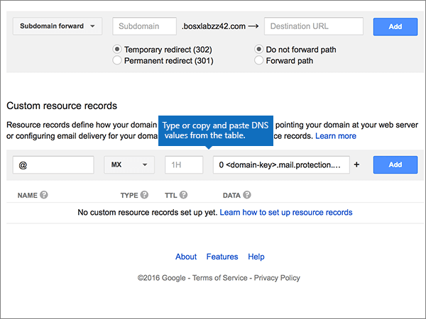

# 在 Google 網域上建立 Microsoft 的 DNS 記錄

 若您找不到所需功能，請**[檢查網域常見問題集](../setup/domains-faq.md)**。 
  
如果 Google Domains 是您的 DNS 主機服務提供者，請按照本文所述的步驟驗證網域，並設定電子郵件與 Lync 等項目的 DNS 記錄。
  
在 Google 網域新增這些記錄之後，您的網域就會設定為與 Microsoft 服務搭配使用。
  

  
> [!NOTE]
> Typically it takes about 15 minutes for DNS changes to take effect. 然而有時可能需要更久的時間，您所做的變更才能在整個網際網路的 DNS 系統中生效。 如果您在新增 DNS 記錄後遇到郵件流程或其他問題的問題，請參閱[尋找並修正在 Microsoft 中新增您的網域或 DNS 記錄之後](../get-help-with-domains/find-and-fix-issues.md)所發生的問題。 
  
## 新增 TXT 記錄以供驗證

在您將自己的網域用於 Microsoft 之前，我們必須先確認您擁有該網域。如果您能在自己的網域註冊機構登入自己的帳戶並能建立 DNS 記錄，Microsoft 就能確信您擁有該網域。
  
> [!NOTE]
> 這筆記錄只會用於驗證您擁有自己的網域，不會影響其他項目。您可以選擇稍後再刪除記錄。 
  
1. 首先請用[這個連結](https://domains.google.com/registrar)移至 Google Domains 上您的網域頁面。系統會提示您登入。若要執行此作業，請執行下列動作：
    
1. 選取 [登**入**]。
    
2. 輸入您的登入認證，然後再選取 [登**入**]。
    
2. 在 [**我的網域**] 頁面上，尋找您要與 Microsoft 搭配使用的網域，然後選取它旁邊的 [**管理**] 連結。 在左側導覽中，選取 [ **DNS**]。
    
3. In the **Custom resource records** section, in the boxes for the new record, type or copy and paste the values from the following table. 
    
    (You may have to scroll down.)
    
    (Choose the **Type** value from the drop-down list.) 
    
    |||||
    |:-----|:-----|:-----|:-----|
    |**Name**   |**Type**   |**TTL**   |**資料**   |
    |@    |TXT    |1H    |MS=ms *XXXXXXXX*    **附註：** 這是範例。 在這裡請使用您自己來自表格的 [目的地或指向位址]**** 值。 [如何找到呢？](../get-help-with-domains/information-for-dns-records.md)          |
   
4. 選取 [新增]****。
    
5. 繼續進行之前，請先稍候幾分鐘，好讓您剛剛建立的記錄能在網際網路上更新。
    
現在您已在網域註冊機構網站新增記錄，請返回 Microsoft 並要求該記錄。
  
在 Microsoft 找到正確的 TXT 記錄後，您的網域就完成驗證了。
  
1. 在 Microsoft 系統管理中心中，移至 [設定]**** \> [網域] 頁面。

    
2. 在 **[網域]** 頁面上，選取您要驗證的網域。 
    
3. 在 **[設定]** 頁面上，選取 **[開始設定]**。
    
4. 在 [驗證網域]**** 頁面上，選取 [驗證]****。
    
> [!NOTE]
> Typically it takes about 15 minutes for DNS changes to take effect. 然而有時可能需要更久的時間，您所做的變更才能在整個網際網路的 DNS 系統中生效。 在您新增 DNS 記錄後，如有郵件流程或其他方面的問題，請參閱[尋找並修正新增網域或 DNS 記錄之後所發生的問題](../get-help-with-domains/find-and-fix-issues.md)。 

  
## 新增 MX 記錄，以將寄往您網域的電子郵件轉至 Microsoft

1. 首先請用[這個連結](https://domains.google.com/registrar)移至 Google Domains 上您的網域頁面。系統會提示您登入。若要執行此作業，請執行下列動作：
    
2. 選取 [登**入**]。
    
3. 輸入您的登入認證，然後再選取 [登**入**]。
4. 在 [**網域**] 頁面上的 [**網域**] 區段中，針對您要編輯的網域選取 [**設定 DNS** ]。
    
    > [!IMPORTANT]
    > 如果您擁有 G Suite 電子郵件帳戶，則必須先刪除與該帳戶相關聯的 MX 記錄。 G Suite MX 記錄會使您無法新增其他任何 MX 記錄，包括 Microsoft 所需的記錄。 請注意，刪除 G Suite 記錄並不會刪除您的 G Suite 帳戶。 若要刪除您的 G Suite MX 記錄，請依照下列步驟操作。 
  
5. 在 [**綜合記錄**] 區段的 [ **G Suite** ] 區域中，選取 [**刪除**]。
    
    (You may have to scroll down.)
    
    ![在 [綜合記錄] 區段中，選取 [刪除]](../../media/bd276b5d-5667-4bb1-a233-2dc5194e7ace.png)
  
6. 選取 [刪除]****。
    
    ![選取 [刪除]](../../media/4413a45a-5b82-4ec6-82c6-0091f5be9696.png)
  
7. In the **Custom resource records** section, in the boxes for the new record, type or copy and paste the values from the following table. 
    
    (You may have to scroll down.)
    
    (Choose the **Type** value from the drop-down list.) 
    
    |**Name**|**Type**|**TTL**|**資料**|
    |:-----|:-----|:-----|:-----|
    |@    |MX    |1H    |0  *\<網域金鑰\>*  .mail.protection.outlook.com.    **This value MUST end with a period (.)**   **0**是 MX 優先順序值。 請將它新增到 MX 值的開頭，並以空格分隔該值的其餘部分。    **注意：** 從您的 Microsoft 帳戶取得您的\<*網域金鑰*\>。  [How do I find this?](../get-help-with-domains/information-for-dns-records.md)          For more information about priority, see [What is MX priority?](https://support.office.com/article/2784cc4d-95be-443d-b5f7-bb5dd867ba83.aspx)   |
   
    
  
5. 選取 [新增]****。
    
    ![選取 [新增]](../../media/32f8f23c-0b80-48da-b08e-4e04052971af.png)
  
6. 如果有任何其他的自訂 MX 記錄，請移除它們。
    
1. 在 [MX 記錄] 列中，選取 [**編輯**]。 
    
    ![在 [MX 記錄] 資料列中，選取 [編輯]](../../media/acc53ae9-3b8a-421d-8d11-d4a4108b2353.png)
  
2. 針對每個其他自訂 MX 記錄，選取 [**資料**] 方塊中的專案，然後按下鍵盤上的**Delete**鍵，以刪除該記錄。 
    
    繼續執行，直到您刪除每個其他 MX 記錄的**資料**輸入為止。 
    
    
  
7. 當您已刪除每個其他 MX 記錄的**資料**輸入時，請選取 [**儲存**] 以儲存您的變更。 
    
    ![選取 [儲存]](../../media/bf496d01-ccbe-4800-95f4-7b2283f2e5f6.png)
  
## 新增 Microsoft 所需的五個 CNAME 記錄

1. 若要開始，請移至 [Google 網域] 頁面]https://domains.google.com/registrar) （並登入。
    
2. 在 [**網域**] 頁面上的 [**網域**] 區段中，針對您要編輯的網域選取 [**設定 DNS** ]。 
    
3. 新增第一筆 CNAME 記錄。
    
    在 [**自訂資源記錄**] 區段的新記錄方塊中，輸入或複製並貼上下表第一列中的值。 
    
    (You may have to scroll down.)
    
    (Choose the **Type** value from the drop-down list.) 
    
    |**Name**|**Type**|**TTL**|**資料**|
    |:-----|:-----|:-----|:-----|
    |autodiscover    |CNAME    |1H    |autodiscover.outlook.com。    **This value MUST end with a period (.)**   |
    |sip    |CNAME    |1H    |sipdir.online.lync.com。    **This value MUST end with a period (.)**   |
    |lyncdiscover    |CNAME    |1H    |webdir.online.lync.com。    **This value MUST end with a period (.)**   |
    |enterpriseregistration    |CNAME    |1H    |enterpriseregistration.windows.net。    **This value MUST end with a period (.)**   |
    |enterpriseenrollment    |CNAME    |1H    |enterpriseenrollment-s.manage.microsoft.com。    **This value MUST end with a period (.)**   |
   
    
  
4. 選取 [新增]****。
    
    ![選取 [新增]](../../media/4a78080a-e0b2-4582-9696-3fe4fea41e91.png)
  
5. 新增其他四筆 CNAME 記錄。
    
    在 [**自訂資源記錄**] 區段中，使用表格中下一列的值來建立記錄，然後再選取 [**新增**] 以完成該記錄。 
    
    重複此程式，直到您已建立所有必要的 CNAME 記錄為止。
    
## 新增 SPF 的 TXT 記錄以協助防範垃圾郵件

> [!IMPORTANT]
> 網域的 SPF 不得擁有一個以上的 TXT 記錄。 如果您的網域具有多筆 SPF 記錄，您將收到電子郵件錯誤，以及傳送及垃圾郵件分類問題。 如果網域已經有 SPF 記錄，請勿為 Microsoft 建立一個新的記錄。 而是，請將必要的 Microsoft 值新增到目前的記錄，以便擁有包含這兩組值的單一 SPF 記錄。 需要範例？ 請參閱這些 [Microsoft 的外部網域名稱系統記錄](https://support.office.com/article/c0531a6f-9e25-4f2d-ad0e-a70bfef09ac0#bkmk_spfrecords)。 若要驗證您的 SPF 記錄，您可以使用其中一種 [SPF 驗證工具](../setup/domains-faq.md)。 
  
1. 首先請用[這個連結](https://domains.google.com/registrar)移至 Google Domains 上您的網域頁面。系統會提示您登入。若要執行此作業，請執行下列動作：
    
1. 選取 [登**入**]。
    
2. 輸入您的登入認證，然後再選取 [登**入**]。
    
3. 在 [**網域**] 頁面上的 [**網域**] 區段中，針對您要編輯的網域選取 [**設定 DNS** ]。 
    
4. 在 [**自訂資源記錄**] 區段的 [TXT 記錄] 列中，選取 [**編輯**]。 
    
    > [!IMPORTANT]
    > Google Domains 會將 TXT 記錄儲存為一組可包含多個記錄的集合。 當您有至少一個其他的 TXT 記錄時 (例如用於驗證網域的 TXT 記錄)，您必須新增 TXT 新記錄到該記錄集。 任何嘗試輸入其他 TXT 記錄做為個別專案會產生重複的**記錄**錯誤訊息。 
  
    ![在 TXT 記錄列中選取 [編輯]](../../media/eae14850-8d0c-4f29-8587-df8b36129d5f.png)
  
5. 選取 **（+）** 控制項。 
    
    
  
6. 在每一筆新記錄的方塊中，輸入或複製並貼上下表中的值。
    
    (您可能需要向下捲動。)
    
    |**資料**|
    |:-----|
    |v=spf1 include:spf.protection.outlook.com -all    

    > [!NOTE]
    > 建議您複製並貼上這個項目，好讓所有的間距保持正確。           
   
   
  
7. 選取 [儲存]****。
    
    ![選取 [儲存]](../../media/20c4c926-f062-4048-9265-bf752be54e0c.png)
  
## 新增兩筆 Microsoft 所需的 SRV 記錄

1. 首先請用[這個連結](https://domains.google.com/registrar)移至 Google Domains 上您的網域頁面。系統會提示您登入。若要執行此作業，請執行下列動作：
    
2. 選取 [登**入**]。
    
3. 輸入您的登入認證，然後再選取 [登**入**]。
    
4. 在 [**網域**] 頁面上的 [**網域**] 區段中，針對您要編輯的網域選取 [**設定 DNS** ]。 
    
5. 新增第一筆 SRV 記錄。
    
    In the **Custom resource records** section, in the boxes for the new record, type or copy and paste the values from the following table. 
    
    (You may have to scroll down.)
    
    (Choose the **Type** value from the drop-down list.) 
    
    |**Name**|**Type**|**TTL**|**資料**|
    |:-----|:-----|:-----|:-----|
    |_sip。 _tls|SRV|1H|100 1 443 sipdir.online.lync.com。 **此值必須以句點（.）結尾****附注：** 建議您複製並貼上此專案，讓所有的間距都保持正確。           |
    |_sipfederationtls。 _tcp|SRV|1H|100 1 5061 sipfed.online.lync.com。 **This value MUST end with a period (.)**

    建議您複製並貼上這個項目，好讓所有的間距保持正確。       
   
    
  
6. 選取 [新增]****。
    
    ![選取 [新增]](../../media/89df6efd-e641-4441-baa2-d9a890424569.png)
  
7. 新增另一筆 SRV 記錄。
    
    在 [**自訂資源記錄**] 區段中，使用表格中第二列的值來建立記錄，然後再選取 [**新增**] 以完成該記錄。 
    
    > [!NOTE]
    > Typically it takes about 15 minutes for DNS changes to take effect. 然而有時可能需要更久的時間，您所做的變更才能在整個網際網路的 DNS 系統中生效。 在您新增 DNS 記錄後，如有郵件流程或其他方面的問題，請參閱[尋找並修正新增網域或 DNS 記錄之後所發生的問題](../get-help-with-domains/find-and-fix-issues.md)。 
  
