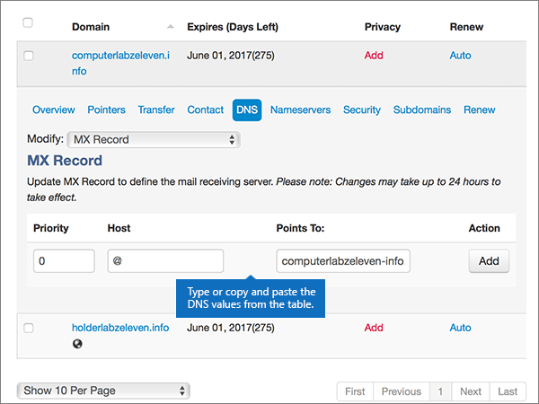
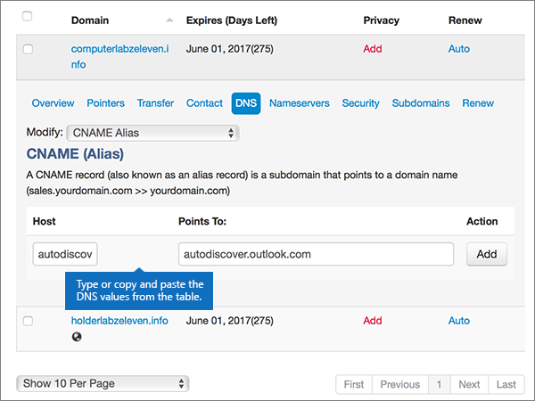

# 在 MyDomain 建立 Microsoft 的 DNS 記錄

  
 若您找不到所需內容，請**[查看網域常見問題集](../setup/domains-faq.md)**。 
  
> [!CAUTION]
> MyDomain 網站不支援 SRV 記錄，這表示有幾項商務用 Skype Online 和 Outlook Web App 功能將無法使用。 無論您使用哪一種 Microsoft 方案，只要在 MyDomain 管理 DNS 記錄，都會受到[重大的服務限制](https://docs.microsoft.com/microsoft-365/admin/setup/domains-faq) (部分機器翻譯)，建議您改換不同的 DNS 主機服務提供者。 
  
儘管有這些服務限制，如果您仍選擇在 MyDomain 管理您的 Microsoft DNS 記錄，請按照本文中的步驟設定電子郵件與商務用 Skype Online 等項目的 DNS 記錄。
    
在 MyDomain 新增這些記錄之後，您的網域就會設定為搭配 Microsoft 服務使用。
  

  
> [!NOTE]
> Typically it takes about 15 minutes for DNS changes to take effect. 然而有時可能需要更久的時間，您所做的變更才能在整個網際網路的 DNS 系統中生效。 在您新增 DNS 記錄後，如有郵件流程或其他方面的問題，請參閱[尋找並修正新增網域或 DNS 記錄之後所發生的問題](../get-help-with-domains/find-and-fix-issues.md)。 
  
## 新增 TXT 記錄以供驗證

在您將自己的網域用於 Microsoft 之前，我們必須先確認您擁有該網域。如果您能在自己的網域註冊機構登入自己的帳戶並能建立 DNS 記錄，Microsoft 就能確信您擁有該網域。
  
> [!NOTE]
> 這筆記錄只會用於驗證您擁有自己的網域，不會影響其他項目。您可以選擇稍後再刪除記錄。 
  
1. 首先，請用[此連結](https://www.mydomain.com/controlpanel)移至您在 MyDomain 的網域頁面。系統會提示您先登入。
    
2. 在 **[我的最愛]** 區段中，選取 **[網域中央]**。
    
3. 在 **[網域]** 下方，選取要編輯的網域名稱。
    
4. 在 **[總覽]** 區段，選取 **[DNS]**。
    
5. 從 **[修改]** 下拉式清單中，選擇 **[TXT/SPF 記錄]**。
    
6. 在 **[內容]** 底下，於新記錄的方塊中，輸入或複製並貼上下表中的值。
    
    ||
    |:-----|
    |**內容**   |
    |MS=ms *XXXXXXXX*    **附註：** 這是範例。 在這裡請使用您自己來自表格的 **[目的地或指向位址]** 值。 [如何找到呢？](../get-help-with-domains/information-for-dns-records.md)          |
   
7. 選取 **[新增]**。
    
8. 繼續進行之前，請先稍候幾分鐘，好讓您剛剛建立的記錄能在網際網路上更新。
    
現在您已在網域註冊機構網站新增記錄，請返回 Microsoft 並要求該記錄。
  
在 Microsoft 找到正確的 TXT 記錄後，您的網域就完成驗證了。
  
1. 在 Microsoft 系統管理中心中，移至 **[設定]** \> <a href="https://go.microsoft.com/fwlink/p/?linkid=834818" target="_blank">[網域]</a> 頁面。
    
2. 在 **[網域]** 頁面上，選取您要驗證的網域。 
    
3. 在 **[設定]** 頁面上，選取 **[開始設定]**。
    
4. 在 **[驗證網域]** 頁面上，選取 **[驗證]**。
    
> [!NOTE]
> Typically it takes about 15 minutes for DNS changes to take effect. 然而有時可能需要更久的時間，您所做的變更才能在整個網際網路的 DNS 系統中生效。 在您新增 DNS 記錄後，如有郵件流程或其他方面的問題，請參閱[尋找並修正新增網域或 DNS 記錄之後所發生的問題](../get-help-with-domains/find-and-fix-issues.md)。 
  
## 新增 MX 記錄，以將寄往您網域的電子郵件轉至 Microsoft

1. 首先，請用[此連結](https://www.mydomain.com/controlpanel)移至您在 MyDomain 的網域頁面。系統會提示您先登入。
    
2. 在 **[我的最愛]** 區段中，選取 **[網域中央]**。
    
3. 在 **[網域]** 下方，選取要編輯的網域名稱。
    
4. 在 **[總覽]** 區段，選取 **[DNS]**。
    
5. 在 **[Modify] (修改)** 下拉式清單中，選擇 **[MX Record] (MX 記錄)**。
    
    
  
6. 在新記錄的方塊中，輸入或複製並貼上下表中的值。
    
    |**優先順序**|**Host**|**Points to: (指向:)**|
    |:-----|:-----|:-----|
    |0    如需關於優先順序的詳細資訊，請參閱[什麼是 MX 優先順序？](https://docs.microsoft.com/microsoft-365/admin/setup/domains-faq)   |@    | *\<domain-key\>*  .mail.protection.outlook.com    **注意：** 從您的 Microsoft 帳戶取得您的 \<*domain-key*\>。 > [如何找到這項資訊？](../get-help-with-domains/information-for-dns-records.md)          |
   
    
  
7. 選取 **[新增]**。
    
    
  
8. 如果有任何其他現有的 MX 記錄，請針對每一筆記錄，選取 **[Actions] (動作)** 欄中的 **[Remove] (移除)**，將它刪除。 
    
    
  
9. 選取 **[確定]**。
    
    
  
## 新增 Microsoft 所需的 CNAME 記錄

1. 首先，請用[此連結](https://www.mydomain.com/controlpanel)移至您在 MyDomain 的網域頁面。系統會提示您先登入。
    
2. 在 **[我的最愛]** 區段中，選取 **[網域中央]**。
    
3. 在 **[網域]** 下方，選取要編輯的網域名稱。
    
4. 在 **[總覽]** 區段，選取 **[DNS]**。
    
5. 在 **[Modify] (修改)** 下拉式清單中，選取 **[CNAME Alias] (CNAME 別名)**。
    
    
  
6. 新增第一筆 CNAME 記錄。
    
    在每一筆新記錄的方塊中，輸入或複製並貼上下表第一列中的值。
    
    |**Host**|**Points to: (指向:)**|
    |:-----|:-----|
    |autodiscover    |autodiscover.outlook.com    |
    |sip    |sipdir.online.lync.com    |
    |lyncdiscover    |webdir.online.lync.com    |
    |enterpriseregistration    |enterpriseregistration.windows.net    |
    |enterpriseenrollment    |enterpriseenrollment-s.manage.microsoft.com    |
   
    
  
7. 選取 **[新增]** 以新增第一筆記錄。 
    
    
  
8. 新增第二筆 CNAME 記錄。
    
    使用上表中第二列的值，然後選取 **[新增]** 以新增第二筆記錄。 
    
    以此類推，使用表格中第三、四、五、六列的值新增其他記錄。
    
## 新增 SPF 的 TXT 記錄以協助防範垃圾郵件

> [!IMPORTANT]
> 網域的 SPF 不得擁有一個以上的 TXT 記錄。 如果您的網域具有多筆 SPF 記錄，您將收到電子郵件錯誤，以及傳送及垃圾郵件分類問題。 如果網域已經有 SPF 記錄，請勿為 Microsoft 建立一個新的記錄。 而是，請將必要的 Microsoft 值新增到目前的記錄，以便擁有包含這兩組值的單一 SPF 記錄。 需要範例？ 請參閱這些 [Microsoft 的外部網域名稱系統記錄](https://docs.microsoft.com/microsoft-365/enterprise/external-domain-name-system-records#bkmk_spfrecords)。 若要驗證您的 SPF 記錄，您可以使用其中一種 [SPF 驗證工具](../setup/domains-faq.md)。 
  
1. 首先，請用[此連結](https://www.mydomain.com/controlpanel)移至您在 MyDomain 的網域頁面。系統會提示您先登入。
    
2. 在 **[我的最愛]** 區段中，選取 **[網域中央]**。
    
3. 在 **[網域]** 下方，選取要編輯的網域名稱。
    
4. 在 **[總覽]** 區段，選取 **[DNS]**。
    
5. 從 **[修改]** 下拉式清單中，選擇 **[TXT/SPF 記錄]**。
    
    
  
6. 在 **[內容]** 底下，於新記錄的方塊中，輸入或複製並貼上下表中的值。
    
    |**內容**|
    |:-----|
    |v=spf1 include:spf.protection.outlook.com -all    **注意：** 建議您複製並貼上這個項目，好讓所有的間距保持正確。           |
   
    
  
7. 選取 **[新增]**。
    
    
  
## 新增兩筆 Microsoft 所需的 SRV 記錄

> [!CAUTION]
> MyDomain 網站不支援 SRV 記錄，這表示有幾項商務用 Skype Online 和 Outlook Web App 功能將無法使用。 無論您使用哪一種 Microsoft 方案，只要在 MyDomain 管理 DNS 記錄，都會受到[重大的服務限制](https://docs.microsoft.com/microsoft-365/admin/setup/domains-faq) (部分機器翻譯)，建議您改換不同的 DNS 主機服務提供者。 
  
> [!NOTE]
> Typically it takes about 15 minutes for DNS changes to take effect. 然而有時可能需要更久的時間，您所做的變更才能在整個網際網路的 DNS 系統中生效。 在您新增 DNS 記錄後，如有郵件流程或其他方面的問題，請參閱[尋找並修正新增網域或 DNS 記錄之後所發生的問題](../get-help-with-domains/find-and-fix-issues.md)。 
  
