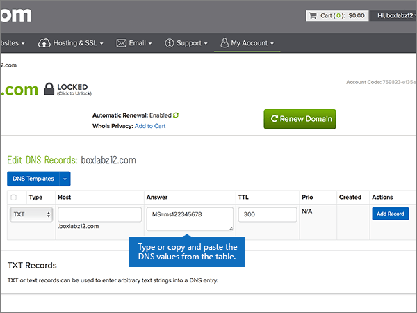

# 在 name.com 建立 Microsoft 的 DNS 記錄Create DNS records at name.com for Microsoft

 若您找不到所需功能，請**[檢查網域常見問題集](../setup/domains-faq.md)**。**[Check the Domains FAQ](../setup/domains-faq.md)** if you don't find what you're looking for. 
  
如果 name.com 是您的 DNS 主機服務提供者，請按照本文所述的步驟驗證網域，並為電子郵件與商務用 Skype Online 等項目設定 DNS 記錄。If name.com is your DNS hosting provider, follow the steps in this article to verify your domain and set up DNS records for email, Skype for Business Online, and so on.
  
在 name.com 新增這些記錄之後，您的網域就會設定為與 Microsoft 服務搭配使用。After you add these records at name.com, your domain will be set up to work with Microsoft services.
  
若要了解使用 Microsoft 網站的虛擬主機和 DNS，請參閱[搭配 Microsoft 使用公用網站](https://support.office.com/article/choose-a-public-website-3325d50e-d131-403c-a278-7f3296fe33a9)。To learn about webhosting and DNS for websites with Microsoft, see [Use a public website with Microsoft](https://support.office.com/article/choose-a-public-website-3325d50e-d131-403c-a278-7f3296fe33a9).
  
> [!NOTE]
> DNS 變更生效通常約需 15 分鐘的時間。而如果您所做的變更要在整個網際網路 DNS 系統中生效，有時可能需要更久的時間。在您新增 DNS 記錄後，如有郵件流程或其他方面的問題，請參閱[變更網域名稱或 DNS 記錄之後所發生問題的疑難排解](../get-help-with-domains/find-and-fix-issues.md)。Typically it takes about 15 minutes for DNS changes to take effect. However, it can occasionally take longer for a change you've made to update across the Internet's DNS system. If you're having trouble with mail flow or other issues after adding DNS records, see [Troubleshoot issues after changing your domain name or DNS records](../get-help-with-domains/find-and-fix-issues.md). 
  
## 新增 TXT 記錄以供驗證Add a TXT record for verification

在您將自己的網域用於 Microsoft 之前，我們必須先確認您擁有該網域。如果您能在自己的網域註冊機構登入自己的帳戶並能建立 DNS 記錄，Microsoft 就能確信您擁有該網域。Before you use your domain with Microsoft, we have to make sure that you own it. Your ability to log in to your account at your domain registrar and create the DNS record proves to Microsoft that you own the domain.
  
> [!NOTE]
> 這筆記錄只會用於驗證您擁有自己的網域，不會影響其他項目。您可以選擇稍後再刪除記錄。This record is used only to verify that you own your domain; it doesn't affect anything else. You can delete it later, if you like. 
  
1. 首先請用[這個連結](https://www.name.com/account/domain)移至 name.com 上您的網域頁面。系統會提示您先登入。To get started, go to your domains page at name.com by using [this link](https://www.name.com/account/domain). You'll be prompted to log in first.
    
    
  
2. 在 [**我的網域**] 底下，選取您要修改的網功能變數名稱稱。Under **My Domains**, select the name of the domain that you want to modify.
    
    
  
3. 在 [**詳細資料**] 欄中，選取 [ **DNS 記錄**]。In the **Details** column, select **DNS Records**. 
    
    
  
4. 在每一筆新記錄的方塊中，輸入或複製並貼上下表中的值。In the boxes for the new record, type or copy and paste the values from the following table.
    
    (Choose the **Type** value from the drop-down list.)(Choose the **Type** value from the drop-down list.) 
    
    |||||
    |:-----|:-----|:-----|:-----|
    |**類型****Type**   |**主機****Host**   |**答案****Answer**   |**TTL****TTL**   |
    |TXTTXT    |(Leave this field empty.)(Leave this field empty.)    |MS=ms *XXXXXXXX*MS=ms *XXXXXXXX*    **附註：** 這是範例。**Note:** This is an example. 在這裡請使用您自己來自表格的 [目的地或指向位址]\*\*\*\* 值。Use your specific **Destination or Points to Address** value here, from the table.           [如何找到呢？How do I find this?](../get-help-with-domains/information-for-dns-records.md)          |Use the default value (300).Use the default value (300).    |
   
    
  
5. 選取 [**新增記錄**]。Select **Add Record**.
    
    
  
6. 繼續進行之前，請先稍候幾分鐘，好讓您剛剛建立的記錄能在網際網路上更新。Wait a few minutes before you continue, so that the record you just created can update across the Internet.
    
現在您已在網域註冊機構網站新增記錄，請返回 Microsoft 並要求該記錄。Now that you've added the record at your domain registrar's site, you'll go back to Microsoft and request the record.
  
在 Microsoft 找到正確的 TXT 記錄後，您的網域就完成驗證了。When Microsoft finds the correct TXT record, your domain is verified.
  
1. 在系統管理中心中，移至 **[設定]** \> <a href="https://go.microsoft.com/fwlink/p/?linkid=834818" target="_blank">[網域]</a> 頁面。In the admin center, go to the **Settings** \> <a href="https://go.microsoft.com/fwlink/p/?linkid=834818" target="_blank">Domains</a> page.
    
2. 在 **[網域]** 頁面上，選取您要驗證的網域。On the **Domains** page, select the domain that you are verifying. 
    
    
  
3. 在 **[設定]** 頁面上，選取 **[開始設定]**。On the **Setup** page, select **Start setup**.
    
    
  
4. 在 **[驗證網域]** 頁面上，選取 **[驗證]**。On the **Verify domain** page, select **Verify**.
    
    
  
> [!NOTE]
> DNS 變更生效通常約需 15 分鐘的時間。而如果您所做的變更要在整個網際網路 DNS 系統中生效，有時可能需要更久的時間。在您新增 DNS 記錄後，如有郵件流程或其他方面的問題，請參閱[變更網域名稱或 DNS 記錄之後所發生問題的疑難排解](../get-help-with-domains/find-and-fix-issues.md)。Typically it takes about 15 minutes for DNS changes to take effect. However, it can occasionally take longer for a change you've made to update across the Internet's DNS system. If you're having trouble with mail flow or other issues after adding DNS records, see [Troubleshoot issues after changing your domain name or DNS records](../get-help-with-domains/find-and-fix-issues.md). 
  
## 新增 MX 記錄，以將寄往您網域的電子郵件轉至 MicrosoftAdd an MX record so email for your domain will come to Microsoft

1. 首先請用[這個連結](https://www.name.com/account/domain)移至 name.com 上您的網域頁面。系統會提示您先登入。To get started, go to your domains page at name.com by using [this link](https://www.name.com/account/domain). You'll be prompted to log in first.
    
    
  
2. 在 [**我的網域**] 底下，選取您要修改的網功能變數名稱稱。Under **My Domains**, select the name of the domain that you want to modify.
    
    
  
3. 在 [**詳細資料**] 欄中，選取 [ **DNS 記錄**]。In the **Details** column, select **DNS Records**. 
    
    
  
4. 在每一筆新記錄的方塊中，輸入或複製並貼上下表中的值。In the boxes for the new record, type or copy and paste the values from the following table.
    
    (Choose the **Type** value from the drop-down list.)(Choose the **Type** value from the drop-down list.) 
    
    |**類型****Type**|**主機****Host**|**答案****Answer**|**TTL****TTL**|**Prio (優先順序)****Prio**|
    |:-----|:-----|:-----|:-----|:-----|
    |MXMX    |(將此欄位保留空白。)(Leave this field empty.)    | *\<網域金鑰\>*  .mail.protection.outlook.com*\<domain-key\>*  .mail.protection.outlook.com    **附注：** 從您的 Microsoft 帳戶取得您\* \<的網域金鑰\> \* 。**Note:** Get your  *\<domain-key\>*  from your Microsoft account.           [How do I find this?How do I find this?](../get-help-with-domains/information-for-dns-records.md)          |Use the default value (300).Use the default value (300).    |00    如需關於優先順序的詳細資訊，請參閱[什麼是 MX 優先順序？](https://support.office.com/article/2784cc4d-95be-443d-b5f7-bb5dd867ba83.aspx)For more information about priority, see [What is MX priority?](https://support.office.com/article/2784cc4d-95be-443d-b5f7-bb5dd867ba83.aspx)   |
   
   
  
5. 選取 [**新增記錄**]。Select **Add Record**.
    
    
  
6. 如果有任何其他 MX 記錄，請透過下列雙步驟程序刪除每個記錄︰If there are any other MX records, delete each of them by using the following two-step procedure:
    
    針對其他每個 MX 記錄，請選取 [**動作**] 欄中的 [**刪除**]。For each other MX record, select **Delete** in the **Actions** column. 
    
    
  
    若要確認每個刪除，請再次選取 [**動作**] 欄中的 [**刪除**]。To confirm each deletion, select **Delete** in the **Actions** column again. 
    
    
  
    重複此進行雙步驟程序，直到您刪除其他 MX 記錄為止。Repeat this two-step procedure until you have deleted each of the other MX records.
    
## 新增 Microsoft 所需的 CNAME 記錄Add the CNAME records that are required for Microsoft

1. 首先請用[這個連結](https://www.name.com/account/domain)移至 name.com 上您的網域頁面。系統會提示您先登入。To get started, go to your domains page at name.com by using [this link](https://www.name.com/account/domain). You'll be prompted to log in first.
    
    
  
2. 在 [**我的網域**] 底下，選取您要修改的網功能變數名稱稱。Under **My Domains**, select the name of the domain that you want to modify.
    
    
  
3. 在 [**詳細資料**] 欄中，選取 [ **DNS 記錄**]。In the **Details** column, select **DNS Records**. 
    
    
  
4. 新增第一筆 CNAME 記錄。Add the first CNAME record.
    
    在每一筆新記錄的方塊中，輸入或複製並貼上下表第一列中的值。In the boxes for the new record, type or copy and paste the values from the first row of the following table.
    
    (Choose the **Type** value from the drop-down list.)(Choose the **Type** value from the drop-down list.) 
    
    |**類型****Type**|**主機****Host**|**答案****Answer**|**TTL****TTL**|
    |:-----|:-----|:-----|:-----|
    |CNAMECNAME    |autodiscoverautodiscover    |autodiscover.outlook.comautodiscover.outlook.com    |使用預設值 (300)。Use the default value (300).    |
    |CNAMECNAME    |sipsip    |sipdir.online.lync.comsipdir.online.lync.com    |使用預設值 (300)。Use the default value (300).    |
    |CNAMECNAME    |lyncdiscoverlyncdiscover    |webdir.online.lync.comwebdir.online.lync.com    |使用預設值 (300)。Use the default value (300).    |
    |CNAMECNAME    |enterpriseregistrationenterpriseregistration    |enterpriseregistration.windows.netenterpriseregistration.windows.net    |使用預設值 (300)。Use the default value (300).    |
    |CNAMECNAME    |enterpriseenrollmententerpriseenrollment    |enterpriseenrollment-s.manage.microsoft.comenterpriseenrollment-s.manage.microsoft.com    |使用預設值 (300)。Use the default value (300).    |
   
   
  
5. 選取 [ **Add record** ] （新增）以新增第一筆記錄。Select **Add Record** to add the first record. 
    
    
  
6. 新增第二筆 CNAME 記錄。Add the second CNAME record.
    
    使用上表中第二列的值，然後選取 [**新增記錄**] 以新增第二筆記錄。Use the values from the second row of the table above, and then select **Add Record** to add the second record. 
    
    以此類推，使用表格中第三、四、五、六列的值新增其他記錄。Add the remaining records in the same way, using the values from the third, fourth, fifth, and sixth rows of the table.
    
## 新增 SPF 的 TXT 記錄以協助防範垃圾郵件Add a TXT record for SPF to help prevent email spam

> [!IMPORTANT]
> 網域的 SPF 不得擁有一個以上的 TXT 記錄。You cannot have more than one TXT record for SPF for a domain. 如果您的網域具有多筆 SPF 記錄，您將收到電子郵件錯誤，以及傳送及垃圾郵件分類問題。If your domain has more than one SPF record, you'll get email errors, as well as delivery and spam classification issues. 如果網域已經有 SPF 記錄，請勿為 Microsoft 建立一個新的記錄。If you already have an SPF record for your domain, don't create a new one for Microsoft. 請改為將必要的 Microsoft 值新增至目前的記錄，讓您擁有包含這兩組值的*單一*SPF 記錄。Instead, add the required Microsoft values to the current record so that you have a  *single*  SPF record that includes both sets of values. 
  
1. 首先請用[這個連結](https://www.name.com/account/domain)移至 name.com 上您的網域頁面。系統會提示您先登入。To get started, go to your domains page at name.com by using [this link](https://www.name.com/account/domain). You'll be prompted to log in first.
    
    
  
2. 在 [**我的網域**] 底下，選取您要修改的網功能變數名稱稱。Under **My Domains**, select the name of the domain that you want to modify.

    
  
3. 在 [**詳細資料**] 欄中，選取 [ **DNS 記錄**]。In the **Details** column, select **DNS Records**. 
    
    
  
4. 在每一筆新記錄的方塊中，輸入或複製並貼上下表中的值。In the boxes for the new record, type or copy and paste the values from the following table.
    
    (Choose the **Type** value from the drop-down list.)(Choose the **Type** value from the drop-down list.) 
    
    |**類型****Type**|**主機****Host**|**答案****Answer**|**TTL****TTL**|
    |:-----|:-----|:-----|:-----|
    |TXTTXT    |(Leave this field empty.)(Leave this field empty.)    |v=spf1 include:spf.protection.outlook.com -allv=spf1 include:spf.protection.outlook.com -all    **注意：** 建議您複製並貼上這個項目，好讓所有的間距保持正確。**Note:** We recommend copying and pasting this entry, so that all of the spacing stays correct.           |Use the default value (300).Use the default value (300).    |
   
   
  
5. 選取 [**新增記錄**]。Select **Add Record**.
    
    
  
## 新增兩筆 Microsoft 所需的 SRV 記錄Add the two SRV records that are required for Microsoft

1. 首先請用[這個連結](https://www.name.com/account/domain)移至 name.com 上您的網域頁面。系統會提示您先登入。To get started, go to your domains page at name.com by using [this link](https://www.name.com/account/domain). You'll be prompted to log in first.
    
    
  
2. 在 [**我的網域**] 底下，選取您要修改的網功能變數名稱稱。Under **My Domains**, select the name of the domain that you want to modify.
    
    
  
3. 在 [**詳細資料**] 欄中，選取 [ **DNS 記錄 +**]。In the **Details** column, select **DNS Records+**. 
    
    
  
4. 新增第一筆 SRV 記錄：Add the first SRV record:
    
    在每一筆新記錄的方塊中，輸入或複製並貼上下表第一列中的值。In the boxes for the new record, type or copy and paste the values from the first row of the following table.
    
    (Choose the **Type** value from the drop-down list.)(Choose the **Type** value from the drop-down list.) 
    
    |**類型****Type**|**Service** (服務)**Service**|**Weight** (權數)**Weight**|**TTL****TTL**|**Prio (優先順序)****Prio**|**Protocol** (通訊協定)**Protocol**|**Port** (連接埠)**Port**|**Target** (目標)**Target**|
    |:-----|:-----|:-----|:-----|:-----|:-----|:-----|:-----|
    |SRVSRV|sipsip|1 1|使用預設值 (300)。Use the default value (300).|100100|tlstls|443443|sipdir.online.lync.comsipdir.online.lync.com   **注意：** 建議您複製並貼上這個項目，好讓所有的間距保持正確。**Note:** We recommend copying and pasting this entry, so that all of the spacing stays correct.           |
    |SRVSRV|sipfederationtlssipfederationtls|1 1|使用預設值 (300)。Use the default value (300).|100100|tcptcp|50615061|sipfed.online.lync.comsipfed.online.lync.com  **注意：** 建議您複製並貼上這個項目，好讓所有的間距保持正確。**Note:** We recommend copying and pasting this entry, so that all of the spacing stays correct.           |
   
   
  
5. 選取 [**新增記錄**]。Select **Add Record**.

    
  
6. 新增第二筆 SRV 記錄：Add the second SRV record:

使用上表中的下一列的值，然後選取 [**新增記錄**] 以新增第二筆記錄。Use the values from the next row of the table above, and then select **Add Record** to add the second record.

>[!NOTE]
>DNS 變更生效通常約需 15 分鐘的時間。而如果您所做的變更要在整個網際網路 DNS 系統中生效，有時可能需要更久的時間。在您新增 DNS 記錄後，如有郵件流程或其他方面的問題，請參閱[變更網域名稱或 DNS 記錄之後所發生問題的疑難排解](../get-help-with-domains/find-and-fix-issues.md)。Typically it takes about 15 minutes for DNS changes to take effect. However, it can occasionally take longer for a change you've made to update across the Internet's DNS system. If you're having trouble with mail flow or other issues after adding DNS records, see [Troubleshoot issues after changing your domain name or DNS records](../get-help-with-domains/find-and-fix-issues.md).
