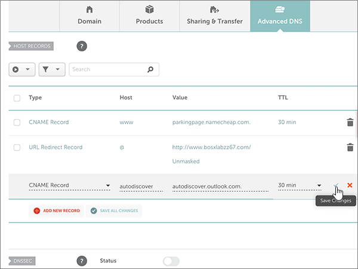

# 在 Namecheap 建立 Microsoft 的 DNS 記錄Create DNS records at Namecheap for Microsoft

 若您找不到所需內容，請 **[查看網域常見問題集](../setup/domains-faq.yml)**。**[Check the Domains FAQ](../setup/domains-faq.yml)** if you don't find what you're looking for. 
  
如果 Namecheap 是您的 DNS 主機服務提供者，請遵循本文中的步驟來驗證您的網域，並設定電子郵件、商務用 Skype Online 等的 DNS 記錄。If Namecheap is your DNS hosting provider, follow the steps in this article to verify your domain and set up DNS records for email, Skype for Business Online, and so on.
  
在 Namecheap 新增這些記錄之後，您的網域就會設定為與 Microsoft 服務搭配使用。After you add these records at Namecheap, your domain will be set up to work with Microsoft services.
  
> [!NOTE]
> DNS 變更生效通常約需 15 分鐘的時間。而如果您所做的變更要在整個網際網路 DNS 系統中生效，有時可能需要更久的時間。在您新增 DNS 記錄後，如有郵件流程或其他方面的問題，請參閱[變更網域名稱或 DNS 記錄之後所發生問題的疑難排解](../get-help-with-domains/find-and-fix-issues.md)。Typically it takes about 15 minutes for DNS changes to take effect. However, it can occasionally take longer for a change you've made to update across the Internet's DNS system. If you're having trouble with mail flow or other issues after adding DNS records, see [Troubleshoot issues after changing your domain name or DNS records](../get-help-with-domains/find-and-fix-issues.md). 
  
## 新增 TXT 記錄以供驗證Add a TXT record for verification

在您將自己的網域用於 Microsoft 之前，我們必須先確認您擁有該網域。如果您能在自己的網域註冊機構登入自己的帳戶並能建立 DNS 記錄，Microsoft 就能確信您擁有該網域。Before you use your domain with Microsoft, we have to make sure that you own it. Your ability to log in to your account at your domain registrar and create the DNS record proves to Microsoft that you own the domain.
  
> [!NOTE]
> 這筆記錄只會用於驗證您擁有自己的網域，不會影響其他項目。您可以選擇稍後再刪除記錄。This record is used only to verify that you own your domain; it doesn't affect anything else. You can delete it later, if you like. 
  
請依照下列步驟操作。Follow the steps below.
  
1. 若要開始使用，請移至您的網域頁面 Namecheap，方法是使用 [此連結](https://www.namecheap.com/myaccount/login.aspx?ReturnUrl=%2f)。To get started, go to your domains page at Namecheap by using [this link](https://www.namecheap.com/myaccount/login.aspx?ReturnUrl=%2f). 系統會提示您登入並繼續。You'll be prompted to Sign in and Continue.
    
    
  
2. 在 [ **登陸** ] 頁面的 [ **帳戶**] 下，從下拉式清單中選擇 [ **網域清單** ]。On the **Landing** page, under **Account**, choose **Domain List** from the drop-down list. 
    
    
  
3. 在 [ **網域清單** ] 頁面上，尋找您要編輯的網功能變數名稱稱，然後選取 [ **管理**]。On the **Domain List** page, find the name of the domain that you want to edit, and then select **Manage**.
    
    
  
4. 選取 [ **ADVANCED DNS**]。Select **Advanced DNS**.
    
    
  
5. 在 [ **主機記錄** ] 區段中，選取 [ **新增記錄**]。In the **HOST RECORDS** section, select **ADD NEW RECORD**.
    
    
  
6. 在 [ **類型** ] 下拉式清單中，選取 [ **TXT 記錄**]。In the **Type** drop-down, select **TXT Record**.
    
    > [!NOTE]
    > 當您選取 [**新增記錄**] 時，會自動顯示 [**類型**] 下拉式清單。The **Type** drop-down automatically appears when you select **ADD NEW RECORD**. 
  
    
  
7. 在新記錄的方塊中，輸入或複製並貼上下表中的值。In the boxes for the new record, type or copy and paste the values from the following table.
    
     (從下拉式清單中選取 [ **TTL** ] 值。 ) (Choose the **TTL** value from the drop-down list.) 
    
    |**類型****Type**|**主機****Host**|**Value** (值)**Value**|**TTL****TTL**|
    |:-----|:-----|:-----|:-----|
    |TXTTXT    |@    |MS=ms *XXXXXXXX*MS=ms *XXXXXXXX*   **附註：** 這是範例。**Note:** This is an example. 在這裡請使用您自己來自表格的 **[目的地或指向位址]** 值。Use your specific **Destination or Points to Address** value here, from the table.  [如何找到呢？How do I find this?](../get-help-with-domains/information-for-dns-records.md)          |30分鐘30 min    |
       
    
  
8. 選取 [ **儲存變更** ] (核取記號) 控制項。Select the **Save Changes** (check mark) control. 
    
    
  
9. 繼續進行之前，請先稍候幾分鐘，好讓您剛剛建立的記錄能在網際網路上更新。Wait a few minutes before you continue, so that the record you just created can update across the Internet.
    
現在您已在網域註冊機構網站新增記錄，請返回 Microsoft 並要求該記錄。Now that you've added the record at your domain registrar's site, you'll go back to Microsoft and request the record.
  
在 Microsoft 找到正確的 TXT 記錄後，您的網域就完成驗證了。When Microsoft finds the correct TXT record, your domain is verified.
  
1. 在系統管理中心中，移至 **[設定]** \> <a href="https://go.microsoft.com/fwlink/p/?linkid=834818" target="_blank">[網域]</a> 頁面。In the admin center, go to the **Settings** \> <a href="https://go.microsoft.com/fwlink/p/?linkid=834818" target="_blank">Domains</a> page.
    
2. 在 **[網域]** 頁面上，選取您要驗證的網域。On the **Domains** page, select the domain that you are verifying. 
    
    
  
3. 在 **[設定]** 頁面上，選取 **[開始設定]**。On the **Setup** page, select **Start setup**.
    
    
  
4. 在 **[驗證網域]** 頁面上，選取 **[驗證]**。On the **Verify domain** page, select **Verify**.
    
    
  
> [!NOTE]
> DNS 變更生效通常約需 15 分鐘的時間。而如果您所做的變更要在整個網際網路 DNS 系統中生效，有時可能需要更久的時間。在您新增 DNS 記錄後，如有郵件流程或其他方面的問題，請參閱[變更網域名稱或 DNS 記錄之後所發生問題的疑難排解](../get-help-with-domains/find-and-fix-issues.md)。Typically it takes about 15 minutes for DNS changes to take effect. However, it can occasionally take longer for a change you've made to update across the Internet's DNS system. If you're having trouble with mail flow or other issues after adding DNS records, see [Troubleshoot issues after changing your domain name or DNS records](../get-help-with-domains/find-and-fix-issues.md). 

  
## 新增 MX 記錄，以將寄往您網域的電子郵件轉至 MicrosoftAdd an MX record so email for your domain will come to Microsoft

請依照下列步驟進行。Follow the steps below.
  
1. 若要開始使用，請移至您的網域頁面 Namecheap，方法是使用 [此連結](https://www.namecheap.com/myaccount/login.aspx?ReturnUrl=%2f)。To get started, go to your domains page at Namecheap by using [this link](https://www.namecheap.com/myaccount/login.aspx?ReturnUrl=%2f). 系統會提示您登入並繼續。You'll be prompted to Sign in and Continue.
    
    
  
2. 在 [ **登陸** ] 頁面的 [ **帳戶**] 下，從下拉式清單中選擇 [ **網域清單** ]。On the **Landing** page, under **Account**, choose **Domain List** from the drop-down list. 
    
    
  
3. 在 [ **網域清單** ] 頁面上，尋找您要編輯的網功能變數名稱稱，然後選取 [ **管理**]。On the **Domain List** page, find the name of the domain that you want to edit, and then select **Manage**.
    
    
  
4. 選取 [ **ADVANCED DNS**]。Select **Advanced DNS**.
    
    
  
5. 在 [**郵件設定**] 區段中，從 [**電子郵件轉發**] 下拉式清單中選取 [**自訂 MX** ]。In the **MAIL SETTINGS** section, select **Custom MX** from the **Email Forwarding** drop-down list. 
    
    (您可能需要向下捲動。)(You may have to scroll down.)
    
    
  
6. 選取 [ **新增記錄**]。Select **Add New Record**.
    
    
  
7. 在新記錄的方塊中，輸入或複製並貼上下清單格中的值。In the boxes for the new record, type or copy and paste the values, from the following table.
    
     ([ **優先順序** ] 方塊是 [ **值** ] 方塊右側的未命名方塊。(The **Priority** box is the unnamed box to the right of the **Value** box. 從下拉式清單中選擇 [ **TTL** ] 值。 ) Choose the **TTL** value from the drop-down list.) 
    
    |**類型****Type**|**主機****Host**|**Value** (值)**Value**|**Priority** (優先順序)**Priority**|**TTL****TTL**|
    |:-----|:-----|:-----|:-----|:-----|
    |MX 記錄MX Record    |@    |\<*domain-key*\>mail.protection.outlook.com。\<*domain-key*\>.mail.protection.outlook.com.    **此值必須以英文句點 (.) 結尾。****This value MUST end with a period (.)**   \**附注：\*\*\*\<domain-key\>* 從您的 Microsoft 帳戶取得。**Note:** Get your  *\<domain-key\>*  from your Microsoft account.  [How do I find this?How do I find this?](../get-help-with-domains/information-for-dns-records.md)          |00    如需關於優先順序的詳細資訊，請參閱[什麼是 MX 優先順序？](../setup/domains-faq.yml)For more information about priority, see [What is MX priority?](../setup/domains-faq.yml)   |30分鐘30 min    |
       
    
  
8. 選取 [ **儲存變更** ] (核取記號) 控制項。Select the **Save Changes** (check mark) control. 
    
    
  
9. 如果有任何其他 MX 記錄，請使用下列兩個步驟的處理程序來逐一移除：If there are any other MX records, use the following two-step process to remove each of them:
    
    首先，選取 [ **刪除] 圖示** (垃圾桶) 您要移除的記錄。First, select the **Delete icon** (trash can) for the record that you want to remove. 
    
    
  
    其次，選取 **[是]** 以確認刪除。Second, select **Yes** to confirm the deletion. 
    
    
  
    移除所有的 MX 記錄，除了您先前在此程式中新增的 MX 記錄。Remove all MX records except for the one that you added earlier in this procedure.

  
## 新增 Microsoft 所需的六筆 CNAME 記錄Add the six CNAME records that are required for Microsoft

請依照下列步驟進行。Follow the steps below.
  
1. 若要開始使用，請移至您的網域頁面 Namecheap，方法是使用 [此連結](https://www.namecheap.com/myaccount/login.aspx?ReturnUrl=%2f)。To get started, go to your domains page at Namecheap by using [this link](https://www.namecheap.com/myaccount/login.aspx?ReturnUrl=%2f). 系統會提示您登入並繼續。You'll be prompted to Sign in and Continue.
    
    
  
2. 在 [ **登陸** ] 頁面的 [ **帳戶**] 下，從下拉式清單中選擇 [ **網域清單** ]。On the **Landing** page, under **Account**, choose **Domain List** from the drop-down list. 
    
    
  
3. 在 [ **網域清單** ] 頁面上，尋找您要編輯的網功能變數名稱稱，然後選取 [ **管理**]。On the **Domain List** page, find the name of the domain that you want to edit, and then select **Manage**.
    
    
  
4. 選取 [ **ADVANCED DNS**]。Select **Advanced DNS**.
    
    
  
5. 在 [ **主機記錄** ] 區段中，選取 [ **新增記錄**]。In the **HOST RECORDS** section, select **ADD NEW RECORD**.
    
    
  
6. 在 [ **類型** ] 下拉式清單中，選取 [ **CNAME 記錄**]。In the **Type** drop-down, select **CNAME Record**.
    
    > [!NOTE]
    > 當您選取 [**新增記錄**] 時，會自動顯示 [**類型**] 下拉式清單。The **Type** drop-down automatically appears when you select **ADD NEW RECORD**. 
  
    
  
7. 在新記錄的空白方塊中，針對 **記錄類型** 選取 [ **CNAME** ]，然後輸入或複製並貼上下表中第一列的值。In the empty boxes for the new record, select **CNAME** for the **Record Type**, and then type or copy and paste the values from the first row in the following table.
    
    |**類型****Type**|**主機****Host**|**Value** (值)**Value**|**TTL****TTL**|
    |:-----|:-----|:-----|:-----|
    |CNAMECNAME    |autodiscoverautodiscover    |autodiscover.outlook.com.autodiscover.outlook.com.    **此值必須以英文句點 (.) 結尾。****This value MUST end with a period (.)**   |36003600    |
    |CNAMECNAME    |sipsip    |sipdir.online.lync.com.sipdir.online.lync.com.    **此值必須以英文句點 (.) 結尾。****This value MUST end with a period (.)**   |36003600    |
    |CNAMECNAME    |lyncdiscoverlyncdiscover    |webdir.online.lync.com.webdir.online.lync.com.    **此值必須以英文句點 (.) 結尾。****This value MUST end with a period (.)**   |36003600    |
    |CNAMECNAME    |enterpriseregistrationenterpriseregistration    |enterpriseregistration.windows.net.enterpriseregistration.windows.net.    **此值必須以英文句點 (.) 結尾。****This value MUST end with a period (.)**   |36003600    |
    |CNAMECNAME    |enterpriseenrollmententerpriseenrollment    |enterpriseenrollment-s.manage.microsoft.com.enterpriseenrollment-s.manage.microsoft.com.    **此值必須以英文句點 (.) 結尾。****This value MUST end with a period (.)**   |36003600    |
       
    
  
8. 選取 [ **儲存變更** ] (核取記號) 控制項。Select the **Save Changes** (check mark) control. 
    
    
  
9. 使用上述四個步驟和表格中其他五列的值，新增其餘五筆 CNAME 記錄。Using the preceding four steps and the values from the other five rows in the table, add each of the other five CNAME records.

  
## 新增 SPF 的 TXT 記錄以協助防範垃圾郵件Add a TXT record for SPF to help prevent email spam

> [!IMPORTANT]
> 網域的 SPF 不得擁有一個以上的 TXT 記錄。You cannot have more than one TXT record for SPF for a domain. 如果您的網域具有多筆 SPF 記錄，您將收到電子郵件錯誤，以及傳送及垃圾郵件分類問題。If your domain has more than one SPF record, you'll get email errors, as well as delivery and spam classification issues. 如果網域已經有 SPF 記錄，請勿為 Microsoft 建立一個新的記錄。If you already have an SPF record for your domain, don't create a new one for Microsoft. 請改為將必要的 Microsoft 值新增至目前的記錄，讓您擁有包含這兩組值的  *單一*  SPF 記錄。Instead, add the required Microsoft values to the current record so that you have a  *single*  SPF record that includes both sets of values. 

請依照下列步驟操作。Follow the steps below.
  
1. 若要開始使用，請移至您的網域頁面 Namecheap，方法是使用 [此連結](https://www.namecheap.com/myaccount/login.aspx?ReturnUrl=%2f)。To get started, go to your domains page at Namecheap by using [this link](https://www.namecheap.com/myaccount/login.aspx?ReturnUrl=%2f). 系統會提示您登入並繼續。You'll be prompted to Sign in and Continue.
    
2. 在 [ **登陸** ] 頁面的 [ **帳戶**] 下，從下拉式清單中選擇 [ **網域清單** ]。On the **Landing** page, under **Account**, choose **Domain List** from the drop-down list. 
    
    
  
3. 在 [ **網域清單** ] 頁面上，尋找您要編輯的網功能變數名稱稱，然後選取 [ **管理**]。On the **Domain List** page, find the name of the domain that you want to edit and then select **Manage**.
    
    
  
4. 選取 [ **ADVANCED DNS**]。Select **Advanced DNS**.
    
    
  
5. 在 [ **主機記錄** ] 區段中，選取 [ **新增記錄**]。In the **HOST RECORDS** section, select **ADD NEW RECORD**.
    
    
  
6. 在 [ **類型** ] 下拉式清單中，選取 [ **TXT 記錄**]。In the **Type** drop-down, select **TXT Record**.
    
    > [!NOTE]
    > 當您選取 [**新增記錄**] 時，會自動顯示 [**類型**] 下拉式清單。The **Type** drop-down automatically appears when you select **ADD NEW RECORD**. 
  
    
  
7. 在新記錄的方塊中，輸入或複製並貼上下清單格中的值。In the boxes for the new record, type or copy and paste the following values from the following table.
    
     (從下拉式清單中選取 [ **TTL** ] 值。 ) (Choose the **TTL** value from the drop-down list.) 
    
    |**類型****Type**|**主機****Host**|**Value** (值)**Value**|**TTL****TTL**|
    |:-----|:-----|:-----|:-----|
    |TXTTXT    |@    |v=spf1 include:spf.protection.outlook.com -allv=spf1 include:spf.protection.outlook.com -all    **注意：** 建議您複製並貼上這個項目，好讓所有的間距保持正確。**Note:** We recommend copying and pasting this entry, so that all of the spacing stays correct.           |30分鐘30 min    |
       
    
  
8. 選取 [ **儲存變更** ] (核取記號) 控制項。Select the **Save Changes** (check mark) control. 
    
    
  
## 新增兩筆 Microsoft 所需的 SRV 記錄Add the two SRV records that are required for Microsoft

1. 若要開始使用，請移至您的網域頁面 Namecheap，方法是使用 [此連結](https://www.namecheap.com/myaccount/login.aspx?ReturnUrl=%2f)。To get started, go to your domains page at Namecheap by using [this link](https://www.namecheap.com/myaccount/login.aspx?ReturnUrl=%2f). You'll be prompted to sign in.You'll be prompted to sign in.
    
    
  
2. 在 [ **登陸** ] 頁面的 [ **帳戶**] 下，從下拉式清單中選擇 [ **網域清單** ]。On the **Landing** page, under **Account**, choose **Domain List** from the drop-down list. 
    
    
  
3. 在 [ **網域清單** ] 頁面上，尋找您要編輯的網功能變數名稱稱，然後選取 [ **管理**]。On the **Domain List** page, find the name of the domain that you want to edit and then select **Manage**.
    
    
  
4. 選取 [ **ADVANCED DNS**]。Select **Advanced DNS**.
    
    
  
5. 在 [ **主機記錄** ] 區段中，選取 [ **新增記錄**]。In the **HOST RECORDS** section, select **ADD NEW RECORD**.
    
    
  
6. 在 [ **類型** ] 下拉式清單中，選取 [ **SRV 記錄**]。In the **Type** drop-down, select **SRV Record**.
    
    > [!NOTE]
    > 當您選取 [**新增記錄**] 時，會自動顯示 [**類型**] 下拉式清單。The **Type** drop-down automatically appears when you select **ADD NEW RECORD**. 
  
    
  
7. 在新記錄的空白方塊中，輸入或複製並貼上下表中第一列的值。In the empty boxes for the new records, type or copy and paste the values from the first row in the following table.
    
    |**服務****Service**|**Protocol** (通訊協定)**Protocol**|**Priority** (優先順序)**Priority**|**Weight** (權數)**Weight**|**Port** (連接埠)**Port**|**Target****Target**|**TTL****TTL**|
    |:-----|:-----|:-----|:-----|:-----|:-----|:-----|
    |_sip_sip    |_tls_tls    |100100    |11    |443443    |sipdir.online.lync.com.sipdir.online.lync.com.    **此值必須以英文句點 (.) 結尾。****This value MUST end with a period (.)**   |30分鐘30 min    |
    |_sipfederationtls_sipfederationtls    |_tcp_tcp    |100100    |11    |50615061    |sipfed.online.lync.com。sipfed.online.lync.com.    **此值必須以英文句點 (.) 結尾。****This value MUST end with a period (.)**   |30分鐘30 min    |
       
    
  
8. 選取 [ **儲存變更** ] (核取記號) 控制項。Select the **Save Changes** (check mark) control. 
    
    
  
9. 使用上述四個步驟和表格中第二列的值，新增另一筆 SRV 記錄。Using the preceding four steps and the values from the second row in the table, add the other SRV record.
    
> [!NOTE]
> DNS 變更生效通常約需 15 分鐘的時間。而如果您所做的變更要在整個網際網路 DNS 系統中生效，有時可能需要更久的時間。在您新增 DNS 記錄後，如有郵件流程或其他方面的問題，請參閱[變更網域名稱或 DNS 記錄之後所發生問題的疑難排解](../get-help-with-domains/find-and-fix-issues.md)。Typically it takes about 15 minutes for DNS changes to take effect. However, it can occasionally take longer for a change you've made to update across the Internet's DNS system. If you're having trouble with mail flow or other issues after adding DNS records, see [Troubleshoot issues after changing your domain name or DNS records](../get-help-with-domains/find-and-fix-issues.md). 
  

