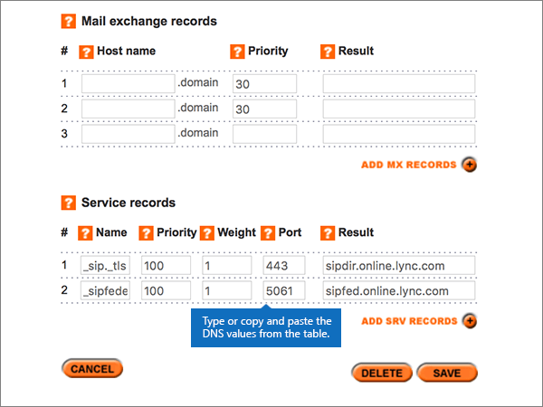

# 在 Names.co.uk 建立 Microsoft 的 DNS 記錄

 若您找不到所需功能，請**[檢查網域常見問題集](../setup/domains-faq.md)**。 
  
如果 Names.co.uk 是您的 DNS 主機服務提供者，請按照本文所述的步驟驗證網域，並設定電子郵件與商務用 Skype Online 等項目的 DNS 記錄。
    
在 Names.co.uk 新增這些記錄之後，您的網域就會設定為與 Microsoft 服務搭配使用。
  
若要深入瞭解 Microsoft 的網站的主控和 DNS，請參閱搭配[Microsoft 使用公用網站](https://support.office.com/article/choose-a-public-website-3325d50e-d131-403c-a278-7f3296fe33a9)。
  
> [!NOTE]
>  DNS 變更生效通常約需 15 分鐘的時間。而如果您所做的變更要在整個網際網路 DNS 系統中生效，有時可能需要更久的時間。在您新增 DNS 記錄後，如有郵件流程或其他方面的問題，請參閱[變更網域名稱或 DNS 記錄之後所發生問題的疑難排解](../get-help-with-domains/find-and-fix-issues.md)。 
  
## 新增 TXT 記錄以供驗證

在將您的網域與 Microsoft 搭配使用之前，我們必須先確認您擁有該網域。 您能夠在您的網域註冊機構登入您的帳戶，並為您擁有網域的 Microsoft 建立 DNS 記錄證明。
  
> [!NOTE]
> 這筆記錄只會用於驗證您擁有自己的網域，不會影響其他項目。您可以選擇稍後再刪除記錄。 
  
1. 首先請用[這個連結](https://account.names.co.uk/dashboard#/)移至 Names.co.uk 上您的網域頁面。系統會提示您先登入。
    
    
  
2. On the **Dashboard** page, find the name of the domain that you are updating, and then choose **DNS Settings** from the drop-down list. 
    
    (You may have to scroll down.)
    
    
  
3. On the **Add/Modify DNS Zone** page, in the **A, CNAME, AAAA, TXT and NS records** section, in the boxes for the new record, type or copy and paste the values from the following table. 
    
    (Choose the **Type** value from the drop-down list.) 
    
    （如果您需要新增一列，請選取 **[新增 A/CNAME 記錄] （+）**。）
    
    (You may have to scroll down.)
        
    |**主機名稱**|**類型**|**結果**|
    |:-----|:-----|:-----|
    |(Leave this field empty.)    |TXT    |MS=ms *XXXXXXXX*    **附註：** 這是範例。 從表格中，使用您的特定**目的地或指向位址**值。           [如何找到呢？](../get-help-with-domains/information-for-dns-records.md)    |
       
    
  
4. 選取 **[儲存]**。
    
    (You may have to scroll down.)
    
    
  
5. 繼續進行之前，請先稍候幾分鐘，好讓您剛剛建立的記錄能在網際網路上更新。
    
現在，您已在網域註冊機構的網站上新增記錄，您會回到 Microsoft 並要求記錄。
  
當 Microsoft 找到正確的 TXT 記錄後，您的網域就會經過驗證。
  
1. 在系統管理中心中，移至 **[設定]** \> <a href="https://go.microsoft.com/fwlink/p/?linkid=834818" target="_blank">[網域]</a> 頁面。
    
2. 在 **[網域]** 頁面上，選取您要驗證的網域。 
    
    
  
3. 在 **[設定]** 頁面上，選取 **[開始設定]**。
    
    
  
4. 在 **[驗證網域]** 頁面上，選取 **[驗證]**。
    
    
  
> [!NOTE]
>  DNS 變更生效通常約需 15 分鐘的時間。而如果您所做的變更要在整個網際網路 DNS 系統中生效，有時可能需要更久的時間。在您新增 DNS 記錄後，如有郵件流程或其他方面的問題，請參閱[變更網域名稱或 DNS 記錄之後所發生問題的疑難排解](../get-help-with-domains/find-and-fix-issues.md)。 
  
## 新增 MX 記錄，使您網域的電子郵件將會傳送給 Microsoft

1. 首先請用[這個連結](https://account.names.co.uk/dashboard#/)移至 Names.co.uk 上您的網域頁面。系統會提示您先登入。
    
    
  
2. On the **Dashboard** page, find the name of the domain that you are updating, and then choose **DNS Settings** from the drop-down list. 
    
    (You may have to scroll down.)
    
    
  
3. 在 [ **ADD/MODIFY DNS 區域**] 頁面的 [**郵件交換記錄**] 區段中，于新記錄的方塊中，輸入或複製並貼上下表中的值。 
    
    (You may have to scroll down.)
    
    |**主機名稱**|**優先順序**|**結果**|
    |:-----|:-----|:-----|
    |(將此欄位保留空白。)    |1     如需關於優先順序的詳細資訊，請參閱[什麼是 MX 優先順序？](https://support.office.com/article/2784cc4d-95be-443d-b5f7-bb5dd867ba83.aspx)   | *\<網域金鑰\>*  .mail.protection.outlook.com    > [!NOTE]> 從您的 Microsoft 帳戶取得您* \<的網域金鑰\> * 。           [如何找到呢？](../get-help-with-domains/information-for-dns-records.md)          |
       
    
  
4. 選取 **[儲存]**。
    
    (You may have to scroll down.)
    
    
  
5. 如果 [**郵件交換記錄**] 區段中列出任何其他 MX 記錄，請選取它，然後按鍵盤上的**delete**鍵，逐一刪除。 
    
    
  
6. 選取 **[儲存]**。
    
    (You may have to scroll down.)
    
    
  
## 新增 Microsoft 所需的六筆 CNAME 記錄

1. 首先請用[這個連結](https://account.names.co.uk/dashboard#/)移至 Names.co.uk 上您的網域頁面。系統會提示您先登入。
    
    
  
2. On the **Dashboard** page, find the name of the domain that you are updating, and then choose **DNS Settings** from the drop-down list. 
    
    (You may have to scroll down.)
    
    
  
3. On the **Add/Modify DNS Zone** page, in the **A, CNAME, AAAA, TXT and NS records** section, in the boxes for the new record, type or copy and paste the values from the following table. 
    
    (Choose the **Type** value from the drop-down list.) 
    
    （如果您需要新增一列，請選取 **[新增 A/CNAME 記錄] （+）**。）
    
    (You may have to scroll down.)
    
    |**Host Name**|**類型**|**結果**|
    |:-----|:-----|:-----|
    |autodiscover    |CNAME    |autodiscover.outlook.com    |
    |sip    |CNAME    |sipdir.online.lync.com    |
    |lyncdiscover    |CNAME    |webdir.online.lync.com    |
    |enterpriseregistration    |CNAME    |enterpriseregistration.windows.net    |
    |enterpriseenrollment    |CNAME    |enterpriseenrollment-s.manage.microsoft.com    |
       
    
  
4. 選取 **[儲存]**。
    
    
  
## 新增 SPF 的 TXT 記錄以協助防範垃圾郵件

> [!IMPORTANT]
> 網域的 SPF 不得擁有一個以上的 TXT 記錄。 如果您的網域具有多筆 SPF 記錄，您將收到電子郵件錯誤，以及傳送及垃圾郵件分類問題。 如果您已有網域的 SPF 記錄，請不要為 Microsoft 建立新的記錄。 請改為將必要的 Microsoft 值新增至目前的記錄，讓您擁有包含這兩組值的*單一*SPF 記錄。
  
1. 首先請用[這個連結](https://account.names.co.uk/dashboard#/)移至 Names.co.uk 上您的網域頁面。系統會提示您先登入。
    
    
  
2. On the **Dashboard** page, find the name of the domain that you are updating, and then choose **DNS Settings** from the drop-down list. 
    
    (You may have to scroll down.)
    
    
  
3. 在 [**帳戶的 DNS 區域**] 頁面上的 [**功能變數名稱**] 欄中，選取您要更新的網功能變數名稱稱。 
    
    
  
4. On the **Add/Modify DNS Zone** page, in the **A, CNAME, AAAA, TXT and NS records** section, in the boxes for the new record, type or copy and paste the values from the following table. 
    
    (Choose the **Type** value from the drop-down list.) 
    
    （如果您需要新增一列，請選取 **[新增 A/CNAME 記錄] （+）**。）
    
    (You may have to scroll down.)
    
    |**主機名稱**|**類型**|**結果**|
    |:-----|:-----|:-----|
    |(Leave this field empty.)    |TXT    |v=spf1 include:spf.protection.outlook.com -all    **注意：** 建議您複製並貼上這個項目，好讓所有的間距保持正確。           |
       
    
  
5. 選取 **[儲存]**。
    
    (您可能需要向下捲動。)
    
    
  
## 新增 Microsoft 所需的兩筆 SRV 記錄

1. 首先請用[這個連結](https://account.names.co.uk/dashboard#/)移至 Names.co.uk 上您的網域頁面。系統會提示您先登入。
    
    
  
2. On the **Dashboard** page, find the name of the domain that you are updating, and then choose **DNS Settings** from the drop-down list. 
    
    (You may have to scroll down.)
    
    
  
3. 在 [ **ADD/MODIFY DNS 區域**] 頁面的 [**服務記錄**] 區段中，于新記錄的方塊中，輸入或複製並貼上下表中的值。 
    
    (You may have to scroll down.)
    
    |**Name** (名稱)|**Priority** (優先順序)|**Weight** (權數)|**Port** (連接埠)|**結果**|
    |:-----|:-----|:-----|:-----|:-----|
    |_sip。 _tls    |100    |1     |443    |sipdir.online.lync.com    |
    |_sipfederationtls。 _tcp    |100    |1     |5061    |sipfed.online.lync.com    |
       
    
  
4. 選取 **[儲存]**。
    
    (您可能需要向下捲動。)
    
    
  
> [!NOTE]
>  DNS 變更生效通常約需 15 分鐘的時間。而如果您所做的變更要在整個網際網路 DNS 系統中生效，有時可能需要更久的時間。在您新增 DNS 記錄後，如有郵件流程或其他方面的問題，請參閱[變更網域名稱或 DNS 記錄之後所發生問題的疑難排解](../get-help-with-domains/find-and-fix-issues.md)。 
  
