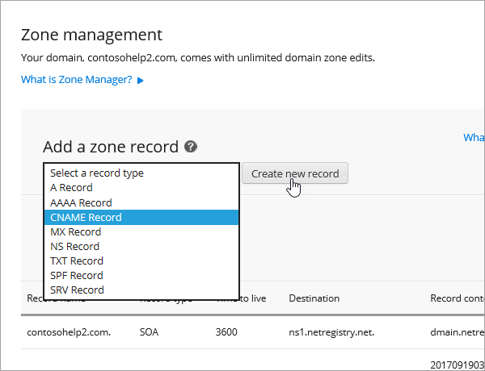
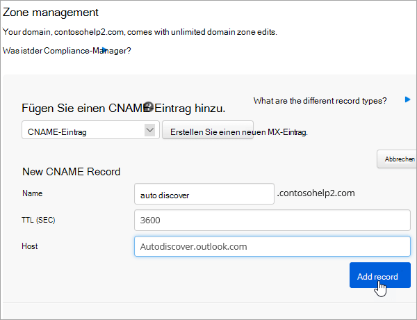
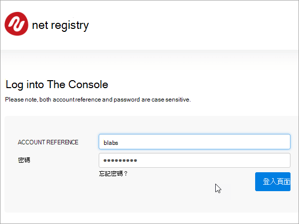
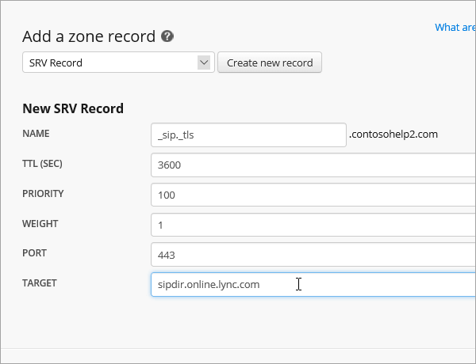
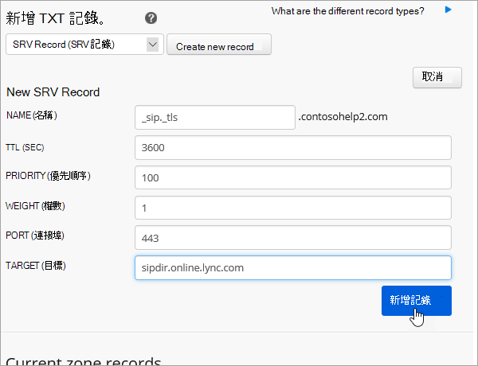

# 在 Netregistry 建立 Microsoft 的 DNS 記錄Create DNS records at Netregistry for Microsoft

[檢查網域的常見問題集](../setup/domains-faq.md) ：供您在找不到所需功能時參考。[Check the Domains FAQ](../setup/domains-faq.md) if you don't find what you're looking for. 
  
如果 Netregistry 是您的 DNS 主機服務提供者，請遵循本文中的步驟來驗證您的網域，並設定電子郵件、商務用 Skype Online 等的 DNS 記錄。If Netregistry is your DNS hosting provider, follow the steps in this article to verify your domain and set up DNS records for email, Skype for Business Online, and so on.
  
以下是要新增的主要記錄。These are the main records to add.
  
- [新增 TXT 記錄以供驗證Add a TXT record for verification](#add-a-txt-record-for-verification)
    
- [新增 MX 記錄，以將寄往您網域的電子郵件轉至 MicrosoftAdd an MX record so email for your domain will come to Microsoft](#add-an-mx-record-so-email-for-your-domain-will-come-to-microsoft)

- [新增 Microsoft 所需的 CNAME 記錄Add the CNAME records that are required for Microsoft](#add-the-cname-records-that-are-required-for-microsoft)
    
- [新增 SPF 的 TXT 記錄以協助防範垃圾郵件Add a TXT record for SPF to help prevent email spam](#add-a-txt-record-for-spf-to-help-prevent-email-spam)
    
- [新增兩筆 Microsoft 所需的 SRV 記錄Add the two SRV records that are required for Microsoft](#add-the-two-srv-records-that-are-required-for-microsoft)
    
在 Netregistry 新增這些記錄之後，您的網域就會設定為與 Microsoft 服務搭配使用。After you add these records at Netregistry, your domain will be set up to work with Microsoft services.
  
  
> [!NOTE]
> DNS 變更生效通常約需 15 分鐘的時間。而如果您所做的變更要在整個網際網路 DNS 系統中生效，有時可能需要更久的時間。在您新增 DNS 記錄後，如有郵件流程或其他方面的問題，請參閱[變更網域名稱或 DNS 記錄之後所發生問題的疑難排解](../get-help-with-domains/find-and-fix-issues.md)。Typically it takes about 15 minutes for DNS changes to take effect. However, it can occasionally take longer for a change you've made to update across the Internet's DNS system. If you're having trouble with mail flow or other issues after adding DNS records, see [Troubleshoot issues after changing your domain name or DNS records](../get-help-with-domains/find-and-fix-issues.md). 
  
## 新增 TXT 記錄以供驗證Add a TXT record for verification

在您將自己的網域用於 Microsoft 之前，我們必須先確認您擁有該網域。如果您能在自己的網域註冊機構登入自己的帳戶並能建立 DNS 記錄，Microsoft 就能確信您擁有該網域。Before you use your domain with Microsoft, we have to make sure that you own it. Your ability to log in to your account at your domain registrar and create the DNS record proves to Microsoft that you own the domain.
  
> [!NOTE]
> 這筆記錄只會用於驗證您擁有自己的網域，不會影響其他項目。您可以選擇稍後再刪除記錄。This record is used only to verify that you own your domain; it doesn't affect anything else. You can delete it later, if you like. 
  
1. 若要開始使用，請使用 [此連結](https://theconsole.netregistry.com.au/)移至 Netregistry 中您的網域頁面。To get started, go to your domains page in Netregistry by using [this link](https://theconsole.netregistry.com.au/). You'll be prompted to log in.You'll be prompted to log in.
    
    
  
2. 在您要管理的網域旁，選取 [ **管理**]。Next to the domain you want to manage, select **Manage**.
    
    
  
3. 選取 [ **區域管理員**]。Select **Zone Manager**.
    
    
  
4. 在 [ **新增區域記錄**] 底下的清單中，選擇 [ **TXT 記錄** ]，然後選取 [ **建立新的記錄**]。Under **Add a zone record**, choose **TXT Record** from the list, and then select **Create new record**.
    
    
  
    > [!NOTE]
    > 您必須在 TXT 方塊中的專案前後使用引號。You must use quotation marks before and after the entry in the TXT box. 
  
    在 [ **新增 TXT 記錄** ] 表單中，輸入或複製並貼上下清單格中的值。In the **New TXT Record** form, type or copy and paste the values from the following table. 
    
    |**名稱****Name**|\*\*TTL (秒) \*\***TTL (SEC)**|\*\*TXT (指向 address 或 value) \*\***TXT (Points to address or value)**|
    |:-----|:-----|:-----|
    |(保留空白)(leave blank)    |3600 (秒) 3600 (seconds)    |"MS=msXXXXXXXX""MS=msXXXXXXXX"    **附註：** 這是範例。**Note:** This is an example. 在這裡請使用您自己來自表格的 **[目的地或指向位址]** 值。Use your specific **Destination or Points to Address** value here, from the table. [如何找到呢？How do I find this?](../get-help-with-domains/information-for-dns-records.md)  |
       
    
  
6. 選取 [ **新增記錄**]。Select **Add record**.
    
現在您已在網域註冊機構網站新增記錄，請返回 Microsoft 並要求該記錄。Now that you've added the record at your domain registrar's site, you'll go back to Microsoft and request the record.
  
在 Microsoft 找到正確的 TXT 記錄後，您的網域就完成驗證了。When Microsoft finds the correct TXT record, your domain is verified.
  
1. 在系統管理中心中，移至 **[設定]** \> <a href="https://go.microsoft.com/fwlink/p/?linkid=834818" target="_blank">[網域]</a> 頁面。In the admin center, go to the **Settings** \> <a href="https://go.microsoft.com/fwlink/p/?linkid=834818" target="_blank">Domains</a> page.
    
2. 在 **[網域]** 頁面上，選取您要驗證的網域。On the **Domains** page, select the domain that you are verifying. 
    
    
  
3. 在 **[設定]** 頁面上，選取 **[開始設定]**。On the **Setup** page, select **Start setup**.
    
    
  
4. 在 **[驗證網域]** 頁面上，選取 **[驗證]**。On the **Verify domain** page, select **Verify**.
    
    
  
> [!NOTE]
>  DNS 變更生效通常約需 15 分鐘的時間。而如果您所做的變更要在整個網際網路 DNS 系統中生效，有時可能需要更久的時間。在您新增 DNS 記錄後，如有郵件流程或其他方面的問題，請參閱[變更網域名稱或 DNS 記錄之後所發生問題的疑難排解](../get-help-with-domains/find-and-fix-issues.md)。Typically it takes about 15 minutes for DNS changes to take effect. However, it can occasionally take longer for a change you've made to update across the Internet's DNS system. If you're having trouble with mail flow or other issues after adding DNS records, see [Troubleshoot issues after changing your domain name or DNS records](../get-help-with-domains/find-and-fix-issues.md). 
  
## 新增 MX 記錄，以將寄往您網域的電子郵件轉至 MicrosoftAdd an MX record so email for your domain will come to Microsoft

1. 若要開始使用，請使用 [此連結](https://theconsole.netregistry.com.au/)移至 Netregistry 中您的網域頁面。To get started, go to your domains page in Netregistry by using [this link](https://theconsole.netregistry.com.au/). You'll be prompted to log in.You'll be prompted to log in.
    
    
  
2. 在您要管理的網域旁，選取 [ **管理**]。Next to the domain you want to manage, select **Manage**.
    
    
  
3. 選取 [ **區域管理員**]。Select **Zone Manager**.
    
    
  
4. 在 [ **目前區域記錄**] 底下，選取清單中每個 MX 記錄旁邊的 [ **移除** ]，以移除預設的 mx 記錄。Under **Current zone records**, remove the default MX records by selecting **Remove** next to each MX record in the list. 
    
    
  
5. 在 [ **新增區域記錄**] 底下的清單中，選擇 [ **MX 記錄** ]，然後選取 [ **建立新的記錄**]。Under **Add a zone record**, choose **MX Record** from the list, and then select **Create new record**.
    
    
  
6. 在 [ **新增 MX 記錄** ] 表單中，輸入或複製並貼上下清單格中的值。In the **New MX Record** form, type or copy and paste the values from the following table. 
    
    |**名稱****Name**|\*\*TTL (秒) \*\***TTL (SEC)**|\*\*Exchange (指向 address 或 value) \*\***Exchange (Points to address or value)**|**主機是否已完全合格？****Is host fully qualified?**|\*\*喜好設定 (優先順序) \*\***Preference (Priority)**|
    |:-----|:-----|:-----|:-----|:-----|
    |(保留空白)(leave blank)    |3600 (秒) 3600 (seconds)    | *\<domain-key\>*  .mail.protection.outlook.com*\<domain-key\>*  .mail.protection.outlook.com    \**附注：\*\*\*\<domain-key\>* 從您的 Microsoft 帳戶取得。**Note:** Get your  *\<domain-key\>*  from your Microsoft account.  [如何找到呢？How do I find this?](../get-help-with-domains/information-for-dns-records.md)      | (選取此核取方塊) (select the checkbox)    |10 10    For more information about priority, see What is MX priority?For more information about priority, see What is MX priority?    |
       
    
  
7. 選取 [ **新增記錄**]。Select **Add Record**.
    
    
  
## 新增 Microsoft 所需的 CNAME 記錄Add the CNAME records that are required for Microsoft

1. 若要開始使用，請使用 [此連結](https://theconsole.netregistry.com.au/)移至 Netregistry 中您的網域頁面。To get started, go to your domains page in Netregistry by using [this link](https://theconsole.netregistry.com.au/). You'll be prompted to log in.You'll be prompted to log in.
    
    
  
2. 在您要管理的網域旁，選取 [ **管理**]。Next to the domain you want to manage, select **Manage**.
    
    
  
3. 選取 [ **區域管理員**]。Select **Zone Manager**.
    
    
  
4. 在 [  **新增區域記錄**] 底下的清單中，選擇 [ **CNAME 記錄** ]，然後選取 [ **建立新的記錄**]。Under  **Add a zone record**, choose **CNAME Record** from the list, and then select **Create new record**.
    
    
  
5. 在新記錄的方塊中，輸入或複製並貼上下表中的值。In the boxes for the new record, type or copy and paste the values from the following table.
    
    |**名稱****Name**|**類型****Type**|**TTL****TTL**|\*\*主機 (指向或位址值) \*\***HOST (Points to or address value)**|
    |:-----|:-----|:-----|:-----|
    |autodiscoverautodiscover    |CNAMECNAME    |3600 (秒) 3600 (seconds)    |autodiscover.outlook.comautodiscover.outlook.com    |
    |sipsip    |CNAMECNAME    |3600 (秒) 3600 (seconds)    |sipdir.online.lync.comsipdir.online.lync.com    |
    |lyncdiscoverlyncdiscover    |CNAMECNAME    |3600 (秒) 3600 (seconds)    |webdir.online.lync.comwebdir.online.lync.com    |
    |enterpriseregistrationenterpriseregistration    |CNAMECNAME    |3600 (秒) 3600 (seconds)    |enterpriseregistration.windows.netenterpriseregistration.windows.net    |
    |enterpriseenrollmententerpriseenrollment    |CNAMECNAME    |3600 (秒) 3600 (seconds)    |enterpriseenrollment-s.manage.microsoft.comenterpriseenrollment-s.manage.microsoft.com    |
       
    
      
6. 選取 [ **新增記錄**]。Select **Add record**.
    
    
  
7. 重複上述步驟，以建立其他五筆 CNAME 記錄。Repeat the previous steps to create the other five CNAME records.
    
    針對每個記錄，輸入或複製並貼上表格中下一列的值，然後將其貼到該記錄的方塊中。For each record, type or copy and paste the values from the next row of the table above into the boxes for that record.
    
## 新增 SPF 的 TXT 記錄以協助防範垃圾郵件Add a TXT record for SPF to help prevent email spam

> [!IMPORTANT]
> 網域的 SPF 不得擁有一個以上的 TXT 記錄。You cannot have more than one TXT record for SPF for a domain. 如果您的網域具有多筆 SPF 記錄，您將收到電子郵件錯誤，以及傳送及垃圾郵件分類問題。If your domain has more than one SPF record, you'll get email errors, as well as delivery and spam classification issues. 如果網域已經有 SPF 記錄，請勿為 Microsoft 建立一個新的記錄。If you already have an SPF record for your domain, don't create a new one for Microsoft. 請改為將必要的 Microsoft 值新增至目前的記錄，讓您擁有包含這兩組值的  *單一*  SPF 記錄。Instead, add the required Microsoft values to the current record so that you have a  *single*  SPF record that includes both sets of values.
  
1. 若要開始使用，請使用 [此連結](https://theconsole.netregistry.com.au/)移至 Netregistry 中您的網域頁面。To get started, go to your domains page in Netregistry by using [this link](https://theconsole.netregistry.com.au/). You'll be prompted to log in.You'll be prompted to log in.
    
    
  
2. 在您要管理的網域旁，選取 [ **管理**]。Next to the domain you want to manage, select **Manage**.
    
    
  
3. 選取 [ **區域管理員**]。Select **Zone Manager**.
    
    
  
4. 在 [ **新增區域記錄**] 底下的清單中，選擇 [ **TXT 記錄** ]，然後選取 [ **建立新的記錄**]。Under **Add a zone record**, choose **TXT Record** from the list, and then select **Create new record**.
    
    
  
5. 在新記錄的方塊中，輸入或複製並貼上下表中的值。In the boxes for the new record, type or copy and paste the values from the following table. 
    
    > [!NOTE]
    > 您必須在 TXT 方塊中的專案前後使用引號。You must use quotation marks before and after the entry in the TXT box. 
  
    |**名稱****Name**|**類型****Type**|**TTL****TTL**|\*\*TXT 資料 (目標) \*\***TXT Data (Target)**|
    |:-----|:-----|:-----|:-----|
    |(保留空白)(leave blank)    |TXTTXT    |3600 (秒) 3600 (seconds)    |"v = spf1 包含: spf.protection.outlook.com. .com-all""v=spf1 include:spf.protection.outlook.com -all"    **注意：** 建議您複製並貼上這個項目，好讓所有的間距保持正確。**Note:** We recommend copying and pasting this entry, so that all of the spacing stays correct.           |
   
    
  
6. 選取 [ **新增記錄**]。Select **Add Record**.
    
    
  
## 新增兩筆 Microsoft 所需的 SRV 記錄Add the two SRV records that are required for Microsoft

1. 若要開始使用，請使用 [此連結](https://theconsole.netregistry.com.au/)移至 Netregistry 中您的網域頁面。To get started, go to your domains page in Netregistry by using [this link](https://theconsole.netregistry.com.au/). You'll be prompted to log in.You'll be prompted to log in.
    
    
  
2. 在您要管理的網域旁，選取 [  **管理**]。Next to the domain you want to manage, select  **Manage**.
    
    
  
3. 選取 [ **區域管理員**]。Select **Zone Manager**.
    
    
  
4. 在 [  **新增區域記錄**] 底下的清單中，選擇 [ **SRV 記錄** ]，然後選取 [ **建立新的記錄**]。Under  **Add a zone record**, choose **SRV Record** from the list, and then select **Create new record**.
    
    
  
5. 在新記錄的方塊中，輸入或複製並貼上下表中的值。In the boxes for the new record, type or copy and paste the values from the following table.
    
    > [!NOTE]
    > Name 欄位是服務 (的組合，例如 _sip) 和通訊協定 (例如 _tls) 。The Name field is a combination of the service (for example, _sip) and protocol (for example, _tls). 
  
    |**類型****Type**|**名稱****Name**|\*\*TTL (秒) \*\***TTL (SEC)**|**Priority** (優先順序)**Priority**|**Weight** (權數)**Weight**|**Port** (連接埠)**Port**|**Target****Target**|
    |:-----|:-----|:-----|:-----|:-----|:-----|:-----|
    |SRV (服務) SRV (service)    |_sip._tls_sip._tls    |3600 (秒) 3600 (seconds)    |100100    |1 1    |443443    |sipdir.online.lync.comsipdir.online.lync.com    |
    |SRV (服務) SRV (service)    |_sipfederationtls._tcp_sipfederationtls._tcp    |3600 (秒) 3600 (seconds)    |100100    |1 1    |50615061    |sipfed.online.lync.comsipfed.online.lync.com    |
       
    
  
6. 選取 [ **新增記錄**]。Select **Add Record**.
    
    
  
7. 重複上述步驟，以建立其他 SRV 記錄。Repeat the previous steps to create the other SRV record.
    
    在第二筆記錄的方塊中，輸入或複製並貼上表格中第二列的值。Type or copy and paste the values from the second row of the table above into the boxes for the second record.
    
> [!NOTE]
> DNS 變更生效通常約需 15 分鐘的時間。而如果您所做的變更要在整個網際網路 DNS 系統中生效，有時可能需要更久的時間。在您新增 DNS 記錄後，如有郵件流程或其他方面的問題，請參閱[變更網域名稱或 DNS 記錄之後所發生問題的疑難排解](../get-help-with-domains/find-and-fix-issues.md)。Typically it takes about 15 minutes for DNS changes to take effect. However, it can occasionally take longer for a change you've made to update across the Internet's DNS system. If you're having trouble with mail flow or other issues after adding DNS records, see [Troubleshoot issues after changing your domain name or DNS records](../get-help-with-domains/find-and-fix-issues.md). 
  

