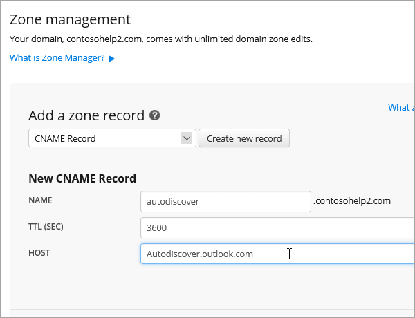
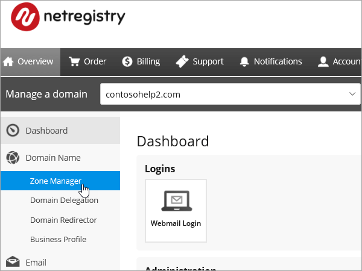
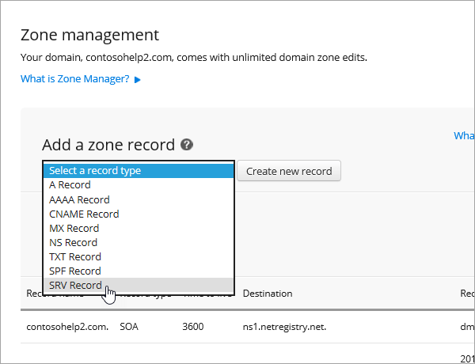

# 在 Netregistry 建立 Office 365 的 DNS 記錄

[檢查網域的常見問題集](../setup/domains-faq.md) ：供您在找不到所需功能時參考。 
  
如果 Netregistry 是您 DNS 主機服務提供者，請遵循本篇文章以驗證您的網域和設定 DNS 記錄的電子郵件、 Skype for Business Online 等等中的步驟。
  
以下是要新增的主要記錄。
  
- [新增 TXT 記錄以供驗證](#add-a-txt-record-for-verification)
    
- [新增 MX 記錄，以將寄往您網域的電子郵件轉至 Office 365](#add-an-mx-record-so-email-for-your-domain-will-come-to-office-365)

- [新增 Office 365 所需的 CNAME 記錄](#add-the-cname-records-that-are-required-for-office-365)
    
- [新增 SPF 的 TXT 記錄以協助防範垃圾郵件](#add-a-txt-record-for-spf-to-help-prevent-email-spam)
    
- [新增兩筆 Office 365 所需的 SRV 記錄](#add-the-two-srv-records-that-are-required-for-office-365)
    
在 Netregistry 新增這些記錄之後，您的網域就會設定為搭配 Office 365 服務。
  
若要了解使用 Office 365 網站的虛擬主機和 DNS，請參閱[搭配 Office 365 使用公用網站](https://support.office.com/article/a8178510-501d-4bd8-9921-b04f2e9517a5.aspx)。
  
> [!NOTE]
> DNS 變更生效通常約需 15 分鐘的時間。而如果您所做的變更要在整個網際網路 DNS 系統中生效，有時可能需要更久的時間。在您新增 DNS 記錄後，如有郵件流程或其他方面的問題，請參閱[變更網域名稱或 DNS 記錄之後所發生問題的疑難排解](../get-help-with-domains/find-and-fix-issues.md)。 
  
## 新增 TXT 記錄以供驗證

在您將自己的網域用於 Office 365 之前，我們必須先確認您擁有該網域。如果您能在自己的網域註冊機構登入自己的帳戶並能建立 DNS 記錄，Office 365 就能確信您擁有該網域。
  
> [!NOTE]
> 這筆記錄只會用於驗證您擁有自己的網域，不會影響其他項目。您可以選擇稍後再刪除記錄。 
  
1. 若要開始，使用[此連結](https://theconsole.netregistry.com.au/)移至您在 Netregistry 中的網域頁面。 You'll be prompted to log in.
    
    
  
2. 您想要管理的網域旁, 選取 [**管理**]。
    
    
  
3. 選取**區域管理員**]。
    
    
  
4. 在 [**新增區域記錄**] 從清單中，選擇 [ **TXT 記錄**，然後選取 [**建立新的記錄**。
    
    
  
    > [!NOTE]
    > 您必須使用引號之前和之後 [TXT] 方塊中的項目。 
  
    在**新的 TXT 記錄**表單中，輸入或複製並貼上下表中的值。 
    
    |**Name**|**TTL （秒）**|**TXT （指向位址] 或 [值）**|
    |:-----|:-----|:-----|
    |(保留空白)    |3600 （秒）    |"MS = msXXXXXXXX 」    **附註：** 這是範例。 Use your specific **Destination or Points to Address** value here, from the table in Office 365. [How do I find this?](../get-help-with-domains/information-for-dns-records.md)  |
       
    
  
6. 選取 [**新增記錄**]。
    
Now that you've added the record at your domain registrar's site, you'll go back to Office 365 and request Office 365 to look for the record.
  
When Office 365 finds the correct TXT record, your domain is verified.
  
1. 在系統管理中心，移至 [**設定** \> <a href="https://go.microsoft.com/fwlink/p/?linkid=834818" target="_blank">網域</a>] 頁面。
    
2. 在 [**網域**] 頁面上，選取您要驗證的網域。 
    
    
  
3. 在 [**安裝**] 頁面上，選取 [**啟動安裝程式**。
    
    
  
4. 在 [**驗證網域**] 頁面上，選取 [**驗證**]。
    
    
  
> [!NOTE]
>  DNS 變更生效通常約需 15 分鐘的時間。而如果您所做的變更要在整個網際網路 DNS 系統中生效，有時可能需要更久的時間。在您新增 DNS 記錄後，如有郵件流程或其他方面的問題，請參閱[變更網域名稱或 DNS 記錄之後所發生問題的疑難排解](../get-help-with-domains/find-and-fix-issues.md)。 
  
## 新增 MX 記錄，以將寄往您網域的電子郵件轉至 Office 365

1. 若要開始，使用[此連結](https://theconsole.netregistry.com.au/)移至您在 Netregistry 中的網域頁面。 You'll be prompted to log in.
    
    
  
2. 您想要管理的網域旁, 選取 [**管理**]。
    
    
  
3. 選取**區域管理員**]。
    
    
  
4. 在**目前區域記錄**，移除預設的 MX 記錄所選取清單中每一個 MX 記錄旁的 [**移除**。 
    
    
  
5. 在 [**新增區域記錄**] 從清單中，選擇 [ **MX 記錄**，然後選取 [**建立新的記錄**。
    
    
  
6. 在**新的 MX 記錄**表單中，輸入或複製並貼上下表中的值。 
    
    |**Name**|**TTL （秒）**|**Exchange （指向位址] 或 [值）**|**為主機的完整？**|**喜好設定 （優先順序）**|
    |:-----|:-----|:-----|:-----|:-----|
    |(保留空白)    |3600 （秒）    | *\<網域金鑰\>*  .mail.protection.outlook.com    **附註：** 取得您*\<網域金鑰\>* 從您的 Office 365 帳戶。  [How do I find this?](../get-help-with-domains/information-for-dns-records.md)      |（選取這個核取方塊）    |10     For more information about priority, see What is MX priority?    |
       
    
  
7. 選取 [**新增記錄**]。
    
    
  
## 新增 Office 365 所需的 CNAME 記錄

1. 若要開始，使用[此連結](https://theconsole.netregistry.com.au/)移至您在 Netregistry 中的網域頁面。 You'll be prompted to log in.
    
    
  
2. 您想要管理的網域旁, 選取 [**管理**]。
    
    
  
3. 選取**區域管理員**]。
    
    
  
4. 在 [**新增區域記錄**] 從清單中，選擇 [ **CNAME 記錄**，然後選取 [**建立新的記錄**。
    
    
  
5. In the boxes for the new record, type or copy and paste the values from the following table.
    
    |**Name**|**Type**|**TTL**|**主機 （以點為單位或位址] 值）**|
    |:-----|:-----|:-----|:-----|
    |autodiscover    |CNAME    |3600 （秒）    |autodiscover.outlook.com    |
    |sip    |CNAME    |3600 （秒）    |sipdir.online.lync.com>    |
    |lyncdiscover    |CNAME    |3600 （秒）    |webdir.online.lync.com>    |
    |enterpriseregistration    |CNAME    |3600 （秒）    |enterpriseregistration.windows.net>    |
    |enterpriseenrollment    |CNAME    |3600 （秒）    |enterpriseenrollment-s.manage.microsoft.com    |
       
    
      
6. 選取 [**新增記錄**]。
    
    
  
7. 重複上述步驟建立其他五筆 CNAME 記錄。
    
    每一筆記錄，輸入或複製並貼入該記錄的方塊中的表格中下一列中的值。
    
## 新增 SPF 的 TXT 記錄以協助防範垃圾郵件

> [!IMPORTANT]
> You cannot have more than one TXT record for SPF for a domain. If your domain has more than one SPF record, you'll get email errors, as well as delivery and spam classification issues. If you already have an SPF record for your domain, don't create a new one for Office 365. Instead, add the required Office 365 values to the current record so that you have a  *single*  SPF record that includes both sets of values.
  
1. 若要開始，使用[此連結](https://theconsole.netregistry.com.au/)移至您在 Netregistry 中的網域頁面。 You'll be prompted to log in.
    
    
  
2. 您想要管理的網域旁, 選取 [**管理**]。
    
    
  
3. 選取**區域管理員**]。
    
    
  
4. 在 [**新增區域記錄**] 從清單中，選擇 [ **TXT 記錄**，然後選取 [**建立新的記錄**。
    
    
  
5. In the boxes for the new record, type or copy and paste the values from the following table. 
    
    > [!NOTE]
    > 您必須使用引號之前和之後 [TXT] 方塊中的項目。 
  
    |**Name**|**Type**|**TTL**|**TXT Data （目標）**|
    |:-----|:-----|:-----|:-----|
    |(保留空白)    |TXT    |3600 （秒）    |「 v = spf1 include: spf.protection.outlook.com-所有 」    **附註：** 建議您複製並貼上這個項目，好讓所有的間距保持正確。           |
   
    
  
6. 選取 [**新增記錄**]。
    
    
  
## 新增兩筆 Office 365 所需的 SRV 記錄

1. 若要開始，使用[此連結](https://theconsole.netregistry.com.au/)移至您在 Netregistry 中的網域頁面。 You'll be prompted to log in.
    
    
  
2. 您想要管理的網域旁, 選取 [**管理**]。
    
    
  
3. 選取**區域管理員**]。
    
    
  
4. 在 [**新增區域記錄**] 從清單中，選擇 [ **SRV 記錄**，然後選取 [**建立新的記錄**。
    
    
  
5. In the boxes for the new record, type or copy and paste the values from the following table.
    
    > [!NOTE]
    > [名稱] 欄位是服務 (例如，_sip) 和通訊協定 (例如，_tls) 的組合。 
  
    |**類型**|**名稱**|**TTL （秒）**|**優先順序**|**Weight**|**Port**|**Target**|
    |:-----|:-----|:-----|:-----|:-----|:-----|:-----|
    |SRV （服務）    |_sip._tls    |3600 （秒）    |100    |1    |443    |sipdir.online.lync.com>    |
    |SRV （服務）    |_sipfederationtls._tcp    |3600 （秒）    |100    |1    |5061    |sipfed.online.lync.com>    |
       
    
  
6. 選取 [**新增記錄**]。
    
    
  
7. 重複上述步驟建立其他 SRV 記錄。
    
    在第二筆記錄的方塊中，輸入或複製並貼上表格中第二列的值。
    
> [!NOTE]
> DNS 變更生效通常約需 15 分鐘的時間。而如果您所做的變更要在整個網際網路 DNS 系統中生效，有時可能需要更久的時間。在您新增 DNS 記錄後，如有郵件流程或其他方面的問題，請參閱[變更網域名稱或 DNS 記錄之後所發生問題的疑難排解](../get-help-with-domains/find-and-fix-issues.md)。 
  

