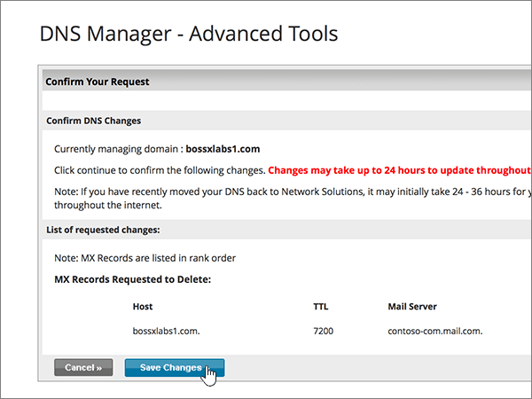
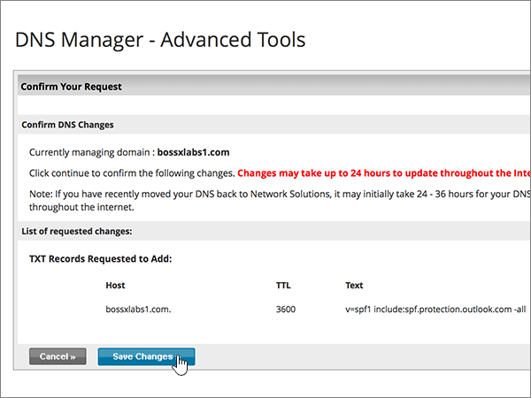

# 在 Network Solutions 建立 Office 365 的DNS 記錄Create DNS records at Network Solutions for Office 365

 若您找不到所需內容，請**[查看網域常見問題集](../setup/domains-faq.md)**。**[Check the Domains FAQ](../setup/domains-faq.md)** if you don't find what you're looking for. 
  
如果 Network Solutions 是您的 DNS 主機服務提供者，請按照本文所述的步驟驗證網域，並設定電子郵件與商務用 Skype Online 等項目的 DNS 記錄。If Network Solutions is your DNS hosting provider, follow the steps in this article to verify your domain and set up DNS records for email, Skype for Business Online, and so on.
  
以下是要新增的主要記錄。These are the main records to add. 請依照下列步驟操作或[觀看影片](https://support.office.com/article/Video-Create-DNS-records-at-Network-Solutions-for-Office-365-c49698c2-6991-47fb-b5ac-18e49a505099?ui=en-US&amp;rs=en-US&amp;ad=US)。Follow the steps below or [watch the video](https://support.office.com/article/Video-Create-DNS-records-at-Network-Solutions-for-Office-365-c49698c2-6991-47fb-b5ac-18e49a505099?ui=en-US&amp;rs=en-US&amp;ad=US). 
  
- [新增 TXT 記錄以供驗證Add a TXT record for verification](#add-a-txt-record-for-verification)
    
- [新增 MX 記錄，以將寄往您網域的電子郵件轉至 Office 365Add an MX record so email for your domain will come to Office 365](#add-an-mx-record-so-email-for-your-domain-will-come-to-office-365)
    
- [新增 Office 365 所需的 CNAME 記錄Add the CNAME records that are required for Office 365](#add-the-cname-records-that-are-required-for-office-365)
    
- [新增 SPF 的 TXT 記錄以協助防範垃圾郵件Add a TXT record for SPF to help prevent email spam](#add-a-txt-record-for-spf-to-help-prevent-email-spam)
    
- [新增兩筆 Office 365 所需的 SRV 記錄Add the two SRV records that are required for Office 365](#add-the-two-srv-records-that-are-required-for-office-365)
    
在 Network Solutions 新增這些記錄之後，您的網域就會設定為搭配 Office 365 服務使用。After you add these records at Network Solutions, your domain will be set up to work with Office 365 services.
  
若要了解使用 Office 365 網站的虛擬主機和 DNS，請參閱[搭配 Office 365 使用公用網站](https://support.office.com/article/choose-a-public-website-3325d50e-d131-403c-a278-7f3296fe33a9)。To learn about webhosting and DNS for websites with Office 365, see [Use a public website with Office 365](https://support.office.com/article/choose-a-public-website-3325d50e-d131-403c-a278-7f3296fe33a9).
  
> [!NOTE]
>  DNS 變更生效通常約需 15 分鐘的時間。而如果您所做的變更要在整個網際網路 DNS 系統中生效，有時可能需要更久的時間。在您新增 DNS 記錄後，如有郵件流程或其他方面的問題，請參閱[變更網域名稱或 DNS 記錄之後所發生問題的疑難排解](../get-help-with-domains/find-and-fix-issues.md)。Typically it takes about 15 minutes for DNS changes to take effect. However, it can occasionally take longer for a change you've made to update across the Internet's DNS system. If you're having trouble with mail flow or other issues after adding DNS records, see [Troubleshoot issues after changing your domain name or DNS records](../get-help-with-domains/find-and-fix-issues.md). 
  
## 新增 TXT 記錄以供驗證Add a TXT record for verification

在您將自己的網域用於 Office 365 之前，我們必須先確認您擁有該網域。如果您能在自己的網域註冊機構登入自己的帳戶並能建立 DNS 記錄，Office 365 就能確信您擁有該網域。Before you use your domain with Office 365, we have to make sure that you own it. Your ability to log in to your account at your domain registrar and create the DNS record proves to Office 365 that you own the domain.
  
> [!NOTE]
> 這筆記錄只會用於驗證您擁有自己的網域，不會影響其他項目。您可以選擇稍後再刪除記錄。This record is used only to verify that you own your domain; it doesn't affect anything else. You can delete it later, if you like. 
  
請依照下列步驟操作或[觀看影片 (從 0:47 處開始)](https://support.office.com/article/Video-Create-DNS-records-at-Network-Solutions-for-Office-365-c49698c2-6991-47fb-b5ac-18e49a505099?ui=en-US&amp;rs=en-US&amp;ad=US)。Follow the steps below or [watch the video (start at 0:47)](https://support.office.com/article/Video-Create-DNS-records-at-Network-Solutions-for-Office-365-c49698c2-6991-47fb-b5ac-18e49a505099?ui=en-US&amp;rs=en-US&amp;ad=US).
  
1. 首先請用[這個連結](https://www.networksolutions.com/manage-it)移至 Network Solutions 上您的網域頁面。To get started, go to your domains page at Network Solutions by using [this link](https://www.networksolutions.com/manage-it). 系統會提示您先登入。You'll be prompted to log in.
    
    > [!IMPORTANT]
    > 您選取 [**登入**] 按鈕之前，請先選擇 [**管理我的網域名稱**中**登入至：** 下拉式清單。Before you select the **Login** button, first choose **Manage My Domain Names** in the **Log In to:** drop-down list. 
  
    ![選擇 [管理我的網域名稱]，然後登入 Network Solutions](../../media/fda7d4a1-9445-4086-be9c-87c6983ef2aa.png)
  
2. 選取您要修改之網域名稱旁的核取方塊。Select the check box next to the name of the domain that you are modifying.
    
    
  
3. 選取 [**編輯 DNS**]。Select **Edit DNS**.
    
    
  
4. 選取 [**管理進階的 DNS 記錄**]。Select **Manage Advanced DNS Records**.
    
    (You may have to scroll down.)(You may have to scroll down.)
    
    
  
5. 向下的**文字 （TXT 記錄）** 區段中，捲動，然後選取 [**編輯 TXT 記錄**。Scroll down to the **Text (TXT Records)** section, and then select **Edit TXT Records**.
    
    
  
6. In the boxes for the new record, type or copy and paste the values in the following table.In the boxes for the new record, type or copy and paste the values in the following table.
    
    |**Host** (主機)**Host**|**TTL****TTL**|**Text****Text**|
    |:-----|:-----|:-----|
    |@    (The system will change this value to **@ (None)** when you save the record.)(The system will change this value to **@ (None)** when you save the record.)    |36003600    |MS=ms *XXXXXXXX*MS=ms *XXXXXXXX*    **附註：** 這是範例。**Note:** This is an example. 在這裡請使用您自己的 [目的地或指向位址] 值，請參閱 Office 365 表格。Use your specific **Destination or Points to Address** value here, from the table in Office 365.  [如何找到呢？How do I find this?](../get-help-with-domains/information-for-dns-records.md)   |
       
    
  
7. 選取 [**繼續**]。Select **Continue**.
    
    ![選取 [繼續]](../../media/89e7fb38-b4d9-4949-a1bb-d0dd10b361e0.png)
  
8. 選取 [**儲存變更**。Select **Save Changes**.
    
    
  
9. 繼續進行之前，請先稍候幾分鐘，好讓您剛剛建立的記錄能在網際網路上更新。Wait a few minutes before you continue, so that the record you just created can update across the Internet.
    
現在您已在網域註冊機構網站新增記錄，請返回 Office 365 並要求 Office 365 尋找該記錄。Now that you've added the record at your domain registrar's site, you'll go back to Office 365 and request Office 365 to look for the record.
  
在 Office 365 找到正確的 TXT 記錄後，您的網域就完成驗證了。When Office 365 finds the correct TXT record, your domain is verified.

1. 在系統管理中心中，移至 **[設定]** \> <a href="https://go.microsoft.com/fwlink/p/?linkid=834818" target="_blank">[網域]</a> 頁面。In the admin center, go to the **Settings** \> <a href="https://go.microsoft.com/fwlink/p/?linkid=834818" target="_blank">Domains</a> page.
    
2. 在 **[網域]** 頁面上，選取您要驗證的網域。On the **Domains** page, select the domain that you are verifying. 
    
    
  
3. 在 **[設定]** 頁面上，選取 **[開始設定]**。On the **Setup** page, select **Start setup**.
    
    
  
4. 在 **[驗證網域]** 頁面上，選取 **[驗證]**。On the **Verify domain** page, select **Verify**.
    
    
  
> [!NOTE]
>  DNS 變更生效通常約需 15 分鐘的時間。而如果您所做的變更要在整個網際網路 DNS 系統中生效，有時可能需要更久的時間。在您新增 DNS 記錄後，如有郵件流程或其他方面的問題，請參閱[變更網域名稱或 DNS 記錄之後所發生問題的疑難排解](../get-help-with-domains/find-and-fix-issues.md)。Typically it takes about 15 minutes for DNS changes to take effect. However, it can occasionally take longer for a change you've made to update across the Internet's DNS system. If you're having trouble with mail flow or other issues after adding DNS records, see [Troubleshoot issues after changing your domain name or DNS records](../get-help-with-domains/find-and-fix-issues.md). 
  
## 新增 MX 記錄，以將寄往您網域的電子郵件轉至 Office 365Add an MX record so email for your domain will come to Office 365

請依照下列步驟操作或[觀看影片 (從 3:51 處開始)](https://support.office.com/article/Video-Create-DNS-records-at-Network-Solutions-for-Office-365-c49698c2-6991-47fb-b5ac-18e49a505099?ui=en-US&amp;rs=en-US&amp;ad=US)。Follow the steps below or [watch the video (start at 3:51)](https://support.office.com/article/Video-Create-DNS-records-at-Network-Solutions-for-Office-365-c49698c2-6991-47fb-b5ac-18e49a505099?ui=en-US&amp;rs=en-US&amp;ad=US).
  
1. 首先請用[這個連結](https://www.networksolutions.com/manage-it)移至 Network Solutions 上您的網域頁面。To get started, go to your domains page at Network Solutions by using [this link](https://www.networksolutions.com/manage-it). 系統會提示您先登入。You'll be prompted to log in.
    
    > [!IMPORTANT]
    > 您選取 [**登入**] 按鈕之前，請先選擇 [**管理我的網域名稱**中**登入至：** 下拉式清單。Before you select the **Login** button, first choose **Manage My Domain Names** in the **Log In to:** drop-down list. 
  
    ![選擇 [管理我的網域名稱]，然後登入 Network Solutions](../../media/fda7d4a1-9445-4086-be9c-87c6983ef2aa.png)
  
2. 選取您要修改之網域名稱旁的核取方塊。Select the check box next to the name of the domain that you are modifying.
    
    
  
3. 選取 [**編輯 DNS**]。Select **Edit DNS**.
    
    
  
4. 選取 [**管理進階的 DNS 記錄**]。Select **Manage Advanced DNS Records**.
    
    (You may have to scroll down.)(You may have to scroll down.)
    
    
  
5. 捲動至 [**郵件伺服器 （MX 記錄）** ] 區段，然後選取 [**編輯 MX 記錄**。Scroll down to the **Mail Servers (MX Records)** section, and then select **Edit MX Records**.
    
    
  
6. 在新記錄的方塊中，輸入或複製並貼上下表中的值。In the boxes for the new record, type or copy and paste the values from the following table.
    
    |**Priority** (優先順序)**Priority**|**TTL****TTL**|**Mail server (郵件伺服器)****Mail Server**|
    |:-----|:-----|:-----|
    |10 10    如需關於優先順序的詳細資訊，請參閱[什麼是 MX 優先順序？](https://support.office.com/article/2784cc4d-95be-443d-b5f7-bb5dd867ba83.aspx)For more information about priority, see [What is MX priority?](https://support.office.com/article/2784cc4d-95be-443d-b5f7-bb5dd867ba83.aspx)   |36003600    | *\<網域金鑰\>*  .mail.protection.outlook.com。*\<domain-key\>*  .mail.protection.outlook.com.    **This value MUST end with a period (.)****This value MUST end with a period (.)**   **附註：** 取得您*\<網域金鑰\>* 從您的 Office 365 帳戶。**Note:** Get your  *\<domain-key\>*  from your Office 365 account. [如何找到呢？How do I find this?](../get-help-with-domains/information-for-dns-records.md)          |
       
    
  
7. 選取 [**繼續**]。Select **Continue**.
    
    ![選取 [繼續]](../../media/963f758b-e79d-4452-8340-7eba8a3972c9.png)
  
8. 選取 [**儲存變更**。Select **Save Changes**.
    
    
  
9. 如果有任何其他 MX 記錄，請刪除所有這些藉由選取 [每一筆記錄的 [**刪除**。If there are any other MX records, delete all of them by selecting **Delete** for each record. 
    
    
  
10. 時所有已選取他們，選取 [**繼續]**。When they are all selected, select **Continue**.
    
    ![選取 [繼續]](../../media/4710f988-0bbc-4ba7-bf31-ca2392b2900e.png)
  
11. 選取 [**儲存變更**。Select **Save Changes**.
    
    
  
## 新增 Office 365 所需的 CNAME 記錄Add the CNAME records that are required for Office 365

請依照下列步驟操作或[觀看影片 (從 4:43 處開始)](https://support.office.com/article/Video-Create-DNS-records-at-Network-Solutions-for-Office-365-c49698c2-6991-47fb-b5ac-18e49a505099?ui=en-US&amp;rs=en-US&amp;ad=US)。Follow the steps below or [watch the video (start at 4:43)](https://support.office.com/article/Video-Create-DNS-records-at-Network-Solutions-for-Office-365-c49698c2-6991-47fb-b5ac-18e49a505099?ui=en-US&amp;rs=en-US&amp;ad=US).
  
1. 首先請用[這個連結](https://www.networksolutions.com/manage-it)移至 Network Solutions 上您的網域頁面。To get started, go to your domains page at Network Solutions by using [this link](https://www.networksolutions.com/manage-it). 系統會提示您先登入。You'll be prompted to log in.
    
    > [!IMPORTANT]
    > 您選取 [**登入**] 按鈕之前，請先選擇 [**管理我的網域名稱**中**登入至：** 下拉式清單。Before you select the **Login** button, first choose **Manage My Domain Names** in the **Log In to:** drop-down list. 
  
    ![選擇 [管理我的網域名稱]，然後登入 Network Solutions](../../media/fda7d4a1-9445-4086-be9c-87c6983ef2aa.png)
  
2. 選取您要修改之網域名稱旁的核取方塊。Select the check box next to the name of the domain that you are modifying.
    
    
  
3. 選取 [**編輯 DNS**]。Select **Edit DNS**.
    
    
  
4. 選取 [**管理進階的 DNS 記錄**]。Select **Manage Advanced DNS Records**.
    
    (You may have to scroll down.)(You may have to scroll down.)
    
    
  
5. 捲動至 [ **Host Aliases （CNAME 記錄）** ] 區段，然後選取 [**編輯 CNAME 記錄**。Scroll down to the **Host Aliases (CNAME Records)** section, and then select **Edit CNAME Records**.
    
    ![選取 [編輯 [Host Aliases] 下的 CNAME 記錄](../../media/2d0a4666-8d40-48f4-886c-64a5157baaf5.png)
  
6. 在這四筆新記錄的方塊中，輸入或複製並貼上下表中的值。In the boxes for the four new records, type or copy and paste the values from the following table.
    
    |**Alias****Alias**|**TTL****TTL**|**參照的主機名稱****Refers to Host Name**|**其他主機 （選取**其他的主機**選項按鈕）****Other Host          (select the **Other Host** option button)**|
    |:-----|:-----|:-----|:-----|
    |autodiscover (自動探索)autodiscover    |36003600    |(沒有設定)(No setting)    |autodiscover.outlook.com。autodiscover.outlook.com.    **This value MUST end with a period (.)****This value MUST end with a period (.)**   |
    |sipsip    |36003600    |(沒有設定)(No setting)    |sipdir.online.lync.com>。sipdir.online.lync.com.    **This value MUST end with a period (.)****This value MUST end with a period (.)**   |
    |lyncdiscoverlyncdiscover    |36003600    |(沒有設定)(No setting)    |webdir.online.lync.com>。webdir.online.lync.com.    **This value MUST end with a period (.)****This value MUST end with a period (.)**   |
    |enterpriseregistrationenterpriseregistration    |36003600    |(沒有設定)(No setting)    |enterpriseregistration.windows.netenterpriseregistration.windows.net    **This value MUST end with a period (.)****This value MUST end with a period (.)**   |
    |enterpriseenrollmententerpriseenrollment    |36003600    |(沒有設定)(No setting)    |enterpriseenrollment-s.manage.microsoft.comenterpriseenrollment-s.manage.microsoft.com    **This value MUST end with a period (.)****This value MUST end with a period (.)**   |
    
    
  
7. 當您已新增所有您需要的 CNAME 記錄時，選取 [**繼續]**。When you have added all of the CNAME records that you need, select **Continue**.
    
    ![選取 [繼續]](../../media/4978bd8b-f6a6-458d-9522-ad612b301c4a.png)
  
8. 選取 [**儲存變更**。Select **Save Changes**.
    
    
  
## 新增 SPF 的 TXT 記錄以協助防範垃圾郵件Add a TXT record for SPF to help prevent email spam

> [!IMPORTANT]
> 網域的 SPF 不得擁有一個以上的 TXT 記錄。You cannot have more than one TXT record for SPF for a domain. 如果您的網域具有多筆 SPF 記錄，您將收到電子郵件錯誤，以及傳送及垃圾郵件分類問題。If your domain has more than one SPF record, you'll get email errors, as well as delivery and spam classification issues. 如果網域已經有 SPF 記錄，請勿為 Office 365 建立一個新的記錄。If you already have an SPF record for your domain, don't create a new one for Office 365. 而是，請將必要的 Office 365 值新增到目前的記錄，以便擁有包含這兩組值的*單一* SPF 記錄。Instead, add the required Office 365 values to the current record so that you have a  *single*  SPF record that includes both sets of values. 
  
請依照下列步驟操作或[觀看影片 (從 5:35 處開始)](https://support.office.com/article/Video-Create-DNS-records-at-Network-Solutions-for-Office-365-c49698c2-6991-47fb-b5ac-18e49a505099?ui=en-US&amp;rs=en-US&amp;ad=US)。Follow the steps below or [watch the video (start at 5:35)](https://support.office.com/article/Video-Create-DNS-records-at-Network-Solutions-for-Office-365-c49698c2-6991-47fb-b5ac-18e49a505099?ui=en-US&amp;rs=en-US&amp;ad=US).
  
1. 首先請用[這個連結](https://www.networksolutions.com/manage-it)移至 Network Solutions 上您的網域頁面。To get started, go to your domains page at Network Solutions by using [this link](https://www.networksolutions.com/manage-it). 系統會提示您先登入。You'll be prompted to log in.
    
    > [!IMPORTANT]
    > 您選取 [**登入**] 按鈕之前，請先選擇 [**管理我的網域名稱**中**登入至：** 下拉式清單。Before you select the **Login** button, first choose **Manage My Domain Names** in the **Log In to:** drop-down list. 
  
    ![選擇 [管理我的網域名稱]，然後登入 Network Solutions](../../media/fda7d4a1-9445-4086-be9c-87c6983ef2aa.png)
  
2. 選取您要修改之網域名稱旁的核取方塊。Select the check box next to the name of the domain that you are modifying.
    
    
  
3. 選取 [**編輯 DNS**]。Select **Edit DNS**.
    
    
  
4. 選取 [**管理進階的 DNS 記錄**]。Select **Manage Advanced DNS Records**.
    
    (You may have to scroll down.)(You may have to scroll down.)
    
    
  
5. 向下的**文字 （TXT 記錄）** 區段中，捲動，然後選取 [**編輯 TXT 記錄**。Scroll down to the **Text (TXT Records)** section, and then select **Edit TXT Records**.
    
    ![選取 [編輯文字] 下的 TXT 記錄](../../media/a69a2631-6da2-4e81-99ab-9a9ab9b30b07.png)
  
6. In the boxes for the new record, type or copy and paste the following values.In the boxes for the new record, type or copy and paste the following values.
    
    |**Host** (主機)**Host**|**TTL****TTL**|**Text****Text**|
    |:-----|:-----|:-----|
    |@    (The system will change this value to **@ (None)** when you save the record.)(The system will change this value to **@ (None)** when you save the record.)    |36003600    |v=spf1 include:spf.protection.outlook.com -allv=spf1 include:spf.protection.outlook.com -all    **附註：** 建議您複製並貼上這個項目，好讓所有的間距保持正確。**Note:** We recommend copying and pasting this entry, so that all of the spacing stays correct. |
       
    
  
7. 選取 [**繼續**]。Select **Continue**.
    
    ![選取 [繼續]](../../media/482a8dae-0c79-47c4-8bd8-87965683de24.png)
  
8. 選取 [**儲存變更**。Select **Save Changes**.
    
    
  
## 新增兩筆 Office 365 所需的 SRV 記錄Add the two SRV records that are required for Office 365

請依照下列步驟操作或[觀看影片 (從 6:18 處開始)](https://support.office.com/article/Video-Create-DNS-records-at-Network-Solutions-for-Office-365-c49698c2-6991-47fb-b5ac-18e49a505099?ui=en-US&amp;rs=en-US&amp;ad=US)。Follow the steps below or [watch the video (start at 6:18)](https://support.office.com/article/Video-Create-DNS-records-at-Network-Solutions-for-Office-365-c49698c2-6991-47fb-b5ac-18e49a505099?ui=en-US&amp;rs=en-US&amp;ad=US).
  
1. 首先請用[這個連結](https://www.networksolutions.com/manage-it)移至 Network Solutions 上您的網域頁面。系統會提示您先登入。To get started, go to your domains page at Network Solutions by using [this link](https://www.networksolutions.com/manage-it). You'll be prompted to log in.
    
    > [!IMPORTANT]
    > 您選取 [**登入**] 按鈕之前，請先選擇 [**管理我的網域名稱**中**登入至：** 下拉式清單。Before you select the **Login** button, first choose **Manage My Domain Names** in the **Log In to:** drop-down list. 
  
    ![選擇 [管理我的網域名稱]，然後登入 Network Solutions](../../media/fda7d4a1-9445-4086-be9c-87c6983ef2aa.png)
  
2. 選取您要修改之網域名稱旁的核取方塊。Select the check box next to the name of the domain that you are modifying.
    
    
  
3. 選取 [**編輯 DNS**]。Select **Edit DNS**.
    
    
  
4. 選取 [**管理進階的 DNS 記錄**]。Select **Manage Advanced DNS Records**.
    
    (You may have to scroll down.)(You may have to scroll down.)
    
    
  
5. 向下**服務 （SRV 記錄）** 區段中，捲動，然後選取 [ **Edit SRV Records**。Scroll down to the **Service (SRV Records)** section, and then select **Edit SRV Records**.
    
    ![選取 [服務] 下的編輯 SRV 記錄](../../media/9a9248ea-5de5-4e16-9364-f7600fa371f5.png)
  
6. 在這兩筆新記錄的方塊中，輸入或複製並貼上下表中的值。In the boxes for the two new records, type or copy and paste the values from the following table.
    
    （從下拉式清單選擇 [**服務**] 和 [**通訊協定**值）。(Choose the **Service** and **Protocol** values from the drop-down lists.) 
    
    |**Service** (服務)**Service**|**Protocol** (通訊協定)**Protocol**|**TTL****TTL**|**Priority** (優先順序)**Priority**|**Weight** (權數)**Weight**|**Port** (連接埠)**Port**|**Target** (目標)**Target**|
    |:-----|:-----|:-----|:-----|:-----|:-----|:-----|
    |_sip_sip    |_tls_tls    |36003600    |100100    |11    |443443    |sipdir.online.lync.com>。sipdir.online.lync.com.    **This value MUST end with a period (.)****This value MUST end with a period (.)**   |
    |_sipfederationtls_sipfederationtls    |_tcp_tcp    |36003600    |100100    |11    |50615061    |sipfed.online.lync.com。sipfed.online.lync.com.    **This value MUST end with a period (.)****This value MUST end with a period (.)**   |
       
    
  
7. 選取 [**繼續**]。Select **Continue**.
    
    ![選取 [繼續]](../../media/bfe2c778-5d2b-4bb6-a79d-c3ff9caf9e1e.png)
  
8. 選取 [**儲存變更**。Select **Save Changes**.
    
    
  
> [!NOTE]
>  DNS 變更生效通常約需 15 分鐘的時間。而如果您所做的變更要在整個網際網路 DNS 系統中生效，有時可能需要更久的時間。在您新增 DNS 記錄後，如有郵件流程或其他方面的問題，請參閱[變更網域名稱或 DNS 記錄之後所發生問題的疑難排解](../get-help-with-domains/find-and-fix-issues.md)。Typically it takes about 15 minutes for DNS changes to take effect. However, it can occasionally take longer for a change you've made to update across the Internet's DNS system. If you're having trouble with mail flow or other issues after adding DNS records, see [Troubleshoot issues after changing your domain name or DNS records](../get-help-with-domains/find-and-fix-issues.md). 
  
