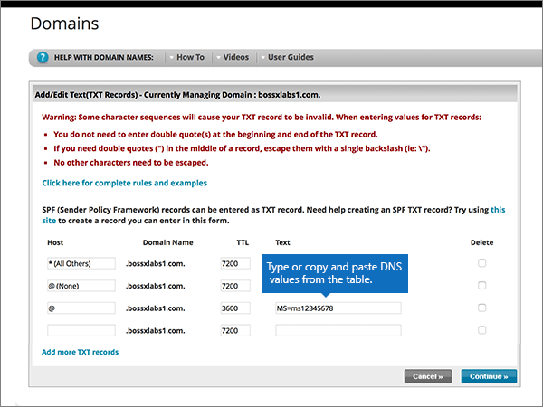

# 在 Network Solutions 建立 Office 365 的DNS 記錄

 若您找不到所需功能，請**[檢查網域常見問題集](../setup/domains-faq.md)**。 
  
如果 Network Solutions 是您的 DNS 主機服務提供者，請按照本文所述的步驟驗證網域，並設定電子郵件與商務用 Skype Online 等項目的 DNS 記錄。
  
以下是要新增的主要記錄。 請依照下列步驟操作或[觀看影片](https://support.office.com/article/Video-Create-DNS-records-at-Network-Solutions-for-Office-365-c49698c2-6991-47fb-b5ac-18e49a505099?ui=en-US&amp;rs=en-US&amp;ad=US)。 
  
- [新增 TXT 記錄以供驗證](#add-a-txt-record-for-verification)
    
- [新增 MX 記錄，以將寄往您網域的電子郵件轉至 Office 365](#add-an-mx-record-so-email-for-your-domain-will-come-to-office-365)
    
- [新增 Office 365 所需的 CNAME 記錄](#add-the-cname-records-that-are-required-for-office-365)
    
- [新增 SPF 的 TXT 記錄以協助防範垃圾郵件](#add-a-txt-record-for-spf-to-help-prevent-email-spam)
    
- [新增兩筆 Office 365 所需的 SRV 記錄](#add-the-two-srv-records-that-are-required-for-office-365)
    
在 Network Solutions 新增這些記錄之後，您的網域就會設定為搭配 Office 365 服務使用。
  
若要了解使用 Office 365 網站的虛擬主機和 DNS，請參閱[搭配 Office 365 使用公用網站](https://support.office.com/article/choose-a-public-website-3325d50e-d131-403c-a278-7f3296fe33a9)。
  
> [!NOTE]
>  DNS 變更生效通常約需 15 分鐘的時間。而如果您所做的變更要在整個網際網路 DNS 系統中生效，有時可能需要更久的時間。在您新增 DNS 記錄後，如有郵件流程或其他方面的問題，請參閱[變更網域名稱或 DNS 記錄之後所發生問題的疑難排解](../get-help-with-domains/find-and-fix-issues.md)。 
  
## 新增 TXT 記錄以供驗證

在您將自己的網域用於 Office 365 之前，我們必須先確認您擁有該網域。如果您能在自己的網域註冊機構登入自己的帳戶並能建立 DNS 記錄，Office 365 就能確信您擁有該網域。
  
> [!NOTE]
> 這筆記錄只會用於驗證您擁有自己的網域，不會影響其他項目。您可以選擇稍後再刪除記錄。 
  
請依照下列步驟操作或[觀看影片 (從 0:47 處開始)](https://support.office.com/article/Video-Create-DNS-records-at-Network-Solutions-for-Office-365-c49698c2-6991-47fb-b5ac-18e49a505099?ui=en-US&amp;rs=en-US&amp;ad=US)。
  
1. 首先請用[這個連結](https://www.networksolutions.com/manage-it)移至 Network Solutions 上您的網域頁面。 系統會提示您先登入。
    
    > [!IMPORTANT]
    > 在您選取 [**登**入] 按鈕之前，請先在 [**登入：** ] 下拉式清單中選擇 [**管理我的功能變數名稱**]。 
  
    ![選擇 [管理我的網域名稱]，然後登入 Network Solutions](../../media/fda7d4a1-9445-4086-be9c-87c6983ef2aa.png)
  
2. 選取您要修改之網域名稱旁的核取方塊。
    
    
  
3. 選取 [**編輯 DNS**]。
    
    ![選取 [編輯 DNS]](../../media/9d7c269f-48d1-442c-9d7b-63bd384a36a9.png)
  
4. 選取 [**管理 ADVANCED DNS 記錄**]。
    
    (You may have to scroll down.)
    
    ![選取 [管理 Advanced DNS 記錄]](../../media/fd2956d6-eec3-47ea-b60a-266bab14f51f.png)
  
5. 向下滾動至 [**文字（TXT 記錄）** ] 區段，然後選取 [**編輯 TXT 記錄**]。
    
    ![選取 [編輯 TXT 記錄]](../../media/240a01d6-750a-4da6-8554-641b571e4b71.png)
  
6. In the boxes for the new record, type or copy and paste the values in the following table.
    
    |**Host**|**TTL**|**Text**|
    |:-----|:-----|:-----|
    |@    (The system will change this value to **@ (None)** when you save the record.)    |3600    |MS=ms *XXXXXXXX*    **附註：** 這是範例。 在這裡請使用您自己的 [目的地或指向位址] 值，請參閱 Office 365 表格。  [如何找到呢？](../get-help-with-domains/information-for-dns-records.md)   |
       
    
  
7. 選取 [**繼續**]。
    
    ![選取 [繼續]](../../media/89e7fb38-b4d9-4949-a1bb-d0dd10b361e0.png)
  
8. 選取 [**儲存變更**]。
    
    ![選取 [儲存變更]](../../media/bd4d7cd0-c8a3-497a-b080-cfd5a5c60dc5.png)
  
9. 繼續進行之前，請先稍候幾分鐘，好讓您剛剛建立的記錄能在網際網路上更新。
    
現在您已在網域註冊機構網站新增記錄，請返回 Office 365 並要求 Office 365 尋找該記錄。
  
在 Office 365 找到正確的 TXT 記錄後，您的網域就完成驗證了。

1. 在系統管理中心中，移至 **[設定]** \> <a href="https://go.microsoft.com/fwlink/p/?linkid=834818" target="_blank">[網域]</a> 頁面。
    
2. 在 **[網域]** 頁面上，選取您要驗證的網域。 
    
    
  
3. 在 **[設定]** 頁面上，選取 **[開始設定]**。
    
    
  
4. 在 **[驗證網域]** 頁面上，選取 **[驗證]**。
    
    
  
> [!NOTE]
>  DNS 變更生效通常約需 15 分鐘的時間。而如果您所做的變更要在整個網際網路 DNS 系統中生效，有時可能需要更久的時間。在您新增 DNS 記錄後，如有郵件流程或其他方面的問題，請參閱[變更網域名稱或 DNS 記錄之後所發生問題的疑難排解](../get-help-with-domains/find-and-fix-issues.md)。 
  
## 新增 MX 記錄，以將寄往您網域的電子郵件轉至 Office 365

請依照下列步驟操作或[觀看影片 (從 3:51 處開始)](https://support.office.com/article/Video-Create-DNS-records-at-Network-Solutions-for-Office-365-c49698c2-6991-47fb-b5ac-18e49a505099?ui=en-US&amp;rs=en-US&amp;ad=US)。
  
1. 首先請用[這個連結](https://www.networksolutions.com/manage-it)移至 Network Solutions 上您的網域頁面。 系統會提示您先登入。
    
    > [!IMPORTANT]
    > 在您選取 [**登**入] 按鈕之前，請先在 [**登入：** ] 下拉式清單中選擇 [**管理我的功能變數名稱**]。 
  
    ![選擇 [管理我的網域名稱]，然後登入 Network Solutions](../../media/fda7d4a1-9445-4086-be9c-87c6983ef2aa.png)
  
2. 選取您要修改之網域名稱旁的核取方塊。
    
    
  
3. 選取 [**編輯 DNS**]。
    
    ![選取 [編輯 DNS]](../../media/9d7c269f-48d1-442c-9d7b-63bd384a36a9.png)
  
4. 選取 [**管理 ADVANCED DNS 記錄**]。
    
    (You may have to scroll down.)
    
    ![選取 [管理 Advanced DNS 記錄]](../../media/fd2956d6-eec3-47ea-b60a-266bab14f51f.png)
  
5. 向下滾動至 [**郵件伺服器（MX 記錄）** ] 區段，然後選取 [**編輯 MX 記錄**]。
    
    ![選取 [編輯 MX 記錄]](../../media/74b4e412-9073-4d2d-8710-fe340b223798.png)
  
6. 在新記錄的方塊中，輸入或複製並貼上下表中的值。
    
    |**優先順序**|**TTL**|**Mail server (郵件伺服器)**|
    |:-----|:-----|:-----|
    |10     如需關於優先順序的詳細資訊，請參閱[什麼是 MX 優先順序？](https://support.office.com/article/2784cc4d-95be-443d-b5f7-bb5dd867ba83.aspx)   |3600    | *\<網域金鑰\>*  .mail.protection.outlook.com。    **This value MUST end with a period (.)**   **附注：** 從您的 Office 365 帳戶取得您* \<的網域金鑰\> * 。 [如何找到呢？](../get-help-with-domains/information-for-dns-records.md)          |
       
    
  
7. 選取 [**繼續**]。
    
    ![選取 [繼續]](../../media/963f758b-e79d-4452-8340-7eba8a3972c9.png)
  
8. 選取 [**儲存變更**]。
    
    ![選取 [儲存變更]](../../media/7c2f784a-6dee-4364-866c-ad7202ef1fc2.png)
  
9. 如果有任何其他 MX 記錄，請選取每一筆記錄的 [**刪除**] 以刪除所有記錄。 
    
    
  
10. 選取所有選項時，請選取 [**繼續**]。
    
    ![選取 [繼續]](../../media/4710f988-0bbc-4ba7-bf31-ca2392b2900e.png)
  
11. 選取 [**儲存變更**]。
    
    ![選取 [儲存變更]](../../media/24432ec6-666b-4612-9488-37c06437959b.png)
  
## 新增 Office 365 所需的 CNAME 記錄

請依照下列步驟操作或[觀看影片 (從 4:43 處開始)](https://support.office.com/article/Video-Create-DNS-records-at-Network-Solutions-for-Office-365-c49698c2-6991-47fb-b5ac-18e49a505099?ui=en-US&amp;rs=en-US&amp;ad=US)。
  
1. 首先請用[這個連結](https://www.networksolutions.com/manage-it)移至 Network Solutions 上您的網域頁面。 系統會提示您先登入。
    
    > [!IMPORTANT]
    > 在您選取 [**登**入] 按鈕之前，請先在 [**登入：** ] 下拉式清單中選擇 [**管理我的功能變數名稱**]。 
  
    ![選擇 [管理我的網域名稱]，然後登入 Network Solutions](../../media/fda7d4a1-9445-4086-be9c-87c6983ef2aa.png)
  
2. 選取您要修改之網域名稱旁的核取方塊。
    
    
  
3. 選取 [**編輯 DNS**]。
    
    ![選取 [編輯 DNS]](../../media/9d7c269f-48d1-442c-9d7b-63bd384a36a9.png)
  
4. 選取 [**管理 ADVANCED DNS 記錄**]。
    
    (You may have to scroll down.)
    
    ![選取 [管理 Advanced DNS 記錄]](../../media/fd2956d6-eec3-47ea-b60a-266bab14f51f.png)
  
5. 向下滾動至 [**主機別名（CNAME 記錄）** ] 區段，然後選取 [**編輯 CNAME 記錄**]。
    
    ![選取 [主機別名] 底下的 [編輯 CNAME 記錄]](../../media/2d0a4666-8d40-48f4-886c-64a5157baaf5.png)
  
6. 在這四筆新記錄的方塊中，輸入或複製並貼上下表中的值。
    
    |**Alias**|**TTL**|**參照的主機名稱**|**其他主機（選取 [**其他主機**] 選項按鈕）**|
    |:-----|:-----|:-----|:-----|
    |autodiscover (自動探索)    |3600    |(沒有設定)    |autodiscover.outlook.com。    **This value MUST end with a period (.)**   |
    |sip    |3600    |(沒有設定)    |sipdir.online.lync.com。    **This value MUST end with a period (.)**   |
    |lyncdiscover    |3600    |(沒有設定)    |webdir.online.lync.com。    **This value MUST end with a period (.)**   |
    |enterpriseregistration    |3600    |(沒有設定)    |enterpriseregistration.windows.net    **This value MUST end with a period (.)**   |
    |enterpriseenrollment    |3600    |(沒有設定)    |enterpriseenrollment-s.manage.microsoft.com    **This value MUST end with a period (.)**   |
    
    
  
7. 當您已新增所需的所有 CNAME 記錄後，請選取 [**繼續**]。
    
    ![選取 [繼續]](../../media/4978bd8b-f6a6-458d-9522-ad612b301c4a.png)
  
8. 選取 [**儲存變更**]。
    
    ![選取 [儲存變更]](../../media/f005c38a-0d8d-4c61-bec6-15e60c89aa5a.png)
  
## 新增 SPF 的 TXT 記錄以協助防範垃圾郵件

> [!IMPORTANT]
> 網域的 SPF 不得擁有一個以上的 TXT 記錄。 如果您的網域具有多筆 SPF 記錄，您將收到電子郵件錯誤，以及傳送及垃圾郵件分類問題。 如果網域已經有 SPF 記錄，請勿為 Office 365 建立一個新的記錄。 而是，請將必要的 Office 365 值新增到目前的記錄，以便擁有包含這兩組值的*單一* SPF 記錄。 
  
請依照下列步驟操作或[觀看影片 (從 5:35 處開始)](https://support.office.com/article/Video-Create-DNS-records-at-Network-Solutions-for-Office-365-c49698c2-6991-47fb-b5ac-18e49a505099?ui=en-US&amp;rs=en-US&amp;ad=US)。
  
1. 首先請用[這個連結](https://www.networksolutions.com/manage-it)移至 Network Solutions 上您的網域頁面。 系統會提示您先登入。
    
    > [!IMPORTANT]
    > 在您選取 [**登**入] 按鈕之前，請先在 [**登入：** ] 下拉式清單中選擇 [**管理我的功能變數名稱**]。 
  
    ![選擇 [管理我的網域名稱]，然後登入 Network Solutions](../../media/fda7d4a1-9445-4086-be9c-87c6983ef2aa.png)
  
2. 選取您要修改之網域名稱旁的核取方塊。
    
    
  
3. 選取 [**編輯 DNS**]。
    
    ![選取 [編輯 DNS]](../../media/9d7c269f-48d1-442c-9d7b-63bd384a36a9.png)
  
4. 選取 [**管理 ADVANCED DNS 記錄**]。
    
    (You may have to scroll down.)
    
    ![選取 [管理 Advanced DNS 記錄]](../../media/fd2956d6-eec3-47ea-b60a-266bab14f51f.png)
  
5. 向下滾動至 [**文字（TXT 記錄）** ] 區段，然後選取 [**編輯 TXT 記錄**]。
    
    ![選取 [文字] 底下的 [編輯 TXT 記錄]](../../media/a69a2631-6da2-4e81-99ab-9a9ab9b30b07.png)
  
6. In the boxes for the new record, type or copy and paste the following values.
    
    |**Host**|**TTL**|**Text**|
    |:-----|:-----|:-----|
    |@    (The system will change this value to **@ (None)** when you save the record.)    |3600    |v=spf1 include:spf.protection.outlook.com -all    **注意：** 建議您複製並貼上這個項目，好讓所有的間距保持正確。 |
       
    
  
7. 選取 [**繼續**]。
    
    ![選取 [繼續]](../../media/482a8dae-0c79-47c4-8bd8-87965683de24.png)
  
8. 選取 [**儲存變更**]。
    
    ![選取 [儲存變更]](../../media/600b8c6d-184f-4213-a50e-8f119ebf3ff0.png)
  
## 新增兩筆 Office 365 所需的 SRV 記錄

請依照下列步驟操作或[觀看影片 (從 6:18 處開始)](https://support.office.com/article/Video-Create-DNS-records-at-Network-Solutions-for-Office-365-c49698c2-6991-47fb-b5ac-18e49a505099?ui=en-US&amp;rs=en-US&amp;ad=US)。
  
1. 首先請用[這個連結](https://www.networksolutions.com/manage-it)移至 Network Solutions 上您的網域頁面。系統會提示您先登入。
    
    > [!IMPORTANT]
    > 在您選取 [**登**入] 按鈕之前，請先在 [**登入：** ] 下拉式清單中選擇 [**管理我的功能變數名稱**]。 
  
    ![選擇 [管理我的網域名稱]，然後登入 Network Solutions](../../media/fda7d4a1-9445-4086-be9c-87c6983ef2aa.png)
  
2. 選取您要修改之網域名稱旁的核取方塊。
    
    
  
3. 選取 [**編輯 DNS**]。
    
    ![選取 [編輯 DNS]](../../media/9d7c269f-48d1-442c-9d7b-63bd384a36a9.png)
  
4. 選取 [**管理 ADVANCED DNS 記錄**]。
    
    (You may have to scroll down.)
    
    ![選取 [管理 Advanced DNS 記錄]](../../media/fd2956d6-eec3-47ea-b60a-266bab14f51f.png)
  
5. 向下滾動至 [**服務（SRV 記錄）** ] 區段，然後選取 [**編輯 SRV 記錄**]。
    
    ![選取 [服務] 下的 [編輯 SRV 記錄]](../../media/9a9248ea-5de5-4e16-9364-f7600fa371f5.png)
  
6. 在這兩筆新記錄的方塊中，輸入或複製並貼上下表中的值。
    
    （從下拉式清單中選擇 [**服務**] 和 [**通訊協定**] 值。） 
    
    |**服務**|**Protocol** (通訊協定)|**TTL**|**Priority** (優先順序)|**Weight** (權數)|**Port** (連接埠)|**Target** (目標)|
    |:-----|:-----|:-----|:-----|:-----|:-----|:-----|
    |_sip    |_tls    |3600    |100    |1     |443    |sipdir.online.lync.com。    **This value MUST end with a period (.)**   |
    |_sipfederationtls    |_tcp    |3600    |100    |1     |5061    |sipfed.online.lync.com。    **This value MUST end with a period (.)**   |
       
    
  
7. 選取 [**繼續**]。
    
    ![選取 [繼續]](../../media/bfe2c778-5d2b-4bb6-a79d-c3ff9caf9e1e.png)
  
8. 選取 [**儲存變更**]。
    
    ![選取 [儲存變更]](../../media/6d323126-0ebe-45ab-8567-c234711d84c7.png)
  
> [!NOTE]
>  DNS 變更生效通常約需 15 分鐘的時間。而如果您所做的變更要在整個網際網路 DNS 系統中生效，有時可能需要更久的時間。在您新增 DNS 記錄後，如有郵件流程或其他方面的問題，請參閱[變更網域名稱或 DNS 記錄之後所發生問題的疑難排解](../get-help-with-domains/find-and-fix-issues.md)。 
  
