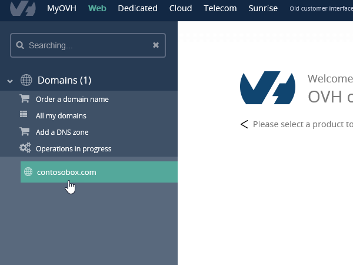
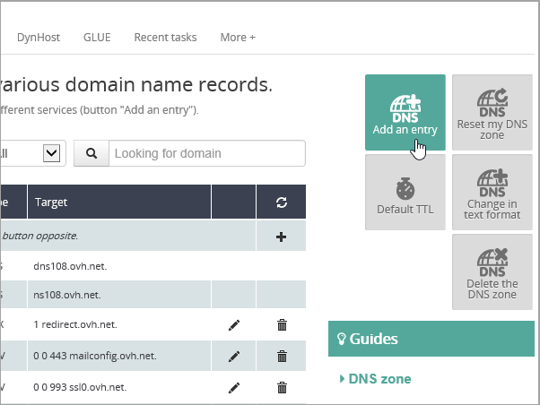
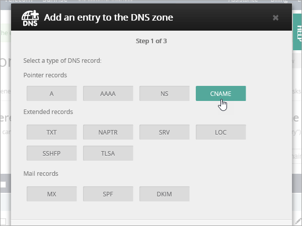

# 在 OVH 建立 Office 365 的 DNS 記錄

[檢查網域的常見問題集](../setup/domains-faq.md) ：供您在找不到所需功能時參考。 
  
如果 OVH 是您 DNS 主機服務提供者，請遵循本篇文章以驗證您的網域和設定 DNS 記錄的電子郵件、 Skype for Business Online 等等中的步驟。
  
以下是要新增的主要記錄。 
  
- [在 OVH 建立 Office 365 的 DNS 記錄](#create-dns-records-at-ovh-for-office-365)
    
- [新增 MX 記錄，以將寄往您網域的電子郵件轉至 Office 365](#add-an-mx-record-so-email-for-your-domain-will-come-to-office-365)
    
- [新增 Office 365 所需的 CNAME 記錄](#add-the-cname-records-that-are-required-for-office-365)
    
- [新增 SPF 的 TXT 記錄以協助防範垃圾郵件](#add-a-txt-record-for-spf-to-help-prevent-email-spam)
    
- [新增兩筆 Office 365 所需的 SRV 記錄](#add-the-two-srv-records-that-are-required-for-office-365)
    
在 OVH 新增這些記錄之後，您的網域就會設定為搭配 Office 365 服務。
  
若要了解使用 Office 365 網站的虛擬主機和 DNS，請參閱[搭配 Office 365 使用公用網站](https://support.office.com/article/a8178510-501d-4bd8-9921-b04f2e9517a5.aspx)。
  
> [!NOTE]
>  DNS 變更生效通常約需 15 分鐘的時間。而如果您所做的變更要在整個網際網路 DNS 系統中生效，有時可能需要更久的時間。在您新增 DNS 記錄後，如有郵件流程或其他方面的問題，請參閱[變更網域名稱或 DNS 記錄之後所發生問題的疑難排解](../get-help-with-domains/find-and-fix-issues.md)。 
  
## 新增 TXT 記錄以供驗證

在您將自己的網域用於 Office 365 之前，我們必須先確認您擁有該網域。如果您能在自己的網域註冊機構登入自己的帳戶並能建立 DNS 記錄，Office 365 就能確信您擁有該網域。
  
> [!NOTE]
> 這筆記錄只會用於驗證您擁有自己的網域，不會影響其他項目。您可以選擇稍後再刪除記錄。 
  
1. 若要開始，使用[此連結](https://www.ovh.com/manager/)移至您在 OVH 中的網域頁面。 You'll be prompted to log in.
    
    
  
2. 在 [**網域**] 中，選取您想要編輯的網域名稱。
    
    
  
3. 選取 [ **DNS 區域**。
    
    
  
4. 選取 [**新增項目**。
    
    
  
5. 選取 [ **TXT**
    
    
  
6. In the boxes for the new record, type or copy and paste the values from the following table. 若要指派 [TTL] 值，從下拉式清單] 清單中，選擇 [**個人化**，然後在文字方塊中輸入的值。 
    
    |**記錄類型**|**子網域**|**TTL**|**值**|
    |:-----|:-----|:-----|:-----|
    |TXT    |(保留空白)    |3600 （秒）    |MS = msxxxxxxxx    **附註：** 這是範例。 Use your specific **Destination or Points to Address** value here, from the table in Office 365.           [How do I find this?](../get-help-with-domains/information-for-dns-records.md)          |
   
7. 選取 [**確認**]。 
    
    
  
8. 繼續進行之前，請先稍候幾分鐘，好讓您剛剛建立的記錄能在網際網路上更新。
    
Now that you've added the record at your domain registrar's site, you'll go back to Office 365 and request Office 365 to look for the record.
  
When Office 365 finds the correct TXT record, your domain is verified.
  
1. 在系統管理中心，移至 [**設定** \> <a href="https://go.microsoft.com/fwlink/p/?linkid=834818" target="_blank">網域</a>] 頁面。
    
2. 在 [**網域**] 頁面上，選取您要驗證的網域。 
    
    
  
3. 在 [**安裝**] 頁面上，選取 [**啟動安裝程式**。
    
    
  
4. 在 [**驗證網域**] 頁面上，選取 [**驗證**]。
    
    
  
> [!NOTE]
>  DNS 變更生效通常約需 15 分鐘的時間。而如果您所做的變更要在整個網際網路 DNS 系統中生效，有時可能需要更久的時間。在您新增 DNS 記錄後，如有郵件流程或其他方面的問題，請參閱[變更網域名稱或 DNS 記錄之後所發生問題的疑難排解](../get-help-with-domains/find-and-fix-issues.md)。 
  
## 新增 MX 記錄，以將寄往您網域的電子郵件轉至 Office 365

1. 若要開始，使用[此連結](https://www.ovh.com/manager/)移至您在 OVH 中的網域頁面。 You'll be prompted to log in.
    
    
  
2. 在 [**網域**] 中，選取您想要編輯的網域名稱。
    
    
  
3. 選取 [ **DNS 區域**。
    
    
  
4. 選取 [**新增項目**。
    
    
  
5. 選取 [ **MX**]。
    
    
  
6. In the boxes for the new record, type or copy and paste the values from the following table. 若要指派 [TTL] 值，從下拉式清單] 清單中，選擇 [**個人化**，然後在文字方塊中輸入的值。 
    
    > [!NOTE]
    > 根據預設 OVH 會使用相對的表示法的目標，目標記錄的結尾加入的網域名稱。 改為使用絕對的標記法，請將句點新增至目標記錄下表所示。 
  
    |**記錄類型**|**子網域**|**TTL**|**優先順序**|**Target**|
    |:-----|:-----|:-----|:-----|:-----|
    |MX    |(保留空白)    |3600 （秒）    |10     如需關於優先順序的詳細資訊，請參閱[什麼是 MX 優先順序？](https://support.office.com/article/2784cc4d-95be-443d-b5f7-bb5dd867ba83.aspx)   |\<網域金鑰\>。 mail.protection.outlook.com。    **附註：** 取得您*\<網域金鑰\>* 從您的 Office 365 帳戶。  [How do I find this?](../get-help-with-domains/information-for-dns-records.md)  |
   
    
  
7. 選取 **[下一步]**。
    
    ![OVH MX 記錄，選取 [下一步]](../media/4db62d07-0dc4-49f6-bd19-2b4a07fd764a.png)
  
8. 選取 [**確認**]。
    
    
  
9. 如果有任何其他 MX 記錄，請將它們刪除所有的**DNS 區域**] 頁面上的清單。 選取 [每一筆記錄，然後在 [**動作**] 欄中，選取 [資源回收筒可以**刪除**圖示。 
    
    
  
10. 選取 [**確認**]。
    
## 新增 Office 365 所需的 CNAME 記錄

1. 若要開始，使用[此連結](https://www.ovh.com/manager/)移至您在 OVH 中的網域頁面。 You'll be prompted to log in.
    
    
  
2. 在 [**網域**] 中，選取您想要編輯的網域名稱。
    
    
  
3. 選取 [ **DNS 區域**。
    
    
  
4. 選取 [**新增項目**。
    
    
  
5. 選取 [ **CNAME**]。
    
    
  
6. 建立第一筆 CNAME 記錄。
    
    在每一筆新記錄的方塊中，輸入或複製並貼上下表第一列中的值。 若要指派 [TTL] 值，從下拉式清單] 清單中，選擇 [**個人化**，然後在文字方塊中輸入的值。 
    
    |**記錄類型**|**子網域**|**Target**|**TTL**|
    |:-----|:-----|:-----|:-----|
    |CNAME    |autodiscover    |autodiscover.outlook.com。    |3600 秒    |
    |CNAME    |sip    |sipdir.online.lync.com>。    |3600 秒    |
    |CNAME    |lyncdiscover    |webdir.online.lync.com>。    |3600 秒    |
    |CNAME    |enterpriseregistration    |enterpriseregistration.windows.net>。    |3600 秒    |
    |CNAME    |enterpriseenrollment    |enterpriseenrollment-s.manage.microsoft.com。    |3600 秒    |
   
    
  
7. 選取 **[下一步]**。
    
    ![OVH 新增 CNAME 值和選取 [下一步]](../media/f9481cb1-559d-4da1-9643-9cacb0d80d29.png)
  
8. 選取 [**確認**]。
    
9. 重複上述步驟建立其他五筆 CNAME 記錄。
    
    每一筆記錄，輸入或複製並貼入該記錄的方塊中的表格中下一列中的值。
    
## 新增 SPF 的 TXT 記錄以協助防範垃圾郵件

> [!IMPORTANT]
> You cannot have more than one TXT record for SPF for a domain. If your domain has more than one SPF record, you'll get email errors, as well as delivery and spam classification issues. If you already have an SPF record for your domain, don't create a new one for Office 365. Instead, add the required Office 365 values to the current record so that you have a  *single*  SPF record that includes both sets of values. 
  
1. 若要開始，使用[此連結](https://www.ovh.com/manager/)移至您在 OVH 中的網域頁面。 You'll be prompted to log in.
    
    
  
2. 在 [**網域**] 中，選取您想要編輯的網域名稱。
    
    
  
3. 選取 [ **DNS 區域**。
    
    
  
4. 選取 [**新增項目**。
    
    
  
5. 選取 [ **TXT**]。
    
6. In the boxes for the new record, type or copy and paste the following values.
    
    |**記錄類型**|**子網域**|**TTL**|**TXT Value**|
    |:-----|:-----|:-----|:-----|
    |TXT    |(保留空白)    |3600 （秒）    |v=spf1 include:spf.protection.outlook.com -all    **附註：** 建議您複製並貼上這個項目，好讓所有的間距保持正確。           |
   
    
  
7. 選取 **[下一步]**。
    
    ![OVH 新增 TXT spf 記錄，然後選取 [下一步]](../media/7937eb7c-114f-479f-a916-bcbe476d6108.png)
  
8. 選取 [**確認**]。
    
    ![SPF] 和 [確認 OVH 新增 TXT 記錄](../media/649eefeb-3227-49e3-98a0-1ce19c42fa54.png)
  
## 新增兩筆 Office 365 所需的 SRV 記錄

1. 若要開始，使用[此連結](https://www.ovh.com/manager/)移至您在 OVH 中的網域頁面。 You'll be prompted to log in.
    
    
  
2. 在 [**網域**] 中，選取您想要編輯的網域名稱。
    
    
  
3. 選取 [ **DNS 區域**。
    
    
  
4. 選取 [**新增項目**。
    
    
  
5. 選取 [ **SRV**]。
    
    
  
6. 建立第一筆 SRV 記錄。
    
    在每一筆新記錄的方塊中，輸入或複製並貼上下表第一列中的值。 若要指派 [TTL] 值，從下拉式清單] 清單中，選擇 [**個人化**，然後在文字方塊中輸入的值。 
    
    |**記錄類型**|**子網域**|**優先順序**|**Weight**|**Port**|**TTL**|**Target**|
    |:-----|:-----|:-----|:-----|:-----|:-----|:-----|
    |SRV (Service) (SRV (服務))    |_sip._tls    |100    |1    |443    |3600 （秒）    |sipdir.online.lync.com>。    |
    |SRV (Service) (SRV (服務))    |_sipfederationtls._tcp    |100    |1    |5061    |3600 （秒）    |sipfed.online.lync.com。    |
       
    
  
7. 選取 **[下一步]**。
    
    ![OVH SRV 記錄選取 [下一步]](../media/cb4ad7e2-a8f0-4ab1-9797-d1b51c1d2da9.png)
  
8. 選取 [**確認**]。
    
9. 重複上述步驟建立其他 SRV 記錄。 在第二筆記錄的方塊中，輸入或複製並貼上表格中第二列的值。
    
> [!NOTE]
>  DNS 變更生效通常約需 15 分鐘的時間。而如果您所做的變更要在整個網際網路 DNS 系統中生效，有時可能需要更久的時間。在您新增 DNS 記錄後，如有郵件流程或其他方面的問題，請參閱[變更網域名稱或 DNS 記錄之後所發生問題的疑難排解](../get-help-with-domains/find-and-fix-issues.md)。 
  
