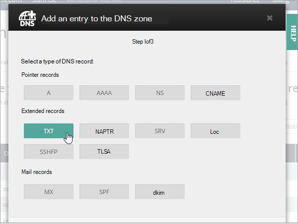
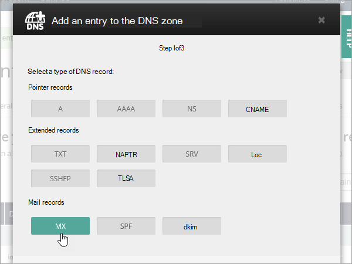
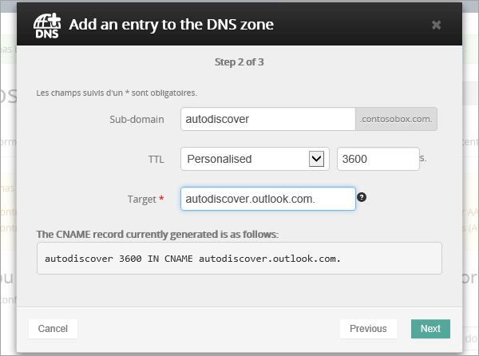
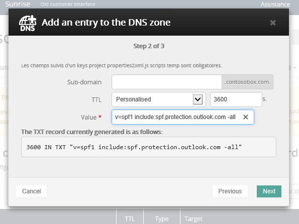
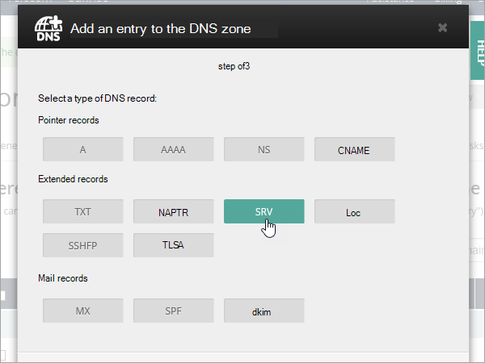

# 在 OVH 建立 Microsoft 的 DNS 記錄

[檢查網域的常見問題集](../setup/domains-faq.md) ：供您在找不到所需功能時參考。 
  
如果 OVH 是您的 DNS 主機服務提供者，請遵循本文中的步驟來驗證您的網域，並設定電子郵件、商務用 Skype Online 等的 DNS 記錄。
  
以下是要新增的主要記錄。 
  
- [在 OVH 建立 Microsoft 的 DNS 記錄](#create-dns-records-at-ovh-for-microsoft)
    
- [新增 MX 記錄，以將寄往您網域的電子郵件轉至 Microsoft](#add-an-mx-record-so-email-for-your-domain-will-come-to-microsoft)
    
- [新增 Microsoft 所需的 CNAME 記錄](#add-the-cname-records-that-are-required-for-microsoft)
    
- [新增 SPF 的 TXT 記錄以協助防範垃圾郵件](#add-a-txt-record-for-spf-to-help-prevent-email-spam)
    
- [新增兩筆 Microsoft 所需的 SRV 記錄](#add-the-two-srv-records-that-are-required-for-microsoft)
    
在 OVH 新增這些記錄之後，您的網域就會設定為與 Microsoft 服務搭配使用。

  
> [!NOTE]
>  DNS 變更生效通常約需 15 分鐘的時間。而如果您所做的變更要在整個網際網路 DNS 系統中生效，有時可能需要更久的時間。在您新增 DNS 記錄後，如有郵件流程或其他方面的問題，請參閱[變更網域名稱或 DNS 記錄之後所發生問題的疑難排解](../get-help-with-domains/find-and-fix-issues.md)。 
  
## 新增 TXT 記錄以供驗證

在您將自己的網域用於 Microsoft 之前，我們必須先確認您擁有該網域。如果您能在自己的網域註冊機構登入自己的帳戶並能建立 DNS 記錄，Microsoft 就能確信您擁有該網域。
  
> [!NOTE]
> 這筆記錄只會用於驗證您擁有自己的網域，不會影響其他項目。您可以選擇稍後再刪除記錄。 
  
1. 若要開始使用，請使用[此連結](https://www.ovh.com/manager/)移至 OVH 中您的網域頁面。 You'll be prompted to log in.
    
    
  
2. 在 [**網域**] 底下，選取您要編輯的網功能變數名稱稱。
    
    
  
3. 選取 [ **DNS 區域**]。
    
    
  
4. 選取 [**新增專案**]。
    
    
  
5. 選取**TXT**
    
    
  
6. 在新記錄的方塊中，輸入或複製並貼上下表中的值。 若要指派 TTL 值，請從下拉式清單中選擇 [**個人**化]，然後在文字方塊中輸入值。 
    
    |**記錄類型**|**子域**|**TTL**|**值**|
    |:-----|:-----|:-----|:-----|
    |TXT    |(保留空白)    |3600（秒）    |MS= msxxxxxxxx    **附註：** 這是範例。 在這裡請使用您自己來自表格的 [目的地或指向位址]**** 值。           [如何找到呢？](../get-help-with-domains/information-for-dns-records.md)          |
   
7. 選取 [**確認**]。 
    
    
  
8. 繼續進行之前，請先稍候幾分鐘，好讓您剛剛建立的記錄能在網際網路上更新。
    
現在您已在網域註冊機構網站新增記錄，請返回 Microsoft 並要求該記錄。
  
在 Microsoft 找到正確的 TXT 記錄後，您的網域就完成驗證了。
  
1. 在系統管理中心中，移至 **[設定]** \> <a href="https://go.microsoft.com/fwlink/p/?linkid=834818" target="_blank">[網域]</a> 頁面。
    
2. 在 **[網域]** 頁面上，選取您要驗證的網域。 
    
    
  
3. 在 **[設定]** 頁面上，選取 **[開始設定]**。
    
    
  
4. 在 **[驗證網域]** 頁面上，選取 **[驗證]**。
    
    
  
> [!NOTE]
>  DNS 變更生效通常約需 15 分鐘的時間。而如果您所做的變更要在整個網際網路 DNS 系統中生效，有時可能需要更久的時間。在您新增 DNS 記錄後，如有郵件流程或其他方面的問題，請參閱[變更網域名稱或 DNS 記錄之後所發生問題的疑難排解](../get-help-with-domains/find-and-fix-issues.md)。 
  
## 新增 MX 記錄，以將寄往您網域的電子郵件轉至 Microsoft

1. 若要開始使用，請使用[此連結](https://www.ovh.com/manager/)移至 OVH 中您的網域頁面。 You'll be prompted to log in.
    
    
  
2. 在 [**網域**] 底下，選取您要編輯的網功能變數名稱稱。
    
    
  
3. 選取 [ **DNS 區域**]。
    
    
  
4. 選取 [**新增專案**]。
    
    
  
5. 選取 [ **MX**]。
    
    
  
6. 在新記錄的方塊中，輸入或複製並貼上下表中的值。 若要指派 TTL 值，請從下拉式清單中選擇 [**個人**化]，然後在文字方塊中輸入值。 
    
    > [!NOTE]
    > 依預設，OVH 會對目標使用相對符號，將功能變數名稱新增至目標記錄的結尾。 若要改為使用絕對標記法，請將點新增至目標記錄，如下表所示。 
  
    |**記錄類型**|**子域**|**TTL**|**優先順序**|**Target** (目標)|
    |:-----|:-----|:-----|:-----|:-----|
    |MX    |(保留空白)    |3600（秒）    |10     如需關於優先順序的詳細資訊，請參閱[什麼是 MX 優先順序？](https://support.office.com/article/2784cc4d-95be-443d-b5f7-bb5dd867ba83.aspx)   |\<網域金鑰\>。 mail.protection.outlook.com    **附注：** 從您的 Microsoft 帳戶取得您* \<的網域金鑰\> * 。  [如何找到呢？](../get-help-with-domains/information-for-dns-records.md)  |
   
    
  
7. 選取 [下一步]****。
    
    ![OVH MX 記錄選取 [下一步]](../../media/4db62d07-0dc4-49f6-bd19-2b4a07fd764a.png)
  
8. 選取 [**確認**]。
    
    ![OVH MX 記錄選取 [確認]](../../media/090bfb11-a753-4af0-8982-582a4069a169.png)
  
9. 如果有任何其他 MX 記錄，請在 [ **DNS 區域**] 頁面上的清單中全部刪除。 選取每一筆記錄，然後在 [**動作**] 欄中，選取 [垃圾箱] [可**刪除**] 圖示。 
    
    
  
10. 選取 [**確認**]。
    
## 新增 Microsoft 所需的 CNAME 記錄

1. 若要開始使用，請使用[此連結](https://www.ovh.com/manager/)移至 OVH 中您的網域頁面。 You'll be prompted to log in.
    
    
  
2. 在 [**網域**] 底下，選取您要編輯的網功能變數名稱稱。
    
    
  
3. 選取 [ **DNS 區域**]。
    
    
  
4. 選取 [**新增專案**]。
    
    
  
5. 選取 [ **CNAME**]。
    
    
  
6. 建立第一筆 CNAME 記錄。
    
    在每一筆新記錄的方塊中，輸入或複製並貼上下表第一列中的值。 若要指派 TTL 值，請從下拉式清單中選擇 [**個人**化]，然後在文字方塊中輸入值。 
    
    |**記錄類型**|**子域**|**Target** (目標)|**TTL**|
    |:-----|:-----|:-----|:-----|
    |CNAME    |autodiscover    |autodiscover.outlook.com。    |3600秒    |
    |CNAME    |sip    |sipdir.online.lync.com。    |3600秒    |
    |CNAME    |lyncdiscover    |webdir.online.lync.com。    |3600秒    |
    |CNAME    |enterpriseregistration    |enterpriseregistration.windows.net。    |3600秒    |
    |CNAME    |enterpriseenrollment    |enterpriseenrollment-s.manage.microsoft.com。    |3600秒    |
   
    
  
7. 選取 [下一步]****。
    
    ![OVH 新增 CNAME 值，然後選取 [下一步]](../../media/f9481cb1-559d-4da1-9643-9cacb0d80d29.png)
  
8. 選取 [**確認**]。
    
9. 重複上述步驟，以建立其他五筆 CNAME 記錄。
    
    針對每個記錄，輸入或複製並貼上表格中下一列的值，然後將其貼到該記錄的方塊中。
    
## 新增 SPF 的 TXT 記錄以協助防範垃圾郵件

> [!IMPORTANT]
> 網域的 SPF 不得擁有一個以上的 TXT 記錄。 如果您的網域具有多筆 SPF 記錄，您將收到電子郵件錯誤，以及傳送及垃圾郵件分類問題。 如果網域已經有 SPF 記錄，請勿為 Microsoft 建立一個新的記錄。 請改為將必要的 Microsoft 值新增至目前的記錄，讓您擁有包含這兩組值的*單一*SPF 記錄。 
  
1. 若要開始使用，請使用[此連結](https://www.ovh.com/manager/)移至 OVH 中您的網域頁面。 You'll be prompted to log in.
    
    
  
2. 在 [**網域**] 底下，選取您要編輯的網功能變數名稱稱。
    
    
  
3. 選取 [ **DNS 區域**]。
    
    
  
4. 選取 [**新增專案**]。
    
    
  
5. 選取 [ **TXT**]。
    
6. In the boxes for the new record, type or copy and paste the following values.
    
    |**記錄類型**|**子域**|**TTL**|**TXT Value** (TXT 值)|
    |:-----|:-----|:-----|:-----|
    |TXT    |(保留空白)    |3600（秒）    |v=spf1 include:spf.protection.outlook.com -all    **注意：** 建議您複製並貼上這個項目，好讓所有的間距保持正確。           |
   
    
  
7. 選取 [下一步]****。
    
    ![OVH 新增 SPF 的 TXT 記錄，然後選取 [下一步]](../../media/7937eb7c-114f-479f-a916-bcbe476d6108.png)
  
8. 選取 [**確認**]。
    
    
  
## 新增兩筆 Microsoft 所需的 SRV 記錄

1. 若要開始使用，請使用[此連結](https://www.ovh.com/manager/)移至 OVH 中您的網域頁面。 You'll be prompted to log in.
    
    
  
2. 在 [**網域**] 底下，選取您要編輯的網功能變數名稱稱。
    
    
  
3. 選取 [ **DNS 區域**]。
    
    
  
4. 選取 [**新增專案**]。
    
    
  
5. 選取 [ **SRV**]。
    
    
  
6. 建立第一筆 SRV 記錄。
    
    在每一筆新記錄的方塊中，輸入或複製並貼上下表第一列中的值。 若要指派 TTL 值，請從下拉式清單中選擇 [**個人**化]，然後在文字方塊中輸入值。 
    
    |**記錄類型**|**子域**|**Priority** (優先順序)|**Weight** (權數)|**Port** (連接埠)|**TTL**|**Target** (目標)|
    |:-----|:-----|:-----|:-----|:-----|:-----|:-----|
    |SRV (Service) (SRV (服務))    |_sip。 _tls    |100    |1     |443    |3600（秒）    |sipdir.online.lync.com。    |
    |SRV (Service) (SRV (服務))    |_sipfederationtls。 _tcp    |100    |1     |5061    |3600（秒）    |sipfed.online.lync.com。    |
       
    
  
7. 選取 [下一步]****。
    
    ![OVH SRV 記錄選取 [下一步]](../../media/cb4ad7e2-a8f0-4ab1-9797-d1b51c1d2da9.png)
  
8. 選取 [**確認**]。
    
9. 重複上述步驟，以建立其他 SRV 記錄。 在第二筆記錄的方塊中，輸入或複製並貼上表格中第二列的值。
    
> [!NOTE]
>  DNS 變更生效通常約需 15 分鐘的時間。而如果您所做的變更要在整個網際網路 DNS 系統中生效，有時可能需要更久的時間。在您新增 DNS 記錄後，如有郵件流程或其他方面的問題，請參閱[變更網域名稱或 DNS 記錄之後所發生問題的疑難排解](../get-help-with-domains/find-and-fix-issues.md)。 
  
