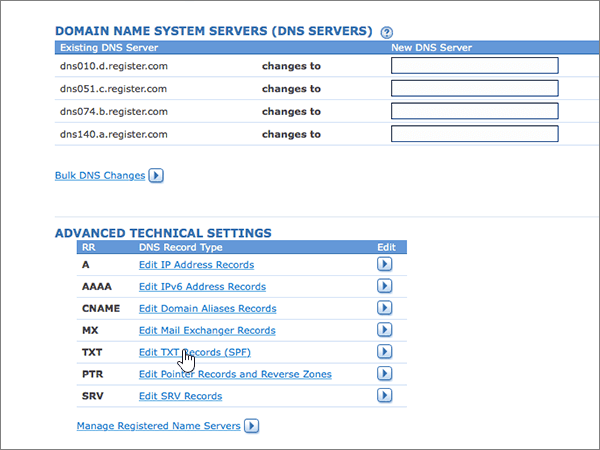

# 在 Register.com 建立 Microsoft 的 DNS 記錄Create DNS records at Register.com for Microsoft

 若您找不到所需內容，請 **[查看網域常見問題集](../setup/domains-faq.yml)**。**[Check the Domains FAQ](../setup/domains-faq.yml)** if you don't find what you're looking for. 
  
如果 Register.com 是您的 DNS 主機服務提供者，請按照本文所述的步驟驗證網域，並為電子郵件與商務用 Skype Online 等項目設定 DNS 記錄。If Register.com is your DNS hosting provider, follow the steps in this article to verify your domain and set up DNS records for email, Skype for Business Online, and so on.
  
以下是要新增的主要記錄。These are the main records to add. 請依照下列步驟操作或[觀看影片](https://support.microsoft.com/office/7448dd9e-c0e7-4d5e-a7e9-f0e4715433c4)。Follow the steps below or [watch the video](https://support.microsoft.com/office/7448dd9e-c0e7-4d5e-a7e9-f0e4715433c4).
  
- [在 Register.com 新增 TXT 記錄以驗證您擁有該網域Add a TXT record at Register.com to verify that you own the domain](#add-a-txt-record-at-registercom-to-verify-that-you-own-the-domain)
    
- [新增 MX 記錄，以將寄往您網域的電子郵件轉至 MicrosoftAdd an MX record so email for your domain will come to Microsoft](#add-an-mx-record-so-email-for-your-domain-will-come-to-microsoft)
    
- [新增 Microsoft 所需的 CNAME 記錄Add the CNAME records that are required for Microsoft](#add-the-cname-records-that-are-required-for-microsoft)
    
- [新增 SPF 的 TXT 記錄以協助防範垃圾郵件Add a TXT record for SPF to help prevent email spam](#add-a-txt-record-for-spf-to-help-prevent-email-spam)

- [新增兩筆 Microsoft 所需的 SRV 記錄Add the two SRV records that are required for Microsoft](#add-the-two-srv-records-that-are-required-for-microsoft)
    
在 Register.com 新增這些記錄之後，您的網域就會設定為與 Microsoft 服務搭配使用。After you add these records at Register.com, your domain will be set up to work with Microsoft services.
  

  
> [!NOTE]
> Typically it takes about 15 minutes for DNS changes to take effect.Typically it takes about 15 minutes for DNS changes to take effect. 然而有時可能需要更久的時間，您所做的變更才能在整個網際網路的 DNS 系統中生效。However, it can occasionally take longer for a change you've made to update across the Internet's DNS system. 在您新增 DNS 記錄後，如有郵件流程或其他方面的問題，請參閱[尋找並修正新增網域或 DNS 記錄之後所發生的問題](../get-help-with-domains/find-and-fix-issues.md)。If you're having trouble with mail flow or other issues after adding DNS records, see [Find and fix issues after adding your domain or DNS records](../get-help-with-domains/find-and-fix-issues.md). 
  
## 在 Register.com 新增 TXT 記錄以驗證您擁有該網域Add a TXT record at Register.com to verify that you own the domain

在您將自己的網域用於 Microsoft 之前，我們必須先確認您擁有該網域。如果您能在自己的網域註冊機構登入自己的帳戶並能建立 DNS 記錄，Microsoft 就能確信您擁有該網域。Before you use your domain with Microsoft, we have to make sure that you own it. Your ability to log in to your account at your domain registrar and create the DNS record proves to Microsoft that you own the domain.
  
> [!NOTE]
> 這筆記錄只會用於驗證您擁有自己的網域，不會影響其他項目。您可以選擇稍後再刪除記錄。This record is used only to verify that you own your domain; it doesn't affect anything else. You can delete it later, if you like. 
  
請依照下列步驟操作或[觀看影片 (從 0:44 處開始)](https://support.microsoft.com/office/7448dd9e-c0e7-4d5e-a7e9-f0e4715433c4)。Follow the steps below or [watch the video (start at 0:44)](https://support.microsoft.com/office/7448dd9e-c0e7-4d5e-a7e9-f0e4715433c4).
  
1. 首先請用[這個連結](https://www.register.com/myaccount/)移至 Register.com 上您的網域頁面。系統會提示您先登入。To get started, go to your domains page at Register.com by using [this link](https://www.register.com/myaccount/). You'll be prompted to sign in.
    
2. Select **Domains**.Select **Domains**.
    
3. 選取 [ **管理**]。Select **Manage**.
    
4. 尋找包含您要修改的功能變數名稱的列;然後在該資料列中，選取 [ **管理**]。Find the row that contains the name of the domain that you want to modify; and then, in that row, select **Manage**.
    
5. 向下滾動至 [ **高級技術設定** ] 區段，然後選取 [ **編輯 TXT 記錄 (SPF)**]。Scroll down to the **Advanced Technical Settings** section, and then select **Edit TXT Records (SPF)**.
    
6. In the boxes for the new record, type or copy and paste the values from the following table.In the boxes for the new record, type or copy and paste the values from the following table.
    
    |||
    |:-----|:-----|
    |**Host Name****Host Name**   |**TXT Record****TXT Record**   |
    |@    |MS=ms *XXXXXXXX*MS=ms *XXXXXXXX*    **附註：** 這是範例。**Note:** This is an example. 在這裡請使用您自己來自表格的 **[目的地或指向位址]** 值。Use your specific **Destination or Points to Address** value here, from the table. [如何找到呢？How do I find this?](../get-help-with-domains/information-for-dns-records.md)          |
   
7. 選取 [ **繼續**]。Select **Continue**.
    
8. 在下一個頁面上，選取 [ **繼續** ]，以確認您的變更。On the next page, select **Continue** again to confirm your changes. 
    
9. 繼續進行之前，請先稍候幾分鐘，好讓您剛剛建立的記錄能在網際網路上更新。Wait a few minutes before you continue, so that the record you just created can update across the Internet.
    
現在您已在網域註冊機構網站新增記錄，請返回 Microsoft 並要求該記錄。Now that you've added the record at your domain registrar's site, you'll go back to Microsoft and request the record.
  
在 Microsoft 找到正確的 TXT 記錄後，您的網域就完成驗證了。When Microsoft finds the correct TXT record, your domain is verified.
  
1. 在系統管理中心中，移至 **[設定]** \> <a href="https://go.microsoft.com/fwlink/p/?linkid=834818" target="_blank">[網域]</a> 頁面。In the admin center, go to the **Settings** \> <a href="https://go.microsoft.com/fwlink/p/?linkid=834818" target="_blank">Domains</a> page.
    
2. 在 **[網域]** 頁面上，選取您要驗證的網域。On the **Domains** page, select the domain that you are verifying. 
    
3. 在 **[設定]** 頁面上，選取 **[開始設定]**。On the **Setup** page, select **Start setup**.
    
4. 在 **[驗證網域]** 頁面上，選取 **[驗證]**。On the **Verify domain** page, select **Verify**.
    
> [!NOTE]
> Typically it takes about 15 minutes for DNS changes to take effect.Typically it takes about 15 minutes for DNS changes to take effect. 然而有時可能需要更久的時間，您所做的變更才能在整個網際網路的 DNS 系統中生效。However, it can occasionally take longer for a change you've made to update across the Internet's DNS system. 在您新增 DNS 記錄後，如有郵件流程或其他方面的問題，請參閱[尋找並修正新增網域或 DNS 記錄之後所發生的問題](../get-help-with-domains/find-and-fix-issues.md)。If you're having trouble with mail flow or other issues after adding DNS records, see [Find and fix issues after adding your domain or DNS records](../get-help-with-domains/find-and-fix-issues.md). 
  
## 新增 MX 記錄，以將寄往您網域的電子郵件轉至 MicrosoftAdd an MX record so email for your domain will come to Microsoft

請依照下列步驟操作或[觀看影片 (從 3:32 處開始)](https://support.microsoft.com/office/7448dd9e-c0e7-4d5e-a7e9-f0e4715433c4)。Follow the steps below or [watch the video (start at 3:32)](https://support.microsoft.com/office/7448dd9e-c0e7-4d5e-a7e9-f0e4715433c4).
  
1. 首先請用[這個連結](https://www.register.com/myaccount/)移至 Register.com 上您的網域頁面。系統會提示您先登入。To get started, go to your domains page at Register.com by using [this link](https://www.register.com/myaccount/). You'll be prompted to sign in.
    
2. Select **Domains**.Select **Domains**.
    
3. 選取 [ **管理**]。Select **Manage**.
    
4. 尋找包含您要修改的功能變數名稱的列;然後在該資料列中，選取 [ **管理**]。Find the row that contains the name of the domain that you want to modify; and then, in that row, select **Manage**.
    
5. 流覽至 [ **高級技術設定** ] 區段，然後選取 [ **編輯郵件交換器記錄**]。Scroll to the **Advanced Technical Settings** section, and then select **Edit Mail Exchanger Records**.
    
    ![選取 [編輯郵件交換器] 記錄](../../media/366b96a1-9147-4bbb-9f8f-50856466cc61.png)
  
6. 在新記錄的方塊中，輸入或複製並貼上下表中的值。In the boxes for the new record, type or copy and paste the values from the following table.
    
     (從下拉式清單中選擇 [ **優先順序** ] 值。 ) (Choose the **Priority** value from the drop-down list.) 
    
    |主機名稱 \* \* \* \*\*\*\*\*Host Name\*\*\*\*|優先順序 \* \* \* \*\*\*\*\*Priority\*\*\*\*|郵件伺服器 \* \* \* \*\*\*\*\*Mail Server\*\*\*\*|
    |:-----|:-----|:-----|
    |@    |High (高)High    如需關於優先順序的詳細資訊，請參閱[什麼是 MX 優先順序？](../setup/domains-faq.yml)For more information about priority, see [What is MX priority?](../setup/domains-faq.yml)   | *\<domain-key\>*  .mail.protection.outlook.com*\<domain-key\>*  .mail.protection.outlook.com      **注意：** 從您的 Microsoft 帳戶取得您的 \<*domain-key*\>。**Note:** Get your \<*domain-key*\> from your Microsoft account.   [如何找到呢？How do I find this?](../get-help-with-domains/information-for-dns-records.md)          |
   
    
  
7. 如果已經列出任何其他 MX 記錄，請逐一選取要刪除的記錄。If there were any other MX records already listed, select each of those records to be deleted.
    
    
  
8. 選取 [ **繼續**]。Select **Continue**.
    
    ![選取 [繼續]](../../media/6ef6ce01-ce21-4e3c-8209-4aa9a3dd4b76.png)
  
9. 在下一個頁面上，選取 [ **繼續** ] 以確認並儲存您的變更。On the next page, select **Continue** again to confirm and save your changes. 
    
    ![選取 [繼續]](../../media/adba4a60-bf61-44fc-9ad9-360e66f8a2ee.png)
  
## 新增 Microsoft 所需的 CNAME 記錄Add the CNAME records that are required for Microsoft

請依照下列步驟操作或[觀看影片 (從 4:23 處開始)](https://support.microsoft.com/office/7448dd9e-c0e7-4d5e-a7e9-f0e4715433c4)。Follow the steps below or [watch the video (start at 4:23)](https://support.microsoft.com/office/7448dd9e-c0e7-4d5e-a7e9-f0e4715433c4).
  
1. 首先請用[這個連結](https://www.register.com/myaccount/)移至 Register.com 上您的網域頁面。系統會提示您先登入。To get started, go to your domains page at Register.com by using [this link](https://www.register.com/myaccount/). You'll be prompted to sign in.
    
2. Select **Domains**.Select **Domains**.
    
3. 選取 [ **管理**]。Select **Manage**.
    
4. 尋找包含您要修改的功能變數名稱的列;然後在該資料列中，選取 [ **管理**]。Find the row that contains the name of the domain that you want to modify; and then, in that row, select **Manage**.
    
5. 流覽至 [ **高級技術設定** ] 區段，然後選取 [ **編輯網域別名記錄**]。Scroll to the **Advanced Technical Settings** section, and then select **Edit Domain Aliases Records**.
    
    ![選取 [編輯網域別名記錄]](../../media/9fbc31ed-d67c-4828-8bd4-b51068f1e0ca.png)
  
6. 選取 [ **新增更多網域別名**]。Select **Add more domain aliases**.
    
    ![選取 [新增更多網域別名]](../../media/b787505f-5566-4879-8552-13f9e89cbf6b.png)
  
7. 新增所需的 CNAME 記錄。Add the required CNAME records.
    
    在每一筆新記錄的方塊中，輸入或複製並貼上下表第一列中的值。In the boxes for the new record, type or copy and paste the values from the first row of the following table.
    
    |第一個欄位 (未標記) \* \* \* \* \*\*\*\*\*First field (unlabeled)\*\*\*\*|指向 \* \* \* \*\*\*\*\*Points to\*\*\*\*|
    |:-----|:-----|
    |autodiscoverautodiscover    |autodiscover.outlook.comautodiscover.outlook.com       |
    |sipsip    |sipdir.online.lync.comsipdir.online.lync.com       |
    |lyncdiscoverlyncdiscover    |webdir.online.lync.comwebdir.online.lync.com      |
    |enterpriseregistrationenterpriseregistration    |enterpriseregistration.windows.netenterpriseregistration.windows.net       |
    |enterpriseenrollmententerpriseenrollment    |enterpriseenrollment-s.manage.microsoft.comenterpriseenrollment-s.manage.microsoft.com       |
   
     
  
8. 當您已新增所需的所有 CNAME 記錄後，請選取 [ **繼續**]。When you have added all of the CNAME records that you need, select **Continue**.
    
    ![選取 [繼續]](../../media/1942612b-338a-48fa-a45d-2d5434516723.png)
  
9. 在下一個頁面上，選取 [ **繼續** ] 以確認並儲存您的變更。On the next page, select **Continue** again to confirm and save your changes. 
    
    ![選取 [繼續]](../../media/3342b570-0633-49c5-9175-5cc8e4a67b53.png)
  
## 新增 SPF 的 TXT 記錄以協助防範垃圾郵件Add a TXT record for SPF to help prevent email spam

> [!IMPORTANT]
> 網域的 SPF 不得擁有一個以上的 TXT 記錄。You cannot have more than one TXT record for SPF for a domain. 如果您的網域具有多筆 SPF 記錄，您將收到電子郵件錯誤，以及傳送及垃圾郵件分類問題。If your domain has more than one SPF record, you'll get email errors, as well as delivery and spam classification issues. 如果網域已經有 SPF 記錄，請勿為 Microsoft 建立一個新的記錄。If you already have an SPF record for your domain, don't create a new one for Microsoft. 而是，請將必要的 Microsoft 值新增到目前的記錄，以便擁有包含這兩組值的單一 SPF 記錄。Instead, add the required Microsoft values to the current record so that you have a single SPF record that includes both sets of values.  
  
請依照下列步驟操作或[觀看影片 (從 5:12 處開始)](https://support.microsoft.com/office/7448dd9e-c0e7-4d5e-a7e9-f0e4715433c4)。Follow the steps below or [watch the video (start at 5:12)](https://support.microsoft.com/office/7448dd9e-c0e7-4d5e-a7e9-f0e4715433c4).
  
1. 首先請用[這個連結](https://www.register.com/myaccount/)移至 Register.com 上您的網域頁面。系統會提示您先登入。To get started, go to your domains page at Register.com by using [this link](https://www.register.com/myaccount/). You'll be prompted to sign in.
    
2. Select **Domains**.Select **Domains**.
    
3. 選取 [ **管理**]。Select **Manage**.
    
4. 尋找包含您要修改的功能變數名稱的列;然後在該資料列中，選取 [ **管理**]。Find the row that contains the name of the domain that you want to modify; and then, in that row, select **Manage**.
    
5. 滾動至 [ **高級技術設定** ] 區段，然後選取 [ **編輯 TXT 記錄 (SPF)**]。Scroll to the **Advanced Technical Settings** section, and then select **Edit TXT Records (SPF)**.
    
    
  
6. 在新記錄的方塊中，輸入或複製並貼上下表中的值。In the boxes for the new record, type or copy and paste the values from the following table.
    
    |主機名稱 \* \* \* \*\*\*\*\*Host Name\*\*\*\*|TXT 記錄 \* \* \* \*\*\*\*\*TXT Record\*\*\*\*|
    |:-----|:-----|
    |@    |v=spf1 include:spf.protection.outlook.com -allv=spf1 include:spf.protection.outlook.com -all    **注意：** 建議您複製並貼上這個項目，好讓所有的間距保持正確。**Note:** We recommend copying and pasting this entry, so that all of the spacing stays correct.  |
   
     
  
7. 選取 [ **繼續**]。Select **Continue**.
    
    ![選取 [繼續]](../../media/08250c98-1a86-48a8-ad94-f96cf338126b.png)
  
8. 在下一個頁面上，選取 [ **繼續** ] 以確認並儲存您的變更。On the next page, select **Continue** again to confirm and save your changes. 
    
    ![選取 [繼續]](../../media/56be3b0a-dc71-471c-9be3-6ab927296f67.png)
  
## 新增兩筆 Microsoft 所需的 SRV 記錄Add the two SRV records that are required for Microsoft

請依照下列步驟操作或[觀看影片 (從 5:55 處開始)](https://support.microsoft.com/office/7448dd9e-c0e7-4d5e-a7e9-f0e4715433c4)。Follow the steps below or [watch the video (start at 5:55)](https://support.microsoft.com/office/7448dd9e-c0e7-4d5e-a7e9-f0e4715433c4).
  
1. 首先請用[這個連結](https://www.register.com/myaccount/)移至 Register.com 上您的網域頁面。系統會提示您先登入。To get started, go to your domains page at Register.com by using [this link](https://www.register.com/myaccount/). You'll be prompted to sign in.
    
2. Select **Domains**.Select **Domains**.
    
3. 選取 [ **管理**]。Select **Manage**.
    
4. 尋找包含您要修改的功能變數名稱的列;然後在該資料列中，選取 [ **管理**]。Find the row that contains the name of the domain that you want to modify; and then, in that row, select **Manage**.
    
5. 滾動至 [ **高級技術設定** ] 區段，然後選取 [ **編輯 SRV 記錄**]。Scroll to the **Advanced Technical Settings** section, and then select **Edit SRV Records**.
    
    ![選取 [編輯 SRV 記錄]](../../media/73c149ae-f0d6-460e-880a-7e04a995acc3.png)
  
6. 新增兩筆 SRV 記錄的第一筆：Add the first of the two SRV records:
    
    在每一筆新記錄的方塊中，輸入或複製並貼上下表第一列中的值。In the boxes for the new record, type or copy and paste the values from the first row of the following table.
    
     (從下拉式清單中選擇 [ **優先順序** ] 值。 ) (Choose the **Priority** value from the drop-down list.) 
    
    |服務 \* \* \* \*\*\*\*\*Service\*\*\*\*|Proto \* \* \* \*\*\*\*\*Proto\*\*\*\*|\*\*\*\*名稱\*\*\*\*\*\*\*\*Name\*\*\*\*|優先順序 \* \* \* \*\*\*\*\*Priority\*\*\*\*|體重 \* \* \* \*\*\*\*\*Weight\*\*\*\*|埠 \* \* \* \*\*\*\*\*Port\*\*\*\*|目標 \* \* \* \*\*\*\*\*Target\*\*\*\*|
    |:-----|:-----|:-----|:-----|:-----|:-----|:-----|
    |_sip_sip    |_tls_tls    |@    |High (高)High    |11    |443443    |sipdir.online.lync.comsipdir.online.lync.com       |
    |_sipfederationtls_sipfederationtls    |_tcp_tcp    |@    |High (高)High    |11    |50615061    |sipfed.online.lync.comsipfed.online.lync.com       |
   
    
  
7. 選取 [ **新增更多 SRV 記錄**]。Select **Add more SRV records**.
    
    ![選取 [新增更多 SRV 記錄]](../../media/823c6bd2-4af7-4079-bf8c-8d35a5c6730f.png)
  
8. 新增第二筆 SRV 記錄：Add the second SRV record:
    
    在第二筆記錄的方塊中，輸入或複製並貼上表格中第二列的值。Type or copy and paste the values from the second row of the table above into the boxes for the second record.
    
9. 當您新增這兩個 SRV 記錄時，請選取 [ **繼續**]。When you have added both of the SRV records, select **Continue**.
    
    ![選取 [繼續]](../../media/008b255a-42d3-442d-83ea-3ffcb7c8fc5d.png)
  
10. 在下一個頁面上，選取 [ **繼續** ] 以確認並儲存您的變更。On the next page, select **Continue** again to confirm and save your changes. 
    
    ![選取 [繼續]](../../media/b4166e3d-7e4b-41ef-b616-747e95aefc37.png)
  
> [!NOTE]
> Typically it takes about 15 minutes for DNS changes to take effect.Typically it takes about 15 minutes for DNS changes to take effect. 然而有時可能需要更久的時間，您所做的變更才能在整個網際網路的 DNS 系統中生效。However, it can occasionally take longer for a change you've made to update across the Internet's DNS system. 在您新增 DNS 記錄後，如有郵件流程或其他方面的問題，請參閱[尋找並修正新增網域或 DNS 記錄之後所發生的問題](../get-help-with-domains/find-and-fix-issues.md)。If you're having trouble with mail flow or other issues after adding DNS records, see [Find and fix issues after adding your domain or DNS records](../get-help-with-domains/find-and-fix-issues.md). 
