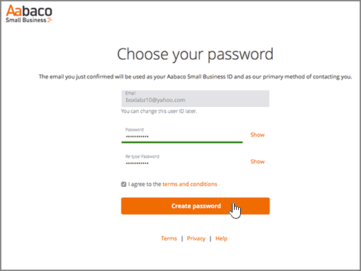

# 在 Yahoo!Create DNS records at Yahoo! Small Business 建立 Office 365 的 DNS 記錄Small Business for Office 365

 若您找不到所需內容，請**[查看網域常見問題集](../setup/domains-faq.md)**。**[Check the Domains FAQ](../setup/domains-faq.md)** if you don't find what you're looking for. 
  
如果 Yahoo! Small Business 一直是您的 DNS 主機服務提供者，請注意，您的提供者現在應該是 Aabaco Small Business。If Yahoo! Small Business has been your DNS hosting provider, you should be aware that your provider is now Aabaco Small Business.
  
請依照本文中的步驟建立 Aabaco 帳戶，以在 Aabaco 變更 DNS 設定並為您的網域續約。Follow the steps in this article to create an account at Aabaco, where you can make DNS changes and renew your domain or domains.
  
您可以[建立 DNS 記錄](../get-help-with-domains/create-dns-records-at-any-dns-hosting-provider.md)之前，您必須建立 Aabaco 帳戶。You must create your Aabaco account before you can [create DNS records](../get-help-with-domains/create-dns-records-at-any-dns-hosting-provider.md).

  
## 建立 Aabaco Small Business 帳戶Create an Aabaco Small Business account

1. 若要開始，移至您的網域頁面，以在 Aabaco [使用[此連結](https://www.luminate.com/services/)，然後選取 [**設定您的 Aabaco Small Business 帳戶**。To get started, go to your domains page at Aabaco by using [this link](https://www.luminate.com/services/), and select **Setup your Aabaco Small Business account**.
    
    
  
2. 提供您的 Yahoo!Provide your Yahoo! Small Business**電子郵件 /yahoo 識別碼**，，然後選取 [ **I 'm not a robot 不**。Small Business **Email/Yahoo ID**, and then select **I'm not a robot**.
    
    
  
3. 選取 [**開始**]。Select **Get started**.
    
    
  
4. 登入您的 Yahoo!Sign in to your Yahoo! Small Business 電子郵件帳戶，並從 Aabaco Small Business 開啟新的電子郵件。Small Business email account and open the new email from Aabaco Small Business.
    
    > [!NOTE]
    > 重新傳送郵件，若有必要，請選擇 [**重新傳送電子郵件連結**在**您已取得最新產品郵件**] 頁面上。Resend the message, if necessary, by choosing the **resend the email link** on the **You've got mail** page. 
  
    
  
5. 在 Aabaco**確認您的電子郵件地址，若要繼續執行安裝程式**電子郵件訊息中，選取 [**確認電子郵件**]。In the Aabaco **Confirm your email address to continue setup** email message, select **Confirm email**.
    
    
  
6. 在 [**選擇您的密碼**] 頁面中，輸入或複製並貼上您想要使用的 Aabaco 帳戶的密碼。On the **Choose your password** page, type or copy and paste the password that you want to use for your Aabaco account. 
    
    > [!NOTE]
    > 您可以使用與 Yahoo! Small Business 帳戶相同的密碼。You can use the same password that you used with your Yahoo! Small Business account. 
  
    
  
7. 選取 [**我同意這些條款和條件**]，然後再選取 [**建立密碼**。Select **I agree to the terms and conditions**, and then select **Create password**.
    
    
  
8. 登入您的 Yahoo!Sign in to your Yahoo! Small Business 電子郵件帳戶，然後從 Aabaco Small Business 開啟新的電子郵件。Small Business email account, and then open the new email from Aabaco Small Business.
    
    > [!NOTE]
    > 重新傳送郵件，如有必要，選擇 [上的 [**重新傳送電子郵件連結\*\*\*\*幾乎大功告成 ！**Resend the message, if necessary, by choosing the **resend the email link** on the **You're almost done!** 頁面。page. 
  
    
  
9. 在 Aabaco**後幾乎有**電子郵件訊息中，選取 [**啟用我的帳戶**]。In the Aabaco **You're almost there** email message, select **Activate my account**.
    
    
  
10. 登入您的 Aabaco Small Business 帳戶。Sign in to your Aabaco Small Business account.
    
    
  
現在您已建立 Aabaco 帳戶，接著可以[在 Aabaco Small Business for Office 365 建立 DNS記錄](../get-help-with-domains/create-dns-records-at-any-dns-hosting-provider.md)。Now that you have created your Aabaco account, you can [Create DNS records at Aabaco Small Business for Office 365](../get-help-with-domains/create-dns-records-at-any-dns-hosting-provider.md).
  
