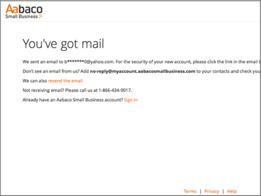

# 在 Yahoo! Small Business 建立 Office 365 的 DNS 記錄

 若您找不到所需功能，請**[檢查網域常見問題集](../setup/domains-faq.md)**。 
  
如果 Yahoo! Small Business 一直是您的 DNS 主機服務提供者，請注意，您的提供者現在應該是 Aabaco Small Business。
  
請依照本文中的步驟建立 Aabaco 帳戶，以在 Aabaco 變更 DNS 設定並為您的網域續約。
  
您必須先建立 Aabaco 帳戶，才能[建立 DNS 記錄](../get-help-with-domains/create-dns-records-at-any-dns-hosting-provider.md)。

  
## 建立 Aabaco Small Business 帳戶

1. 若要開始，請使用[此連結](https://www.luminate.com/services/)移至 Aabaco 上您的網域頁面，並選取**設定 Aabaco Small Business 帳戶**。
    
    ![選取 [設定 Aabaco Small Business 帳戶]](../../media/d708f272-d42f-40a1-9aaf-d05d8cfd55cf.png)
  
2. 提供您的 Yahoo! 小型企業**電子郵件/YAHOO 識別碼**，然後選取 [**我不是自動機**]。
    
    
  
3. 選取 [**開始**]。
    
    ![選取 [入門]](../../media/6674707d-c222-4f0d-bec4-229d39ab2499.png)
  
4. 登入您的 Yahoo! Small Business 電子郵件帳戶，並從 Aabaco Small Business 開啟新的電子郵件。
    
    > [!NOTE]
    > 若有必要，請選擇 [**您已有郵件**] 頁面上的 [**重新傳送電子郵件] 連結**，以重新傳送郵件。 
  
    
  
5. 在 [Aabaco**確認您的電子郵件地址以繼續安裝**電子郵件] 中，選取 [**確認電子**郵件]。
    
    ![選取 [確認電子郵件]](../../media/eb5f5526-6f90-4a10-83a7-5249a1ebd562.png)
  
6. 在 [**選擇您的密碼**] 頁面上，輸入或複製並貼上您要用於 Aabaco 帳戶的密碼。 
    
    > [!NOTE]
    > 您可以使用與 Yahoo! Small Business 帳戶相同的密碼。 
  
    
  
7. 選取 **[我同意條款與條件**]，然後選取 [**建立密碼**]。
    
    ![選取 [建立密碼]](../../media/434aa6a3-076e-4abf-a9cf-31145786e819.png)
  
8. 登入您的 Yahoo! Small Business 電子郵件帳戶，然後從 Aabaco Small Business 開啟新的電子郵件。
    
    > [!NOTE]
    > 若有必要，請選擇**即將完成**的**電子郵件連結**重新傳送郵件！ 網頁。 
  
    
  
9. 在 Aabaco 中**幾乎有**電子郵件訊息時，請選取 [**啟用我的帳戶**]。
    
    ![選取 [啟用我的帳戶]](../../media/e76d5edc-d8ba-4d8d-872d-d916716c3618.png)
  
10. 登入您的 Aabaco Small Business 帳戶。
    
    
  
現在您已建立 Aabaco 帳戶，接著可以[在 Aabaco Small Business for Office 365 建立 DNS記錄](../get-help-with-domains/create-dns-records-at-any-dns-hosting-provider.md)。
  
