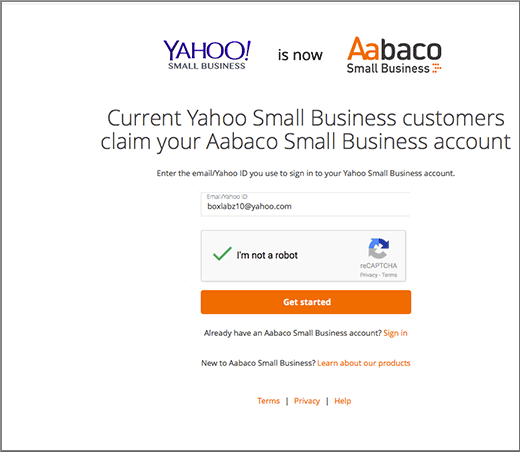

# 在 Yahoo! Small Business 建立 Office 365 的 DNS 記錄

 若您找不到所需內容，請**[查看網域常見問題集](../setup/domains-faq.md)**。 
  
如果 Yahoo! Small Business 一直是您的 DNS 主機服務提供者，請注意，您的提供者現在應該是 Aabaco Small Business。
  
請依照本文中的步驟建立 Aabaco 帳戶，以在 Aabaco 變更 DNS 設定並為您的網域續約。
  
您可以[建立 DNS 記錄](../get-help-with-domains/create-dns-records-at-any-dns-hosting-provider.md)之前，您必須建立 Aabaco 帳戶。

  
## 建立 Aabaco Small Business 帳戶

1. 若要開始，移至您的網域頁面，以在 Aabaco [使用[此連結](https://www.luminate.com/services/)，然後選取 [**設定您的 Aabaco Small Business 帳戶**。
    
    
  
2. 提供您的 Yahoo! Small Business**電子郵件 /yahoo 識別碼**，，然後選取 [ **I 'm not a robot 不**。
    
    
  
3. 選取 [**開始**]。
    
    
  
4. 登入您的 Yahoo! Small Business 電子郵件帳戶，並從 Aabaco Small Business 開啟新的電子郵件。
    
    > [!NOTE]
    > 重新傳送郵件，若有必要，請選擇 [**重新傳送電子郵件連結**在**您已取得最新產品郵件**] 頁面上。 
  
    
  
5. 在 Aabaco**確認您的電子郵件地址，若要繼續執行安裝程式**電子郵件訊息中，選取 [**確認電子郵件**]。
    
    
  
6. 在 [**選擇您的密碼**] 頁面中，輸入或複製並貼上您想要使用的 Aabaco 帳戶的密碼。 
    
    > [!NOTE]
    > 您可以使用與 Yahoo! Small Business 帳戶相同的密碼。 
  
    
  
7. 選取 [**我同意這些條款和條件**]，然後再選取 [**建立密碼**。
    
    
  
8. 登入您的 Yahoo! Small Business 電子郵件帳戶，然後從 Aabaco Small Business 開啟新的電子郵件。
    
    > [!NOTE]
    > 重新傳送郵件，如有必要，選擇 [上的 [**重新傳送電子郵件連結****幾乎大功告成 ！** 頁面。 
  
    
  
9. 在 Aabaco**後幾乎有**電子郵件訊息中，選取 [**啟用我的帳戶**]。
    
    
  
10. 登入您的 Aabaco Small Business 帳戶。
    
    
  
現在您已建立 Aabaco 帳戶，接著可以[在 Aabaco Small Business for Office 365 建立 DNS記錄](../get-help-with-domains/create-dns-records-at-any-dns-hosting-provider.md)。
  
