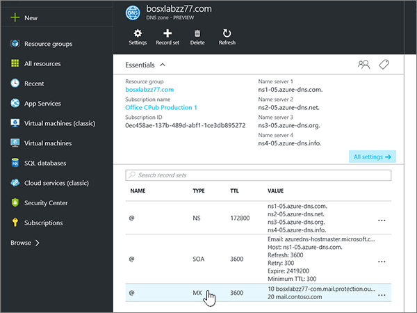

# 建立 Azure DNS 區域的 DNS 記錄

 若您找不到所需功能，請**[檢查網域常見問題集](../setup/domains-faq.md)**。 
  
如果 Azure DNS 主機供應商，遵循的步驟中本篇文章以驗證您的網域和設定 DNS 記錄的電子郵件、 Skype for Business Online 等等。
  
以下是要新增的主要記錄。 
  
- [變更您網域的名稱伺服器 (NS) 記錄](#change-your-domains-nameserver-ns-records)
    
- [新增 TXT 記錄以供驗證](#add-a-txt-record-for-verification)

- [新增 MX 記錄，以將寄往您網域的電子郵件轉至 Office 365](#add-an-mx-record-so-email-for-your-domain-will-come-to-office-365)
    
- [新增 Office 365 所需的四個 CNAME 記錄](#add-the-four-cname-records-that-are-required-for-office-365)
    
- [新增 SPF 的 TXT 記錄以協助防範垃圾郵件](#add-a-txt-record-for-spf-to-help-prevent-email-spam)
    
- [新增兩筆 Office 365 所需的 SRV 記錄](#add-the-two-srv-records-that-are-required-for-office-365)
    
在 Azure 新增這些記錄之後，您的網域就是設定為搭配 Office 365 服務。
  
> [!NOTE]
> DNS 變更生效通常約需 15 分鐘的時間。而如果您所做的變更要在整個網際網路 DNS 系統中生效，有時可能需要更久的時間。在您新增 DNS 記錄後，如有郵件流程或其他方面的問題，請參閱[變更網域名稱或 DNS 記錄之後所發生問題的疑難排解](../get-help-with-domains/find-and-fix-issues.md)。 
  
## 變更您網域的名稱伺服器 (NS) 記錄

> [!IMPORTANT]
> 您必須在您購買及註冊網域的網域註冊機構中執行此程序。 
  
當您註冊 Azure 」 時，您建立 DNS 區域內，資源群組，然後指派給該資源群組的 [您的網域名稱。 該網域名稱註冊到外部網域註冊機構中;Azure 不提供網域註冊服務。
  
若要確認並在 Office 365 建立 DNS 記錄為您的網域，您需要變更的名稱伺服器，在您網域註冊機構，讓他們使用 Azure 指派給您的資源群組的名稱伺服器。
  
若要自行在網域註冊機構網站變更自家網域的名稱伺服器，請遵循下列步驟進行：
  
1. 在網域註冊機構的網站上，找出您可編輯您網域之名稱伺服器的區域。
    
2. 在下列表格中，使用的值來建立兩筆名稱伺服器記錄，或編輯現有的名稱伺服器記錄，使其符合這些值。 指派給 Azure 的範例如下所示的名稱伺服器。
    

**第一個名稱伺服器：** 使用 Azure 由指派的名稱伺服器值。  
**第二個名稱伺服器：** 使用 Azure 由指派的名稱伺服器值。  

  
> [!TIP]
> You should use at least two name server records. 如果沒有列在您的網域註冊機構網站的任何其他名稱伺服器，您應該將予以刪除。 
  
3. 儲存變更。
    
> [!NOTE]
> 您的名稱伺服器記錄更新可能需要數小時的時間，才能更新到整個網際網路的 DNS 系統。接著，您的 Office 365 電子郵件和其他服務就能搭配您的網域順利運作。 
  
## 新增 TXT 記錄以供驗證

在您將自己的網域用於 Office 365 之前，我們必須先確認您擁有該網域。如果您能在自己的網域註冊機構登入自己的帳戶並能建立 DNS 記錄，Office 365 就能確信您擁有該網域。
  
> [!NOTE]
> 這筆記錄只會用於驗證您擁有自己的網域，不會影響其他項目。您可以選擇稍後再刪除記錄。 
  
1. 若要開始，使用[這個連結](https://portal.azure.com )移至您在 Azure 的網域頁面。 You'll be prompted to log in first.
    
    
  
2. 使用**搜尋列**在 [**儀表板**] 頁面上，輸入**DNS 區域**中。 在結果中顯示，選取 [ **Services**部分的**DNS 區域**。 一旦您已被重新導向，選取您想要更新的網域。
    
    
  
3. 在您的網域，在 [ **DNS 區域**] 區域中，[**設定**] 頁面上選取 [ **+ 記錄集**]。
    
    
  
4. 在 [**新增記錄集**] 區域中，於新記錄集的方塊中選取值從下表。 
    
    （從下拉式清單選擇 [**類型**] 和 [ **TTL 單位**值）。 
    
    |**Name**|**Type**|**TTL**|**TTL 單位**|**值**|
    |:-----|:-----|:-----|:-----|:-----|
    |@    |TXT    |1    |小時    |MS=ms *XXXXXXXX*    **附註：** 這是範例。 Use your specific **Destination or Points to Address** value here, from the table in Office 365.           [How do I find this?](../get-help-with-domains/information-for-dns-records.md)          |
   
    
  
5. 選取 [確定]****。
  
6. 繼續進行之前，請先稍候幾分鐘，好讓您剛剛建立的記錄能在網際網路上更新。
    
Now that you've added the record at your domain registrar's site, you'll go back to Office 365 and request Office 365 to look for the record.
  
When Office 365 finds the correct TXT record, your domain is verified.
  
1. 在系統管理中心，移至 [**設定** \> <a href="https://go.microsoft.com/fwlink/p/?linkid=834818" target="_blank">網域</a>] 頁面。
    
2. 在 [**網域**] 頁面上，選取您要驗證的網域。 
    
    
  
3. 在 [**安裝**] 頁面上，選取 [**啟動安裝程式**。
    
    
  
4. 在 [**驗證網域**] 頁面上，選取 [**驗證**]。
    
    
  
> [!NOTE]
>  DNS 變更生效通常約需 15 分鐘的時間。而如果您所做的變更要在整個網際網路 DNS 系統中生效，有時可能需要更久的時間。在您新增 DNS 記錄後，如有郵件流程或其他方面的問題，請參閱[變更網域名稱或 DNS 記錄之後所發生問題的疑難排解](../get-help-with-domains/find-and-fix-issues.md)。 
  
## 新增 MX 記錄，以將寄往您網域的電子郵件轉至 Office 365

1. 若要開始，使用[這個連結](https://portal.azure.com )移至您在 Azure 的網域頁面。 You'll be prompted to log in first.
    
    
  
2. 在 [**儀表板**] 頁面上**的所有資源**] 區域中，選取您想要更新的網域。 
    
    
  
3. 在您的網域，在 [ **DNS 區域**] 區域中，[**設定**] 頁面上選取 [ **+ 記錄集**]。
    
    
  
4. 在 [**新增記錄集**] 區域中，於新記錄集的方塊中選取值從下表。 
    
    （從下拉式清單選擇 [**類型**] 和 [ **TTL 單位**值）。 
    
    |**Name**|**Type**|**TTL**|**TTL 單位**|**喜好設定**|**郵件交換**|
    |:-----|:-----|:-----|:-----|:-----|:-----|
    |@    |MX    |1    |小時    |10     如需關於優先順序的詳細資訊，請參閱[什麼是 MX 優先順序？](https://support.office.com/article/2784cc4d-95be-443d-b5f7-bb5dd867ba83.aspx)   | *\<網域金鑰\>*  .mail.protection.outlook.com    **附註：** 取得您*\<網域金鑰\>* 從您的 Office 365 帳戶。   [How do I find this?](../get-help-with-domains/information-for-dns-records.md)  
   
    
  
5. 選取 [確定]****。
    
    
  
6. 如果有任何其他 MX 記錄列在 [ **MX 記錄**] 區段中，您必須將它們刪除。 
    
    首先，在 [ **DNS 區域**] 區域中，選取 [ **MX 記錄設定**]。
    
    
  
    下一步]，選取您想要刪除的 MX 記錄。
    
    
  
7. 選取 [**快顯功能表 （...）**]，然後選擇 [**移除**。
    
    
  
8. 選取 **[儲存]**。
    
    
  
## 新增 Office 365 所需的四個 CNAME 記錄

1. 若要開始，使用[這個連結](https://portal.azure.com )移至您在 Azure 的網域頁面。 You'll be prompted to log in first.
    
    
  
2. 在 [**儀表板**] 頁面上**的所有資源**] 區域中，選取您想要更新的網域。 
    
    
  
3. 在您的網域，在 [ **DNS 區域**] 區域中，[**設定**] 頁面上選取 [ **+ 記錄集**]。
    
    
  
4. 新增第一筆四筆 CNAME 記錄。
    
    在 [**新增記錄集**] 區域中，於新記錄的方塊中設定、 輸入或複製並貼下表中第一列的值。 
    
    （從下拉式清單選擇 [**類型**] 和 [ **TTL 單位**值）。 
    
    |**Name**|**Type**|**TTL**|**TTL 單位**|**Alias**|
    |:-----|:-----|:-----|:-----|:-----|
    |autodiscover    |CNAME    |1    |小時    |autodiscover.outlook.com    |
    |sip    |CNAME    |1    |小時    |sipdir.online.lync.com>    |
    |lyncdiscover    |CNAME    |1    |小時    |webdir.online.lync.com>    |
    
   
    
  
5. 選取 [確定]****。
    
    
  
6. 新增每個其他三筆 CNAME 記錄。
    
    在 [ **DNS 區域**] 區域中，選取 [ **+ 記錄集**]。 然後，在空的記錄組中，在表格中，使用下一列的值來建立記錄，並再次選擇 **[確定]** 以完成該筆記錄。 
    
    重複此程序，直到四筆 CNAME 記錄全部建立完畢。
    
7.  （選用）新增 MDM 2 的 CNAME 記錄

> [!IMPORTANT]
> 如果您有 Office 365 行動裝置管理 (MDM)，您必須建立兩個額外的 CNAME 記錄。 Follow the procedure that you used for the other four CNAME records, but supply the values from the following table. （如果您沒有 MDM，您可以略過此步驟。） 
  
|**Name**|**Type**|**TTL**|**TTL 單位**|**Alias**|
|:-----|:-----|:-----|:-----|:-----|
|enterpriseregistration    |CNAME    |1    |小時    |enterpriseregistration.windows.net>    |
|enterpriseenrollment    |CNAME    |1    |小時    |enterpriseenrollment-s.manage.microsoft.com    |
   
## 新增 SPF 的 TXT 記錄以協助防範垃圾郵件

> [!IMPORTANT]
> You cannot have more than one TXT record for SPF for a domain. If your domain has more than one SPF record, you'll get email errors, as well as delivery and spam classification issues. If you already have an SPF record for your domain, don't create a new one for Office 365. Instead, add the required Office 365 values to the current record so that you have a  *single*  SPF record that includes both sets of values. 
  
1. 若要開始，使用[這個連結](https://portal.azure.com )移至您在 Azure 的網域頁面。 You'll be prompted to log in first.
    
    
  
2. 在 [**儀表板**] 頁面上**的所有資源**] 區域中，選取您想要更新的網域。 
    
    
  
3. 在 [ **DNS 區域**] 區域中，選取 [ **TXT 記錄設定**]。
    
    
  
4. 在 [**記錄設定內容**區域中，於新記錄集的方塊中選取值從下表。 
    
    （從下拉式清單選擇 [**類型**] 和 [ **TTL 單位**值）。 
    
    |**Name**|**Type**|**TTL**|**TTL 單位**|**值**|
    |:-----|:-----|:-----|:-----|:-----|
    |@    |TXT    |1    |小時    |v=spf1 include:spf.protection.outlook.com -all    **附註：** 建議您複製並貼上這個項目，好讓所有的間距保持正確。           

    
  
5. 選取 **[儲存]**。
    
    
  
## 新增兩筆 Office 365 所需的 SRV 記錄

1. 若要開始，使用[這個連結](https://portal.azure.com )移至您在 Azure 的網域頁面。 You'll be prompted to log in first.
    
    
  
2. 在 [**儀表板**] 頁面上**的所有資源**] 區域中，選取您想要更新的網域。 
    
    
  
3. 在您的網域，在 [ **DNS 區域**] 區域中，[**設定**] 頁面上選取 [ **+ 記錄集**]。
    
    
  
4. 新增兩筆 SRV 記錄中的第一筆。
    
    在 [**新增記錄集**] 區域中，於新記錄集的方塊中選取值從下表中的第一列。 
    
    （從下拉式清單選擇 [**類型**] 和 [ **TTL 單位**值）。 
    
    |**Name**|**Type**|**TTL**|**TTL 單位**|**優先順序**|**Weight**|**Port**|**Target**|
    |:-----|:-----|:-----|:-----|:-----|:-----|:-----|:-----|
    |_sip._tls    |SRV    |1    |小時    |100    |1    |443    |sipdir.online.lync.com>    |
    |_sipfederationtls._tcp    |SRV    |1    |小時    |100    |1    |5061    |sipfed.online.lync.com>    

    
  
5. 選取 [確定]****。
    
    
  
6. 新增另一筆 SRV 記錄。
    
    在新記錄方塊中，輸入或複製並貼上表格中第二列中的值。
    
> [!NOTE]
> DNS 變更生效通常約需 15 分鐘的時間。而如果您所做的變更要在整個網際網路 DNS 系統中生效，有時可能需要更久的時間。在您新增 DNS 記錄後，如有郵件流程或其他方面的問題，請參閱[變更網域名稱或 DNS 記錄之後所發生問題的疑難排解](../get-help-with-domains/find-and-fix-issues.md)。 
  
