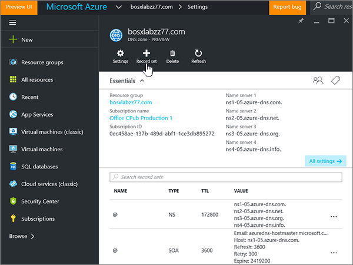

# 建立 Azure DNS 區域的 DNS 記錄

 若您找不到所需內容，請**[查看網域常見問題集](../setup/domains-faq.md)**。 
  
如果 Azure 是您的 DNS 主機服務提供者，請遵循本文中的步驟來驗證您的網域，並設定電子郵件、商務用 Skype Online 等的 DNS 記錄。
  
以下是要新增的主要記錄。 
  
- [變更您網域的名稱伺服器 (NS) 記錄](#change-your-domains-nameserver-ns-records)
    
- [新增 TXT 記錄以供驗證](#add-a-txt-record-for-verification)

- [新增 MX 記錄，以將寄往您網域的電子郵件轉至 Microsoft](#add-an-mx-record-so-email-for-your-domain-will-come-to-microsoft)
    
- [新增 Microsoft 所需的四種 CNAME 記錄](#add-the-four-cname-records-that-are-required-for-microsoft)
    
- [新增 SPF 的 TXT 記錄以協助防範垃圾郵件](#add-a-txt-record-for-spf-to-help-prevent-email-spam)
    
- [新增兩筆 Microsoft 所需的 SRV 記錄](#add-the-two-srv-records-that-are-required-for-microsoft)
    
在 Azure 新增這些記錄之後，您的網域就會設定為與 Microsoft 服務搭配使用。
  
> [!NOTE]
> DNS 變更生效通常約需 15 分鐘的時間。而如果您所做的變更要在整個網際網路 DNS 系統中生效，有時可能需要更久的時間。在您新增 DNS 記錄後，如有郵件流程或其他方面的問題，請參閱[變更網域名稱或 DNS 記錄之後所發生問題的疑難排解](../get-help-with-domains/find-and-fix-issues.md)。 
  
## 變更您網域的名稱伺服器 (NS) 記錄

> [!IMPORTANT]
> 您必須在您購買及註冊網域的網域註冊機構中執行此程序。 
  
當您註冊 Azure 時，您會在 DNS 區域中建立資源群組，然後將您的功能變數名稱指派給該資源群組。 該功能變數名稱已註冊到外部網域註冊機構;Azure 不提供網域註冊服務。
  
若要在 Microsoft 中驗證及建立網域的 DNS 記錄，您必須先在您的網域註冊機構中變更名稱伺服器，以便使用指派給您資源群組的 Azure 名稱伺服器。
  
若要自行在網域註冊機構網站變更自家網域的名稱伺服器，請遵循下列步驟進行：
  
1. 在網域註冊機構的網站上，找出您可編輯您網域之名稱伺服器的區域。
    
2. 您可以使用下表中的值建立兩筆名稱伺服器記錄，或編輯現有的名稱伺服器記錄，使其符合這些值。 Azure 指派名稱伺服器的範例如下所示。
    

**第一個**名稱伺服器：使用 Azure 所指派的名稱伺服器值。  
**第二個**名稱伺服器：使用 Azure 所指派的名稱伺服器值。  

  
> [!TIP]
> You should use at least two name server records. 如果您的網域註冊機構網站上列出任何其他名稱伺服器，您應該將其刪除。 
  
3. 儲存變更。
    
> [!NOTE]
> Your nameserver record updates may take up to several hours to update across the Internet's DNS system. 然後，您的 Microsoft 電子郵件和其他服務將全部設定為與您的網域搭配使用。 
  
## 新增 TXT 記錄以供驗證

在您將自己的網域用於 Microsoft 之前，我們必須先確認您擁有該網域。如果您能在自己的網域註冊機構登入自己的帳戶並能建立 DNS 記錄，Microsoft 就能確信您擁有該網域。
  
> [!NOTE]
> 這筆記錄只會用於驗證您擁有自己的網域，不會影響其他項目。您可以選擇稍後再刪除記錄。 
  
1. 若要開始使用，請使用[此連結](https://portal.azure.com )前往 Azure 上的網域頁面。 系統會提示您先登入。
    
    
  
2. 使用 [**儀表板**] 頁面上的**搜尋**列，輸入 [ **DNS 區域**]。 在 [結果顯示] 中，選取 [**服務**] 部分底下的 [ **DNS 區域**]。 重新導向後，請選取您要更新的網域。
    
    
  
3. 在您網域的 [**設定**] 頁面上，選取 [ **DNS 區域**] 區域中的 [ **+ 記錄集**]。
    
    
  
4. 在 [新增**記錄集**] 區域，于新記錄集的方塊中，選取下表中的值。 
    
    （從下拉式清單中選擇 [**類型**] 和 [ **TTL 單位**] 值。） 
    
    |**Name**|**Type**|**TTL**|**TTL 單位**|**值**|
    |:-----|:-----|:-----|:-----|:-----|
    |@    |TXT    |1    |小時    |MS=ms *XXXXXXXX*    **附註：** 這是範例。 在這裡請使用您自己來自表格的 [目的地或指向位址]**** 值。           [如何找到呢？](../get-help-with-domains/information-for-dns-records.md)          |
   
    
  
5. 選取 **[確定]**。
  
6. 繼續進行之前，請先稍候幾分鐘，好讓您剛剛建立的記錄能在網際網路上更新。
    
現在您已在網域註冊機構網站新增記錄，請返回 Microsoft 並要求該記錄。
  
在 Microsoft 找到正確的 TXT 記錄後，您的網域就完成驗證了。
  
1. 在系統管理中心中，移至 **[設定]** \> <a href="https://go.microsoft.com/fwlink/p/?linkid=834818" target="_blank">[網域]</a> 頁面。
    
2. 在 **[網域]** 頁面上，選取您要驗證的網域。 
    
    
  
3. 在 **[設定]** 頁面上，選取 **[開始設定]**。
    
    
  
4. 在 **[驗證網域]** 頁面上，選取 **[驗證]**。
    
    
  
> [!NOTE]
>  DNS 變更生效通常約需 15 分鐘的時間。而如果您所做的變更要在整個網際網路 DNS 系統中生效，有時可能需要更久的時間。在您新增 DNS 記錄後，如有郵件流程或其他方面的問題，請參閱[變更網域名稱或 DNS 記錄之後所發生問題的疑難排解](../get-help-with-domains/find-and-fix-issues.md)。 
  
## 新增 MX 記錄，以將寄往您網域的電子郵件轉至 Microsoft

1. 若要開始使用，請使用[此連結](https://portal.azure.com )前往 Azure 上的網域頁面。 系統會提示您先登入。
    
    
  
2. 在 [**儀表板**] 頁面上的 [**所有資源**] 區域中，選取您要更新的網域。 
    
    
  
3. 在您網域的 [**設定**] 頁面上，選取 [ **DNS 區域**] 區域中的 [ **+ 記錄集**]。
    
    
  
4. 在 [新增**記錄集**] 區域，于新記錄集的方塊中，選取下表中的值。 
    
    （從下拉式清單中選擇 [**類型**] 和 [ **TTL 單位**] 值。） 
    
    |**Name**|**Type**|**TTL**|**TTL 單位**|**偏好**|**郵件交換**|
    |:-----|:-----|:-----|:-----|:-----|:-----|
    |@    |MX    |1    |小時    |10     如需關於優先順序的詳細資訊，請參閱[什麼是 MX 優先順序？](https://docs.microsoft.com/microsoft-365/admin/setup/domains-faq)   | *\<網域金鑰\>*  .mail.protection.outlook.com    **附注：** 從您的 Microsoft 帳戶取得您* \<的網域金鑰\> * 。   [如何找到呢？](../get-help-with-domains/information-for-dns-records.md)  
   
    
  
5. 選取 **[確定]**。
    
    
  
6. 如果 [ **Mx 記錄**] 區段中列出任何其他 MX 記錄，您必須加以刪除。 
    
    首先，在 [ **DNS 區域**] 區域中，選取**MX 記錄集**。
    
    
  
    接下來，選取您要刪除的 MX 記錄。
    
    
  
7. 選取**快顯功能表（...）**，然後選擇 [**移除**]。
    
    
  
8. 選取 [儲存]****。
    
    
  
## 新增 Microsoft 所需的四種 CNAME 記錄

1. 若要開始使用，請使用[此連結](https://portal.azure.com )前往 Azure 上的網域頁面。 系統會提示您先登入。
    
    
  
2. 在 [**儀表板**] 頁面上的 [**所有資源**] 區域中，選取您要更新的網域。 
    
    
  
3. 在您網域的 [**設定**] 頁面上，選取 [ **DNS 區域**] 區域中的 [ **+ 記錄集**]。
    
    
  
4. 新增四筆 CNAME 記錄中的第一筆。
    
    在 [新增**記錄集**] 區域，于新記錄集的方塊中，輸入或複製並貼上下表中第一列的值。 
    
    （從下拉式清單中選擇 [**類型**] 和 [ **TTL 單位**] 值。） 
    
    |**Name**|**Type**|**TTL**|**TTL 單位**|**Alias**|
    |:-----|:-----|:-----|:-----|:-----|
    |autodiscover    |CNAME    |1    |小時    |autodiscover.outlook.com    |
    |sip    |CNAME    |1    |小時    |sipdir.online.lync.com    |
    |lyncdiscover    |CNAME    |1    |小時    |webdir.online.lync.com    |
    
   
    
  
5. 選取 **[確定]**。
    
    
  
6. 新增其他三筆 CNAME 記錄。
    
    在 [ **DNS 區域**] 區域中，選取 [ **+ 記錄集**]。 然後，在空白的記錄集中，使用表格中下一列的值來建立記錄，然後再選取 **[確定]** 以完成記錄。 
    
    重複此程式，直到您已建立所有四筆 CNAME 記錄為止。
    
7.  選新增兩個 MDM 的 CNAME 記錄。

> [!IMPORTANT]
> 如果您有 Microsoft 的行動裝置管理（MDM），則必須建立兩個額外的 CNAME 記錄。 請按照您針對其他四筆 CNAME 記錄所進行的程序執行，但提供下表的值。 （如果您沒有 MDM，您可以略過此步驟。） 
  
|**Name**|**Type**|**TTL**|**TTL 單位**|**Alias**|
|:-----|:-----|:-----|:-----|:-----|
|enterpriseregistration    |CNAME    |1    |小時    |enterpriseregistration.windows.net    |
|enterpriseenrollment    |CNAME    |1    |小時    |enterpriseenrollment-s.manage.microsoft.com    |
   
## 新增 SPF 的 TXT 記錄以協助防範垃圾郵件

> [!IMPORTANT]
> 網域的 SPF 不得擁有一個以上的 TXT 記錄。 如果您的網域具有多筆 SPF 記錄，您將收到電子郵件錯誤，以及傳送及垃圾郵件分類問題。 如果網域已經有 SPF 記錄，請勿為 Microsoft 建立一個新的記錄。 請改為將必要的 Microsoft 值新增至目前的記錄，讓您擁有包含這兩組值的*單一*SPF 記錄。 
  
1. 若要開始使用，請使用[此連結](https://portal.azure.com )前往 Azure 上的網域頁面。 系統會提示您先登入。
    
    
  
2. 在 [**儀表板**] 頁面上的 [**所有資源**] 區域中，選取您要更新的網域。 
    
    
  
3. 在 [ **DNS 區域**] 區域中，選取**TXT 記錄集**。
    
    
  
4. 在 [**記錄集屬性**] 區域的新記錄集方塊中，選取下表中的值。 
    
    （從下拉式清單中選擇 [**類型**] 和 [ **TTL 單位**] 值。） 
    
    |**Name**|**Type**|**TTL**|**TTL 單位**|**值**|
    |:-----|:-----|:-----|:-----|:-----|
    |@    |TXT    |1    |小時    |v=spf1 include:spf.protection.outlook.com -all    **附註：** 建議您複製並貼上這個項目，好讓所有的間距保持正確。           

    
  
5. 選取 [儲存]****。
    
    
  
## 新增兩筆 Microsoft 所需的 SRV 記錄

1. 若要開始使用，請使用[此連結](https://portal.azure.com )前往 Azure 上的網域頁面。 系統會提示您先登入。
    
    
  
2. 在 [**儀表板**] 頁面上的 [**所有資源**] 區域中，選取您要更新的網域。 
    
    
  
3. 在您網域的 [**設定**] 頁面上，選取 [ **DNS 區域**] 區域中的 [ **+ 記錄集**]。
    
    
  
4. 新增兩筆 SRV 記錄中的第一筆。
    
    在 [新增**記錄集**] 區域，于新記錄集的方塊中，選取下表中第一列的值。 
    
    （從下拉式清單中選擇 [**類型**] 和 [ **TTL 單位**] 值。） 
    
    |**Name**|**Type**|**TTL**|**TTL 單位**|**Priority** (優先順序)|**Weight** (權數)|**Port** (連接埠)|**Target** (目標)|
    |:-----|:-----|:-----|:-----|:-----|:-----|:-----|:-----|
    |_sip。 _tls    |SRV    |1    |小時    |100    |1    |443    |sipdir.online.lync.com    |
    |_sipfederationtls。 _tcp    |SRV    |1    |小時    |100    |1    |5061    |sipfed.online.lync.com    

    
  
5. 選取 **[確定]**。
    
    
  
6. 新增另一筆 SRV 記錄。
    
    在新記錄的方塊中，輸入或複製並貼上表格中第二列的值。
    
> [!NOTE]
> DNS 變更生效通常約需 15 分鐘的時間。而如果您所做的變更要在整個網際網路 DNS 系統中生效，有時可能需要更久的時間。在您新增 DNS 記錄後，如有郵件流程或其他方面的問題，請參閱[變更網域名稱或 DNS 記錄之後所發生問題的疑難排解](../get-help-with-domains/find-and-fix-issues.md)。 
  
