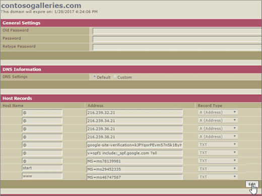

# 您的網域由 Google (eNom) 管理時建立 DNS 記錄

 若您找不到所需內容，請**[查看網域常見問題集](../setup/domains-faq.md)**。 
  
若要將您的郵件帳戶移轉到 Office 365，您需要在您的網域註冊機構建立 DNS 記錄。
  
如果您購買透過 Google 網域註冊時為您的**Google Apps for Work**帳戶時，您的 DNS 記錄是由 Google 管理，但是註冊 eNom。 
  
您可以存取 eNom，並透過 Google**網域**] 頁面上建立 DNS]。 請按照本文所述的步驟進行。 
  
## 建立 DNS 記錄

1. 在[Google 系統管理主控台](https://www.google.com/work/apps/business)中，選取 [**登入**。
    
    
  
2. 輸入您的網域名稱，然後再選取 [**移**。
    
    
  
3. 在頁面底部，選取 [**更多控制項**。
    
    
  
4. Select **Domains**.
    
    
  
5. 在 [**網域**] 頁面上，選取 [**新增/移除網域**。
    
    
  
6. 在 [**網域**] 頁面上選取 [**進階 DNS 設定**]。
    
    > [!NOTE]
    > 如果您未購買透過 Google 網域名稱註冊您的**Google Apps for Work**帳戶時，您不會有**進階 DNS 設定**上您的**網域**頁面。 相反地，您必須直接前往您網域主機的網站以存取您的 DNS 設定，並執行此操作與下列步驟。 如需詳細資訊，請參閱[存取您的 G Suite 網域設定](https://support.google.com/a/answer/54693?hl=en)。 
  
    
  
7. 在 [**進階 DNS 設定**] 頁面上，選取 [**登入 DNS 主控台**。 請注意的**登入名稱**及**密碼**資訊。 您在下一個步驟需要用到這些資訊。 
    
    
  
8. 登入 Google**網域管理員**從 [**進階 DNS 設定**] 頁面上使用的**登入名稱**與**密碼**。 
    
    
  
9. 在 [ ***domain_name*** ] 頁面的 [在 [**主機記錄**] 區段中，選取 [**編輯**]。
    
    
  
10. 在 [**主機記錄**] 區段中，選取 [**加入新**項目。
    
    
  
11. 在新記錄的方塊中，輸入或複製並貼上下表中的值。
    
    |**主應用程式**|**TXT VALUE**|**記錄類型**|
    |:-----|:-----|:-----|
    |@    ||TXT    |

    > [!NOTE]
    > This is an example. 在這裡請使用您自己的 **[目的地或指向位址]** 值，請參閱 Office 365 表格。 
  
    [如何找到呢？](../get-help-with-domains/information-for-dns-records.md)
  
12. 選取 [儲存]****。
    
    
  
13. 選取 [**儲存變更**。
    
    
  
> [!NOTE]
>  DNS 變更生效通常約需 15 分鐘的時間。而如果您所做的變更要在整個網際網路 DNS 系統中生效，有時可能需要更久的時間。在您新增 DNS 記錄後，如有郵件流程或其他方面的問題，請參閱[變更網域名稱或 DNS 記錄之後所發生問題的疑難排解](../get-help-with-domains/find-and-fix-issues.md)。 
  
