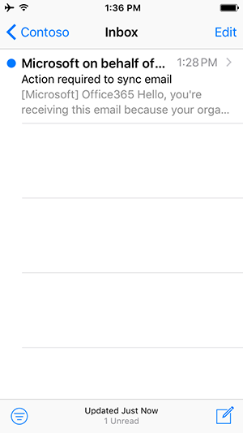

# 從行動裝置存取電子郵件選項Options for accessing email from your mobile device

您的組織有設定可控制哪些行動裝置的應用程式，可用來存取電子郵件、 行事曆及連絡人貴公司帳戶。Your organization has configured settings which control what mobile apps you can use to access your work account for email, calendar and contacts.
  
Android 版 Outlook 和 Outlook for iOS 行動應用程式專為您的工作或學校電子郵件，是唯一的應用程式，以提供功能，例如[焦點收件匣](https://support.office.com/article/f445ad7f-02f4-4294-a82e-71d8964e3978.aspx)，哪些會不斷重要的電子郵件前方和中心]，和[排程小幫手](https://go.microsoft.com/fwlink/?linkid=873406)，這可協助您尋找會議時間和同事互動的作用和只會尋找可用的會議室。The Outlook for Android and Outlook for iOS mobile apps are designed for your work or school email, and are the only apps to provide features like [Focused Inbox](https://support.office.com/article/f445ad7f-02f4-4294-a82e-71d8964e3978.aspx), which keeps important emails front and center, and [Scheduling Assistant](https://go.microsoft.com/fwlink/?linkid=873406), which helps you find meeting times that work with colleagues and simply finds available conference rooms.
  
## 使用者體驗End user experience

 **僅限 outlook****Outlook only**
  
您的組織需要您使用 Android 版 Outlook 或 Outlook for iOS 行動應用程式存取公司電子郵件、 行事曆和連絡人。Your organization requires that you use the Outlook for Android or Outlook for iOS mobile apps to access company email, calendar, and contacts. 您的資料將會啟動同步處理一旦您下載並安裝 Android 版 Outlook 或 Outlook for iOS。Your data will start syncing once you download and install Outlook for Android or Outlook for iOS.
  

  
請參閱[最佳化您的 iOS 或 Android 手機的 Outlook 行動應用程式](https://support.office.com/article/de075b19-b73c-4d8a-841b-459982c7e890.aspx)的更多的 Outlook 功能。Check out [Optimize the Outlook mobile app for your iOS or Android phone](https://support.office.com/article/de075b19-b73c-4d8a-841b-459982c7e890.aspx) for more Outlook features. 然後移至[Outlook for iOS 和 Android 說明中心](https://support.office.com/article/cd84214e-a5ac-4e95-9ea3-e07f78d0cde6.aspx)，如果您遇到任何問題。And go to [Outlook for iOS and Android Help Center](https://support.office.com/article/cd84214e-a5ac-4e95-9ea3-e07f78d0cde6.aspx) if you run into any issues. 
  
 **任何電子郵件應用程式****Any email app**
  
您的組織建議您使用適用於 Android 或 iOS 行動應用程式的 Outlook 來存取您的 Office 365 工作或學校帳戶的電子郵件、 行事曆和連絡人。Your organization recommends that you use the Outlook for Android or iOS mobile app to access your Office 365 work or school account for email, calendar, and contacts. 如果您不採取任何動作下, 一步的幾個小時內，您的電子郵件將自動開始同步處理。If you don't take any action within the next few hours, your email will automatically begin syncing. 如果您選擇使用適用於 Android 或 iOS 行動應用程式的 Outlook，您的資料只會同步與 Android 版 Outlook 或 Outlook for iOS 行動應用程式。If you choose to use the Outlook for Android or iOS mobile app, your data will only sync with the Outlook for Android or Outlook for iOS mobile app. 如果您選擇繼續使用協力廠商應用程式，您的資料會同步處理立即啟動。If you choose to continue using the third-party app, your data will start to sync instantly.
  

