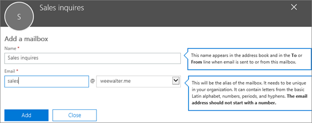

# 建立共用信箱 

> [!NOTE]
> 如果您的組織使用混合式 Exchange 環境，您應使用內部部署 Exchange 系統管理中心 (EAC) 來建立及管理共用信箱。 請參閱[在 Exchange 系統管理中心建立共用信箱](https://docs.microsoft.com/Exchange/collaboration/shared-mailboxes/create-shared-mailboxes?view=exchserver-2019.)  
> 如果您不確定應該建立共用信箱或者 Outlook​​ 的 Microsoft 365 群組，請參閱[比較群組](../create-groups/compare-groups.md)以取得指導。 請注意，目前無法將共用信箱移轉至 Microsoft 365 群組。 如果您想要這麼做，請[在這裡投票](https://go.microsoft.com/fwlink/?linkid=871518)讓我們知道。

建立共用信箱能讓一群人輕易監視某個共用電子郵件地址 (例如 info@contoso.com) 的電子郵件，並從該電子郵件地址傳送電子郵件。當群組中的某人回覆一則傳送到共用信箱的郵件時，該封電子郵件會顯示為從共用信箱發出，而非從個別使用者發出。

共用信箱中也包含了共用行事曆。 許多小型企業喜歡將共用行事曆當做一個可以讓所有人輸入各自約會的地方。 舉例來說，如果您有 3 個人負責客戶拜訪，他們就都可以使用共用行事曆來輸入約會。 這是能讓每個人都能掌握各自事務的簡便方法。

建立共用信箱前，請務必閱讀[關於共用信箱](about-shared-mailboxes.md)，以取得詳細資訊。

## 建立共用信箱和新增成員
  
1. 使用全域系統管理員帳戶或 Exchange 系統管理員帳戶登入。 如果您收到 **[您沒有存取這個頁面或執行這個動作的權限]** 訊息，則代表您不是系統管理員。 

::: moniker range="o365-worldwide"

2. 在系統管理中心中，移至 **[群組]** \> <a href="https://go.microsoft.com/fwlink/p/?linkid=2066847" target="_blank">[共用信箱]</a> 頁面。

::: moniker-end

::: moniker range="o365-germany"

2. [在系統管理中心](https://go.microsoft.com/fwlink/p/?linkid=848041)中，移至 **[群組] ** \> **[共用信箱]** 頁面。

::: moniker-end

::: moniker range="o365-21vianet"

2. [在系統管理中心](https://go.microsoft.com/fwlink/p/?linkid=850627)中，移至 **[群組] ** \> **[共用信箱]** 頁面。

::: moniker-end
    
3. 在 **[共用信箱]** 頁面上，選取 **[+ 新增信箱]**。 輸入共用信箱的名稱。 精靈會隨後選擇電子郵件地址，但您可再自行編輯。
    
    
  
4. 選取 **[新增]**。 您可能需要等待幾分鐘之後才能開始新增成員。

5. 在 **[後續步驟]** 底下選取 **[將成員新增到此信箱]**。 成員是指能檢視此共用信箱的內送郵件以及外寄回覆的人員。

   ![選取 [新增成員]](../../media/a2a72e3d-6170-40fe-a94f-0af8fbef8ab2.png)

6. 選取 **[+ 新增成員]** 按鈕。 選取您要讓他們使用此共用信箱人員旁邊的核取記號，然後選取 **[儲存]**。

   

7. 選取 **[關閉]**。

您已經擁有共用信箱，且其中包含了共用行事曆。 現在繼續進行後續步驟：封鎖登入共用信箱帳戶。

## 封鎖登入共用信箱帳戶

每個共用信箱都有對應的使用者帳戶。 注意到當您建立共用信箱時，系統如何要求您提供密碼嗎？ 帳戶有密碼，但它是系統產生的密碼 (未知)。 您不應使用該帳戶登入共用信箱。

但是如果系統管理員重設共用信箱使用者帳戶的密碼，該怎麼辦？ 或者如果攻擊者能夠存取共用信箱帳號憑證，該怎麼辦？ 這可讓使用者帳戶登入共用信箱，並傳送電子郵件。 若要避免發生此情況，您需要封鎖與共用信箱相關聯的帳戶登入。

::: moniker range="o365-worldwide"

1. 在系統管理中心中，移至 **[使用者]** \> <a href="https://go.microsoft.com/fwlink/p/?linkid=834822" target="_blank">[作用中使用者]</a> 頁面。

2. 在使用者帳戶清單中，找出共用信箱的帳戶 (例如，將篩選變更為 **[未授權的使用者]**)。

3. 選取 [使用者] 以開啟其 [內容] 窗格，然後選取 **[封鎖此使用者]** 圖示。

   **附註**：如果該帳戶已封鎖，**[封鎖登入]** 將會顯示在頂端，且圖示上會顯示 **[解除封鎖此使用者]**。

4. 在 **[封鎖此使用者?]** 窗格中，選取 **[封鎖使用者，使其無法登入]**，然後選取 **[儲存變更]**。

::: moniker-end

::: moniker range="o365-germany"

1. 在系統管理中心中，移至 **[使用者]** \> <a href="https://go.microsoft.com/fwlink/p/?linkid=847686" target="_blank">[作用中使用者]</a> 頁面。

2. 在使用者帳戶清單中，找出共用信箱的帳戶 (例如，將檢視變更為 **[未授權的使用者]**)，然後選取帳戶。

3. 在 [內容] 飛出視窗中，選取 **[封鎖登入]**。

    **附註：** 如果帳戶已經封鎖，則按鈕會顯示 **[解除封鎖登入]**。

4. 在 **[編輯登入狀態]** 飛出視窗中，確認已選取 [封鎖使用者，使其無法登入]、選取 **[儲存]**，然後 **[關閉]**。

::: moniker-end

::: moniker range="o365-21vianet"

1. 在系統管理中心中，移至 **[使用者]** \> <a href="https://go.microsoft.com/fwlink/p/?linkid=850628" target="_blank">[作用中使用者]</a> 頁面。

2. 在使用者帳戶清單中，找出共用信箱的帳戶 (例如，將檢視變更為 **[未授權的使用者]**)，然後選取帳戶。

3. 在 [內容] 飛出視窗中，選取 **[封鎖登入]**。

    **附註：** 如果帳戶已經封鎖，則按鈕會顯示 **[解除封鎖登入]**。

4. 在 **[編輯登入狀態]** 飛出視窗中，確認已選取 [封鎖使用者，使其無法登入]、選取 **[儲存]**，然後 **[關閉]**。
::: moniker-end

如需有關如何使用 Azure AD PowerShell 封鎖帳戶登入的指示 (包含一次封鎖多個帳戶)，請參閱[使用 Office 365 PowerShell 封鎖使用者帳戶](https://docs.microsoft.com/office365/enterprise/powershell/block-user-accounts-with-office-365-powershell)。

## 將共用信箱新增至 Outlook

如果您在貴公司啟用了自動對應功能 (根據預設，大多數人都會這麼做)，當使用者關閉並重新啟動 Outlook 後，共用信箱就會自動顯示在使用者的 Outlook 應用程式中。 

自動對應是在使用者的信箱中設定，而非共用信箱。 也就是說，如果您嘗試使用安全性群組來管理哪些人員可以存取共用信箱，自動對應將無法運作。 因此，若要使用自動對應，您就必須明確地指派權限。 根據預設會啟用自動對應。 若要瞭解如何將它關閉，請參閱[移除共用信箱的自動對應](https://docs.microsoft.com/office365/troubleshoot/administration/remove-automapping-for-shared-mailbox)。

若要深入了解 Outlook 中的共用信箱，請參閱：

- <a href="https://support.microsoft.com/office/d94a8e9e-21f1-4240-808b-de9c9c088afd" target="_blank">在 Outlook 中開啟及使用共用信箱</a>

- <a href="https://support.microsoft.com/office/98b5a90d-4e38-415d-a030-f09a4cd28207" target="_blank">新增共用信箱到 Outlook 網頁版</a>

- <a href="https://support.microsoft.com/office/f866242c-81b2-472e-8776-6c49c5473c9f" target="_blank">將共用信箱新增至 Outlook mobile</a>

- <a href="https://support.microsoft.com/office/6ecc39c5-5577-4a1d-b18c-bbdc92972cb2" target="_blank">在 Mac 版 Outlook 中開啟共用資料夾或信箱</a>

- <a href="https://support.microsoft.com/office/b0963400-2a51-4c64-afc7-b816d737d164" target="_blank">新增規則到共用信箱</a>

## 在行動裝置上使用共用信箱 (手機或平板電腦)

有兩種方式可以行動裝置上存取共用信箱：
- 在 <a href="https://apps.apple.com/us/app/microsoft-outlook/id951937596" target="_blank">iOS 版 Outlook 應用程式</a>或 <a href="https://play.google.com/store/apps/details?id=com.microsoft.office.outlook&hl=en_US" target="_blank">Android 版 Outlook 行動裝置應用程式</a>中新增共用信箱。 
    
    如需相關指示，請參閱<a href="https://support.microsoft.com/office/f866242c-81b2-472e-8776-6c49c5473c9f" target="_blank">將共用信箱新增至 Outlook mobile</a>。

- 開啟您的瀏覽器、登入，然後移至 Outlook 網頁版。 您可以從 Outlook 網頁版存取共用信箱。

    如需相關指示，請參閱<a href="https://support.microsoft.com/office/98b5a90d-4e38-415d-a030-f09a4cd28207" target="_blank">新增共用信箱到 Outlook 網頁版</a>。

## 使用共用行事曆

當您建立共用信箱時，系統會自動建立共用的行事曆。 相較於 SharePoint 行事曆，我們比較喜歡使用共用信箱行事曆來追蹤約會與人員的所在位置。 共用行事曆已與 Outlook 整合，因此使用性更勝 SharePoint 行事曆。

1. 在 Outlook 應用程式中，移至行事曆檢視並選取共用信箱。

2. 當您輸入約會後，所有共用信箱的成員都能看見它們。

3. 共用信箱的任何成員都可以建立、檢視及管理行事曆上的約會，就像他們處理其個人約會一樣。 身為共用信箱成員的每個人都可以看到其對共用信箱的變更。

## 相關文章

[關於共用信箱](about-shared-mailboxes.md)

[設定共用信箱](configure-a-shared-mailbox.md)

[將使用者信箱轉換為共用信箱](convert-user-mailbox-to-shared-mailbox.md)

[從共用信箱中移除授權](remove-license-from-shared-mailbox.md)

[解決共用信箱的問題](resolve-issues-with-shared-mailboxes.md)

