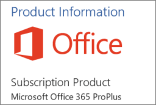

# <a name="determine-if-centralized-deployment-of-add-ins-works-for-your-organization"></a>判斷集中式部署的增益集是否適用于您的組織

若要將 Office 增益集部署至組織內的使用者和群組，集中式部署對於大多數客戶而言是建議和功能最豐富的方法。 如果您是系統管理員，請使用此指導方針來判斷您的承租人和使用者是否符合需求，以便您可以使用集中式部署。
集中式部署支援 Windows、Mac、iOS、Android 和 Online Office 應用程式。
增益集最多可以花12小時來顯示所有使用者的用戶端。
  
## <a name="requirements"></a>需求

[！注意] 增益集的集中式部署需要使用者使用 Microsoft 365 應用程式的 enterprise （並使用其組織識別碼登入 Office），且具有 Exchange Online 和 active Exchange Online 信箱。 您的訂閱目錄必須是 in 或同盟至 Azure Active Directory。
您可以在下面查看 Office 和 Exchange 的特定需求，或使用[集中式部署相容性檢查](https://docs.microsoft.com/office365/admin/manage/centralized-deployment-of-add-ins?view=o365-worldwide#office-365-centralized-deployment-compatibility-checker)程式。

[集中式部署] 不支援下列項目：
  
- 目標鎖定為 Office 2013 中的 Word、Excel 或 PowerPoint 的增益集
    
- 內部部署目錄服務
    
- 將增益集部署到 SharePoint  

- 小組應用程式
   
- 部署元件物件模型 (COM) 或 Visual Studio Tools for Office (VSTO) 增益集
    
- 不包含 Exchange 的 Microsoft 365 部署（例如 Microsoft 365 應用程式的企業版）

### <a name="office-requirements"></a>Office 需求

- 若為 Word、Excel 及 PowerPoint 增益集，您的使用者必須使用下列其中一項：
  - 在 Windows 裝置上，適用于企業的 Microsoft 365 應用程式版本1704或更新版本。
  - 在 Mac 上，版本15.34 或更新版本。

- 對於 Outlook，您的使用者必須使用下列其中一項： 
  - 適用于企業的 Microsoft 365 應用程式版本1701或更新版本。
  - Office Professional Plus 2019 或 Office Standard 2019 的版本1808或更新版本。
  - 16.0.4494.1000 或更新版本的 Office Professional Plus 2016 （MSI）或 Office Standard 2016 （MSI）\*
  - 15.0.4937.1000 或更新版本的 Office Professional Plus 2013 （MSI）或 Office Standard 2013 （MSI）\*
  - 適用于 Mac 的 Office 2016 版本16.0.9318.1000 或更新版本 
- IOS 的 Outlook mobile 版本2.75.0 或更新版本 
- 2.2.145 或更新版本的 Outlook mobile for Android 
    
    * MSI 版本的 Outlook 會在適當的 Outlook 功能區中顯示系統管理員安裝的增益集，而不是「我的增益集」一節。
    

#### <a name="find-out-if-microsoft-365-apps-for-enterprise-is-installed"></a>確定是否已安裝適用于企業的 Microsoft 365 應用程式

若要使用 Microsoft 365 應用程式的企業版，使用者必須擁有 Microsoft 365 帳戶，且必須已獲指派授權。 如需詳細資訊，請參閱適用[于企業的 Microsoft 365 應用程式概述](https://go.microsoft.com/fwlink/p/?linkid=846328)。

偵測使用者是否已安裝 Microsoft 365 應用程式並最近使用它的最簡單方法，就是使用 microsoft Office 啟用報告，該報告可在 Microsoft 365 系統管理中心中取得。 報告提供過去7天、30天、90天或180天內，已為企業版啟用 Microsoft 365 應用程式的所有使用者清單。 對於集中式部署用途而言，Windows 或 Mac 的電腦版啟用數是報告中的重要欄。 您可以將報告匯出到 Excel。 如需報告的詳細資訊，請參閱系統[管理中心的 microsoft 365 報告-Microsoft Office](../activity-reports/microsoft-office-activations.md)啟用。
  
如果您不想使用啟用報告，您可以要求使用者在其電腦上開啟 Office 應用程式（如 Word），然後選擇 [**檔** \> **帳戶**]。 在 [**產品資訊**] 底下，您應該會看到 [**訂閱產品**] 和 [ **microsoft microsoft 365 應用程式適用于企業**]，如下列影像所示。


  
如需 Microsoft 365 應用程式 enterprise 的說明，請參閱適用于[企業的 microsoft 365 應用程式疑難排解秘訣](https://go.microsoft.com/fwlink/p/?linkid=846339)。


### <a name="exchange-online-requirements"></a>Exchange Online 需求

Microsoft Exchange 會將增益集資訊清單儲存在貴組織的租用戶中。 部署增益集的系統管理員和接收這些增益集的使用者，必須位於支援 OAuth 驗證的 Exchange Online 版本上。
  
請洽詢貴組織的 Exchange 系統管理員，確認現正使用的設定。您可以使用 [Test-OAuthConnectivity](https://go.microsoft.com/fwlink/p/?linkid=846351) PowerShell Cmdlet，驗證每個使用者的 OAuth 連線。 


### <a name="centralized-deployment-compatibility-checker"></a>集中式部署相容性檢查程式

您可以使用集中式部署相容性檢查程式，確認您租使用者上的使用者是否已設定為使用 Word、Excel 和 PowerPoint 的集中式部署。 相容性檢查程式不需要 Outlook 支援。 請在[這裡](https://aka.ms/officeaddindeploymentorgcompatibilitychecker) (英文) 下載相容性檢查程式。
  
#### <a name="run-the-compatibility-checker"></a>執行相容性檢查程式
  
1. 啟動提升的 PowerShell.exe 視窗。
    
2. 執行下列命令：

```powershell
Import-Module O365CompatibilityChecker
```
    
3. 執行**CompatabilityCheck**命令：

```powershell
Invoke-CompatibilityCheck
```
   這會提示您*_TenantDomain_* （例如， *TailspinToysIncorporated）。</span>com*）和*_TenantAdmin_* 認證（使用您的全域系統管理員認證），然後要求同意。
    
> [!NOTE]
> 根據您租用戶中的使用者人數而定，檢查程式可能需要花費幾分鐘至幾小時。 
  
檢查程式執行完畢後，會產生一個逗號分隔 (.csv) 格式的輸出檔案。 預設會將檔案儲存為**C:\windows\system32** 。 輸出檔案中包含下列資訊：
  
- 使用者名稱
    
- 使用者識別碼 (該使用者的電子郵件地址)
    
- 已準備好使用集中式部署 (如果其餘項目之值皆為 true)
    
- Office plan-已授權的 Office 計畫
    
- Office 已啟用 (如果該使用者已啟用 Office)
    
- 支援的信箱 (如果該使用者擁有啟用 OAuth 的信箱)


  
## <a name="user-and-group-assignments"></a>使用者和群組指派

[集中式部署] 功能目前支援 Azure Active Directory 支援的大部分群組，包括 Microsoft 365 群組、通訊群組清單和安全性群組。
  
> [!NOTE]
> 目前不支援未啟用郵件功能的安全性群組。 
  
集中式部署支援對承租人中個別使用者、群組和所有人的工作分派。 [集中式部署] 支援頂層群組或無父項群組之群組中的使用者，但不支援巢狀群組或有父項群組之群組中的使用者。
   
看看下列範例，其中晨怡、欣雯和銷售部門群組已被指派增益集。由於西岸銷售部門是巢狀群組，誠雄和又倫未被指派增益集。
  


   
### <a name="find-out-if-a-group-contains-nested-groups"></a>確認群組是否包含巢狀群組

The easiest way to detect if a group contains nested groups is to view the group contact card within Outlook. 如果您在電子郵件的 [**至**] 欄位中輸入組名，然後在解析時選取組名，它會顯示其是否包含使用者或嵌套的群組。 In the example below, the **Members** tab of the Outlook contact card for the Test Group shows no users and only two sub groups. 
  
![Outlook 連絡人卡片的 [成員] 索引標籤](../../media/d9db88c4-d752-426c-a480-b11a5b3adcd6.png)
  
You can do the opposite query by resolving the group to see if it's a member of any group. In the example below, you can see under the **Membership** tab of the Outlook contact card that Sub Group 1 is a member of the Test Group. 
  
![Outlook 連絡人卡片的 [成員資格] 索引標籤](../../media/a9f9b6ab-9c19-4822-9e3d-414ca068c42f.png)
  
或者，您也可以使用 Azure Active Directory 圖形 API 來執行查詢，尋找群組中的群組清單。如需詳細資訊，請參閱[群組上的作業 | 圖形 API 參考](https://go.microsoft.com/fwlink/p/?linkid=846342)。
  
### <a name="contacting-microsoft-for-support"></a>連絡 Microsoft 以取得支援

如果您或您的使用者在使用 Office 應用程式（Word、Excel 等）時載入增益集時遇到問題，則您可能需要與 Microsoft 支援人員取得聯繫（[瞭解如何](../contact-support-for-business-products.md)）。 在支援票證中提供下列有關您 Microsoft 365 環境的資訊。
  
|**平台**|**偵錯資訊**|
|:-----|:-----|
|辦公室  <br/> | Charles/Fiddler 記錄檔  <br/>  租用戶識別碼 ( [了解做法](https://support.office.com/article/6891b561-a52d-4ade-9f39-b492285e2c9b.aspx))  <br/>  CorrelationID。 查看其中一個 office 頁面的來源，並尋找 [相關性識別碼] 值並傳送給支援：  <br/>`<input name=" **wdCorrelationId**" type="hidden" value=" **{BC17079E-505F-3000-C177-26A8E27EB623}**">`  <br/>  `<input name="user_id" type="hidden" value="1003bffd96933623"></form>`  <br/> |
|豐富型用戶端 (Windows、Mac)  <br/> | Charles/Fiddler 記錄檔  <br/>  用戶端應用程式的組建編號（最好是檔案 **/帳戶**的螢幕擷取畫面）  <br/> |
   

