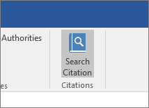

# 在系統管理中心管理增益集Manage add-ins in the admin center

::: moniker range="o365-21vianet"

> [!NOTE]
> 系統管理中心正在變更。The admin center is changing. 如果您的體驗不符合此處所示的詳細資料，請參閱 [關於新版 Microsoft 365 系統管理中心](https://docs.microsoft.com/microsoft-365/admin/microsoft-365-admin-center-preview?view=o365-21vianet) (英文)。If your experience doesn't match the details presented here, see [About the new Microsoft 365 admin center](https://docs.microsoft.com/microsoft-365/admin/microsoft-365-admin-center-preview?view=o365-21vianet).

::: moniker-end

Office 增益集可協助您個人化檔，並簡化存取網頁上資訊的方式 (請參閱 [開始使用 Office 增益集](https://support.microsoft.com/office/82e665c4-6700-4b56-a3f3-ef5441996862)) 。Office add-ins help you personalize your documents and streamline the way you access information on the web (see [Start using your Office add-in](https://support.microsoft.com/office/82e665c4-6700-4b56-a3f3-ef5441996862)). 

在管理員為組織中的使用者部署增益集後，系統管理員可以關閉或開啟增益集、編輯、刪除及管理增益集的存取。After an admin deploys add-ins for users in an organization, the admin can turn add-ins off or on, edit, delete, and manage access to the add-ins.

如需從系統管理中心安裝增益集的詳細資訊，請參閱 [在系統管理中心部署增益集](https://docs.microsoft.com/microsoft-365/admin/manage/manage-deployment-of-add-ins)。For more information about installing add-ins from the admin center, see [Deploy add-ins in the admin center](https://docs.microsoft.com/microsoft-365/admin/manage/manage-deployment-of-add-ins).
  
## 增益集狀態Add-in states

增益集可以處於 [ **開啟** ] 或 [ **關閉** ] 狀態。An add-in can be in either the **On** or **Off** state.
  
|**State****State**|**狀態如何發生****How the state occurs**|**影響****Impact**|
|:-----|:-----|:-----|
|**Active****Active**    |系統管理員上載增益集，並將其指派給使用者或群組。Admin uploaded the add-in and assigned it to users or groups.    |被指派增益集的使用者和群組會在相關用戶端中看見增益集。Users and groups assigned to the add-in see it in the relevant clients.    |
|**已關閉****Turned off**    |系統管理員已關閉增益集。Admin turned off the add-in.    |被指派增益集的使用者和群組無法再存取增益集。Users and groups assigned to the add-in no longer have access to it.    如果增益集狀態已變更為 [使用中]，使用者和群組將可再次存取增益集。If the add-in state is changed to Active, the users and groups will have access to it again.    |
|**Deleted****Deleted**    |系統管理員已刪除增益集。Admin deleted the add-in.    |被指派增益集的使用者和群組無法再存取增益集。Users and groups assigned the add-in no longer have access to it.    |
   
如果沒有人再使用增益集，請考慮刪除增益集。Consider deleting an add-in if no one is using it anymore. 例如，如果增益集只會在一年的特定時間內使用，則關閉增益集可能會有意義。For example, turning off an add-in might make sense if an add-in is used only during specific times of the year.

## 刪除增益集Delete an add-in

您也可以刪除已部署的增益集。You can also delete an add-in that was deployed.

1. 在系統管理中心中，移至 [ **設定**  >  **服務] & 增益集** ] 頁面。In the admin center, go to the **Settings** > **Services & add-ins** page.

     > [!NOTE]
    > 系統管理中心已更新整合型應用程式的部署經驗。The admin center is getting updated to deployment experience with Integrated Apps . 如果您未看到上述步驟，請移至 [集中式部署] 區段，移至 [ **設定** ] [  >  **整合式應用程式** ]。If you don't see the above steps, go to Centralized Deployment section by going to **Settings** > **Integrated apps**. 在 [ **整合式應用程式** ] 頁面的頂端，選擇 [ **增益集** ]。On the top of the **Integrated apps** page, choose **Add-ins**.

2. 選取部署的增益集。Select the deployed add-in.

3. 按一下 [ **刪除] Add-In** 。Click on **Delete Add-In**. 移除右下角的增益集按鈕。Remove the Add-in button on the bottom right corner.

4. 驗證您的選擇，然後選擇 [ **移除增益集** ]。Validate your selections, and choose **Remove add-in**.

## 編輯增益集存取Edit add-in access

部署後，系統管理員也可以管理使用者對增益集的存取。Post deployment, admins can also manage user access to add-ins.

1. 在系統管理中心中，移至 [ **設定**  >  **服務] & 增益集** ] 頁面。In the admin center, go to the **Settings** > **Services & add-ins** page.

     > [!NOTE]
    > 系統管理中心已更新整合型應用程式的部署經驗。The admin center is getting updated to deployment experience with Integrated Apps . 如果您未看到上述步驟，請移至 [集中式部署] 區段，移至 [ **設定** ] [  >  **整合式應用程式** ]。If you don't see the above steps, go to Centralized Deployment section by going to **Settings** > **Integrated apps**. 在 [ **整合式應用程式** ] 頁面的頂端，選擇 [ **增益集** ]。On the top of the **Integrated apps** page, choose **Add-ins**.

2. 選取部署的增益集。Select the deployed add-in.

3. 按一下 [在 **誰可以存取** ] 底下的 [ **編輯** ]。Click on **Edit** under **Who has Access**.

4. 儲存變更。Save the changes.

## 在 Outlook) 以外的所有用戶端上關閉 Office 存放區，以防止增益集下載 (Prevent add-in downloads by turning off the Office Store across all clients (Except Outlook)

> [!NOTE]
> Outlook 增益集安裝是由 [不同](https://technet.microsoft.com/library/jj943754%28v=exchg.150%29.aspx)的程式管理。Outlook add-in installation is managed by a [different process](https://technet.microsoft.com/library/jj943754%28v=exchg.150%29.aspx).

做為組織，您可能想要防止從 Office Store 下載新的 Office 增益集。As an organization you may wish to prevent the download of new Office add-ins from the Office Store. 這可以與集中式部署搭配使用，以確保只有組織認可的增益集部署至組織內的使用者。This can be used in conjunction with Centralized Deployment to ensure that only organization-approved add-ins are deployed to users within your organization.
  
**若要關閉增益集採集****To turn off add-in acquisition**
  
1. 在系統管理中心中，移至 **[設定]** \> [[服務與增益集]](https://go.microsoft.com/fwlink/p/?linkid=2053743) 頁面。In the admin center, go to the **Settings** \> [Services &amp; add-ins](https://go.microsoft.com/fwlink/p/?linkid=2053743) page.

     > [!NOTE]
    > 系統管理中心已更新整合型應用程式的部署經驗。The admin center is getting updated to deployment experience with Integrated Apps . 如果您未看到上述步驟，請移至 [集中式部署] 區段，移至 [ **設定** ] [  >  **整合式應用程式** ]。If you don't see the above steps, go to Centralized Deployment section by going to **Settings** > **Integrated apps**. 在 [ **整合式應用程式** ] 頁面的頂端，選擇 [ **增益集** ]。On the top of the **Integrated apps** page, choose **Add-ins**.
    
3. 選取 [ **使用者擁有的應用程式和服務** ]。Select **User owned apps and services**.
    
4. 清除 [讓使用者存取 Office store] 選項。Clear the option to let users access the Office store.

這會防止所有使用者從存放區中取得下列增益集。This will prevent all users from acquiring the following add-ins from the store.
  
- Word、Excel 及 PowerPoint 2016 的增益集，來自：Add-ins for Word, Excel, and PowerPoint 2016 from:
    
  - WindowsWindows
    
  - MacMac
    
  - 辦公室Office
    
    
- 從 **AppSource** 中開始的購置Acquisitions starting within **AppSource**
    
- Microsoft 365 中的增益集Add-ins within Microsoft 365
    
嘗試存取儲存區的使用者會看到下列訊息： **對不起，Microsoft 365 已設定為防止個別購買 Office store 增益集。**A user who tries to access the store will see the following message: **Sorry, Microsoft 365 has been configured to prevent individual acquisition of Office Store add-ins.**
  
下列版本提供支援關閉 Office 書店的功能：Support for turning off the Office Store is available in the following versions:
  
- Windows： 16.0.9001-目前可供使用。Windows: 16.0.9001 - Currently available.
    
- Mac： 16.10.18011401-目前可供使用。Mac: 16.10.18011401 - Currently available.
    
- iOS： 2.9.18010804-目前可供使用。iOS: 2.9.18010804 - Currently available.
    
- 目前可用的 web。The web - Currently available.
    
這不會讓系統管理員使用集中式部署從 Office Store 指派增益集。This does not prevent an administrator from using Centralized Deployment to assign an add-in from the Office Store.
  
若要防止使用者使用 Microsoft 帳戶登入，您可以限制登入只使用組織帳戶。To prevent a user from signing in with a Microsoft account, you can restrict logon to use only the organizational account. 如需詳細資訊，請參閱 [Office 2016 的身分識別、驗證及授權](https://technet.microsoft.com/library/jj683102%28v=office.16%29.aspx)。For more information, see [Identity, authentication, and authorization in Office 2016](https://technet.microsoft.com/library/jj683102%28v=office.16%29.aspx).  

> [!NOTE]
> 防止使用者存取 office 書店也會防止使用者在 [進行測試時旁載 Office 增益集](https://docs.microsoft.com/office/dev/add-ins/testing/create-a-network-shared-folder-catalog-for-task-pane-and-content-add-ins)。Preventing users from accessing the office store will also prevent them from [Sideloading Office Add-ins for testing](https://docs.microsoft.com/office/dev/add-ins/testing/create-a-network-shared-folder-catalog-for-task-pane-and-content-add-ins).

## 更多關於使用者使用增益集的體驗More about the end user experience with add-ins

部署增益集之後，您的使用者就可以開始在 Office 應用程式中使用它 (請參閱 [開始使用 Office 增益集](https://support.microsoft.com/office/82e665c4-6700-4b56-a3f3-ef5441996862)) 。After you deploy an add-in, your end users can start using it in their Office applications (see [Start using your Office Add-in](https://support.microsoft.com/office/82e665c4-6700-4b56-a3f3-ef5441996862)). 增益集會出現在增益集所支援的所有平臺上。The add-in appears on all platforms that the add-in supports.
  
如果增益集支援增益集命令，命令會顯示在 Office 功能區上。If the add-in supports add-in commands, the commands appear on the Office ribbon. 在下列範例中，會出現 **引文** 增益集的命令 **搜尋引文** 。In the following example, the command **Search Citation** appears for the **Citations** add-in. 

  
如果部署的增益集不支援增益集命令，或是您想要查看所有已部署的增益集，您可以透過 **My 增益集** 進行查看。If the deployed add-in doesn't support add-in commands or if you want to view all deployed add-ins, you can view them via **My Add-ins**. 
  
### 在 Word 2016、Excel 2016 或 PowerPoint 2016 中In Word 2016, Excel 2016, or PowerPoint 2016

1. 選取 [ **插入 \> 我的增益集** ]。Select **Insert \> My Add-ins**. 
    
2. 在 [Office 增益集] 視窗中，選取 [ **管理受管理** ] 索引標籤。Select the **Admin Managed** tab in the Office Add-ins window. 
    
3. 在此範例中，按兩下您先前部署的增益集 (中的 **引文** ) 。Double-click the add-in you deployed earlier (in this example, **Citations** ).  ![[Office 增益集] 頁面的 [管理受管理] 索引標籤](../../media/fd36ba81-9882-40f0-9fce-74f991aa97d5.png)
  
### 在 Outlook 中In Outlook

1. 在 [ **首頁** ] 功能區上，選取 [ **取得增益集** ]。On the **Home** ribbon, select **Get Add-ins**. ![Outlook 中的 [市集] 按鈕](../../media/getaddinsicon.png)
  
2. 選取左側導覽中的 [系統 **管理管理** ]。Select **Admin-managed** in the left nav. 

## 深入了解Learn more

[在系統管理中心部署增益集Deploy add-ins in the admin center](https://docs.microsoft.com/microsoft-365/admin/manage/manage-deployment-of-add-ins)

深入了解如何建立及建置 [Office 增益集](https://docs.microsoft.com/office/dev/add-ins/overview/office-add-ins)。Learn more about creating and building [Office Add-ins](https://docs.microsoft.com/office/dev/add-ins/overview/office-add-ins).
  
[使用集中式部署 PowerShell Cmdlet 來管理增益集](https://docs.microsoft.com/office365/enterprise/use-the-centralized-deployment-powershell-cmdlets-to-manage-add-ins)。[Use Centralized Deployment PowerShell cmdlets to manage add-ins](https://docs.microsoft.com/office365/enterprise/use-the-centralized-deployment-powershell-cmdlets-to-manage-add-ins).
  
[疑難排解：使用者未看到增益集Troubleshoot: User not seeing add-ins](https://docs.microsoft.com/office365/troubleshoot/access-management/user-not-seeing-add-ins)

[Microsoft Store 中的未成年人和取得增益集Minors and acquiring add-ins from the Microsoft Store](https://docs.microsoft.com/microsoft-365/admin/manage/minors-and-acquiring-addins-from-the-store)
