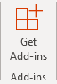

# 在 Microsoft 365 管理中心中管理 Office 365 增益集的部署Manage deployment of Office 365 add-ins in the Microsoft 365 admin center

Office 增益集可以協助您將文件個人化，也可以簡化您存取網路資訊的方式 (請參閱[開始使用 Office 增益集](https://support.office.com/article/82e665c4-6700-4b56-a3f3-ef5441996862.aspx))。Office add-ins help you personalize your documents and streamline the way you access information on the web (see [Start using your Office Add-in](https://support.office.com/article/82e665c4-6700-4b56-a3f3-ef5441996862.aspx)). 身為系統管理員，您可以在組織中部署 Office 增益集的使用者。As an admin, you can deploy Office add-ins for the users in your organization. 您可以在 Microsoft 365 系統管理中心中使用 [集中式部署] 功能。You can do this using the Centralized Deployment feature in the Microsoft 365 admin center.
  
集中式的部署] 是建議且最功能豐富的方法，大部分的系統管理員將增益集部署至使用者和組織中的群組。Centralized Deployment is the recommended and most feature-rich way for most admins to deploy add-ins to users and groups within an organization. 如需有關如何判斷貴組織是否可支援 [集中式部署] 的詳細資訊，請參閱[判斷您的 Office 365 組織是否適合使用 [集中式部署] 來部署增益集](centralized-deployment-of-add-ins.md)。For more information on how to determine if your organization can support Centralized Deployment, see [Determine if Centralized Deployment of add-ins works for your Office 365 organization](centralized-deployment-of-add-ins.md).
  
[集中式部署] 提供下列優點：Centralized Deployment provides the following benefits:
  
- 直接給使用者、 群組中，透過多個使用者或租用戶中的每個人都全域系統管理員可以指派增益集。A Global admin can assign an add-in directly to a user, to multiple users via a group, or to everyone in the tenant.
    
- 當相關 Office 應用程式啟動時，系統會自動為使用者下載增益集。如果增益集支援增益集命令，增益集會自動顯示在 Office 應用程式的 [功能區] 中。When the relevant Office application starts, the add-in automatically downloads for the user. If the add-in supports add-in commands, the add-in automatically appears in the Ribbon within the Office application.
    
- 增益集不會再出現的使用者如果系統管理員會關閉或刪除增益集，或者使用者已從 Azure Active Directory 或增益集指派給群組。Add-ins will no longer appear for users if the admin turns off or deletes the add-in, or if the user is removed from Azure Active Directory or from a group that the add-in is assigned to.
    
> [!NOTE]
>  對於 Word，Excel 及 PowerPoint 使用[SharePoint 應用程式目錄](https://dev.office.com/docs/add-ins/publish/publish-task-pane-and-content-add-ins-to-an-add-in-catalog)將增益集部署到未連線到 Office 365 及 （或） 支援的 SharePoint 增益集所需的內部部署環境中的使用者。For Word, Excel and PowerPoint use a [SharePoint App Catalog](https://dev.office.com/docs/add-ins/publish/publish-task-pane-and-content-add-ins-to-an-add-in-catalog) to deploy add-ins to users in an on-premises environment with no connection to Office 365 and/or support for SharePoint add-ins required. >  針對 Outlook，請使用 Exchange 控制台來在未連線到 Office 365 的內部部署環境中進行部署。>  For Outlook use Exchange control panel to deploy in an on-premises environment without a connection to Office 365. > 
  
## 部署 Office 增益集的建議方式Recommended approach for deploying Office add-ins

請考慮採用分階段的方式來推出增益集，這樣有助於確保增益集部署順利進行。我們的建議方案如下：Consider rolling out add-ins in a phased approach to help ensure your add-in deployment goes smoothly. We recommend the following plan:
  
1. 為一小組商務專案關係人以及 IT 部門的成員推行增益集。評估部署是否成功，如果成功，則請繼續進行步驟 2。Roll-out the add-in to a small set of business stakeholders and members of the IT department. Evaluate if the deployment was successful, and if so, move on to step 2.
    
2. 為企業中將需使用增益集的一大組人員推行。同樣地，請評估成果，如果一切順利，則請繼續進行完整部署的下一個步驟。Roll-out to a larger set of individuals within the business who will be using the add-in. Again, evaluate results and, if all went well, go to the next step of a full deployment.
    
3. 為目標對象使用者完全推行。Full rollout to target audience of users.
    
視目標對象的大小規模而定，您可能會想要新增或移除推行步驟。Depending on the size of the target audience, you may want to add or remove roll-out steps.
  
## 部署 Office 增益集使用系統管理中心Deploy an Office add-in using the admin center

開始之前，請參閱[判斷您的 Office 365 組織是否適合使用 [集中式部署] 來部署增益集](centralized-deployment-of-add-ins.md)。Before you begin, see [Determine if Centralized Deployment of add-ins works for your Office 365 organization](centralized-deployment-of-add-ins.md).

  
1. 在系統管理中心，移至 [**設定** \> **增益集**] 頁面。In the admin center, go to the **Settings** \> **Add-ins** page.
    
2. 選取 [**部署增益集**] 頁面的頂端。Select **Deploy Add-in** at the top of the page. 在 [概觀] 頁面上，選取 [**下一步**]。On the overview page, select **Next**.
    
3. 選取一個選項，並遵循指示。Select an option and follow the instructions.
  
4. 如果您選取 [從 Office 市集新增增益集] 選項，您現在可以讓您增益集的選取範圍。If you selected the option to add an add-in from the Office Store, you can now make your add-in selection. 請注意，您可以檢視可用增益集透過類別的**建議為您**、**評等**，或**名稱**。Notice that you can view available add-ins via categories of **Suggested for you**, **Rating**, or **Name**. 您只能從 Office 市集新增免費的增益集。Only free add-ins are available to add from the Office Store. 目前尚不支援付費增益集。Paid add-ins aren't supported currently. 一旦您已經選取增益集，您必須同意才能繼續執行一些其他條款和條件。Once you've selected your add-in, you will need to agree to some additional terms and conditions in order to proceed.    附註： 使用 Office 市集選項時，更新和增強功能的增益集將會自動可供您無需介入的使用者。NOTE: With the Office Store option, updates and enhancements to the add-in will automatically be made available to users without your intervention.

5. 在下一個頁面上，選取**所有人**、**特定使用者/群組**或**只是我**來指定增益集部署至使用者。On the next page, select **Everyone**, **Specific users/groups** or **Just me** to specify who the add-in is deployed to. 使用 [搜尋] 方塊，尋找您要將增益集部署到哪個使用者或群組。Use the Search box to find the users or groups who you want to deploy the add-in to.  附註： 了解適用於增益集的狀態。NOTE: Learn about the other states that apply to an add-in. 請參閱本主題稍後介紹的[增益集狀態](#add-in-states)。See [Add-in states](#add-in-states) later in this topic.
  
6. 選取 [**部署**]。Select **Deploy**.
  
7. 增益集已部署時，會顯示綠色刻度。A green tick will appear when the add-in has been deployed. 您可以遵循若要測試的增益集已部署成功] 頁面上的指示。You can follow the on-page instructions to test that the add-in has deployed successfully.

> [!NOTE]
> 使用者可能需要重新啟動 Office，以查看出現在應用程式的功能區上的 [增益集] 圖示。Users may need to relaunch Office to see the add-in icon appear on the ribbon of app. Outlook 增益集可能需要最多 12 小時才會出現在使用者的功能區上。Outlook add-ins can take up to 12 hours to appear on users' ribbons.
    
8. 完成後，選取 [**下一步**]。When finished, select **Next**. 如果您已部署至只給您自己，您可以在才能部署到多個使用者選取**有權存取增益集的變更**。If you've deployed to just yourself, you can select **Change who has access to add-in** in order to deploy to more users.

如果您已部署增益集以外自行貴組織的成員，請遵循顯示才能有效地宣布增益集的部署指示。If you've deployed the add-in to members of your organization other than yourself, follow the instructions displayed in order to effectively announce the deployment of the add-in.  您現在會在 Office 365 中看見您的增益集以及其他 App。You now see your add-in along with other apps in Office 365.
  
將增益集部署到使用者和群組後，建議您告知他們，這樣他們才會知道已經可以使用增益集。It's a good idea to inform the users and groups who you deployed the add-in to so that they know that it's available. 請考慮傳送電子郵件給他們，說明使用增益集的時機與方法，並解說增益集對於提升工作效率有何幫助。Consider sending an email to them that describes when and how to use the add-in and explains how the add-in can help them do their job better. 包含或連結到相關的說明內容或常見問題集，如果使用者有任何增益集的問題可能會幫助。Include or link to relevant Help content or FAQs that might help if users have any problems with the add-in.
  
### 將增益集指派給使用者和群組時的考慮事項Considerations when assigning an add-in to users and groups

系統管理員可以將增益集指派給所有人或特定的使用者和群組。Admins can assign an add-in to everyone or to specific users and groups. 每個選項都有其意涵：Each option has implications:
  
- **所有人**： 顧名思義，此選項會將指定的增益集給租用戶中的每位使用者。**Everyone**: As the name implies, this option assigns the add-in to every user in the tenant. 請謹慎使用此選項，並且只有在貴組織需要普遍使用此增益集時才使用此選項。Use this option sparingly and only for add-ins that are truly universal to your organization. 
    
- **使用者**： 如果您的增益集指派給個別使用者，然後增益集部署到新的使用者，您必須先新增該使用者。**Users**: If you assign an add-in to an individual user, then to deploy the add-in to a new user, you will need to first add that user. 移除使用者時也是如此。The same goes for removing users. 
    
- **群組**： 如果您將增益集指派給群組，新增至群組的使用者將會自動指派增益集。**Groups**: If you assign an add-in to a group, users who are added to the group will automatically be assigned the add-in. 此外，移除群組中的使用者後，該使用者就會失去增益集的存取權。And, when a user is removed from a group, the user loses access to the add-in. 在任何一種情況下，身為系統管理員的您都不需要執行額外的動作。In either case, no additional action is required from you as the admin. 

- **僅自己**： 如果您將增益集指派給只給您自己，這樣會將指定的增益集至您的帳戶。**Just me**: If you assign an add-in to just yourself, this assigns the add-in to only your account. 這是理想如果您想要測試增益集第一次。This is ideal if you wish to test out the add-in first.
    
最適合貴組織的選項取決於您的設定。The option that is right for your organization depends on your configuration. 不過，建議透過群組執行指派。However, we recommend making assignments via groups. 身為系統管理員，比起每次必須變更指派的使用者，使用群組來管理增益集及控制這些群組的成員資格可能會比較輕鬆。As an admin, you might find it easier to manage add-ins using groups and control the membership of those groups rather than having to change the users assigned each time. 另一方面，在某些情況下，您可能會想要將存取權限制於一小組使用者以內，因而指派特定的使用者。On the other hand, in some situations, you may want to restrict access to a very small set of users and therefore make assignments to specific users. 因此，您必須以手動方式管理被指派的使用者。As a result, you will need to manage the assigned users manually.
  
### 增益集狀態Add-in states

增益集可以是在**開啟**或**關閉**狀態。An add-in can either be in the **On** or **Off** state.
  
|**State****State**|**狀態如何發生****How the state occurs**|**影響****Impact**|
|:-----|:-----|:-----|
|**Active****Active**    |系統管理員上傳增益集，並將其指派給使用者或群組。Admin uploaded the add-in and assigned it to users or groups.    |被指派增益集的使用者和群組會在相關用戶端中看見增益集。Users and groups assigned to the add-in see it in the relevant clients.    |
|**已關閉****Turned off**    |系統管理員已關閉增益集。Admin turned off the add-in.    |被指派增益集的使用者和群組無法再存取增益集。Users and groups assigned to the add-in no longer have access to it.    如果增益集狀態已變更為 [使用中]，使用者和群組將可再次存取增益集。If the add-in state is changed to Active, the users and groups will have access to it again.    |
|**Deleted****Deleted**    |系統管理員已刪除增益集。Admin deleted the add-in.    |被指派增益集的使用者和群組無法再存取增益集。Users and groups assigned the add-in no longer have access to it.    |
   
請考慮刪除增益集，如果沒有人在有人使用。Consider deleting an add-in if no one is using it any more. 如果只有在一年的某些特殊時段需要使用增益集，關閉增益集可能會是比較合理的做法。Turning off an add-in may make sense if an add-in is used only during specific times of the year.
  
### Office 增益集的安全性Security of Office add-ins

Office 增益集會與內含部分增益集中繼資料的 XML 資訊清單檔案合併，但最重要的是，Office 增益集會與指向包含所有程式碼和邏輯的 Web 應用程式合併。增益集可以有各種不同的功能。例如，增益集可以：Office add-ins combine an XML manifest file that contains some metadata about the add-in, but most importantly points to a web application which contains all the code and logic. Add-ins can range in their capabilities. For example, add-ins can:
  
- 顯示資料。Display data.
    
- 閱讀使用者的文件以提供內容相關服務。Read a user's document to provide contextual services.
    
- 從使用者的文件讀取及寫入資料，以提供值給該使用者。Read and write data to and from a user's document to provide value to that user.
    
如需 Office 增益集類型和功能的詳細資訊，請參閱 [Office 增益集平台概觀](https://go.microsoft.com/fwlink/p/?linkid=846362) (尤其是「分析 Office 增益集」一節)。For more information about the types and capabilities of Office add-ins, see [Office Add-ins platform overview](https://go.microsoft.com/fwlink/p/?linkid=846362), especially the section "Anatomy of an Office Add-in."
  
若要與使用者的文件互動，增益集必須在資訊清單中宣告需要的權限。五個層級的 JavaScript API 存取權限模型可為工作窗格增益集使用者提供基本的隱私權和安全性。Office 市集中的大多數增益集為 ReadWriteDocument 層級，且包含至少 ReadDocument 層級的大部分增益集支援功能。如需權限層級的詳細資訊，請參閱[要求取得用於內容和工作窗格增益集之 API 的權限](https://go.microsoft.com/fwlink/p/?linkid=848863) (英文)。To interact with the user's document, the add-in needs to declare what permission it needs in the manifest. A five-level JavaScript API access-permissions model provides the basis for privacy and security for users of task pane add-ins. The majority of the add-ins in the Office Store are level ReadWriteDocument with almost all add-ins supporting at least the ReadDocument level. For more information about the permission levels, see [Requesting permissions for API use in content and task pane add-ins](https://go.microsoft.com/fwlink/p/?linkid=848863).
  
更新資訊清單時，通常是變更增益集的圖示和文字。有時則會變更增益集的命令。不過，增益集的權限不會遭到變更。執行增益集的所有程式碼和邏輯的 Web 應用程式可能隨時變更，這是 Web 應用程式的本質所致。When updating a manifest, the typical changes are to an add-in's icon and text. Occasionally, add-in commands change. However, the permissions of the add-in do not change. The web application where all the code and logic for the add-in runs can change at any time, which is the nature of web applications.
  
增益集的更新會以下列方式進行：Updates for add-ins happen as follows:
  
- **-營運增益集：** 在此情況下，系統管理員明確上傳資訊清單，其中的增益集需要系統管理員上傳新的資訊清單檔案，以支援中繼資料變更。**Line-of-business add-in:** In this case, where an admin explicitly uploaded a manifest, the add-in requires that the admin upload a new manifest file to support metadata changes. 在下次啟動相關的 Office 應用程式時，增益集就會更新。The next time the relevant Office applications start, the add-in will update. Web 應用程式可以隨時變更。The web application can change at any time. 

    > [!NOTE]
    > 系統管理員不需要若要移除的 LOB 增益集進行更新。Admin does not need to remove a LOB Add-in for doing an update.   在增益集] 區段中，系統管理員可以只是按一下 LOB 增益集，然後選擇右下角中的**更新] 按鈕**。In the Add-ins section, Admin can simply click on the LOB Add-in and choose the **Update Button** in the bottom right corner. 只有當新的增益集的版本是大於的現有的增益集，將運作更新。Update will work only if the version of the new add-in is greater than that of the existing add-in.   
    
- **Office 市集增益集：** 當系統管理員選取增益集從 Office 市集，如果增益集更新 Office 市集中時，增益集將會更新稍後集中式部署。**Office Store add-in:** When an admin selected an add-in from the Office Store, if an add-in updates in the Office Store, the add-in will update later in Centralized Deployment. 在下次啟動相關的 Office 應用程式時，增益集就會更新。The next time the relevant Office applications start, the add-in will update. Web 應用程式可以隨時變更。The web application can change at any time. 

### 編輯增益集的存取Edit Add-in access

張貼部署，系統管理員也可以修改增益集的使用者存取。Post deployment, admins can also modify the user access to add-ins.

1. 在系統管理中心，移至 [**設定** > **服務 & 增益集**] 頁面。In the admin center, go to the **Settings** > **Services & add-ins** page.

2. 選取已部署的增益集。Select the deployed add-in.

3. 按一下在 [**誰可以存取**的 [**編輯**]。Click on **Edit** under **Who has Access**.
4. 儲存所做的變更。Save the changes.
    
### 防止增益集的下載項目，藉由關閉 Office 市集總所有用戶端 (除了 Outlook)Prevent add-in downloads by turning off the Office Store across all clients (Except Outlook)

> [!NOTE]
> Outlook 增益集安裝的管理方式的[不同程序](https://technet.microsoft.com/library/jj943754%28v=exchg.150%29.aspx)。Outlook add-in installation is managed by a [different process](https://technet.microsoft.com/library/jj943754%28v=exchg.150%29.aspx).

為組織，您可能想要防止新 Office 增益集從 Office 市集下載。As an organization you may wish to prevent the download of new Office add-ins from the Office Store. 這可以用搭配集中式部署來確保只有組織核准增益集部署到組織內的使用者。This can be used in conjunction with Centralized Deployment to ensure that only organization-approved add-ins are deployed to users within your organization.
  
若要關閉增益集擷取：To turn off add-in acquisition:
  
1. 在系統管理中心中，移至 **[設定]** \> [[服務與增益集]](https://go.microsoft.com/fwlink/p/?linkid=2053743) 頁面。In the admin center, go to the **Settings** \> [Services &amp; add-ins](https://go.microsoft.com/fwlink/p/?linkid=2053743) page.
    
3. 選取 [**使用者所擁有的應用程式與服務**]。Select **User owned apps and services**.
    
4. 清除，讓使用者可存取 Office 存放區] 選項。Clear the option to let users access the Office store.

這會防止所有使用者取得下列增益集從存放區。This will prevent all users from acquiring the following add-ins from the store.
  
- 增益集的 Word、 Excel 及 PowerPoint 2016 中：Add-ins for Word, Excel, and PowerPoint 2016 from:
    
  - WindowsWindows
    
  - MacMac
    
  - 辦公室Office
    
  - iOS （僅限 ipad 版）iOS (iPad only)
    
- 收購**AppSource**內開始Acquisitions starting within **AppSource**
    
- 增益集在 Office 365Add-ins within Office 365
    
嘗試存取存放區的使用者會看到下列訊息：**連到顯示抱歉，Office 365 已設定為防止 Office 市集新增寫的個別擷取**A user who tries to access the store will see the following message: **Sorry, Office 365 has been configured to prevent individual acquisition of Office Store add-ins.**
  
關閉 Office 市集的支援位於下列版本：Support for turning off the Office Store is available in the following versions:
  
- Windows: 16.0.9001-目前無法使用。Windows: 16.0.9001 - Currently available.
    
- Mac: 16.10.18011401-目前無法使用。Mac: 16.10.18011401 - Currently available.
    
- iOS: 2.9.18010804-目前無法使用。iOS: 2.9.18010804 - Currently available.
    
- Web-目前無法使用。The web - Currently available.
    
這不防止系統管理員從 Office 市集增益集指派使用集中式部署。This does not prevent an administrator from using Centralized Deployment to assign an add-in from the Office Store.
  
若要防止使用者登入 Microsoft 帳戶後，您可以限制使用組織的帳戶登入。To prevent a user from signing in with a Microsoft account, you can restrict logon to use only the organizational account. 如需詳細資訊，請查看[以下](https://technet.microsoft.com/library/jj683102%28v=office.16%29.aspx)。For more information, look [here](https://technet.microsoft.com/library/jj683102%28v=office.16%29.aspx).
 
  
## 未成年人獲取和取得增益集從存放區Minors and acquiring add-ins from the Store

一般資料保護規定 (GDPR) 會變成有效歐盟規定 2018 年 5 月 25 日。The General Data Protection Regulation (GDPR) is a European Union regulation that becomes effective May 25, 2018. 它會提供使用者的權限和其資料的保護。It gives users rights to and protection of their data. GDPR 的層面是未成年人獲取不能有傳送給其父或守護者未核准的廠商其個人資料。One of the aspects of the GDPR is that minors cannot have their personal data sent to parties that their parent or guardian hasn't approved. 定義為次要的特定保留取決於個別所在的區域。The specific age defined as a minor depends on the region where the individual is located.
  
有關於家長的同意法定之擔保規定的區域包含美國、 南韓、 英國及歐盟地區。Regions that have statutory regulations about parental consent include the United States, South Korea, the United Kingdom, and the European Union. 這些區域中，次要粗俗 （透過 Azure Active Directory) 從市集取得任何新 Office 增益集並執行增益集已先前取得的。For those regions, a minor will be blocked (via Azure Active Directory) from getting any new Office add-ins from the Store and running add-ins that were previously acquired. 國家/地區而法定之擔保規定，會沒有下載限制。For countries without statutory regulations, there will be no download restrictions.
  
使用者決定要在 Azure Active Directory 中指定的資料為基礎的次要。A user is determined to be a minor based on data specified in Azure Active Directory. 租用戶系統管理員負責宣告法律保留天數群組和該使用者的家長的同意。The tenant admin is responsible for declaring the legal age group and the parental consent for that user.
  
如果父/守護者 consents 來使用特定的增益集次要，租用戶系統管理員可以將該增益集部署至所有已獲同意未成年人獲取使用集中式的部署。If the parent/guardian consents to a minor using a specific add-In, then the tenant admin can use centralized deployment to deploy that add-In to all minors who have consent.
  
若要設為 GDPR 合規性的未成年人獲取您必須確保下列組建 Office 的其中一個可部署在您的學校/組織。To be GDPR compliant for minors you need to ensure that one of following builds of Office is deployed in your school/organization.
  
 **如 Word、 Excel、 PowerPoint 和 Project**:**For Word, Excel, PowerPoint, and Project**: 
  
|||
|:-----|:-----|
|**平台****Platform**   |**組建號碼****Build number**   |
|Windows 版 office 2016 專業增強版每月Office 2016 ProPlus Monthly for Windows    |9001.21389001.2138     |
|Office 2016 專業增強版的半年Office 2016 ProPlus Semi-Annual    |8431.21598431.2159    |
|Office 2016 for WindowsOffice 2016 for Windows    |16.0.4672.100016.0.4672.1000    |
|Office 2013 for WindowsOffice 2013 for Windows    |15.0.5023.100015.0.5023.1000    |
|Office 2016 for MacOffice 2016 for Mac    |16.11.1802020016.11.18020200    |
|Office 2016 for iOS （僅限 ipad 版）Office 2016 for iOS (ipad only)    |2.12.180326002.12.18032600    |
|網頁版 OfficeOffice for the web    |不適用N/A    |
   
 **Outlook**:**For Outlook**: 
  
|||
|:-----|:-----|
|**平台****Platform**   |**組建號碼****Build number**   |
|Outlook 2016 for Windows (MSI)Outlook 2016 for Windows (MSI)    |建立沒有 TBDBuild No TBD    |
|Outlook 2016 for Windows (C2R)Outlook 2016 for Windows (C2R)    |16.0.9323.100016.0.9323.1000    |
|Office 2016 for MacOffice 2016 for Mac    |16.0.9318.100016.0.9318.1000    |
|IOS 版 outlook 行動裝置Outlook mobile for iOS    |2.75.02.75.0    |
|Android 版行動裝置的 outlookOutlook mobile for Android    |2.2.1452.2.145    |
|Outlook.comOutlook.com    |不適用N/A    |
   
 **Office 2013 需求****Office 2013 requirements**
  
Word、 Excel 及 PowerPoint 2013 for Windows 會支援相同的次要檢查，如果已啟用 Active Directory Authentication Library (ADAL)。Word, Excel, and PowerPoint 2013 for Windows will support the same minor checks if Active Directory Authentication Library (ADAL) is enabled. 有兩個選項的符合性下, 一步] 所述。There are two options for compliance, as explained next.
  
- **啟用 ADAL**。**Enable ADAL**. 本文說明如何啟用 ADAL for Office 2013：[使用 Office 365 的 Office 用戶端啟用新式驗證](https://support.office.com/article/776c0036-66fd-41cb-8928-5495c0f9168a)。This article explains how to enable ADAL for Office 2013: [Using Office 365 modern authentication with Office clients](https://support.office.com/article/776c0036-66fd-41cb-8928-5495c0f9168a). 您也必須設定[Windows 裝置上的 Office 2013 啟用新式驗證](../security-and-compliance/enable-modern-authentication.md)所述啟用 ADAL 登錄機碼。You also need to set the registry keys to enable ADAL as explained in [Enable Modern Authentication for Office 2013 on Windows devices](../security-and-compliance/enable-modern-authentication.md). 此外，您需要安裝的下列年 4 月更新 Office 2013:Additionally, you need to install the following April updates for Office 2013:
    
  - [說明 Office 2013 的安全性更新： 2018 年 4 月 10 日Description of the security update for Office 2013: April 10, 2018](https://support.microsoft.com/help/4018330/description-of-the-security-update-for-office-2013-april-10-2018)
    
  - [2018 年 4 月 3 日，更新適用於 Office 2013 (KB4018333)April 3, 2018, update for Office 2013 (KB4018333)](https://support.microsoft.com/help/4018333/april-3-2018-update-for-office-2013-kb4018333)
    
- **請不要啟用 ADAL**。**Don't enable ADAL**. 如果您無法啟用 ADAL Office 2013 中的，我們建議是使用群組原則來關閉 office 用戶端的存放區。If you're unable to enable ADAL in Office 2013, then our recommendation is to use Group Policy to turn off the Store for the office clients. 如何關閉 Office 設定的應用程式的資訊是位[在這裡](https://technet.microsoft.com/library/cc178992.aspx)。Information on how to turn off the app for Office settings is located [here](https://technet.microsoft.com/library/cc178992.aspx).
    
## 使用者的增益集使用體驗End user experience with add-ins

既然您已部署增益集，使用者就可以開始在他們的 Office 應用程式中使用 (請參閱[開始使用 Office 增益集](https://support.office.com/article/82e665c4-6700-4b56-a3f3-ef5441996862.aspx))。增益集會顯示在增益集支援的所有平台上。Now that you've deployed the add-in, your end users can start using it in their Office applications (see [Start using your Office Add-in](https://support.office.com/article/82e665c4-6700-4b56-a3f3-ef5441996862.aspx)). The add-in will appear on all platforms that the add-in supports.
  
如果增益集支援增益集命令，命令會顯示在 Office 功能區上。If the add-in supports add-in commands, the commands appear on the Office ribbon. 在下列範例中，顯示**Search Citation**命令**引文**增益集。In the following example, the command **Search Citation** appears for the **Citations** add-in. 

  
如果已部署的增益集不支援增益集命令，或如果您想要檢視所有部署增益集，您可以透過 **「 我的增益集**檢視它們。If the deployed add-in doesn't support add-in commands or if you want to view all deployed add-ins, you can view them via **My Add-ins**. 
  
### 在 Word 2016、Excel 2016 或 PowerPoint 2016 中In Word 2016, Excel 2016, or PowerPoint 2016

1. 選取**插入\>我的增益集**。Select **Insert \> My Add-ins**. 
    
2. 在 [Office 增益集] 視窗中選取 [**系統管理**] 索引標籤。Select the **Admin Managed** tab in the Office Add-ins window. 
    
3. 連按兩下 [增益集在您部署更早版本 （在本例中為**Citations** ）。Double-click the add-in you deployed earlier (in this example, **Citations** ).  ![系統管理] 索引標籤的 [Office 增益集] 頁面上](../media/fd36ba81-9882-40f0-9fce-74f991aa97d5.png)
  
### 在 Outlook 中In Outlook

1. **家用版**功能區上，選取 [**取得增益集**]。On the **Home** ribbon, select **Get Add-ins**. ![Outlook 中的 [市集] 按鈕](../media/getaddinsicon.png)
  
2. 選取左側的 [**系統管理**Select **Admin-managed** in the left nav.

## 刪除增益集Delete the add-in

您也可以刪除已部署的增益集。You can also delete an add-in that was deployed.

1. 在系統管理中心，移至 [**設定** > **服務 & 增益集**] 頁面。In the admin center, go to the **Settings** > **Services & add-ins** page.

2. 選取已部署的增益集。Select the deployed add-in.

3. 按一下 [**刪除增益集**]。Click on **Delete Add-In**. 移除在右下角的 [增益集] 按鈕。Remove the Add-in button on the bottom right corner.
4. 驗證您的選項，然後選擇 [**移除增益集**。Validate your selections, and choose **Remove add-in**.
  
## 深入了解Learn more

深入了解如何建立及建置 [Office 增益集](https://go.microsoft.com/fwlink/p/?linkid=846362)。Learn more about creating and building [Office Add-ins](https://go.microsoft.com/fwlink/p/?linkid=846362).
  
[使用集中式部署 PowerShell cmdlet 來管理增益集](https://support.office.com/article/94f4e86d-b8e5-42dd-b558-e6092f830ec9)。[Use Centralized Deployment PowerShell cmdlets to manage add-ins](https://support.office.com/article/94f4e86d-b8e5-42dd-b558-e6092f830ec9).
  
[疑難排解： 使用者找不到增益集Troubleshoot: User not seeing add-ins](https://docs.microsoft.com/office365/troubleshoot/access-management/user-not-seeing-add-ins)
