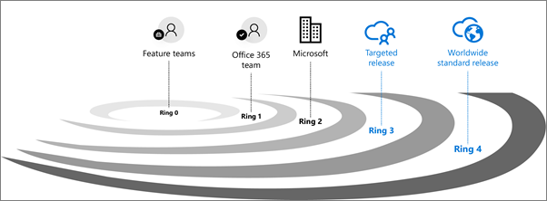

# 設定標準或目標發行選項

::: moniker range="o365-21vianet"

> [!NOTE]
> 系統管理中心正在變更。 如果您的體驗不符合此處所示的詳細資料，請參閱 [關於新版 Microsoft 365 系統管理中心](https://docs.microsoft.com/microsoft-365/admin/microsoft-365-admin-center-preview?view=o365-21vianet) (英文)。

::: moniker-end

使用 Microsoft 365 時，您會在新的產品更新及功能可供使用時收到，而不是每隔幾年執行昂貴的更新。 您可以管理組織收到這些更新的方式。 例如，您可以註冊以在早期取得發行的更新，讓您的組織率先收到更新。 您可以指定僅特定人員收到這些更新。 或者，您可以維持預設的發行排程，於稍後收到更新。 本文說明不同的發行選項，以及您可以如何將它們用於您的組織。
  
> [!IMPORTANT]
> 本文所述的 Microsoft 365 更新適用于 Microsoft 365、SharePoint Online 和 Exchange Online。 這些不適用於商務用 Skype 及相關服務。 這些版本選項是針對目標的，將變更發佈至 Microsoft 365 的最佳操作方式，但在任何時間或所有更新皆無法保證。 
  
## 發行驗證如何運作

任何新的版本都會先由功能小組進行測試及驗證，再由整個 Microsoft 365 功能小組進行測試及驗證，最後是所有 Microsoft。 在內部測試及驗證之後，下一步是針對加入宣告的客戶，將**目標發行**（先前稱為第一版）。 在每個發行週期，Microsoft 都會收集意見反應，並透過監視關鍵使用計量，進一步驗證品質。 這樣一系列的漸進式驗證，都是為了確保全球發行能夠盡可能完善。 下圖是發行的圖片說明： 
  

  
對於重要的更新，客戶最初是由[Microsoft 365 藍圖](https://products.office.com/business/office-365-roadmap)通知。 隨著更新變得更接近，它會透過您的[Microsoft 365 訊息中心](https://admin.microsoft.com/Adminportal/Home?source=applauncher#/MessageCenter)進行傳遞。

> [!NOTE]
> 您必須使用 Microsoft 365 或 Azure AD 帳戶，透過系統[管理中心](https://docs.microsoft.com/office365/admin/admin-overview/about-the-admin-center)存取您的郵件中心。 Microsoft 365 家用方案使用者沒有系統管理員中心。

## 標準發行

這是預設選項，當您和您的使用者廣泛發佈給所有客戶時，您就會收到最新的更新。
  
好的做法是讓大部分的使用者都是在**標準發行**中，也可以讓 IT 專業人員和超級使用者在**目標版本**中，評估新功能，並準備小組以支援商務使用者和主管人員。 
  
> [!NOTE]
> 如果您從已設定目標發行切換回標準發行，您的使用者可能無法存取尚未到達標準發行的功能。 
  
## 已設定目標發行

使用此選項時，您和您的使用者將成為第一批使用最新更新的人員，並可率先提供意見反應來協助改進產品。您可以選擇讓個人或整個組織率先收到更新。
  
> [!IMPORTANT]
> 較大或較複雜的更新可能需要比其他更新更長的時間，以免對使用者造成負面影養。我們無法保持發行的確切時間表。 
  
### 適用於整個組織的已設定目標發行

如果您為此選項[設定系統管理中心的 [發行] 選項](#set-up-the-release-option-in-the-admin-center)，所有的使用者都將取得目標的發行體驗。 針對超過 300 個使用者的組織，建議您針對此選項使用測試訂閱。 如需測試訂閱資訊，請連絡您的 Microsoft 連絡人。 
  
### 適用於已選取使用者的已設定目標發行

如果您為此選項[設定系統管理中心的 [發行] 選項](#set-up-the-release-option-in-the-admin-center)，您可以定義特定使用者（通常為 [超級使用者]）以接收可及早存取功能。 
  
## 已設定目標發行的優點

目標版本可讓系統管理員、變更管理員或其他人負責 Microsoft 365 更新，以準備即將進行的變更，其方式如下：
  
- 在新的更新發行給組織中的所有使用者之前，對更新進行測試與驗證。
    
- 在更新全球發行之前準備使用者通知與文件。
    
- 針對即將到來的變更準備內部技術支援中心。
    
- 瀏覽合規性與安全性審查。
    
- 使用功能控制項 (如果適用的話) 來控制發行給使用者的更新。
    
## 設定系統管理中心的 [發行] 選項

您可以遵循下列步驟，變更您的組織接收 Microsoft 365 更新的方式。 您必須是 Microsoft 365 中的全域系統管理員，才能加入宣告。
  
> [!IMPORTANT]
> 在下列情況下，最多可能需要24小時的時間，才會在 Microsoft 365 中生效。 如果您在啟用已設定目標發行後選擇退出，使用者可能會無法存取尚未到達排定發行的功能。 
  
1. 在系統管理中心中，移至 [**設定**  >  **組織設定**]，然後在 [**組織設定檔**] 索引標籤下，選擇 [**發行喜好**設定]。

5. 若要停用目標版本，請選取 [**標準版本**]，然後選取 [**儲存變更**]。 
    
6. 若要為組織中的所有使用者啟用目標版本，請為 [所有人] 選取 [**目標版本**]，然後選取 [**儲存變更**]。 
    
7. 若要為組織中的某些人員啟用目標版本，請選取 [**目標的版本] 選取的使用者**，然後選取 [**儲存變更**]。 
    
8. 選擇 [**選取使用者**]，一次新增一個使用者，或**上傳使用者**以大量新增使用者。
    
9. 當您新增使用者後，請選取 [**儲存變更**]。

  
## 深入了解

探索如何在[microsoft 365 訊息中心](https://admin.microsoft.com/Adminportal/Home?source=applauncher#/MessageCenter)[管理郵件](https://docs.microsoft.com/office365/admin/manage/message-center)，以取得即將推出之 microsoft 365 更新及發行的通知。
