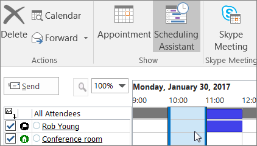
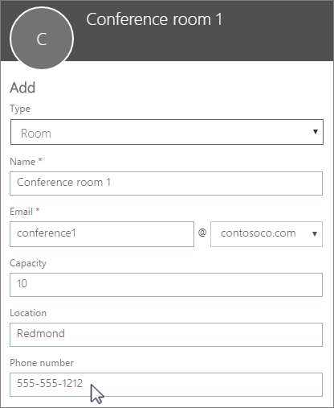

# 會議室和設備信箱

如果您有每個人都需要用到的會議室、公務車或設備，您就必須設法讓每個人都能夠預約這些資源。最好的方法是在 Microsoft 365 中為每個資源建立會議室或設備信箱。您可能會為您的一樓會議室、媒體設備或物流貨車建立會議室或設備信箱。
  
一旦建立會議室或設備信箱，公司中的每個人都可以使用 Outlook 預約會議或活動所需的資源。 若要了解**使用方法**和**設定方法**，請參閱下列兩個索引標籤。 以下是一些有關會議室與設備信箱的其他常見問題。 
  
## 使用會議室和設備信箱

若要使用會議室或設備信箱，請開啟電腦上的 Outlook 或登入 Outlook 網頁版。排定新會議，然後將會議室或設備新增到會議，就像邀請其他員工或客戶一樣。您現在已完成預約。
  
1. 開啟電腦上的 **Outlook**。 
    
2. 在 **[常用]** 索引標籤上，選擇 **[新項目]** \> **[會議]**。 ![若要排定會議，請在 [常用] 索引標籤上，選擇 [新增] 群組中的 [新項目]，然後選擇 [會議]。](../../media/ffd575a8-1036-4d67-b839-73941fc60276.png) 或者，從 [行事曆] 選取 **[新增會議]**。
    
3. 在 [收件者] 欄位中，除了您想要邀請的任何出席者，也請輸入您要預約的會議室名稱或設備。 或者，選取 **[收件者]**，然後按兩下清單中的會議室或設備。 然後選取 **[確定]**。 
  
4. 在 **[主旨]** 行中，輸入預約或會議的目的。 
    
5. 變更 [位置]**** 的值或保留原狀。 
    
6. 變更 **[開始時間]** 與 **[結束時間]**。 或選取 **[全天活動]**。 若要讓會議或預約重複發生，請選取頂端的 **[週期性]**。 
  
7. 輸入描述會議目的的訊息，並視需要附加任何檔案。
    
8. 若要讓其他人在線上加入或撥入到會議，請選取 **[Skype 會議]**。
    
9. 若要確認會議室、設備和您邀請的人員皆為可用/有空的狀態，請選取頂端的 **[排程小幫手]**。 然後選取行事曆中的可用時間。   提示：在排程行事曆中，藍色表示會議室或設備已被預約或為忙碌的狀態。 選取行事曆上的白色 (即表示可用) 區域。 
  
10. 完成後，選取 **[傳送]**。
    
## 設定會議室和設備信箱

若要設定會議室或設備信箱，請移至 Microsoft 365 系統管理中心 (您必須有系統管理員權限才能執行此操作)。 建立信箱，並通知每個人他們可以開始預約會議和活動所需的資源。
  
1. 在系統管理中心，移至 **[資源]** \> [[會議室與設備]](https://go.microsoft.com/fwlink/p/?linkid=2067334) 頁面。
  
2. 選取 **[新增]**。
    
3. 填寫會議室或設備欄位：  
  
  - **會議室**或**設備**：您想要建立的信箱類型。
    
  - **名稱**：易記的名稱或甚至是簡短的描述。
    
  - **電子郵件**：會議室或設備的電子郵件別名。 這是將會議邀請傳送給會議室或設備的必要欄位。
    
  - **容量**：會議室可以容納的人數，或可同時使用設備的人數。
    
  - **位置**：會議室號碼或大樓或區域中的會議室位置。
    
  - **電話號碼**：會議室本身的號碼。 這與使用商務用 Skype 時所產生的會議室電話號碼不同。
    
4. 選取 **[新增]**。
    
5. 選取您建立的會議室或設備信箱，以查看或編輯詳細資料。
  
6. 如果您做了變更，請選取 **[儲存]**，然後選取 **[關閉]**。

> [!Note]
> 若要確保會議室和設備信箱安全，請封鎖登入這些信箱。 如需詳細資訊，請參閱[封鎖登入共用信箱帳戶](https://docs.microsoft.com/office365/admin/email/create-a-shared-mailbox?view=o365-worldwide#block-sign-in-for-the-shared-mailbox-account) (部分內容為機器翻譯)。

## 有關會議室與設備信箱的常見問題。

### 如何判斷會議室或設備是否可用？

開啟 Outlook，然後建立新會議。 就像新增人員的做法一樣，將會議室或設備新增到會議，然後選取 **[排程小幫手]**，以查看會議室或設備可用性的即時行事曆檢視。 如果小時的時段是空白的，則表示可用；如果顯示藍色，則表示已被預約。 
  
### 如何取消會議室或設備要求？

開啟您在 Outlook 中排定的會議，然後將會議室或設備從會議移除，就像移除出席者一樣。這樣會將會議室開放給其他人進行預約。
  
### 是否應有某個人員接受或拒絕每個會議室或設備要求？

 否，不需要讓某個人員接受或拒絕要求。您可以決定是否要讓會議室或設備自動接受預約，或交由公司中的某個人員管理。 
  
### 會議室信箱或設備信箱是否需要產品授權？

否。雖然您組織中大部分的人員都需要授權才能使用 Microsoft 365，但您不需要對會議室信箱或設備信箱指派授權。
  
### 是否需要擁有者來負責會議室或設備的預約？

 否，您不需要任何人來負責會議室信箱或設備信箱。 
