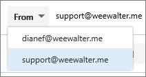

# 為 Office 365 中的通訊群組清單傳送電子郵件Send email as a distribution list in Office 365

在 Office 365 中，您可以傳送電子郵件作為通訊群組清單。In Office 365, you can send email as a distribution list. 當通訊群組清單成員的人員回覆傳送給通訊群組清單的郵件時，將電子郵件會顯示從通訊群組清單，而不是由個別使用者。When a person who is a member of the distribution list replies to a message sent to the distribution list, the email appears to be from the distribution list, not from the individual user. 本主題顯示如何進行此作業。This topic shows you how to do this.
  
## 傳送電子郵件作為通訊群組清單Send email as a distribution list

在執行這些步驟之前，請確定您已新增至 Office 365 通訊群組清單並已獲授與傳送為 」 權限在其上。Before you perform these steps, make sure you've been added to an Office 365 distribution list and you've have been granted Send as permission on it.
  
 **系統管理員**： 請確定您已後面的步驟主題中所[新增的 Office 365 使用者或連絡人至清單](../email/add-user-or-contact-to-distribution-list.md)和[允許傳送電子郵件做為 Office 365 群組的成員](../create-groups/allow-members-to-send-as-or-send-on-behalf-of-group.md#allow-members-to-send-email-as-a-group)，且正確的人員新增至通訊群組清單。**Admins**: Make sure you've followed the steps in the [Add an Office 365 user or contact to a list](../email/add-user-or-contact-to-distribution-list.md) and [Allow members to send email as an Office 365 Group](../create-groups/allow-members-to-send-as-or-send-on-behalf-of-group.md#allow-members-to-send-email-as-a-group) topics, and added the correct people to the distribution list.
  
1. 開啟 outlook 網頁版並移至收件匣。Open Outlook on the web and go to your inbox. 
    
2. 開啟已傳送至通訊群組清單的郵件。Open a message that was sent to the distribution list. 
    
3. 選取 [**回覆**]。Select **Reply**. 
    
4. 在郵件的底部，選取 [**更多** \> **顯示的**。At the bottom of the message, select **More** \> **Show from**.  ![選取 [其他]，然後選擇 [顯示從](../media/534f13b7-9f15-48ea-8835-ea2ed1863ece.png)
  
5. 以滑鼠右鍵按一下來源地址-例如`Ina@weewalter.me`-選擇 [**移除**。Right-click on the From address - such as `Ina@weewalter.me` - and choose **Remove**.  
  
6. 然後輸入通訊群組清單地址，例如 support@contoso.com，然後傳送郵件。Then type the distribution list address such as support@contoso.com, and send the message. 下次您回覆從通訊群組清單，其地址會顯示為 [**從**] 清單中的選項。The next time you reply from the distribution list, its address will appear as an option in the **From** list. 
  

