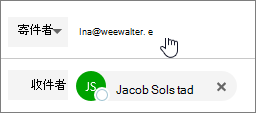

# 以通訊群組清單傳送電子郵件

在 Microsoft 365 中，您可以傳送電子郵件做為通訊群組清單。 當通訊群組清單的成員回復傳送至通訊群組清單的郵件時，電子郵件看似來自通訊群組清單，而不是來自個別使用者。 本主題說明如何執行這項操作。
  
## 以通訊群組清單傳送電子郵件

在您執行這些步驟之前，請確定您已新增至 Microsoft 365 通訊群組清單，且已被授與您的「傳送為」許可權。
  
 系統 **管理員**：請確定您已遵循 [[將 microsoft 365 使用者或連絡人新增至清單](../email/add-user-or-contact-to-distribution-list.md)] 中的步驟，並 [允許成員以 Microsoft 365 群組主題傳送電子郵件](../../solutions/allow-members-to-send-as-or-send-on-behalf-of-group.md#allow-members-to-send-email-as-a-group)，並將正確的人員新增至通訊群組清單。
  
1. 開啟 Outlook 網頁版，然後移至您的收件匣。 
    
2. 開啟傳送至通訊群組清單的郵件。 
    
3. 選取 [ **回復**]。 
    
4. 在郵件的底部，選取 [ **其他** \> **顯示來源**]。  ![選取 [其他]，然後選擇 [顯示來源]](../../media/534f13b7-9f15-48ea-8835-ea2ed1863ece.png)
  
5. 在 [寄件者位址--] 上按一下滑鼠右鍵 `Ina@weewalter.me` ，然後選擇 [ **移除**]。  
  
6. 然後輸入通訊群組清單位址（如 support@contoso.com），然後傳送郵件。 當您下次從通訊群組清單回復時，其位址會顯示為 [ **發件** 人] 清單中的選項。 
