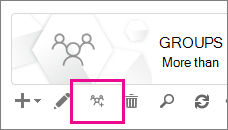

# <a name="upgrade-distribution-lists-to-microsoft-365-groups-in-outlook"></a>將通訊群組清單升級至 Microsoft 365 群組中 Outlook

您可以將通訊群組清單升級至 Outlook 中的 Microsoft 365 群組。 這是一種極好的方式，可讓組織的通訊組列出 Microsoft 365 群組的所有功能。 [為什麼您應該將 Outlook 中的通訊群組清單升級成群組](https://support.microsoft.com/office/7fb3d880-593b-4909-aafa-950dd50ce188)

您可以一次升級一個 DLs，也可以同時升級多個。

## <a name="upgrade-one-or-many-distribution-list-groups-to-microsoft-365-groups-in-outlook"></a>將一個或多個通訊群組清單群組升級為 Microsoft 365 群組中 Outlook

您必須是全域系統管理員或 Exchange 管理員才能升級通訊群組清單群組。 若要升級為 Microsoft 365 群組，通訊群組清單群組必須擁有信箱的擁有者。

### <a name="use-the-new-eac-to-upgrade-one-or-many-distribution-list-groups-to-microsoft-365-groups-in-outlook"></a>使用新的 EAC 將一個或多個通訊群組清單群組升級為 Microsoft 365 群組中 Outlook

1. 移至 [新增 [Exchange 系統管理中心](https://admin.exchange.microsoft.com)]，然後流覽 **至 [** 收件者] \> **群組**。

2. 從 [**群組**] 頁面中，選取通訊群組清單群組 (也稱為 **通訊群組**) ，以升級至 Microsoft 365 群組。

3. 從工具列選取 [ **升級通訊群組** ]。

4. 在對話方塊中 **準備好升級？**，按一下 [ **升級**]。 會立即開始處理常式。 根據您所升級之通訊群組清單群組的大小和數目，此程式可能需要數分鐘或數小時的時間。

> [!NOTE]
> 頁首的橫幅表示升級，例如 *通訊群組 () 已升級。需要5分鐘才能反映變更。Microsoft 365 群組篩選，以查看已升級的 distrubtion 群組 (s)*。

### <a name="use-the-classic-eac-to-upgrade-one-or-many-distribution-list-groups-to-microsoft-365-groups-in-outlook"></a>使用傳統 EAC 將一個或多個通訊群組清單群組升級為 Microsoft 365 群組中 Outlook

1. 移至經典<a href="https://go.microsoft.com/fwlink/p/?linkid=2059104" target="_blank">Exchange 系統管理中心</a>。

2. 在 [傳統 Exchange 系統管理中心] 中，**移至 [** 收件者 \> **群組**]。<br/>您會看到一則通知，指出您的通訊群組清單 (也稱為 **通訊群組**) 可升級至 Microsoft 365 群組。<br/> ![選取 [快速入門] 按鈕](../../media/8cf838b4-2644-401f-a366-08c1eea183eb.png)

3. 從 [**群組**] 頁面中，選取一或多個通訊群組清單 (也稱為 **通訊群組**) 。<br/>

4. 選取 [升級] 圖示。<br/>

5. 在 [資訊] 對話方塊中，選取 **[是]** 以確認升級。 會立即開始處理常式。 視您所升級的 DLs 大小和數目而定，此程式可能需要數分鐘或數小時的時間。<br/>如果無法升級通訊群組清單，就會顯示一個對話方塊。 查看 [哪些通訊群組清單無法升級？](#which-distribution-lists-cant-be-upgraded)。

6. 如果您要升級多個通訊群組清單，請使用下拉式清單來篩選已升級的通訊群組清單。 如果清單尚未完成，請稍候片刻，然後選取 [重新整理 **]，以** 查看已成功升級的功能。<br/>在您選取的所有 DLs 完成升級程式時，並無任何通知。 您可以查看 [ **可用於升級** 或 **升級的 DLs**] 中所列的專案，以找出此專案。

7. 如果您選取了要升級的 DL，但是它仍會顯示在頁面上，以供升級，則無法升級。 若 [升級無法運作，請查看要執行的](#what-to-do-if-the-upgrade-doesnt-work)動作。

> [!NOTE]
> 如果您正在取得群組摘要電子郵件，您可能會注意到，它有時候會讓您升級您所擁有的任何合格通訊群組清單。 如需有關摘要電子郵件的詳細資訊，請參閱[Outlook 中的群組交談](https://support.microsoft.com/office/a0482e24-a769-4e39-a5ba-a7c56e828b22)。

## <a name="what-to-do-if-the-upgrade-doesnt-work"></a>升級無法運作時應執行的動作

無法升級的通訊群組清單保持不變。

若一或多個 **合格** 的通訊群組清單無法升級，請開啟 [支援票證](../../business-video/get-help-support.md)。 您必須將問題升級至群組工程小組，以找出問題。

通訊群組清單可能由於服務中斷而無法升級，但不太可能。 如有需要，請稍候一段時間，然後嘗試再次升級 DL。

## <a name="how-to-use-powershell-to-upgrade-several-distribution-lists-at-the-same-time"></a>如何使用 PowerShell 同時升級多個通訊群組清單

如果您已使用 PowerShell，您可能想要移至此路由，而不是使用 UI。 我們有一組 Cmdlet 可協助您升級通訊群組清單。 請參閱下列。

### <a name="upgrade-a-single-dl"></a>升級單一 DL

若要升級單一 DL，請執行下列命令：

```PowerShell
Upgrade-DistributionGroup -DlIdentities \<Dl SMTP address\>`
```

例如，如果您想要使用 SMTP 位址 dl1@contoso.com 升級 DLs，請執行下列命令：

```PowerShell
Upgrade-DistributionGroup -DlIdentities dl1@contoso.com`
```

> [!NOTE]
> 您也可以使用[set-unifiedgroup](/powershell/module/exchange/new-unifiedgroup) PowerShell Cmdlet 將單一通訊群組清單升級為 Microsoft 365 群組

### <a name="upgrade-multiple-dls-in-a-batch"></a>在批次中升級多個 DLs

您也可以以批次方式傳遞多個 DLs，並將它們升級到一起：

```PowerShell
Upgrade-DistributionGroup -DlIdentities \<DL SMTP address1\>, \< DL SMTP address2\>,
\< DL SMTP address3\>, \< DL SMTP address 4\>
```

例如，如果您想要使用 SMTP 位址升級5個 DLs `dl1@contoso.com` ， `dl2@contoso.com` 並 `dl3@contoso.com` `dl4@contoso.com` `dl5@contoso.com` 執行下列命令：

`Upgrade-DistributionGroup -DlIdentities dl1@contoso.com, dl2@contoso.com, dl3@contoso.com, dl4@contoso.com, dl5@contoso.com`

### <a name="upgrade-all-eligible-dls"></a>升級所有合格的 DLs

您可以透過兩種方式升級所有合格的 DLs。

> [!NOTE]
> Upgrade-DistributionGroup 指令程式不會從管線接收資料，因此，您必須使用「foreach-object」 {} 運算子才能成功執行。

1. 在租使用者中取得合格的 DLs，並使用升級命令進行升級：

```PowerShell
Get-EligibleDistributionGroupForMigration | Foreach-Object{
    Upgrade-DistributionGroup -DlIdentities $_.PrimarySMTPAddress
}
```

2. 取得所有 DLs 的清單，並只升級合格的 DLs：

```PowerShell
Get-DistributionGroup| Foreach-Object{
    Upgrade-DistributionGroup -DlIdentities $_.PrimarySMTPAddress
}
```

## <a name="faq-about-upgrading-distribution-lists-to-microsoft-365-groups-in-outlook"></a>將通訊群組清單升級至 Outlook 中 Microsoft 365 群組的常見問題

### <a name="which-distribution-lists-cant-be-upgraded"></a>哪些通訊群組清單無法升級？

您只能升級雲端管理、簡單且不會嵌套的通訊群組清單。 下表列出 **無法** 升級的通訊群組清單。

|**屬性**|**資格？**|
|:-----|:-----|
|內部部署的受管理通訊群組清單。  <br/> |否  <br/> |
|嵌套的通訊群組清單。 通訊群組清單具有子群組或為另一個群組的成員。  <br/> |否  <br/> |
|成員 **RecipientTypeDetails** 不是 **UserMailbox**、 **SharedMailbox**、 **TeamMailbox**、 **MailUser** 的通訊群組清單  <br/> |否  <br/> |
|擁有超過100個擁有者的通訊群組清單  <br/> |否  <br/> |
|只具有成員但沒有擁有者的通訊群組清單  <br/> |否  <br/> |
|別名包含特殊字元的通訊群組清單  <br/> |否  <br/> |
|如果通訊群組清單設定為共用信箱的轉寄位址  <br/> |否  <br/> |
|如果 DL 是另一個 DL 中的 **寄件者限制** 的一部分。  <br/> |否  <br/> |
|安全性群組  <br/> |否  <br/> |
|動態通訊群組清單  <br/> |否  <br/> |
|已轉換為 **RoomLists** 的通訊群組清單  <br/> |否  <br/> |
|**關閉** **MemberJoinRestriction** 和/或 **MemberDepartRestriction** 的通訊群組清單  <br/> |否  <br/> |

### <a name="check-which-dls-are-eligible-for-upgrade"></a>檢查哪些 DLs 有資格升級

如果您想要檢查是否有資格使用 DL，您可以執行下列命令：

`Get-DistributionGroup \<DL SMTP address\> | Get-EligibleDistributionGroupForMigration`

如果您想要檢查哪些 DLs 可用於升級，請執行下列命令：

`Get-EligibleDistributionGroupForMigration`

### <a name="who-can-run-the-upgrade-scripts"></a>神秘可以執行升級腳本？

具有全域管理員或 Exchange 系統管理員許可權的人員。

### <a name="why-is-the-contact-card-still-showing-a-distribution-list-what-should-i-do-to-prevent-an-upgraded-distribution-list-from-showing-up-in-my-auto-suggest-list"></a>為什麼連絡人卡片仍顯示通訊群組清單？ 若要防止已升級的通訊群組清單顯示在我的自動建議清單中，該怎麼辦？

- Outlook：當有人嘗試在遷移後輸入 Microsoft 365 群組名稱時，在 Outlook 中傳送電子郵件時，收件者將會解析為通訊群組清單，而不是群組。 收件者的連絡人卡片將會是通訊群組清單連絡人卡片。 這是因為 Outlook 中的收件者快取或 nick 名稱快取。 電子郵件會順利傳送至群組，但是可能會造成對寄件者的混淆。<br/>您可以執行本文中的步驟， [Outlook AutoComplete 清單的相關資訊](/outlook/troubleshoot/contacts/information-about-the-outlook-autocomplete-list)來重設快取，這會修正此問題。

- 針對網頁上的 Outlook：在網頁上 Outlook 時，通訊群組清單收件者仍會保留在快取中。 您可以依照「 [從自動完成」清單中移除建議的名稱或電子郵件地址](https://support.microsoft.com/office/9E1419D9-E88F-445B-B07F-F558B8A37C58) 中的步驟進行，以重新整理快取，以查看群組連絡人卡片。

### <a name="do-new-group-members-get-a-welcome-email-in-their-inbox"></a>新增群組成員是否會在其收件匣中取得歡迎使用的電子郵件？

錯誤。 預設會將 [啟用歡迎郵件] 設定設為 false。 此設定會影響在遷移完成後，可能會加入的現有和新群組成員。 如果群組擁有者後來允許來賓使用者，來賓使用者將不會在其收件匣中收到歡迎使用的電子郵件。 來賓成員可以繼續使用群組。

### <a name="what-if-one-or-some-of-the-dls-are-not-upgraded"></a>如果一或部分 DLs 未升級，該怎麼辦？

在某些情況下，雖然仍有資格，但無法升級。 DL 不會升級，而且會以 DL 形式保留。

- 在組織中，系統管理員已套用 **群組的電子郵件地址原則** ，並嘗試升級不符合準則的 DLs，而 DL 則無法升級

- **MemberJoinRestriction** 或 **MemberDepartRestriction** 設定為 [**已關閉**] 的 DLs，無法升級

### <a name="what-happens-to-the-dl-if-the-upgrade-from-eac-fails"></a>從 EAC 升級時，DL 會發生什麼事？

只有在將通話送出至伺服器時，才會進行升級。 升級失敗時，您的 DLs 會完好無損。 它們的運作方式與使用的方式相同。
