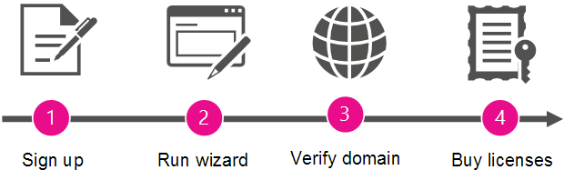

# 成為系統管理員，並為您的組織購買 Microsoft 365

Microsoft 提供生產力工具與服務的方式相當便捷，貴組織內部使用者無須等待 IT 部門正式部署完畢，也能自行註冊並立即使用！
  
貴組織可選擇讓使用者以這種方式繼續使用這些服務。但要是使用者註冊了 Skype 會議服務，您也可以指派系統管理員進行升級作業，取得更多完整的會議解決方案，以便搭配商務用 Skype 與 Office 應用程式、檔案儲存空間與共用等功能使用。
  
## 為什麼成為系統管理員，並為您的組織購買 Microsoft 365？

員工使用公司帳戶註冊 Skype 會議後，並無法管理這項服務。他們只能取得最基本的功能：會議數量無上限，但只能開放 10 位以下與會者參與 (使用 60 天後，與會者上限會改為 3 人)。 
  
當您設定服務的管理員並為您的使用者購買 Microsoft 365 時，他們就能獲得更多的高級功能。 此外，您也會取得服務的管理權限，以便強制執行政策及新增使用者。
  
另外，您還可享有 24 小時全年無休的電話支援福利。
  
## 如何成為系統管理員

若要成為系統管理員，首先您必須證明自己擁有使用者所註冊的網域 (像是 contoso.com)。 接著，您將為已使用 Skype 會議之公司中的所有人員升級至 Microsoft 365。 精靈會逐步引導您完成步驟。
  
> [!NOTE]
> 成為系統管理員，並升級為 Microsoft 365 是相同程式的一部分。 除非您先成為系統管理員，否則無法將服務升級為系統管理員，除非您也升級為 Microsoft 365。 
  
 **為什麼我們要求您證明自己擁有該網域？** 因為系統會根據使用者所註冊的電子郵件地址網域名稱，將電子郵件地址位於相同網域的所有使用者分為同一組 (例如 rob@contoso.com 和 sara@contoso.com)。 我們決定每個人屬於哪個群組的電子郵件地址的網域部分（如 contoso.com），讓來自相同組織的人員可以一起運作。 因為他們都屬於同一個群組，就能與彼此共同作業。
  
若要成為該群組的系統管理員，請驗證您擁有貴組織使用者群組所屬的網域。 如果您有證明網域擁有權的授權（透過登入網域的位置），則可讓使用該網域的人員管理 Microsoft 365 服務。
  
成為系統管理員後，如有需要，您也可以新增新使用者或強制執行原則。
  
## 步驟概觀

  
精靈會引導您完成程序，以下是每個步驟的摘要。
  
|||
|:-----|:-----|
||**註冊** 成為系統管理員前，您必須先使用公司電子郵件地址完成 Skype 會議 的註冊程序。    |
||**執行精靈** 註冊後，您即可遵循以下其中一個步驟來執行精靈：     執行在應用程式啟動器中選取 [系統**管理員**] 之後所顯示**的 [管理員**] 嚮導。     OR     選擇 [升級為 Skype 會議中的**microsoft 365** ]，然後選取您要升級的 microsoft 365 訂閱。    |
||**驗證網域擁有權**接下來，您將會驗證 Microsoft 365，您擁有或管理與您組織的電子郵件地址相關聯的功能變數名稱（例如 contoso.com）。 只有網域名稱擁有者有權執行此動作。    |
||**購買授權**在嚮導的最後一個步驟中，您會為組織中的每位人員，購買其工作電子郵件所註冊的 Skype 會議的 Microsoft 365 授權。    舉例來說，如果有兩位使用者使用自己的公司電子郵件註冊 Skype 會議，您就需要購買兩份授權，以分配給個別使用者使用。    > [!NOTE]> 您在購買授權之前，您無法管理 Microsoft 365。           |

## 您的 Microsoft 365 訂閱

在您驗證網域並購買授權後，您的組織會升級至 Microsoft 365。 系統也會針對個別使用者先前所使用的 Skype 會議訂閱，一併移轉其中的個人設定 (移轉到已付費訂閱)。
  
您的組織升級所用的 Microsoft 365 訂閱取決於您使用的是哪個嚮導：
  
|||
|:-----|:-----|
|**精靈啟動的方式**   |**訂閱選項**   |
|使用 App 啟動器中的 [系統管理] 磚    |Microsoft 365 商務基本版    |
|在 Skype 會議中選擇 [**升級為商務用 Microsoft 365** ]    |Microsoft 365 商務 Basic 或 Microsoft 365 商務標準    |
   
## 下一步是什麼？

現在您是系統管理員，您可能想要執行下列作業：
  
|****工作****|****詳細資料****|
|:-----|:-----|
|新增或移除授權    |您可以為未使用 Microsoft 365 的使用者[新增更多授權](../../commerce/licenses/buy-licenses.md)，或從不想使用組織之 microsoft 365 進行商務版訂閱的[使用者中移除授權](../manage/remove-licenses-from-users.md)。    |
|連絡已註冊的使用者    |與其他使用者聯繫，讓他們知道您正在管理其 Microsoft 365 訂閱，且已升級。 [Follow these steps](../add-users/add-users.md) to see a list of **Active Users** and their email addresses.    |
|開始使用 Microsoft 365    |請造訪 [Office 365 學習中心](https://support.office.com/learn/office365-for-business) 並了解如何登入、檢查電子郵件、共用文件等。 您和您的使用者可以使用此網站開始使用 Microsoft 365。    |
|管理 Microsoft 365 訂閱    |請造訪[Microsoft 365 系統管理中心協助中心](../admin-home.md)，瞭解常見的系統管理工作，例如新增及移除使用者、重設密碼及設定行動裝置。    |

## 仍需要協助嗎？

[撥打 Microsoft 支援服務](../contact-support-for-business-products.md)
