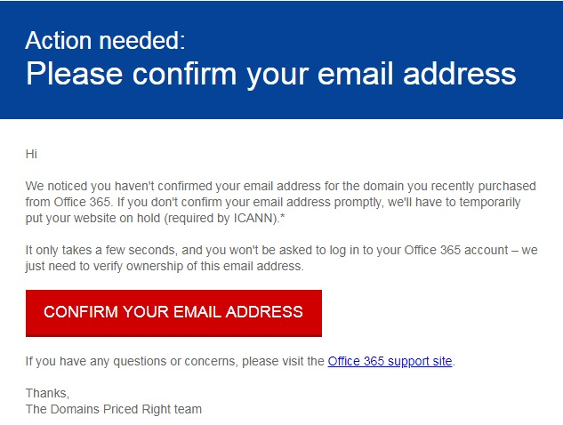

# 連絡人資訊的 ICANN 驗證ICANN Verification of Contact Information

當您購買網域，或變更網域的連絡人資訊時，註冊機構需要若要驗證您遵守 numbers，ICANN 法規的連絡資訊。When you purchase a domain or make changes to the contact information for a domain, the registrar is required to validate your contact information to comply with ICANN regulations.

進行驗證，電子郵件傳送至註冊者的地址。For validation, an email is sent to the registrant's address.

 **若要確認您的連絡人資訊，請驗證電子郵件中選取的連結。****To verify your contact information, select the link in the verification email.** 如果沒有驗證網域擁有者的電子郵件地址的網域就會被擱置。If the domain owners don't verify the the email address, the domain will be suspended. 然後，移至系統管理中心中的[網域] 頁面上](https://admin.microsoft.com/adminportal/home?ref=Domains)，並檢查您網域的狀態。Then, go to the [Domains page](https://admin.microsoft.com/adminportal/home?ref=Domains) in the admin center and check your domain status.

電子郵件看起來像這樣：The email will look like this:

