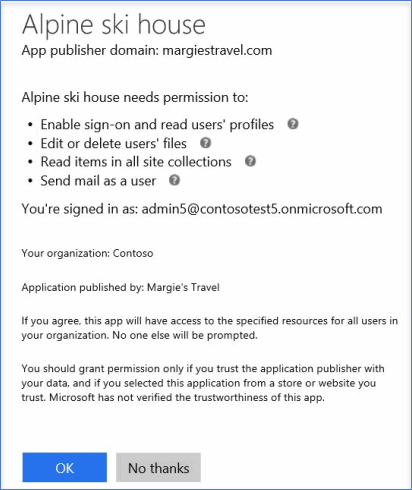

# 開啟或關閉整合式應用程式Turning Integrated Apps on or off

開啟整合式應用程式時，您組織中的使用者可以允許協力廠商應用程式存取其 Office 365 資訊。 例如，當有人使用協力廠商應用程式時，該應用程式可能會要求行事曆的存取權限，以編輯 OneDrive 資料夾中的檔案。When Integrated Apps is turned on, users in your organization can allow third-party apps to access their Office 365 information. For example, when someone uses a third-party app, that app might ask for permission to access their calendar and to edit files that are in a OneDrive folder.

## 開啟或關閉整合式應用程式Turning Integrated Apps on or off

以下說明如何開啟或關閉整合式應用程式。Here's how to turn Integrated Apps on or off.

1. 在系統管理中心，移至 [**設定** \> [服務&amp;增益集](https://go.microsoft.com/fwlink/p/?linkid=2053743)] 頁面上，然後選取 [**整合式應用程式**。In the admin center, go to the **Settings** \> [Services &amp; add-ins](https://go.microsoft.com/fwlink/p/?linkid=2053743) page, and then select **Integrated apps**.

2. 在 [**整合式應用程式**] 頁面上，選取 [若要開啟或關閉整合式應用程式] 選項。On the **Integrated Apps** page, select the option to turn Integrated Apps on or off.

## 更多整合式應用程式的資訊More info on Integrated Apps

整合式應用程式可以從您自己的組織內部建立，或它可能來自另一個 Office 365 組織或協力廠商。An integrated app can be created from within your own organization, or it can come from another Office 365 organization or a third-party.

開啟整合式應用程式並使用應用程式時，應用程式會在其存取使用者的資訊時，要求設定其需要的存取層級的權限。 使用者可以授與權限給他們擁有的應用程式存取自己的 Office 365 資訊。 他們無法讓應用程式存取任何其他使用者的資訊。When Integrated Apps is turned on and an app is used, the app asks for permission to set the level of access it needs when it accesses the user's information. A user can give access only to apps they own that access their Office 365 information. They can't give an app access to any other user's information.

在 Office 365 中使用整合式應用程式時，使用權限分為兩種：使用者權限和管理員權限。 例如，當您的組織已啟用整合式應用程式，而使用者使用的是協力廠商應用程式，應用程式可能會要求使用者權限以讀取其使用者的設定檔詳細資料、編輯或刪除使用者檔案、讀取網站集合中包含的項目，並為使用者傳送電子郵件。There are two kinds of permissions that are used when using Integrated Apps in Office 365: user permissions and admin permissions. For example, when your organization is enabled for Integrated Apps and a user uses a third-party app, the app might ask for the user's permission to read their user profile details, edit or delete their files, read items contained in site collections, and send email as that user.

如果系統管理員在組織中註冊應用程式的所有使用者，他或她則要求的權限，讓該應用程式存取資訊與組織中的資源。If an admin registers an app for all users in an organization, he or she is asked for permission to let that app access information and resources in the organization. 之後，當組織中的其他使用者使用該應用程式時，應用程式就不會向他們要求權限。After this, when other users in the organization use that app, they won't be asked for permission. 當管理員註冊應用程式時，管理員必須確定他們能信任該應用程式的發行者。When an admin registers an app, that admin must make sure that they trust that app's publisher. 如需註冊應用程式的詳細資訊，請參閱[新增、更新與移除應用程式](https://go.microsoft.com/fwlink/p/?LinkID=518600)。For details on registering an app, see [Adding, Updating and Removing an Application](https://go.microsoft.com/fwlink/p/?LinkID=518600).

如果關閉整合式應用程式，已安裝並有存取資訊權限的應用程式不會解除安裝，權限也不會移除。 即使已關閉整合式應用程式，管理員仍然可以註冊應用程式，讓使用者使用它們，並允許這些應用程式存取使用者的相關資訊。 如需移除已註冊的應用程式與其權限的詳細資訊，請參閱 [新增、更新與移除應用程式](https://go.microsoft.com/fwlink/?LinkID=518600&amp;clcid=0x409)。If Integrated Apps is turned off, apps that have already been installed and have permission to access information won't be uninstalled, and the permissions won't be removed. Even though Integrated Apps is turned off, admins can still register apps to make them available to their users and allow those apps access to the users' information. For details on removing a registered application and it's permissions, see [Adding, Updating and Removing an Application](https://go.microsoft.com/fwlink/?LinkID=518600&amp;clcid=0x409).

