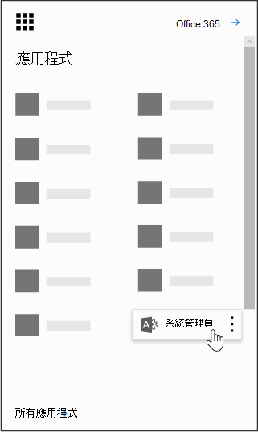

# 貴組織中的 Power BIPower BI in your organization

本頁面說明貴組織的使用者能如何使用 Power BI，以及您如何控制貴組織取得這項服務的方式。This page describes how users in your organization can use Power BI and how you can control how your organization acquires this service.

## 什麼是 Power BI？What is Power BI?

Microsoft Power BI 可讓使用者以視覺化的方式呈現資料、共用所獲得的資訊，以及用直覺式的新方法共同作業。 若要深入瞭解，請參閱 [Power BI 網站](https://powerbi.microsoft.com/en-us/)。Microsoft Power BI enables users to visualize data, share discoveries, and collaborate in intuitive new ways. To learn more, see the [Power BI Web site](https://powerbi.microsoft.com/en-us/).
  
## Power BI 是否符合國內、地區和行業特定的合規性需求？Does Power BI meet national, regional, and industry-specific compliance requirements?

若要深入瞭解 Power BI 規範，請參閱[Microsoft 信任中心](https://go.microsoft.com/fwlink/?LinkId=785324)。To learn more about Power BI compliance, see the [Microsoft Trust Center](https://go.microsoft.com/fwlink/?LinkId=785324).
  
## 使用者如何註冊 Power BI？How do users sign up for Power BI?

如果您是管理員，可以透過 [Power BI 網站](https://powerbi.microsoft.com/en-us/)註冊 Power BI。As an administrator, you can sign up for Power BI through the [Power BI web site](https://powerbi.microsoft.com/en-us/). 您也可以在 Microsoft 365 系統管理中心的 [購買服務] 頁面上進行註冊。You can also sign up through the purchase services page on the Microsoft 365 admin center. 當管理員註冊 Power BI 時，他們可以將使用者訂閱授權指派給應有存取權的使用者。When an administrator signs up for Power BI, they can assign user subscription licenses to users who should have access.
  
此外，貴組織中的個別使用者也可以透過 [Power BI 網站](https://powerbi.microsoft.com/en-us/).註冊 Power BI。 當貴組織中的使用者註冊 Power BI 時，該使用者便會自動獲指派 Power BI 授權。Additionally, individual users in your organization may be able to sign up for Power BI through the [Power BI web site](https://powerbi.microsoft.com/en-us/). When a user in your organization signs up for Power BI, that user is assigned a Power BI license automatically.
  
## 組織中的個別使用者如何註冊？How do individual users in my organization sign up?

組織中的使用者可能屬於下列三種情況：There are three scenarios that might apply to users in your organization:
  
### 案例1：您的組織已有現有的 Microsoft 365 環境，註冊 Power BI 的使用者已具備 Microsoft 365 帳戶。Scenario 1: Your organization already has an existing Microsoft 365 environment and the user signing up for Power BI already has a Microsoft 365 account.

在這種情況下，如果使用者已有租用戶 (例如，contoso.com) 中的公司或學校帳戶，但是還沒有 Power BI，那麼 Microsoft 只要為該帳戶啟用方案，使用者就會自動收到 Power BI 服務使用方式的通知。In this scenario, if a user already has a work or school account in the tenant (for example, contoso.com) but does not yet have Power BI, Microsoft will simply activate the plan for that account, and the user will automatically be notified of how to use the Power BI service.
  
### 案例2：您的組織有現有的 Microsoft 365 環境，註冊 Power BI 的使用者沒有 Microsoft 365 帳戶。Scenario 2: Your organization has an existing Microsoft 365 environment and the user signing up for Power BI doesn't have a Microsoft 365 account.

在此案例中，使用者在您組織的網域中有電子郵件地址 (例如，contoso.com) ，但還沒有 Microsoft 365 帳戶。In this scenario, the user has an email address in your organization's domain (for example, contoso.com) but does not yet have a Microsoft 365 account. 在這種情況下，使用者可以註冊 Power BI，而且會自動獲得指定帳戶。In this case, the user can sign up for Power BI and will automatically be given an account. 這能讓使用者存取 Power BI 服務。This lets the user access the Power BI service. 例如，如果名為張穎的員工使用她的工作電子郵件地址 (例如，Nancy@contoso.com) 進行註冊，則 Microsoft 會自動將張穎新增為 contoso Microsoft 365 環境中的使用者，並為該帳戶啟用 Power BI。For example, if an employee named Nancy uses her work email address (for example, Nancy@contoso.com) to sign up, Microsoft will automatically add Nancy as a user in the Contoso Microsoft 365 environment and activate Power BI for that account.
  
### 案例3：您的組織沒有連線至您電子郵件網域的 Microsoft 365 環境。Scenario 3: Your organization does not have a Microsoft 365 environment connected to your email domain.

您的組織不需要執行 Power BI 的管理動作。There are no administrative actions your organization needs to take advantage of Power BI.
  
> [!IMPORTANT]
> 如果您的組織有多個電子郵件網域，而且您喜歡所有的電子郵件地址分機都位於相同的承租人中，則在任何使用者建立主要租使用者之前，請先將所有電子郵件地址網域新增至該租使用者，然後再建立主要租使用者。If your organization has multiple email domains and you prefer all email address extensions to be in the same tenant, before any users create your primary tenant, add all email address domains to that tenant before any users create your primary tenant. 建立使用者後，就不會自動將使用者移至不同的機制。There is no automated mechanism to move users across tenants after they have been created. 如需此程式的詳細資訊，請參閱本文稍後的[[如果我有多個網域，我可以控制使用者新增至的承租人](#if-i-have-multiple-domains-can-i-control-the-tenant-that-users-are-added-to)]，[將網域新增至 Office 365](../setup/add-domain.md)線上。For more information on this process, see [If I have multiple domains, can I control the tenant that users are added to?](#if-i-have-multiple-domains-can-i-control-the-tenant-that-users-are-added-to) later in this article and [Add a domain to Office 365](../setup/add-domain.md) online.
  
## 這對於我目前管理組織使用者身分識別的方式有何影響？How will this change the way I manage identities for users in my organization today?

如果您的組織已有現有的 Microsoft 365 環境，且組織中的所有使用者都有 Microsoft 365 帳戶，身分識別管理不會變更。If your organization already has an existing Microsoft 365 environment and all users in your organization have Microsoft 365 accounts, identity management will not change.
  
如果您的組織已有現有的 Microsoft 365 環境，但是組織中的所有使用者都沒有 Microsoft 365 帳戶，我們會在租使用者中建立使用者，並根據使用者的工作或學校電子郵件地址指派授權。If your organization already has an existing Microsoft 365 environment but not all users in your organization have Microsoft 365 accounts, we will create a user in the tenant and assign licenses based on the user's work or school email address. 這表示您在任何特定時間管理的使用者人數，都會隨著貴組織的使用者註冊服務而增加。This means that the number of users you are managing at any particular time will grow as users in your organization sign up for the service.
  
如果您負責管理內部部署的目錄，並且在使用 Active Directory 同盟服務 (AD FS)，則 Microsoft 不會將使用者新增至您的租用戶，而且任何想加入您租用戶的使用者都會收到一則訊息，要求該人員與其組織管理員連絡。If you are managing your directory on-premises, and use Active Directory Federation Services (AD FS), Microsoft will not add users to your tenant, and users attempting to join your tenant will receive a message to contact their organization's admin.
  
如果您的組織沒有連線至您電子郵件網域的 Microsoft 365 環境，您管理身分識別的方式將不會有任何變更。If your organization does not have a Microsoft 365 environment connected to your email domain, there will be no change in how you manage identity. 使用者會加入新的雲端專用使用者目錄，而您也可以選擇以租用戶管理員的身分接管工作，並管理使用者。Users will be added to a new, cloud-only user directory, and you will have the option to elect to take over as the tenant admin and manage them.
  
## 為使用者管理 Microsoft 所建立租用戶的程序為何？What is the process to manage a tenant created by Microsoft for my users?

如果租用戶由 Microsoft 建立，您可以透過下列步驟宣告及管理該租用戶：If a tenant was created by Microsoft, you can claim and manage that tenant by following these steps:
  
1. 使用與您要管理之租用戶網域相符的電子郵件地址網域來[註冊 Power BI](https://go.microsoft.com/fwlink/?LinkId=522448)，藉此加入該租用戶。舉個例說，如果 Microsoft 建立了 contoso.com 租用戶，您就得用 @contoso.com 結尾的電子郵件地址加入租用戶。Join the tenant by [signing up for Power BI](https://go.microsoft.com/fwlink/?LinkId=522448) using an email address domain that matches the tenant domain you want to manage. For example, if Microsoft created the contoso.com tenant, you will need to join the tenant with an email address ending with @contoso.com.

1. 確認網域擁有權以宣告管理控制：只要成為租用戶，您就可以透過確認網域擁有權的方式，將自己升級為管理員角色。其步驟如下：Claim admin control by verifying domain ownership: once you are in the tenant, you can promote yourself to the admin role by verifying domain ownership. To do so, follow these steps:

::: moniker range="o365-worldwide"

3. 前往 <a href="https://admin.microsoft.com" target="_blank">https://admin.microsoft.com</a>。Go to <a href="https://admin.microsoft.com" target="_blank">https://admin.microsoft.com</a>.

::: moniker-end

::: moniker range="o365-germany"

3. 轉到 (G) <a href="https://portal.office.de" target="_blank">https://portal.office.de</a>Go to <a href="https://portal.office.de" target="_blank">https://portal.office.de</a>

::: moniker-end

::: moniker range="o365-21vianet"

3. 請移至 <a href="https://portal.partner.microsoftonline.cn" target="_blank">https://portal.partner.microsoftonline.cn</a>。Go to <a href="https://portal.partner.microsoftonline.cn" target="_blank">https://portal.partner.microsoftonline.cn</a>.

::: moniker-end

4. 選取左上角的應用程式啟動器圖示，然後選擇 [管理員]。Select the app launcher icon in the upper-left and choose **Admin**.

    
  
5. 閱讀 [ **成為系統管理** ] 頁面上的指示，然後選取 **[是，我要成為系統管理員]**。Read the instructions on the **Become the admin** page and then select **Yes, I want to be the admin**.

    > [!NOTE]
    >  如果未顯示此選項，則表示已有系統管理員。If this option doesn't appear, there is already an administrator in place.
  
## 如果我有多個網域，我可以控制新增使用者的租使用者嗎？If I have multiple domains, can I control the tenant that users are added to?

如果您不做任何動作，則會針對每一個使用者電子郵件網域和子網域建立租用戶。If you do nothing, a tenant will be created for each user email domain and subdomain.
  
如果您希望所有使用者都位於相同的租用戶 (不論他們的電子郵件地址副檔名為何)，請執行以下動作：If you want all users to be in the same tenant regardless of their email address extensions:
  
- 提前建立目標租用戶或使用現有租用戶，並新增您要在該租用戶內合併的所有現有網域與子網域。這麼一來，電子郵件地址以這些網域和子網域結尾的所有使用者，都會在註冊時自動加入目標租用戶。Create a target tenant ahead of time or use an existing tenant, and add all the existing domains and subdomains that you want consolidated within that tenant. Then all the users with email addresses ending in those domains and subdomains will automatically join the target tenant when they sign up.

> [!IMPORTANT]
> 沒有任何支援的自動化機制，可讓使用者在租用戶建立之後於其間移動。There is no supported automated mechanism to move users across tenants once they have been created. 若要瞭解如何將網域新增至單一 Microsoft 365 租使用者，請參閱[Add a domain to Office 365](../setup/add-domain.md)。To learn about adding domains to a single Microsoft 365 tenant, see [Add a domain to Office 365](../setup/add-domain.md).

> [!IMPORTANT]
> 如需有關管理承租人的詳細資訊和指導方針，請參閱[何謂 Power BI 管理？](/power-bi/service-admin-administering-power-bi-in-your-organization)。For more information and guidance on managing tenants, see [What is Power BI administration?](/power-bi/service-admin-administering-power-bi-in-your-organization).
  
## 如何防止使用者加入我的現有租使用者？How can I prevent users from joining my existing tenant?

您可以做為系統管理員採取的步驟，以避免使用者加入您的現有租使用者。There are steps you can take as an admin to prevent users from joining your existing tenant. 如果您禁止使用者加入租使用者，則使用者的登入嘗試會失敗，並會導向他們聯繫其組織的系統管理員。如果您已在 (之前停用自動授權發佈，則無需重複此程式，例如，Office 365 教育版學生、教職員和人員) 。If you block users from joining the tenant, users' attempts to sign in will fail and they will be directed to contact their organization's admin. You do not need to repeat this process if you have already disabled automatic license distribution before (for example, Office 365 Education for Students, Faculty, and Staff).
  
執行這些步驟必須使用 Windows PowerShell。 若要開始使用 Windows PowerShell，請參閱 [PowerShell 快速入門指南](/powershell/scripting/overview)。These steps require the use of Windows PowerShell. To get started with Windows PowerShell, see the [PowerShell getting started guide](/powershell/scripting/overview).
  
若要執行下列步驟，您必須安裝最新版的 64 [Azure Active Directory V2 PowerShell 模組](https://www.powershellgallery.com/packages/AzureADPreview/2.0.2.5)。To perform the following steps, you must install the latest 64-bit version of the [Azure Active Directory V2 PowerShell Module](https://www.powershellgallery.com/packages/AzureADPreview/2.0.2.5).
  
選取連結之後，選取 [執行 **]** 以執行安裝程式套件。After you select the link, select **Run** to run the installer package.
  
**停用自動租用戶加入**：使用這個 Windows PowerShell 命令可防止新使用者加入受管理的租用戶：**Disable automatic tenant join**: Use this Windows PowerShell command to prevent new users from joining a managed tenant:
  
停用新使用者的自動租用戶加入： `Set-MsolCompanySettings -AllowEmailVerifiedUsers $false`To disable automatic tenant join for new users:  `Set-MsolCompanySettings -AllowEmailVerifiedUsers $false`
  
啟用新使用者的自動租用戶加入： `Set-MsolCompanySettings -AllowEmailVerifiedUsers $true`To enable automatic tenant join for new users:  `Set-MsolCompanySettings -AllowEmailVerifiedUsers $true`
  
> [!NOTE]
> 這項封鎖可防止您組織中的新使用者註冊 Power BI。This blocking prevents new users in your organization from signing up for Power BI. 為您的組織停用新 signups 之前，註冊 Power BI 的使用者仍會保留其授權。Users that sign up for Power BI prior to disabling new signups for your organization will still retain their licenses. 請參閱[如何為已註冊的使用者移除 Power BI？](#how-do-i-remove-power-bi-for-users-that-already-signed-up)如需如何為先前註冊服務的使用者移除 Power BI 存取權的指示。See the [How do I remove Power BI for users that already signed up?](#how-do-i-remove-power-bi-for-users-that-already-signed-up) for instructions on how you can remove access to Power BI for users that had previously signed up for the service.
  
## 如何允許使用者加入我的現有租使用者？How can I allow users to join my existing tenant?

若要允許使用者加入您的租用戶，請參考上一個問題的說明，然後執行相反的命令：  `Set-MsolCompanySettings -AllowEmailVerifiedUsers $true`To allow users to join your tenant, run the opposite command as described in the question above:  `Set-MsolCompanySettings -AllowEmailVerifiedUsers $true`
  
## 我要如何確認我是否已在租用戶中進行封鎖？How do I verify if I have the block on in the tenant?

使用下列 PowerShell 指令碼： `Get-MsolCompanyInformation | fl allow*`Use the following PowerShell script:  `Get-MsolCompanyInformation | fl allow*`
  
## 如何防止現有使用者開始使用 Power BI？How can I prevent my existing users from starting to use Power BI?

**停用自動授權散佈：** 您可以使用這個 Windows PowerShell 指令碼，停用現有使用者的自動授權散佈。**Disable automatic license distribution:** Use this Windows PowerShell script to disable automatic license distributions for existing users. 如果您已在 (之前停用自動授權發佈，則無需重複此程式，例如，Office 365 教育版學生、教職員和人員) 。You do not need to repeat this process if you have already disabled automatic license distribution before (for example, Office 365 Education for Students, Faculty, and Staff).
  
停用現有使用者的自動授權散佈： `Set-MsolCompanySettings -AllowAdHocSubscriptions $false`To disable automatic license distribution for existing users:  `Set-MsolCompanySettings -AllowAdHocSubscriptions $false`
  
啟用現有使用者的自動授權散佈： `Set-MsolCompanySettings -AllowAdHocSubscriptions $true`To enable automatic license distribution for existing users:  `Set-MsolCompanySettings -AllowAdHocSubscriptions $true`
  
> [!NOTE]
> *AllowAdHocSubscriptions* 旗標是用來控制組織中的數個使用者功能，包括使用者註冊 Azure Rights Management 服務的能力。The *AllowAdHocSubscriptions* flag is used to control several user capabilities in your organization, including the ability for users to sign up for the Azure Rights Management Service. 如果變更這個旗標，將會影響上述所有功能。Changing this flag will affect all of these capabilities.
  
## 如何允許我現有的使用者註冊使用 Power BI？How can I allow my existing users to sign up for Power BI?

若要允許現有的使用者註冊使用 Power BI，請參考上一個問題的說明，然後執行相反的命令：  `Set-MsolCompanySettings -AllowAdHocSubscriptions $true`To allow your existing users to sign up for Power BI, run the opposite command as described in the question above:  `Set-MsolCompanySettings -AllowAdHocSubscriptions $true`
  
## 如何對已註冊的使用者移除 Power BI？How do I remove Power BI for users that already signed up?

如果使用者已註冊 Power BI，但您不再想要讓他們能夠存取 Power BI，您可以移除該使用者的 Power BI 授權。If a user signed up for Power BI, but you no longer want them to have access to Power BI, you can remove the Power BI license for that user.
  
::: moniker range="o365-worldwide"

1. 在系統管理中心中，移至 **[使用者]** \> <a href="https://go.microsoft.com/fwlink/p/?linkid=834822" target="_blank">[作用中使用者]</a> 頁面。In the admin center, go to the **Users** \> <a href="https://go.microsoft.com/fwlink/p/?linkid=834822" target="_blank">Active users</a> page.

::: moniker-end

::: moniker range="o365-germany"

 1. 在系統管理中心中，移至 **[使用者]** \> <a href="https://go.microsoft.com/fwlink/p/?linkid=847686" target="_blank">[作用中使用者]</a> 頁面。In the admin center, go to the **Users** \> <a href="https://go.microsoft.com/fwlink/p/?linkid=847686" target="_blank">Active users</a> page.

::: moniker-end

::: moniker range="o365-21vianet"

 1. 在系統管理中心中，移至 **[使用者]** \> <a href="https://go.microsoft.com/fwlink/p/?linkid=850628" target="_blank">[作用中使用者]</a> 頁面。In the admin center, go to the **Users** \> <a href="https://go.microsoft.com/fwlink/p/?linkid=850628" target="_blank">Active users</a> page.

::: moniker-end

2. 尋找您要移除授權的使用者，然後選取其名稱。Find the user you want to remove the license for, then select their name.

3. 在 [**授權與應用程式**] 索引標籤上，清除 [ **Microsoft Power BI** ] 核取方塊。On the **Licenses and Apps** tab, clear the **Microsoft Power BI** check box.

4. 選取 **[儲存變更]**。Select **Save changes**.

## 我怎麼知道新使用者何時已加入我的租用戶？How do I know when new users have joined my tenant?

已在本方案中加入您租用戶的使用者，會獲得專屬授權的指派，您可以在管理員儀表板的 [作用中的使用者] 窗格內篩選這項授權。Users who have joined your tenant as part of this program are assigned a unique license that you can filter on within your active user pane in the admin dashboard.
  
若要建立這個新的視圖，請在系統管理中心，依照 [ [建立自訂使用者視圖](../add-users/create-edit-or-delete-a-custom-user-view.md#create-a-custom-user-view)] 中的步驟進行。To create this new view, in the admin center, follow the steps to in [Create a custom user view](../add-users/create-edit-or-delete-a-custom-user-view.md#create-a-custom-user-view). 在 [**已指派產品授權**] 底下，選取 [ **Microsoft Power BI**]。Under **Assigned product license**, select **Microsoft Power BI**. 在建立新的視圖後，您就可以看到您租使用者中已註冊此程式的所有使用者。After the new view has been created, you will be able to see all the users in your tenant who have enrolled in this program.
  
## 我還需要準備其他任何事項嗎？Are there any additional things I should be prepared for?

您可能會遇到增加密碼重設要求次數的情況。 有關此程序的資訊，請參閱[重設使用者的密碼](../add-users/reset-passwords.md)。You might experience an increase in password reset requests. For information about this process, see [Reset a user's password](../add-users/reset-passwords.md).
  
您可以透過系統管理中心的標準程式，從您的租使用者中移除使用者。You can remove a user from your tenant via the standard process in the admin center. 但是，如果使用者仍擁有組織發給的有效電子郵件地址，除非您不讓所有使用者加入，否則他們還是可以重新加入。However, if the user still has an active email address from your organization, they will be able to rejoin unless you block all users from joining.
  
## 為什麼在我的租使用者中才會顯示 Microsoft Power BI 的1000000授權？Why did 1 million licenses for Microsoft Power BI show up in my tenant?

如果貴組織符合條件，則組織中的使用者就有權使用 Microsoft Power BI 服務，而這些授權正代表租用戶中新 Power BI 使用者的可用權限。As a qualifying organization, users in your organization are eligible to use the Microsoft Power BI service and these licenses represent the available capacity for new Power BI users in your tenant. 這些授權為免費使用。There is no charge for these licenses. 如果您已選擇允許使用者自行註冊 Power BI，當他們完成註冊程式時，系統會指派這些可用授權之一。If you've chosen to allow users to sign up for Power BI themselves, they will be assigned one of these available free licenses when they complete the sign up process. 您也可以選擇透過系統管理中心將這些授權指派給使用者。You can also choose to assign these licenses to users yourself through the admin center.
  
## 這是免費的嗎？ 使用這些授權需要付費嗎？Is this free? Will I be charged for these licenses?

這些是免費版 Power BI 的授權。 如果您對額外的功能有興趣，不妨參考一下 Power BI 專業版。These licenses are for the free version of Power BI. If you're interested in additional capabilities, take a look at the Power BI Pro version.
  
## 為什麼有 1 百萬個授權？Why 1 million licenses?

我們選擇了足夠大的數位，大多陣列織都有充足的授權，可提供此權益，而不會延遲使用者。We chose a number that was large enough that the majority of organizations would have ample licenses to provide this benefit without delay to their users.
  
## 如果我需要 100 萬個以上的授權，該怎麼辦？What if I need more than 1 million licenses?

如需取得更多授權，請連絡您的 Microsoft 客戶代表取得詳細資訊。Contact your Microsoft account representative for more information if you will need to acquire additional licenses.