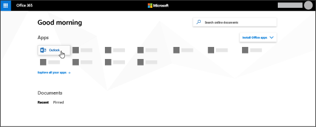

# 設定 Outlook 讀取電子郵件

您的 Microsoft 365 訂閱隨附網路型 Outlook，但是如果您的訂閱包含 Office 用戶端應用程式，您也會收到可在您的個人電腦或裝置上安裝的 Outlook。
  
## 在 Outlook 中設定電子郵件帳戶

您第一次開啟 Outlook 時，會開啟自動帳戶嚮導。 如果不是，**請選擇 [** 檔案] [**新增帳戶**]。
  
1. 在 [**電子郵件帳戶**] 頁面上，選擇 **[下一步** \> **新增帳戶**]。
    
2. 在 [**自動帳戶設定**] 頁面上，輸入您的姓名、電子郵件地址和密碼，然後選擇 [**下一步] [下一步** \> **]**。
    
閱讀[整篇文章](https://support.office.com/article/6e27792a-9267-4aa4-8bb6-c84ef146101b.aspx)。
  
## 如何安裝 Office 應用程式（包括 Outlook）？

1. 移至[admin.microsoft.com/OLS/MySoftware](https://admin.microsoft.com/OLS/MySoftware.aspx)。
    
2. 使用公司或學校帳戶登入。
    
3. 在 [管理安裝] 中，選取 [**安裝**]。
    
## 在 Outlook 2016 for Mac 中設定電子郵件帳戶

當您第一次開啟 Outlook app 時，請設定 [收件匣] 嚮導隨即開啟。 在 [嚮導] 中： 
  
1. 在 [**設定我的收件**匣] 頁面上，選取 [**新增帳戶**]。
    
2. 在 [**帳戶**] 頁面上，選取 [ **Exchange] 或 [Office 365**]。
    
3. 在 [**輸入您的 Exchange 帳戶資訊**] 頁面上，輸入您的姓名、電子郵件地址和密碼，然後選取 [**新增帳戶**]。
    
閱讀[整篇文章](https://support.office.com/article/6e27792a-9267-4aa4-8bb6-c84ef146101b.aspx#PickTab=Outlook_for_Mac)。 
  
## 如何線上存取我的郵件？

登入 Microsoft 365 後，請選取 [ **Outlook**]。
  

  
Can't find the app you're looking for? 從應用程式啟動器中，選取 [**所有應用程式**]，以查看您可以使用的 Microsoft 365 應用程式的字母順序清單。 From there, you can search for a specific app. 
  
## 如何知道我的訂閱是否包含 Office 應用程式？

Microsoft 365 商務版和 Microsoft 365 應用程式包含 Office 應用程式。 如需詳細資訊，請參閱[Microsoft 365 for business 方案](https://go.microsoft.com/fwlink/p/?LinkId=723731)或[Office 365 企業版方案](https://go.microsoft.com/fwlink/p/?LinkId=800029)。
  
## 如何判斷我有哪些訂閱？

若要判斷您的訂閱，請參閱[我有哪些訂閱？](../admin-overview/what-subscription-do-i-have.md)
  

