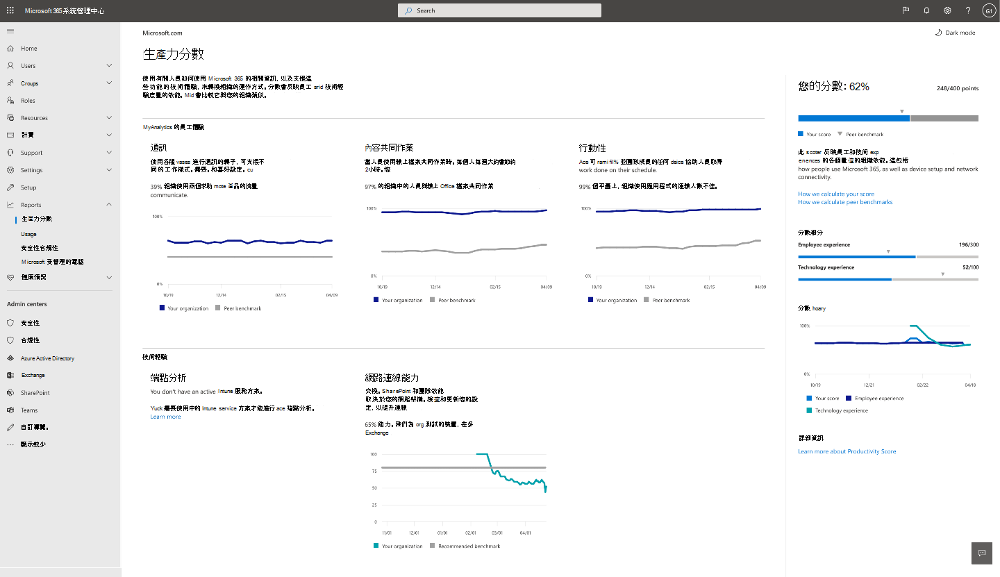

# Microsoft (預覽的工作效率分數) 

生產力分數可協助組織轉換工作如何使用 Microsoft 365 的相關資訊，以及支援這些功能的技術體驗。 分數會反映貴組織對於員工和技術經驗的效能，並將您的分數與像您的組織相比較。

分數包括：

- **度量** ，可協助您瞭解使用者如何使用 Microsoft 365 產品來共同作業、溝通及跨平臺工作。
- 資料的**深入**瞭解，可協助您找出機會，以提升員工生產力及滿意度。
- 您可以採取**建議的動作**，協助貴組織中的人員有效使用 Microsoft 365 產品，讓每個人都能進行最佳的工作。

我們提供兩個區域的資料、洞察力和建議： 

- **員工經驗：** 我們會測量人員如何共同處理內容，如何使用 Microsoft 365 產品進行通訊，以及是否在平臺上使用 Microsoft 365。 

    我們提供這些真知灼見，是因為當人們線上共同作業時，他們會節省時間。 當使用者可以自由使用任何裝置時，其效率也會比較高。 當他們能夠以彈性的方式進行通訊時，其效率會更高、形式更好，且您的組織更具整合性。 如需證據，請參閱 [Forrester report](https://vc2prod.blob.core.windows.net/vc-resources/TEIStudies/TEI%20of%20Microsoft%20365%20E5%20-%20Oct%202018.pdf)。

- **技術經驗：** 生產力取決於可靠性和能力強的技術，以及 Microsoft 365 的有效使用方式。 我們提供 [端點分析](https://aka.ms/endpointanalytics)，可協助您瞭解使用者的生產力對您的端點硬體和軟體的效能與狀況問題的影響，並提供建議的動作以加以修復;而且我們為您的組織提供 Microsoft 365 網路連線資訊洞察力。

如需概述和必要條件詳細資料，請參閱 [何謂「端點分析](https://docs.microsoft.com/mem/analytics/overview) 」。 若要深入瞭解 Microsoft 365 network connectivity insights，請參閱 [network connectivity 一覽](https://docs.microsoft.com/microsoft-365/enterprise/microsoft-365-networking-overview)。
  

## 計算分數的方式

您的生產力分數是以員工和技術經驗類別的綜合分數為基礎。 每個類別平均加權，每個類別總100點數。 生產力分數的可能點數總為500。

### 分數類別 

- 內容共同作業 (100 點) 
-  (100 點的通訊) 
- 行動性 (100 點) 
- 端點分析 (100 點) 
- 網路連通性 (100 點) 
- **總可能 = 500 點**
 
 在每個類別中，我們都會識別重要活動的模式，以瞭解人員如何使用 Microsoft 365 產品來共同作業、溝通，以及跨平臺工作。 我們提供28天和180天的主要即時檢視。 我們也提供支援的度量值，但不是分數計算的一部分，但很重要的一點是協助您識別您可以採取行動的底層行為和設定，以促進變更。

### 產品包含在生產力分數中的產品 

生產力分數包括來自 Exchange、SharePoint、OneDrive、小組、Word、Excel、PowerPoint、OneNote、Outlook、Yammer 及 Skype 的資料。

您的分數會每日更新，並且反映過去28到180天的使用者動作， (包括當天) 。

## 先決條件 

您需要 Microsoft 365 for business 或 Office 365 for enterprise 訂閱才能取得員工經驗資料，您必須使用多承租人雲端服務。 若要取得租使用者的端點分析資料，您必須將 Microsoft Intune 新增至您的訂閱。 Intune 可協助您保護組織的資料，方法是管理裝置和應用程式。       當您有 Intune 之後，您可以在 Intune 體驗中開啟端點分析。 深入瞭解 Microsoft Intune。 

若要查看組織的生產力評分，您必須具有下列其中一個角色： 

- 全域系統管理員 
- Exchange 系統管理員
- SharePoint 系統管理員 
- 商務用 Skype 系統管理員 
- Teams 系統管理員 
- 全域讀取者 
- 報告讀取者 

您可以從 [**報表**  >  **生產力分數**] 底下的 Microsoft 365 系統管理員那裡存取體驗。

## 解讀生產力分數 

[生產力分數] 首頁會顯示總分和總分的記錄，以及每個類別的主要洞察力

**您的分數** 會顯示為百分比值以及點，因此您可以看到 (分子) 和最大可能的點數 (分母) 。

**對等基準** 可讓您將您的分數與像您的組織比較。 針對員工經驗類別，對等的基準量值會計算為一組類似組織內的平均量值。 此集合是由您地區中的組織所組成，其授權的使用者數目、授權類型、行業和 tenure，以及 Microsoft 365。 

端點分析對等基準包括裝置啟動效能的目標，以及根據整個承租人中匯總的中線值進行建議的軟體設定。

若為網路連線，建議的基準是80點。

**分數細分**區段利用員工和技術經驗方面的基準，提供您的生產力分數明細。

分數記錄會顯示過去6個月內，每個類別中的分數變更的方式。

「 **員工經驗** 」和「 **技術經驗** 」區域包含這些區域中的類別的主要洞察力。 您可以按一下每個類別以查看更深入的見解。

## 類別詳細資料頁面

每個類別詳細資料頁面會顯示主要的洞察力和支援度量，以及您可以採取哪些相關的研究和動作，以促進組織中的變更。 調研可支援每個類別之主要真知灼見的重要性和基本概念。 如需詳細資訊，請 [閱讀 Forrester 報告](https://vc2prod.blob.core.windows.net/vc-resources/TEIStudies/TEI%20of%20Microsoft%20365%20E5%20-%20Oct%202018.pdf)。

### 內容共同作業詳細資料

內容共同作業的主要洞察力是建立、讀取及共同作業 (編輯和共用) 線上的人員人數。 這些措施很重要，因為調查顯示當人們使用線上檔案共同作業時，每個人平均會儲存100分鐘，或每週大約2小時。

我們將內容共同作業定義為一個人，以建立及共用 Office 檔案，然後再至少另外一個人進行編輯。 

讀者：在 OneDrive 或 SharePoint 中存取或下載線上檔案的人員。

建立**者：** 建立、修改、上傳、同步處理、存回、複製或移動線上 OneDrive 或 SharePoint 檔案的人員。

合作者：使用 OneDrive 或 SharePoint 與線上檔案共同作業的人員。 若有兩位人員在建立或修改線上 Word、Excel、PowerPoint、OneNote 或 PDF 雲端檔之後，他們會在28天的時段內讀取或編輯該檔，這兩個人都是合作者。

考慮進行共同作業的檔案類型包括 Word、Excel、PowerPoint、OneNote 和 PDF 檔。

我們將深入瞭解啟動時間，並為您的組織中的裝置和網路 connectivity insights 進行內容共同作業，因為線上檔案共同作業需要可靠的裝置能夠快速啟動，且具有最新的軟體，而且能夠與 Microsoft 365 保持良好的連接。

### 通訊詳細資料

通訊的主要洞察力是組織中的人員使用電子郵件、聊天和群組帖子進行通訊的頻率。 這項洞察力很重要，因為當人們使用各種即時通訊工具時，他們可以選擇可協助其最有效率的通訊模式，而且其工具類似聊天和社區，可協助他們開發各辦公室位置的關聯性。

### 行動詳細資料

行動性的主要洞察力是存取檔的人數，以及跨多個平臺使用電子郵件與聊天的人數。 您可以從任何裝置上的任何位置運作，對擁有銷售角色的人員、資深管理員、顧問，以及需要在辦公室進行工作以進行生產力的人員很重要的功能。 這些工作者的增強功能會影響大。 

我們衡量在兩個以上的平臺（包括桌面、行動裝置和 web）上，使用至少一個 Microsoft 365 生產力應用程式的百分比和絕對人數。 我們測量的生產力應用程式為 Outlook、小組、Word、Excel、PowerPoint、OneNote、Yammer 及 Skype。 人員必須具有 Microsoft 365 應用程式，才能進行企業、Exchange、Yammer、Skype 或小組授權的評估。 

## 商務持續性特殊報告

「業務持續性報告」是可供所有 Microsoft 365 客戶使用的有限的工作場所智慧報告，可協助他們在這項富有挑戰性的時間內指導其組織。  

此報告可協助業務負責人瞭解： 

- 對「遠端工作」的倒班如何影響共同作業和通訊。 

- 因人員調整為在家運作時，對工作生命期的影響。 

- 如果遠端會議支援有效的決策過程。

[深入瞭解商務持續性報告](https://aka.ms/bcrps)

[深入瞭解 Microsoft Graph](https://docs.microsoft.com/graph/)

## 我們想要聽到您的來信

請分享您對於生產力評分的想法，以及如何改善的想法。 請使用產品中的 **意見** 反應區段和/或與 ProductivityScorePreview@service.microsoft.com 的生產力分數小組聯繫。
