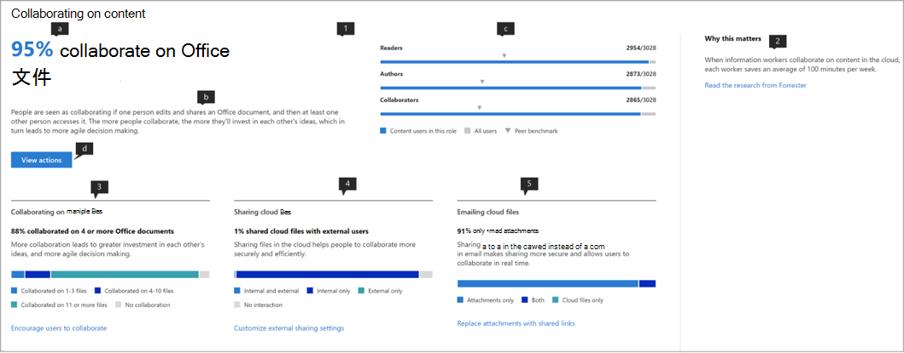

# Microsoft 生產力評分（預覽）Microsoft Productivity score (Preview)

Microsoft 365 提供生產力解決方案，可讓您的組織達到其業務目標。Microsoft 365 offers productivity solutions that enables your organization to meet its business goals. 生產力分數提供使用這些解決方案的洞察力，您可以轉換為工作的完成方式。Productivity Score provides insights to use these solutions that you can transform to how work gets done.它包含： It contains: 

- **Visibility**透過協助他們瞭解人員如何以其目前分數的方式處理員工經驗和技術經驗的類別，以及技術經驗（即將推出）。**Visibility** by helping them understand how people work in the form of their current score with breakdown across categories of Employee experience and Technology experience (coming soon). 
- **深入**瞭解，以找出提高體驗的機會。**Insights** to identify opportunities to enable improved experiences. 
- 更新技能和系統的**動作**，讓每個人都能進行最佳的工作。**Actions** to update skills and systems so everyone can do their best work. 

分數和真知灼見會出現在兩個類別中–The score and the insights are present across two categories –  

- **員工經驗：** 示範 Microsoft 365 如何協助建立高效且共同運作的員工，方法是量化人員如何在內容間進行共同作業、在任何位置進行共同作業、瞭解通訊樣式（即將推出），以及如何開發會議文化（即將推出）**Employee experience:** shows how Microsoft 365 is helping to create a productive and engaged workforce by quantifying how people collaborate on content, work anywhere, by understanding communication styles (coming soon), and by developing a meeting culture (coming soon) 

- **技術經驗**（即將推出）：協助您優化裝置體驗，例如主動修正常見的服務台問題，以及改善電腦的啟動時間和網路，以確保您的應用程式順利運作。**Technology experience** (coming soon): Assists you to optimize your device experiences such as proactively fixing common helpdesk issues,  and improving PC startup times and your network to ensure your apps work well.  

## 運作方式How it works

### 計分區域Areas of scoring 

在每個分數類別中，生產力分數可讓您跨區域的工作轉換獲得深入瞭解。Within each score category, Productivity Score provides insights on your work transformation across areas. 員工經驗中涵蓋的領域包括：The areas covered within Employee experience are:

- 與內容共同作業Collaborating on content  
- 隨處運作Working anywhere 
- 瞭解通訊樣式（即將推出）Understanding communication styles (coming soon) 
- 開發會議文化（即將推出）Developing a meeting culture (coming soon) 

### 計分使用者動作Scoring user actions 

在每個地區內，我們會測量以資訊為基礎的主要動作，代表讓組織轉變為高生產力組織的運作方式。Within each area, we measure the research-based key actions which represent the ways of working that enable organizations to transform into highly productive organization. 針對每個區域，我們計算過去28天內執行這些動作的使用者百分比。For each area we compute the % of users who perform these actions within the last 28 days. 

「員工經驗」分數是策劃為橫跨所有地區的平均分數。The Employee experience score is curated as an average score across all areas. 請注意，我們將不斷新增更多領域的員工經驗和技術經驗。Note that we will keep adding more areas to Employee experience and Technology experience over time. 

### 生產排名中包含的產品Products included in the Productivity Score 

生產力分數目前包括來自主要 Microsoft 365 工作負載 OneDrive、SharePoint、Word、Excel、PowerPoint、OneNote、Outlook、Yammer、小組、Skype 等的信號。Productivity Score currently includes signals from the key Microsoft 365 workloads OneDrive, SharePoint, Word, Excel, PowerPoint, OneNote, Outlook, Yammer, Teams, Skype. 

您的分數會每日更新，並且反映過去28天（包括目前日期）完成的使用者動作。Your score is updated daily and reflects user actions completed in the last 28 days (including the current day).

## 存取權及必要許可權Access and required permissions 

針對員工經驗，您必須訂閱 Office 365 for business plan 或具有多位使用者的 Microsoft 365 商務方案。For the employee experience, you must have a subscription to an Office 365 for business plan or a Microsoft 365 Business plan with multiple users. 

若要具有存取 Microsoft 生產力分數的許可權，您必須具備下列角色：To have permission to access Microsoft Productivity Score, you must have of the following roles: 

- 全域系統管理員Global admin 
- Exchange 系統管理員Exchange admins 
- SharePoint 系統管理員SharePoint admins 
- 商務用 Skype 系統管理員Skype for Business admins 
- Teams 系統管理員Teams admin 
- 全域讀取者Global Reader 
- 報告讀取者Reports Reader 

您可以選擇左側導覽中的 [**報表** > **生產力評分**]，從 Microsoft 365 系統管理員的首頁存取體驗。You can access the experience from Microsoft 365 Admin home by choosing **Reports** > **Productivity Score** in the left navigation.

## 解讀生產力分數Interpreting Productivity Score 

### 深入瞭解貴組織的運作方式Learn how your organization works 

他的生產力分數首頁會以百分比為基礎，提供目前的分數和歷程記錄，以及依據基準補充的各分評分類別中的區域的主要洞察力。he Productivity Score home page provides the current score and history on a percentage basis, primary insights for areas within each score category supplemented by benchmarks. 

1.**生產力分數**會以百分比和<numerator> / <denominator>格式列出，因此您也可以看到絕對點數（分子）及可能的最大點數。1.**Productivity Score** is listed on a percentage basis as well as in the <numerator>/<denominator> format so you can also see your absolute points (numerator) and maximum possible points  
1. 此樞紐分析表可讓您選取要重點關注的分數類別。This pivot allows you to select the score category you want to focus on. 在預覽中，您只能查看**員工經驗**，但選擇將很快展開以包含**技術經驗**。In the preview, you can only view **Employee experience**, but the selection will soon expand to include **Technology experience**. 
1. **對等基準**可讓您將目前的分數與像您一樣的組織進行比較。**Peer benchmark** allows you to compare your current score with organizations like you. 基準量值的計算方式是一組類似組織內的平均量值。The benchmark measure is calculated as the average of measures within a set of similar organizations. 此集合由具有類似啟用的使用者、地區、您擁有的授權類型、行業和 tenure 內部的 Microsoft 365 或 Office 365 中的組織所組成。The set is composed of organizations who have similar number of enabled users, region, the types of licenses you own, industry, and tenure within Microsoft 365 or Office 365. 
1. [**得分類別**] 區段提供每個類別的基準成績明細。The **Score categories** section provides a breakdown of your Productivity Score with benchmarks per category.
1. **分數記錄**會顯示每個類別中的分數在過去6個月中的移動方式。**Score history** displays how your score in each category has moved in the past 6 months.
1. 對**內容**進行共同作業的主要洞察力會顯示此區域中的基準基準的相關量值，這些因素可用於評分。The primary insight for **Collaborating on content** shows the relevant measures with benchmarks from this area that contribute to the score. 選取 [**查看詳細**資料] 以查看 [區域詳細資料] 頁面。Select **View Details** to see the area detail page.
1. 「**工作**中的主要洞察力」顯示此區域中的基準基準的相關量值，以貢獻分數。The primary insight for **Working anywhere** shows the relevant measures with benchmarks from this area that contribute to the score. 選取 [**查看詳細**資料] 以查看 [區域詳細資料] 頁面。Select **View Details** to see the area detail page.  

### 深入瞭解，以找出改善體驗的機會Insights to identify opportunities to improve experiences 

針對每個區域，選取主要洞察力中的 [**查看詳細**資料]，以查看顯示其他真知灼見的 [區域詳細資料] 頁面，相關的調研和動作，以提升您的分數。For each area, select **View Details** in the primary insight to view the area detail page that displays additional insights, related research and actions to improve your score. ..

所有區域詳細資料頁面均遵循下列結構：All area detail pages follow the following structure: 

- 左上：保留首頁的主要洞察力。Top left: Primary insight retained from the home page.
- 左下方：支援具有上下文動作的真知灼見。Bottom left: Supporting insights with contextual actions.  
- 許可權：學術研究示範區域與生產力之間的關係。Right: Academic research demonstrating the relationship between the area and productivity.

此外，所有的真知灼見都包含下列元素：Additionally, all insights contain the following elements: 

- 標頭：針對每項洞察力追蹤的重要提示或結果。Header: Key takeaway or outcome tracked for each insight;
- 摘要：進一步說明深入瞭解瞭解組織的生產力為何重要。Summary: Further explanation of why the measures in the insight are important for your organization’s productivity. 
- 資料視覺效果：以視覺方式衡量組織在深入瞭解中的測度的位置。Data visualization: Visually quantifies your organization’s position with regard to the measures in the insight with benchmarks as applicable.
- 動作：內容指令，可協助每個洞察的更多相關結果，進而提升您的分數。Actions: Contextual action that can help drive more of the desired outcome per the insight and thus improve your score.

### 區域詳細資料頁面-與內容共同合作Area detail page – Collaborating on content 

在內容頁面上進行共同作業，包含「生產力分數」首頁的主要洞察力。Collaborating on content page contains the primary insight from the Productivity Score home page. 其包含下列元件：It has the following components:

1. 標頭：量化在內容上進行共同作業的使用者百分比（重要結果）。Header: Quantifies what percentage of users are collaborating on content (key outcome).
1. 本文：更多有關如何增加共同作業帶來更高生產力的詳細資訊。Body: More detail on how increased collaboration leads to higher productivity.
1. 視覺效果：這會透過基準的方式，對此區域的分數貢獻的每個元素進行量化。Visualization: This visually quantifies each element that contributes to the score for this area with benchmarks:

    - **讀者**：在啟用 OneDrive 和 SharePoint 啟用使用者的基礎內，量化，在雲端（OneDrive 和 SharePoint）上存取或下載檔案的使用者。**Readers**: Quantifies users accessing or downloading files on the cloud (OneDrive and SharePoint) within a base of OneDrive and SharePoint enabled users.
    - **作者**：量化使用者修改、上傳、同步處理、存回或移動雲端（OneDrive 和 SharePoint）上的檔案，以 OneDrive 和 SharePoint 啟用的使用者在雲中的基礎上進行。**Authors**:  Quantifies users modifying, uploading, syncing, checking in, copying or moving files on the cloud (OneDrive and SharePoint) within a base of OneDrive and SharePoint enabled users.
    - **合作者**：以 OneDrive 和 SharePoint 啟用的使用者為基礎，在雲端（OneDrive 和 SharePoint）上量化使用者共同作業。**Collaborators**: Quantifies users collaborating on files on the cloud (OneDrive and SharePoint) within a base of OneDrive and SharePoint enabled users. 若有兩位使用者在建立或修改 Word、Excel、PowerPoint、OneNote 或 PDF 雲端檔之後，他們會在28天的時段內進行讀取或編輯，則為合作者。Two users are Collaborators if one of them read or edited a Word, Excel, PowerPoint, OneNote or PDF cloud document after the other created or modified it within a 28-day window.

1. **為什麼很重要**的是在雲端檔案上與生產力相關的研究連結共同作業的摘要。**Why it matters** provides a summary of research linking collaboration on cloud files with productivity. **閱讀 Forrester 中的研究中心**，以深入瞭解如何 conducive 共同作業以提升生產力的相關資訊。**Read the research from Forrester** goes to a research article that provides more context on how collaboration is conducive to increased productivity.
1. 支援透過**多個**檔案共同作業的洞察力量化組織中的使用者如何在不同的檔案間進行協同作業。Supporting insight on **Collaborating on multiple files** quantifies how users in your organization are collaborating across different files. 
1. 有關**共用雲端**檔案的支援資訊，請量化如果使用者是在雲端共用內容時，在內部和外部共用之間的區別。Supporting insight on **Sharing cloud files** quantifies if users are sharing content on the cloud while drawing distinction between internal and external sharing.
1. 如果使用者透過電子郵件共用檔案所使用的附件與雲端檔案的連結，則對**電子郵件雲端**檔案的支援將會量化。Supporting insight on **Emailing cloud files** quantifies if users sharing files via email are using attachments versus links to cloud files.

考慮進行共同作業的檔案類型為 Word/Excel/PowerPoint/OneNote/PDF。The file types considered for collaboration are Word/Excel/PowerPoint/OneNote/PDF.

### 區域詳細資料頁面-隨處運作Area detail page – Working anywhere 

[工作中的地方] 頁面會為使用者計算至少一個在兩個或更多平臺（即桌面機、行動裝置及 web）上具有一個生產力應用程式的使用者人數（以百分比和絕對值為值）。The Working anywhere page quantifies the users (as a percentage and absolute value) who used at least one productivity app across two or more platforms, which are desktop, mobile and web. 使用者在使用更多應用程式和平臺時，獲得更高的評分。Users get scored higher for using more apps and platforms. 被視為的應用程式包括 Outlook、小組、Word、Excel、PowerPoint、OneNote、Yammer、Skype。The apps being considered are Outlook, Teams, Word, Excel, PowerPoint, OneNote, Yammer, Skype. 真知灼見的基礎是針對 Office 365 ProPlus、Exchange、Yammer、Skype 或小組啟用的使用者。The base of the insight are users enabled for Office 365 ProPlus, Exchange, Yammer, Skype or Teams.

1. **為什麼很重要的一點**是從多個平臺的「資訊檢索」連結使用的摘要，到較高的生產力。**Why it matters** provides a summary from research linking usage of multiple platforms to higher productivity. 請**閱讀 Forrester 中的「調研**」，以提供更多關於如何在如何 conducive 工作以提升生產力的內容的資訊。**Read the research from Forrester** goes to a research article that provides more context on how working across is conducive to increased productivity.
1. 支援**電子郵件**的深入瞭解在 outlook 中，透過使用 outlook 的使用者，在您組織中使用 outlook 的使用者人數。Supporting insight on **Email anywhere** quantifies number of users in your organization using Outlook across platforms within base of users active on Outlook.
1. 協助工具的支援洞察力**可量化組織**中的使用者如何在團隊中的使用者所使用的不同平臺上使用團隊。Supporting insight on **Chat anywhere** quantifies how users in your organization are using Teams across platforms within base of users active on Teams.
1. 支援深入瞭解**存取 Office 檔**的情況量化組織中的使用者如何在 Word、excel、PowerPoint 或 OneNote 上使用之使用者所使用的 Word、excel、PowerPoint 和 OneNote。Supporting insight on **Accessing Office documents anywhere** quantifies how users in your organization are using Word, Excel, PowerPoint and OneNote across platforms within base of users active on Word, Excel, PowerPoint or OneNote.

### 更新技能和系統的動作Actions for update skills and systems 

為了推廣 actionability，每個支援的知識都是內置動作，可協助您轉變您的員工經驗。其中一些可能是設定變更或認知活動。In order to promote actionability, each supporting insight comes with inline actions that can help transform your employee experience some of which can be configuration changes or awareness campaigns. 在 [建議動作] 面板選項中，按一下您可能會考慮的動作。Clicking on these calls-to-action opens in the recommended actions panel options that you might consider. 目前已啟用對**內容進行合作**的動作。Currently the actions in the **Collaborating on content** are enabled.

1. **View 動作**會移至一個窗格，其中會列出與內容共同作業相關的所有動作。The **View Actions** goes to a pane listing all actions related to Collaborating on content.
1. **鼓勵使用者共同**作業，以與共同撰寫和 @mentions 等主題共同作業的教學影片清單。**Encourage users to collaborate** goes to a list of instructional videos on collaboration with topics such as co-authoring and @mentions. 
1. **自訂外部共用**設定會進入一個頁面，其中包含外部共用簡介，描述使用者共用時所發生的情況，視其共用及與其共用的方式而定。**Customize external sharing** settings goes to a page with an overview on external sharing describing what happens when users share, depending on what they're sharing and with whom.  
1. 以**共用連結取代附件**的頁面，說明如何分享 OneDrive 連結，而不是透過電子郵件的附件，以進行更好的協同作業。**Replace attachments with shared links** goes to a page explaining how to share OneDrive links instead of attachments over email for better collaboration.

選取任何動作按鈕會開啟右側的 [**建議的動作**] 窗格，其具有每個動作摘要及檔頁面的連結。Selecting any of the action buttons opens the **Recommended actions** pane on the right that has a summary of each action and a link to the documentation pages.

## 我們想要聽到您的來信We want to hear from you 

我們想要使用私人預覽計畫來 glean 意見反應，並使用 learnings，隨著您今後的使用而建立產品。We want to utilize the private preview program to glean feedback and use the learnings to co-create the product with you going forward. 您可以使用產品中的**意見**反應區段和/或與 ProductivityScorePreview@service.microsoft.com 中的生產力分數小組聯繫。You can use the **Feedback** sections within the product and/or reach out to the Productivity Score team at ProductivityScorePreview@service.microsoft.com.

若要要求存取私人預覽，請填寫表單https://aka.ms/productivityscorepreview。To request access to the private preview please fill out the form at https://aka.ms/productivityscorepreview.  
