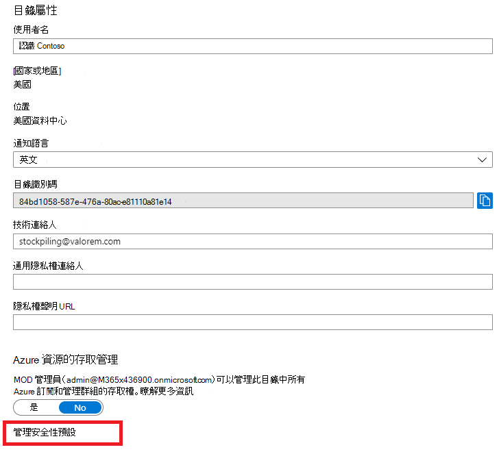
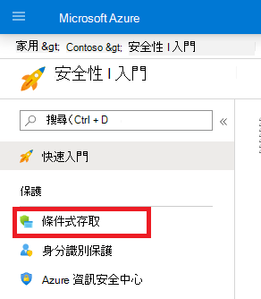
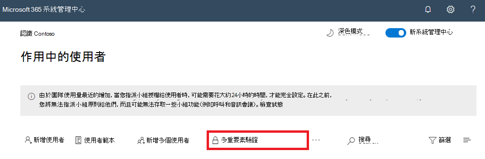

# Microsoft 365 的多重要素驗證

密碼是對電腦或線上服務驗證登入的最常見方法，但也是最容易受到攻擊的方法。 人員可以選擇輕鬆密碼，並對不同的電腦和服務使用多個登入的相同密碼。

若要為登入提供額外的安全性層級，您必須使用多重要素驗證（MFA），它會同時使用密碼（該密碼應該強），並以其他驗證方法為基礎：

- 您所擁有的專案不會輕易重複，例如智慧型電話。
- 您獨特且 biologically 的功能，例如您的指紋、字型或其他生物統計學屬性。

在驗證使用者密碼之後，才會採用其他驗證方法。 使用 MFA 時，即使強使用者密碼遭到損害，攻擊者也沒有您的智慧型電話或指紋，即可完成登入。

## Microsoft 365 中的 MFA 支援
根據預設，Microsoft 365 和 Office 365 都支援使用下列使用者帳戶的 MFA：

- 傳送至電話的文字訊息，需要使用者輸入驗證碼。
- 通話。
- Microsoft 驗證器智慧型電話應用程式。

在這兩種情況下，MFA 登入都使用「您具有的「您所擁有的專案」方法，以進行其他驗證。
您可以使用多種方式，為 Microsoft 365 和 Office 365 啟用 MFA：

- 使用安全性預設值
- 使用條件式存取原則
- 每個個別使用者帳戶（不建議）

這些方式是以您的 Microsoft 365 方案為基礎。
    
|方案  |建議  | 客戶類型 |
|---------|---------|----------|
| 所有 Microsoft 365 方案 | 使用安全性預設值，這需要對所有使用者帳戶執行 MFA。   您也可以針對個別使用者帳戶要求 MFA，但不建議這麼做。 | 小型企業 |
| Microsoft 365 商務進階版    Microsoft 365 E3    Azure Active Directory （Azure AD）高級 P1 授權 | 使用條件式存取原則，根據群組成員資格、應用程式或其他準則，針對使用者帳戶要求 MFA。 | 小型企業對企業 |
| Microsoft 365 E5    Azure AD 高級 P2 授權 | 使用 Azure AD 身分識別保護，根據登入風險準則要求 MFA。 |  企業 |
||||

### 安全性預設

安全性預設是 2019 年 10 月 21 日之後所建立 Microsoft 365 和 Office 365 付費或試用版訂用帳戶的新功能。 這些訂閱已開啟安全性預設值，其：

- 要求所有使用者都使用 MFA 與 Microsoft 驗證器應用程式。
- 封鎖舊版驗證。

使用者有 14 天的時間可以從其智慧型手機向 Microsoft Authenticator 應用程式註冊 MFA，時間從啟用安全性預設後使用者首次登入時起算。 14 天過後，使用者就無法登入，除非其完成 MFA 註冊。

安全性預設可確保所有組織都具備預設啟用的使用者登入基本層級安全性。 您可以使用條件式存取原則來停用安全性預設值，以取代 MFA。

您可以在 Azure 入口網站中，啟用或停用 Azure AD 的**屬性**窗格中的安全性預設值。

您可以使用安全性預設值搭配任何 Microsoft 365 方案。

如需詳細資訊，請參閱這個[安全性預設概觀](https://docs.microsoft.com/azure/active-directory/fundamentals/concept-fundamentals-security-defaults)。 

### 條件式存取原則

條件式存取原則是一組規則，可指定要在什麼條件下評估和允許登入。 例如，您可以建立敘述如下的條件式存取原則：

- 如果使用者帳戶名稱是獲派 Exchange、使用者、密碼、安全性、SharePoint 或全域管理員角色的使用者群組成員，則先要求 MFA 再允許存取。

此原則可讓您根據群組成員資格要求 MFA，而不是在指派或取消指派這些管理員角色時，嘗試針對 MFA 設定個別使用者帳戶。

您也可以使用條件式存取原則進行更高級的功能，例如，針對特定的應用程式要求 MFA，或登入是從相容的裝置（例如，您的可擕式電腦執行 Windows 10）進行。

您可以在 Azure 入口網站中，從 Azure AD 的**安全性**窗格中設定條件式存取原則。

您可以使用條件式存取原則：

- Microsoft 365 商務進階版
- Microsoft 365 E3 和 E5
- Azure AD Premium P1 和 Azure AD Premium P2 授權 

針對具有 Microsoft 365 商務版 Premium 的小型企業，您可以使用下列步驟輕鬆使用條件式存取原則：

1. 建立群組，以包含需要 MFA 的使用者帳戶。
2. 啟用 [**需要對全域管理員的 MFA** ] 原則。
3. 使用下列設定來建立以群組為基礎的條件式存取原則：
    - > 使用者和群組的工作分派：上述步驟1的群組名稱。
    - 工作分派 > Cloud app or 動作：所有雲端應用程式。
    - 存取控制 > 授與存取權 > > 需要多重要素驗證。
4. 啟用原則。
5. 將使用者帳戶新增至上述步驟1中建立的群組，然後進行測試。
6. 若要對其他使用者帳戶要求 MFA，請將其新增至步驟1中建立的群組。

此條件式存取原則可讓您以您自己的節奏向您的使用者推廣 MFA 需求。

企業應該使用[通用的條件式存取原則](https://docs.microsoft.com/azure/active-directory/conditional-access/concept-conditional-access-policy-common)來設定下列原則：

- [要求系統管理員使用 MFA](https://docs.microsoft.com/azure/active-directory/conditional-access/howto-conditional-access-policy-admin-mfa)
- [要求所有使用者使用 MFA](https://docs.microsoft.com/azure/active-directory/conditional-access/howto-conditional-access-policy-all-users-mfa)
- [封鎖舊版驗證](https://docs.microsoft.com/azure/active-directory/conditional-access/howto-conditional-access-policy-block-legacy)

如需詳細資訊，請參閱這個[條件式存取概觀](https://docs.microsoft.com/azure/active-directory/conditional-access/overview)。

### Azure AD Identity Protection

使用 Azure AD Identity Protection，您可以建立額外的條件式存取原則，以在登[入風險為中低或高時，要求進行 MFA](https://docs.microsoft.com/microsoft-365/enterprise/identity-access-policies#require-mfa-based-on-sign-in-risk)。

您可以使用 Azure AD 身分識別保護和以風險為基礎的條件式存取原則：

- Microsoft 365 E5
- Azure AD 高級 P2 授權

如需詳細資訊，請參閱這個 [Azure AD Identity Protection 概觀](https://docs.microsoft.com/azure/active-directory/identity-protection/overview-identity-protection)。

### 個別使用者帳戶的 MFA （不建議使用）

您應該使用安全性預設值或條件式存取原則，針對您的使用者帳戶登入要求 MFA。不過，如果上述任一項無法使用，Microsoft 強烈建議對具有系統管理員角色的使用者帳戶（特別是全域系統管理員角色）進行 MFA，以進行任何大小訂閱。 

您可以從 Microsoft 365 系統管理中心的 [作用中**使用者**] 窗格中，為個別使用者帳戶啟用 MFA。

啟用之後，使用者下一次登入時，系統會提示他們註冊 MFA，並選擇及測試其他驗證方法。

### 共同使用這些方法

下表顯示啟用 MFA 與安全性預設、條件式存取原則和每一使用者帳戶設定的結果。

|| Enabled | 停用 | 次要驗證方法 |
|:-------|:-----|:-------|:-------|
| **安全性預設** | 無法使用條件式存取原則 |   可以使用條件式存取原則 | Microsoft Authenticator 應用程式 |
| **條件式存取原則** |如果已啟用任何原則，則無法啟用安全性預設 | 如果已停用所有原則，則可啟用安全性預設 | 在註冊 MFA 期間由使用者指定 |
| **每個使用者帳戶設定（不建議使用）** | 覆寫安全性預設值，以及在每次登入時要求 MFA 的條件式存取原則 | 由安全性預設值和條件式存取原則所取代 | 在註冊 MFA 期間由使用者指定|
||||

如果啟用安全性預設值，系統會提示所有新的使用者進行 MFA 註冊，並在下一個登入時使用 Microsoft 驗證應用程式。

## 管理 MFA 設定的方法

有兩種方式可管理 MFA 設定。

在 Azure 入口網站中，您可以：

- 啟用及停用安全性預設值
- 設定條件式存取原則

在 Microsoft 365 系統管理中心中，您可以設定每個使用者和服務 MFA 設定。

## 下一個步驟

[設定 Microsoft 365 的 MFA](set-up-multi-factor-authentication.md)

